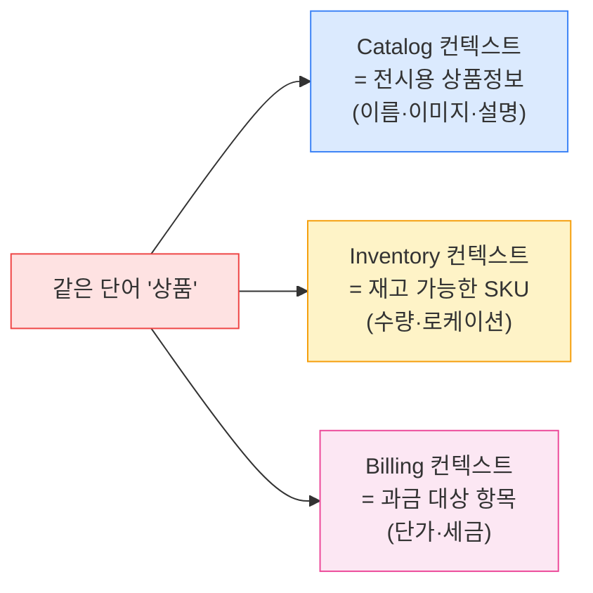
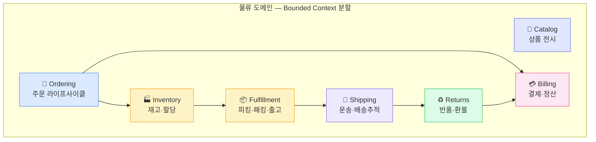
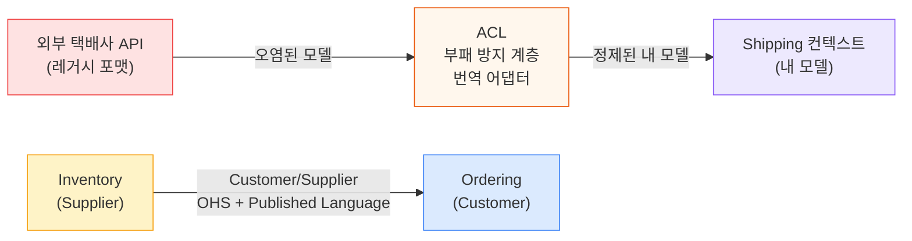
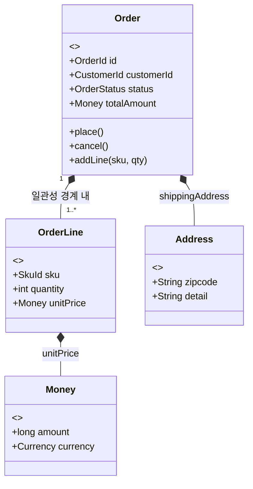
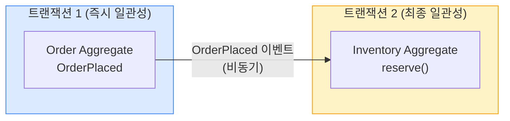

## 1. 왜 DDD인가 — 문제 → 해결

**문제**: 큰 시스템에서 "상품", "주문" 같은 단어가 부서마다 다른 의미인데 하나의 거대 모델로 욱여넣으면, 모든 곳에 영향을 주는 *God Model(만능 모델)*이 생겨 변경이 마비된다.

**해결**: **DDD(Domain-Driven Design, 도메인 주도 설계)**는 도메인을 의미 경계로 나누고(`Bounded Context`), 그 안에서 도메인 전문가와 개발자가 같은 언어(`Ubiquitous Language`)를 쓰며, 일관성 경계(`Aggregate`)를 명확히 한다.

*"상품"은 컨텍스트마다 다른 모델이다. 하나로 합치려는 시도가 곧 강결합의 시작.*

> **💡 적용 조건 — DDD를 항상 쓰진 않는다**
>
> DDD는 **도메인 복잡도가 높을 때** 가치가 크다. 단순 CRUD 게시판에 전술 패턴(Aggregate, Repository, Domain Event)을 다 끼우면 오버엔지니어링. 핵심 도메인(Core domain)에만 깊게 투자하고, 보조 도메인(Supporting/Generic)은 가볍게 간다.

## 2. Ubiquitous Language (유비쿼터스 언어)

도메인 전문가와 개발자가 **회의·코드·DB 컬럼·이벤트 이름까지 동일한 용어**를 쓰는 것. 번역 레이어(현업은 "출고지시", 코드는 `processItem()`)가 끼면 그 틈에서 버그가 자란다.

| 나쁜 예 (번역 발생) | 좋은 예 (유비쿼터스) |
| --- | --- |
| 현업 "재고를 잡아둬라" → 코드 `updateStock(-1)` | `inventory.reserve(orderId, qty)` — "예약(Reserve)"이라는 도메인 용어 그대로 |
| 현업 "배송 시작" → 코드 `status = 3` | `shipment.dispatch()` → `ShipmentDispatched` 이벤트 |

> **🎯 면접 포인트**
>
> "도메인 이벤트 이름은 어떻게 짓나요?" → **과거형 + 비즈니스 용어** ( `OrderPlaced` , `InventoryReserved` ). `doOrder` , `processData` 같은 명령형/기술용어는 유비쿼터스 언어 위반.

## 3. Bounded Context (경계 컨텍스트)

한 모델이 일관되게 적용되는 **명시적 경계**. 같은 단어가 경계 밖에선 다른 뜻이어도 된다. Bounded Context는 곧 *서비스 경계 후보*이자 *팀 소유권의 단위*다.

*물류 도메인의 Bounded Context 예 — 각 컨텍스트가 "상품"·"주문"의 의미를 독자적으로 가진다.*

> **⚠️ 실무 함정**
>
> "서비스"는 만들었는데 **Bounded Context를 안 정의** 하면, 같은 `Product` 클래스를 모든 서비스가 공유 jar로 import → 한 곳 변경이 전 서비스에 전파. 경계마다 **자기만의 모델** 을 가져야 한다.

## 4. Context Map (컨텍스트 맵)

Bounded Context들 **사이의 관계와 통합 방식**을 그린 지도. "어느 쪽이 갑이고, 어떻게 변경 압력이 전파되는가"를 명시한다.

| 관계 패턴 | 의미 | 물류 예시 |
| --- | --- | --- |
| **Partnership** | 두 팀이 운명 공동체로 함께 변경 | 주문 ↔ 결제 (동시 출시 협의) |
| **Customer/Supplier** | 공급자가 소비자 요구를 반영 | Inventory(공급) → Ordering(소비) |
| **Conformist** | 약자가 강자 모델을 그대로 수용 | 외부 택배사 API 포맷 그대로 따름 |
| **ACL (Anti-Corruption Layer, 부패 방지 계층)** | 외부 모델을 내 모델로 번역해 오염 차단 | 레거시 WMS / 외부 운송사 연동 어댑터 |
| **OHS (Open Host Service)** | 공개 표준 API로 다수 소비자에 제공 | 배송추적 조회 API (수많은 셀러가 소비) |
| **Published Language** | 공유 스키마/표준 메시지 포맷 | 운송장 이벤트 Avro/Protobuf 스키마 |
| **Shared Kernel** | 두 컨텍스트가 작은 공통 모델 공유 (위험) | 공통 Money/Address VO — 최소화 권장 |

*ACL은 외부/레거시 모델이 내 도메인을 오염시키지 못하게 막는 핵심 방어선이다.*

> **🎯 면접 포인트**
>
> "레거시 WMS를 새 시스템과 통합하라"는 문제에서 정답 키워드는 **ACL** . 외부의 지저분한 모델을 그대로 받지 말고 번역 계층에서 차단해야 한다고 답하면 시니어 신호. 🔥(Deep-dive)

## 5. 전술 빌딩블록 (Tactical Building Blocks)

| 블록 | 정의 | 예시 |
| --- | --- | --- |
| **Entity(엔티티)** | 식별자(ID)로 구분, 가변 | `Order`, `Shipment` |
| **Value Object(값 객체)** | 값으로 동등성 판단, 불변 | `Money`, `Address`, `Weight` |
| **Aggregate(애그리거트)** | 일관성 경계로 묶인 객체 그래프 | `Order` + `OrderLine`들 |
| **Aggregate Root(루트)** | 외부가 접근하는 유일한 진입점 | `Order` (OrderLine은 직접 못 건드림) |
| **Domain Event(도메인 이벤트)** | 도메인에서 일어난 사실(과거형) | `OrderPlaced` |
| **Repository(리포지토리)** | Aggregate 단위 영속화 추상화 | `OrderRepository` |
| **Domain Service(도메인 서비스)** | 한 Entity에 안 속하는 도메인 로직 | `AllocationService` (창고 할당) |

*Order Aggregate — 외부는 오직 **Aggregate Root(Order)**를 통해서만 OrderLine에 접근한다.*

## 6. Aggregate 설계 — 한 트랜잭션 = 한 Aggregate

Aggregate의 핵심은 **Invariant(불변식)**를 지키는 일관성 경계다. 규칙: *한 트랜잭션에서는 하나의 Aggregate만 수정*한다. 여러 Aggregate를 동시에 바꿔야 하면 그건 도메인 이벤트 + 최종 일관성(Eventual Consistency)으로 푼다.

> **⚠️ 실무 함정 — Aggregate를 너무 크게**
>
> "주문 안에 결제·배송·재고까지 다 넣자" → Aggregate가 비대해져 한 주문 수정 때마다 거대한 객체 그래프에 락이 걸린다. Cut-off 직전 주문 폭주 시 **락 경합·트랜잭션 실패** 폭발. 작게 쪼개고 ID 참조로 느슨하게 연결하라. 🔥(Deep-dive)

### Aggregate 설계 4원칙 (Vaughn Vernon)

1. **진짜 불변식만 한 Aggregate에** — 즉시 일관성이 꼭 필요한 규칙만 같이 둔다.
2. **작게 설계** — 클수록 동시성·메모리·락 비용 증가.
3. **다른 Aggregate는 ID로만 참조** — 객체 직접 참조 금지 (`customerId`지 `Customer` 객체 아님).
4. **경계 밖 변경은 최종 일관성** — 도메인 이벤트로 비동기 처리.

*Order와 Inventory는 별개 Aggregate → 한 트랜잭션에 묶지 않고 이벤트로 연결. 이 구조가 Saga로 이어진다.*

## 7. 전략 설계 vs 전술 설계 — 순서가 중요

|  | 전략 설계 (Strategic) | 전술 설계 (Tactical) |
| --- | --- | --- |
| 관심사 | 큰 그림 — 경계와 관계 | 코드 — 객체 모델 |
| 도구 | Bounded Context, Context Map, Subdomain | Aggregate, Entity, VO, Repository |
| 순서 | **먼저** | 나중 |
| 실패 시 | 서비스 경계가 틀려 분산 모놀리스 | 코드가 지저분하지만 국소적 손해 |

> **🎯 면접 포인트 (가장 흔한 실수)**
>
> 많은 개발자가 곧장 **전술 설계(Aggregate/Repository 코드)** 로 뛰어든다. 하지만 경계(Bounded Context)가 틀리면 코드를 아무리 잘 짜도 시스템이 깨진다. **"먼저 Event Storming으로 경계를 그리고, 그 다음 Aggregate를 설계한다"** 가 정석 답변이다.

> **💡 실무 적용 — Event Storming**
>
> 도메인 전문가와 함께 **도메인 이벤트(주황 포스트잇) → 커맨드(파랑) → Aggregate(노랑) → Bounded Context** 순으로 워크샵하면 경계가 자연히 드러난다. 04(Saga)·03(Event-Driven)이 이 결과물 위에 세워진다.
