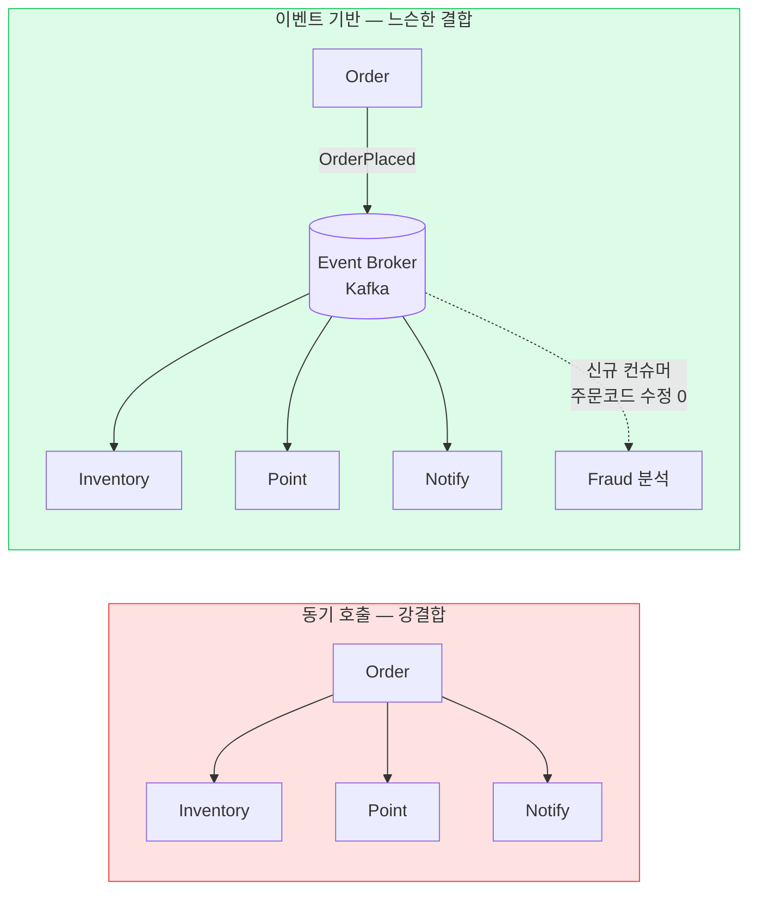
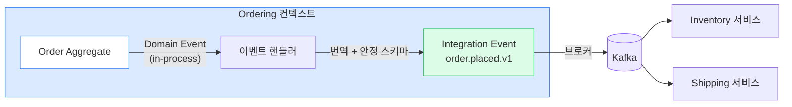
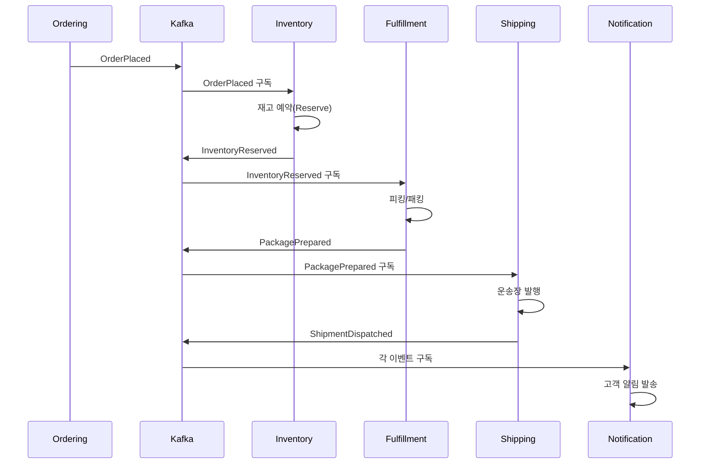
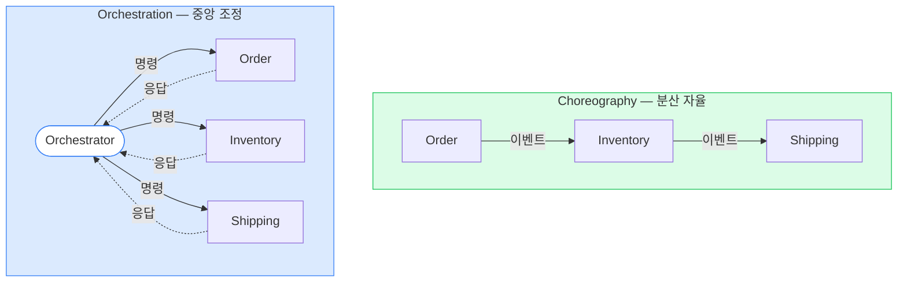

## 1. 왜 이벤트 기반인가 — 문제 → 해결

**문제**: 주문 완료 후 재고차감·포인트적립·알림발송·정산을 동기 호출하면, 한 호출만 느려도/죽어도 주문 전체가 실패한다(시간 결합 Temporal coupling). 새 후속 작업이 생길 때마다 주문 코드를 고쳐야 한다.

**해결**: 주문은 `OrderPlaced` 이벤트만 발행하고 떠난다. 관심 있는 컨슈머가 알아서 구독한다. **발행자는 소비자를 모른다** → 느슨한 결합과 확장성.

*동기(좌)는 컨슈머 추가마다 발행자 수정. 이벤트(우)는 발행자 변경 없이 컨슈머만 늘린다.*

> **💡 Trade-off**
>
> 이벤트 기반은 결합도↓·확장성↑·장애 격리↑를 주지만, 대가로 **최종 일관성(Eventual Consistency)** , 흐름 추적 난이도↑, 디버깅 복잡도↑를 받는다. 강한 일관성이 필수인 곳(잔액 차감 즉시 반영 등)은 동기가 낫다.

## 2. Event vs Command vs Query — 명확히 구분

|  | Command(명령) | Event(이벤트) | Query(조회) |
| --- | --- | --- | --- |
| 의미 | "~을 해라" | "~이 일어났다"(사실) | "~을 알려달라" |
| 시제 | 명령형 | **과거형** | 질문형 |
| 수신자 | 1명 (특정) | 0~N명 (모름) | 1명 |
| 거부 가능 | 가능 (검증 후 실패) | 불가 (이미 발생함) | 해당 없음 |
| 예시 | `ReserveInventory` | `InventoryReserved` | `GetOrderStatus` |

> **⚠️ 실무 함정 — Event와 Command 혼용**
>
> 이벤트 이름을 `ReserveInventory` (명령형)로 지으면 발행자가 컨슈머의 행동을 지시하는 셈 → 결합이 다시 강해진다. 이벤트는 **과거의 사실** ( `OrderPlaced` )만 알리고, 무엇을 할지는 컨슈머가 결정해야 한다.

## 3. Domain Event vs Integration Event

둘 다 "과거의 사실"이지만 **범위와 계약(Contract)**이 다르다. 이 구분을 못 하면 내부 모델이 외부로 새어 강결합이 된다.

|  | Domain Event (도메인 이벤트) | Integration Event (통합 이벤트) |
| --- | --- | --- |
| 범위 | 한 Bounded Context **내부** | 컨텍스트/서비스 **경계 간** |
| 전달 | in-process (메모리 디스패처) | 메시지 브로커 (Kafka/SQS) |
| 스키마 | 내부용, 자유롭게 변경 | **공개 계약** — 하위호환 필수 |
| 내용 | 풍부한 도메인 객체 가능 | 최소·안정 필드 (ID 중심) |
| 예시 | Order Aggregate가 발행한 `OrderPlaced` | 외부로 나가는 `order.placed.v1` |

*도메인 이벤트는 내부에서, 통합 이벤트는 안정된 공개 스키마로 번역해 밖으로. 내부 모델을 외부에 그대로 노출하지 마라.*

> **🎯 면접 포인트 — 스키마 진화**
>
> 통합 이벤트는 **하위 호환(Backward compatibility)** 이 생명. 필드 추가는 OK, 삭제·의미 변경은 금지. `Schema Registry(Avro/Protobuf)` 와 버전 태깅( `v1` )으로 관리. `Consumer-Driven Contracts(Pact)` 로 컨슈머가 깨지지 않게 검증. 🔥(Deep-dive)

## 4. 이벤트 흐름 설계 — 물류 주문 파이프라인

주문이 들어오면 이벤트가 컨텍스트를 타고 흐른다. 각 컨슈머는 자기 일을 하고 다음 이벤트를 발행한다.

*물류 주문 이벤트 파이프라인 — 각 컨텍스트가 사실을 발행하고 다음이 반응한다(Choreography).*

### 이벤트 설계 체크리스트

- **이벤트는 자기완결적**: 컨슈머가 매번 발행자에게 되묻지(콜백) 않아도 되게 필요한 ID·핵심 필드 포함.
- **too fat / too thin 균형**: 전체 객체를 다 넣으면 결합·페이로드 비대, 너무 적으면 컨슈머가 추가 조회 폭주. 보통 ID + 핵심 필드.
- **순서 보장 범위**: Kafka는 파티션 내 순서만 보장 → 같은 `orderId`는 같은 파티션 키로.

## 5. Choreography vs Orchestration

여러 단계의 흐름을 누가 제어하는가의 문제. **Choreography(코레오그래피)**는 각자 이벤트를 듣고 자율적으로 반응, **Orchestration(오케스트레이션)**은 중앙 조정자가 단계를 지시한다.

*Choreography는 결합도 낮지만 흐름이 코드에 흩어진다. Orchestration은 흐름이 한곳에 보이지만 조정자가 핵심 지점.*

| 관점 | Choreography | Orchestration |
| --- | --- | --- |
| 결합도 | **낮음** (서로 모름) | 중간 (조정자가 다 앎) |
| 흐름 가시성 | 낮음 (전체 추적 어려움) | **높음** (한곳에 정의) |
| 단일 지점 | 없음 | 조정자 (장애·병목 가능) |
| 적합 상황 | 단계 적고 자율적, 느슨한 흐름 | 단계 많고 복잡, 보상·롤백 필요 |
| 디버깅 | 어려움 (분산 추적 필수) | 쉬움 (상태 머신 추적) |

> **💡 선택 기준**
>
> 단계가 **2~3개로 단순** 하면 Choreography. **4단계 이상 + 실패 보상이 복잡** (주문-결제-재고-배송 + 각 단계 롤백)하면 Orchestration이 흐름 가시성에서 유리. 이게 다음 장(04 Saga)의 두 변형으로 직결된다.

## 6. 전달 보장과 함정

| 전달 의미론 | 의미 | 현실 |
| --- | --- | --- |
| At-most-once | 최대 1번 (유실 가능) | 중요 이벤트에 부적합 |
| At-least-once | 최소 1번 (중복 가능) | **표준** — 중복은 멱등성으로 흡수 |
| Exactly-once | 정확히 1번 | 네트워크상 수학적으로 불가 — "Effectively once"로 근사 |

> **⚠️ 실무 함정 — DB 커밋 후 이벤트 발행**
>
> "주문 저장 → 그 다음 줄에서 Kafka 발행"은 위험하다. 저장 후 발행 직전에 프로세스가 죽으면 **이벤트 유실** (Dual-write 문제). 반대로 발행 후 커밋 실패면 **유령 이벤트** . 해결은 `Transactional Outbox(트랜잭셔널 아웃박스)` — DB 트랜잭션과 이벤트 적재를 원자화. 06장에서 깊게 다룬다. 🔥(Deep-dive)

> **🎯 면접 포인트**
>
> "이벤트가 중복으로 오면?" → 컨슈머를 **멱등(Idempotent)** 하게 설계. 운송장 `TrackingEvent` 가 여러 경로로 중복 수신되어도 같은 `eventId` 를 이미 처리했으면 무시(Inbox 패턴). At-least-once + 멱등 컨슈머 = Effectively once.

## 7. 실제 사례

| 회사 | 이벤트 활용 |
| --- | --- |
| **우아한형제들(배민)** | 주문 도메인을 Kafka 이벤트로 결제·정산·배달대행에 전파. 주문 발생 시 다수 컨슈머가 비동기 반응 |
| **쿠팡** | 풀필먼트·물류 상태 변화를 이벤트 스트림으로 — 수천만 건/일 TrackingEvent fan-out에 Kafka + CDC |
| **토스** | 금융 이벤트를 비동기로 처리하되 핵심 트랜잭션은 동기 강일관성 유지 (혼합 전략) |
| **Netflix** | 대규모 이벤트 파이프라인 + 스트림 처리로 추천·시청 로그 처리 |
| **Uber** | 배차·결제·위치 업데이트를 이벤트 기반으로, Orchestration(Cadence/Temporal) 활용 |

> **💡 물류 맥락**
>
> 운송장 상태 변화( `PickedUp` → `InTransit` → `Delivered` )는 이벤트 기반의 교과서. 기사 앱 오프라인 동기화·중복 스캔 때문에 **멱등 + 순서 키(orderId 파티셔닝)** 가 필수다.
