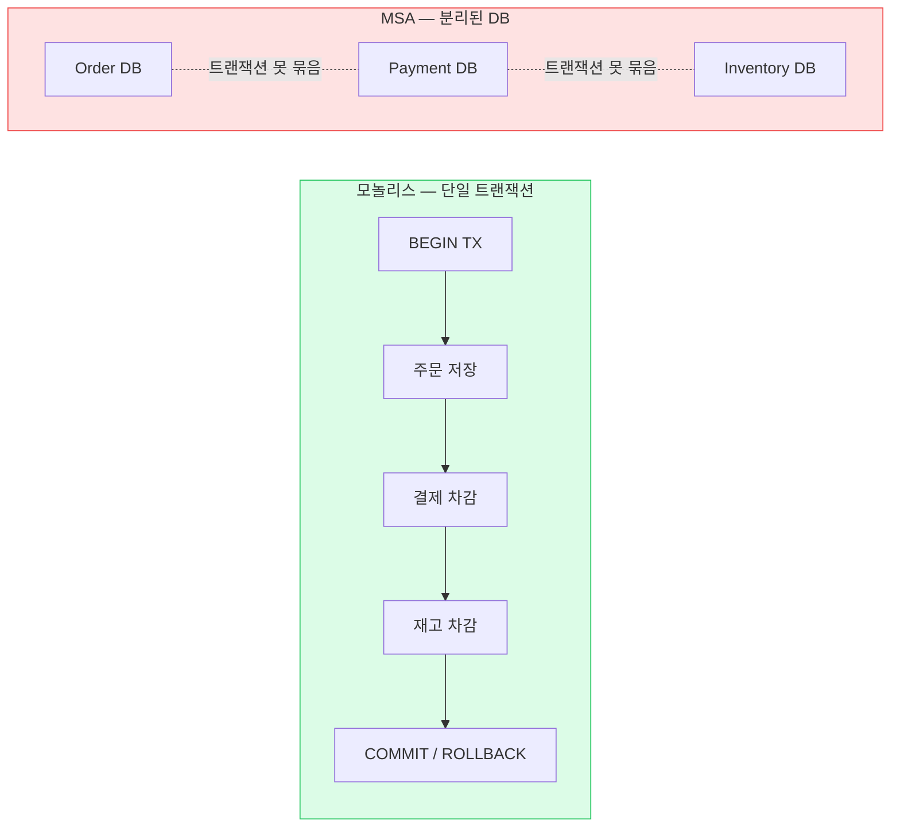
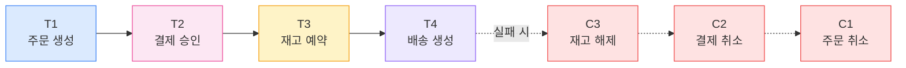
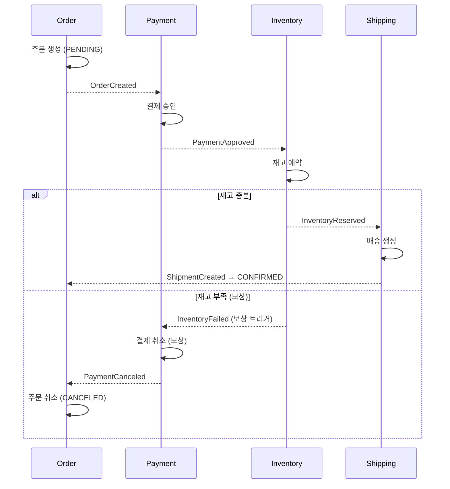
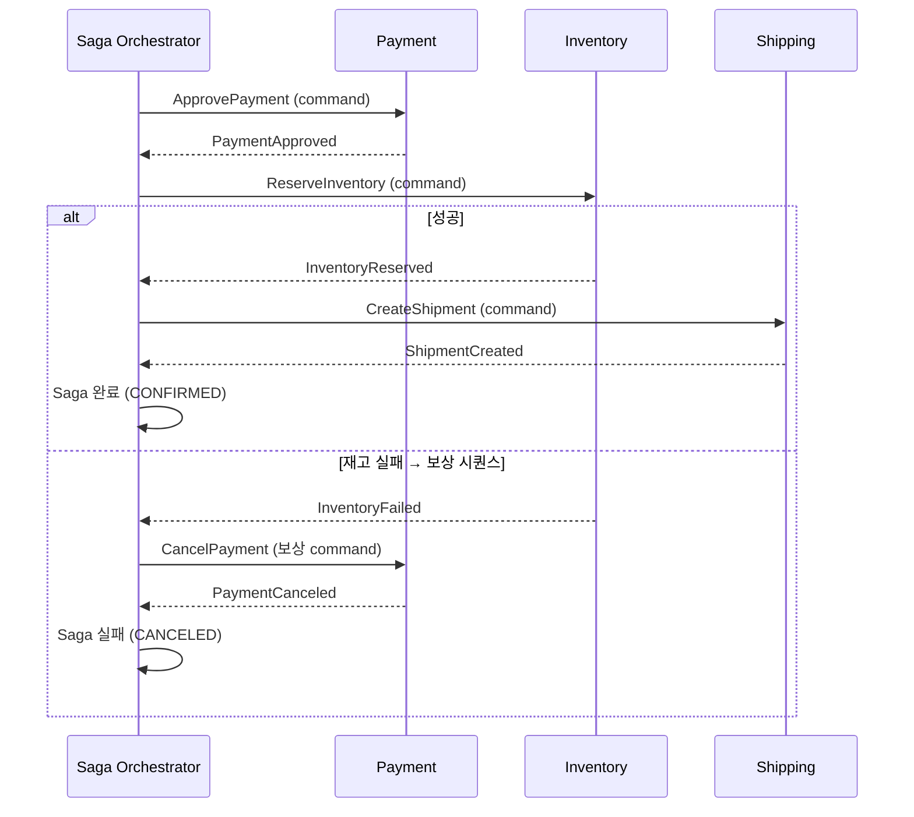
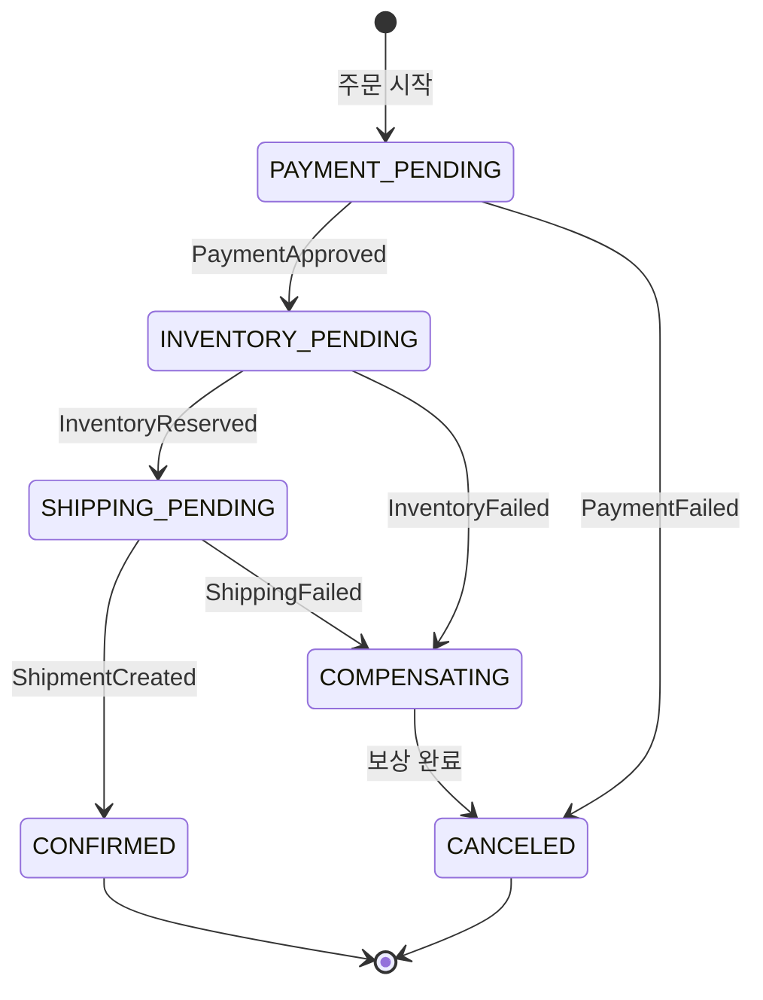
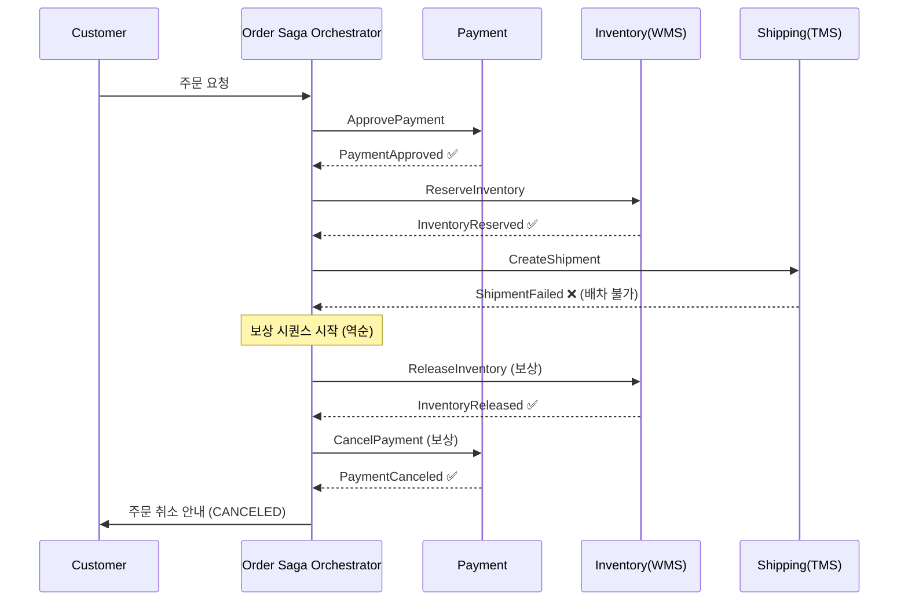

## 1. 분산 트랜잭션 문제

모놀리스에서는 주문·결제·재고가 하나의 DB 트랜잭션으로 묶여 **All-or-nothing**이 공짜다. MSA에서는 각 서비스 DB가 분리되어 하나의 트랜잭션으로 묶을 수 없다. 그런데 비즈니스적으로는 "결제됐는데 재고가 없는" 어중간한 상태를 허용할 수 없다.

*DB가 분리되면 단일 ACID 트랜잭션이 불가능. 그래서 분산 트랜잭션 전략이 필요하다.*

## 2. 2PC를 왜 피하는가

**2PC(Two-Phase Commit, 2단계 커밋)**는 코디네이터가 Prepare → Commit으로 모든 참여자를 원자적으로 커밋하는 고전 기법이다. 이론상 강일관성을 주지만 현대 MSA에서는 거의 피한다.

| 2PC의 문제 | 설명 |
| --- | --- |
| **Blocking** | Prepare 후 코디네이터 응답까지 참여자가 락을 잡고 대기 → 처리량 급락 |
| **가용성 저하** | 코디네이터 단일 장애점. 죽으면 참여자가 락 잡은 채 무한 대기 |
| **확장성 한계** | 참여자가 많고 지연이 클수록 락 보유 시간↑ → 동시성 붕괴 |
| **이종 시스템 미지원** | Kafka·외부 결제 API 등은 XA 트랜잭션을 지원 안 함 |

> **🎯 면접 포인트**
>
> "분산 환경에서 트랜잭션을 어떻게 보장하나요?"에 "2PC 쓰면 됩니다"는 위험한 답. **2PC의 blocking·가용성 문제를 설명하고 "그래서 대신 Saga로 최종 일관성을 택한다"** 가 시니어 답변. 강일관성 vs 가용성의 Trade-off를 짚어야 한다.

## 3. Saga(사가)란

**Saga**는 하나의 큰 분산 트랜잭션을 **여러 개의 로컬 트랜잭션 시퀀스**로 쪼갠 것이다. 각 단계는 자기 DB에서 로컬 커밋한다. 중간에 실패하면, 이미 커밋된 앞 단계들을 **보상 트랜잭션(Compensating Transaction)**으로 의미적으로 되돌린다(롤백이 아니라 "상쇄").

> **💡 핵심 — ACID가 아니라 ACD + 최종 일관성**
>
> Saga는 Isolation(격리성)을 포기한다. 중간 단계가 외부에 보일 수 있다(주문은 PENDING으로 노출). 대신 가용성과 확장성을 얻는다. 보상으로 **의미적 원자성(Semantic atomicity)** 을 달성한다.

*정방향 T1~T4가 진행되다 실패하면 역방향 보상 C3→C2→C1이 **역순**으로 실행된다.*

## 4. Choreography Saga (코레오그래피 사가)

중앙 조정자 없이 각 서비스가 **이벤트를 구독하고 다음 이벤트를 발행**한다. 흐름이 이벤트 체인으로 흩어진다.

*Choreography Saga — 각 서비스가 자율적으로 이벤트를 듣고 반응. 실패 시 역방향 보상 이벤트가 전파.*

> **⚠️ 실무 함정**
>
> 단계가 많아지면 "지금 전체 흐름이 어디까지 왔는지" 추적이 매우 어렵다. 누가 어떤 이벤트를 구독하는지가 코드 곳곳에 흩어져 **순환 의존·암묵적 결합** 이 생긴다. 4단계를 넘으면 Orchestration을 고려.

## 5. Orchestration Saga (오케스트레이션 사가)

중앙 **Saga Orchestrator(오케스트레이터)**가 상태 머신을 들고 각 단계를 명령하고 응답을 받아 다음을 결정한다. 흐름이 한곳에 보인다.

*Orchestration Saga — 오케스트레이터가 상태 머신으로 전체 흐름과 보상을 한곳에서 제어.*

### 오케스트레이터 상태 머신

*Saga 상태 머신 — COMPENSATING 상태가 보상 트랜잭션 진행을 명시적으로 표현한다.*

| 관점 | Choreography Saga | Orchestration Saga |
| --- | --- | --- |
| 흐름 가시성 | 낮음 (흩어짐) | **높음** (한곳) |
| 결합도 | **낮음** | 중간 (조정자가 다 앎) |
| 단일 지점 | 없음 | 오케스트레이터 |
| 보상 로직 관리 | 분산 (실수하기 쉬움) | **중앙 집중 (안전)** |
| 적합 | 2~3단계 단순 | 4단계+ 복잡, 보상 많음 |
| 도구 | Kafka 이벤트 | Temporal, Camunda, AWS Step Functions |

## 6. 보상 트랜잭션 (Compensating Transaction)

이미 커밋된 단계를 **의미적으로 상쇄**하는 별도 트랜잭션. DB 롤백이 아니라 "반대 행위"다.

| 정방향 (T) | 보상 (C) | 주의 |
| --- | --- | --- |
| 결제 승인 (Capture) | 결제 취소/환불 | 이미 정산됐으면 환불 처리 — 완전 역행 아님 |
| 재고 예약 | 재고 예약 해제 | 이미 출고됐으면 보상 불가 → 순서 설계 중요 |
| 포인트 적립 | 포인트 회수 | 이미 사용됐으면 마이너스 잔액 처리 |
| 운송장 발행 | 운송장 취소 | 이미 집하됐으면 회수(역물류) 필요 |

> **⚠️ 실무 함정 — 보상 누락과 비가역성**
>
> **실패 경로를 설계 안 하는 것** 이 Saga 최대 실수. 또한 "메일 발송"처럼 **되돌릴 수 없는(irreversible)** 단계는 보상이 불가능 → 이런 단계는 **Saga 맨 끝** 에 배치(Pivot transaction 이후). 비가역 작업 전까지가 취소 가능 구간.

### 보상 설계 3원칙

- **보상은 멱등(Idempotent)해야** — 보상이 재시도돼도 안전. "이미 취소된 결제 또 취소" → 무시.
- **보상은 실패하면 안 됨(또는 재시도로 반드시 성공)** — 보상이 실패하면 시스템이 불일치 상태로 고착. 재시도 + Dead Letter Queue + 수동 개입 알림.
- **Pivot 단계 식별** — 그 이후로는 되돌릴 수 없는 "확정점"을 정하고, 그 전까지만 자동 취소.

## 7. 주문-결제-배송 Saga 예제 (물류)

> **시나리오** — 고객이 로켓배송 주문 → 결제 승인 → 재고 예약 → 출고/배송 생성. 각 단계 실패 시 보상.

*배송 생성 실패 → 재고 해제 → 결제 취소 역순 보상. 고객은 "결제됐다가 취소"를 경험(격리성 포기의 대가).*

> **💡 정량 근거 & 설계 팁**
>
> Cut-off 직전 주문 폭주(초당 수천 건) 상황에서 Saga는 각 단계가 독립 확장 가능해 2PC보다 처리량이 훨씬 높다. 단, 각 단계 호출에 **Idempotency-Key** 와 **타임아웃 + 재시도** 가 필수. 오케스트레이터 상태는 DB에 영속화해 장애 후 복구(Recovery)가 되어야 한다. 🔥(Deep-dive)

## 8. 함정과 실제 사례

| 함정 | 대응 |
| --- | --- |
| 보상 트랜잭션 누락 (실패 경로 미설계) | 모든 단계에 대응 보상 정의 + 테스트 |
| 중복 이벤트로 이중 처리 | 각 단계·보상 멱등 + Idempotency-Key |
| 오케스트레이터 상태 휘발 | 상태 DB 영속화 + 재시작 복구 |
| 비가역 단계를 중간에 배치 | Pivot 이후로 이동, 그 전까지만 취소 가능 |
| 이벤트 발행과 DB 커밋 불일치 | Outbox 패턴으로 원자화 (06장) |

| 회사 | 활용 |
| --- | --- |
| **우아한형제들(배민)** | 주문-결제-배달대행 흐름에 Saga + 이벤트로 정합성 보장, 실패 시 보상 |
| **쿠팡** | 주문-결제-풀필먼트-배송 다단계 Saga, 출고 전까지 취소 가능 구간 관리 |
| **Uber** | Cadence/Temporal로 결제·배차 워크플로우를 Orchestration Saga로 운영 |
| **Netflix** | Conductor 오케스트레이터로 복잡한 미디어 처리 워크플로우 제어 |

> **🎯 면접 포인트 (압박 질문)**
>
> "Saga 중간에 오케스트레이터가 죽으면?" → 상태를 DB에 영속화했으니 재시작 후 마지막 상태부터 복구. "보상도 실패하면?" → 재시도 + DLQ + 알림 → 최후엔 수동 개입. 이 두 질문에 막힘없이 답하면 시니어 신호. 🔥(Deep-dive)
