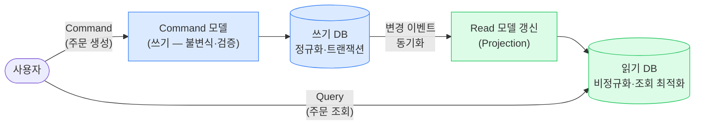
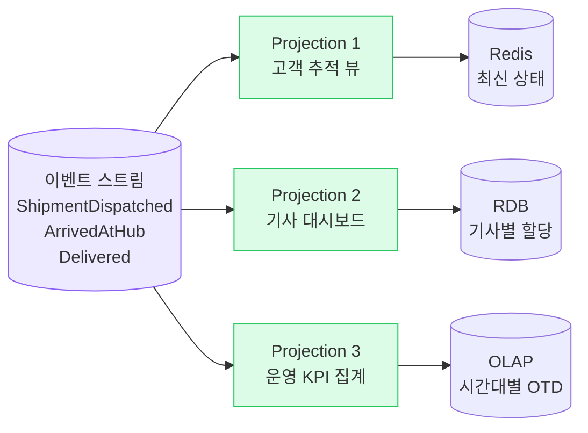
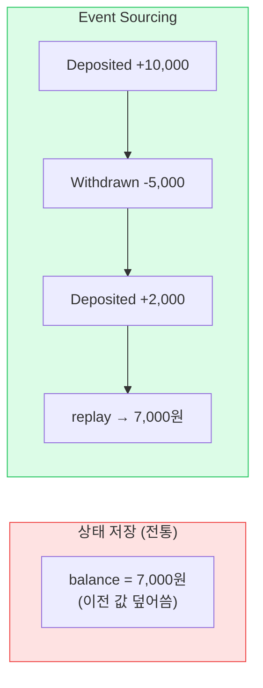
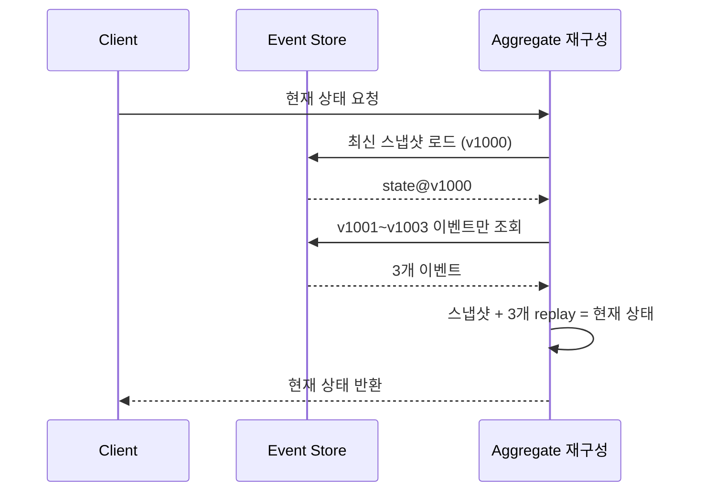
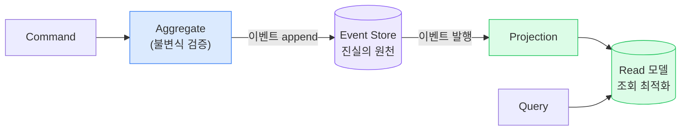

## 1. 왜 읽기/쓰기를 분리하는가 — 문제 → 해결

**문제**: 하나의 모델로 쓰기(주문 생성·검증)와 읽기(주문 목록·대시보드·통계)를 다 처리하면, 복잡한 쓰기 불변식과 다양한 읽기 요구가 충돌한다. 읽기 트래픽이 폭주(운송추적 조회)하면 쓰기까지 같이 느려진다.

**해결**: **CQRS(Command Query Responsibility Segregation, 명령/조회 책임 분리)**는 쓰기 모델(Command)과 읽기 모델(Query)을 *분리된 모델·분리된 저장소*로 나눈다. 각각 독립 최적화·독립 확장.

> **⚠️ 가장 중요한 경고**
>
> CQRS는 **기본값이 아니다** . 단순 CRUD에 도입하면 코드 2배, 동기화 버그, 최종 일관성 디버깅 지옥. **읽기/쓰기의 모델·부하·확장 요구가 확연히 다를 때만** 도입하라. "멋있어서" 쓰면 면접에서 오히려 감점.

## 2. CQRS 구조

*CQRS — 쓰기는 정규화·트랜잭션 최적화, 읽기는 비정규화·조회 최적화. 둘은 이벤트로 동기화(최종 일관성).*

|  | Command (쓰기) | Query (읽기) |
| --- | --- | --- |
| 목표 | 불변식 보장·정합성 | 빠른 조회·다양한 뷰 |
| 모델 | Aggregate (DDD) | DTO·비정규화 뷰 |
| 저장소 | RDBMS 정규화 | Elasticsearch / Redis / 비정규화 테이블 |
| 확장 | 쓰기 부하 기준 | 읽기 부하 기준(보통 훨씬 큼) |
| 일관성 | 강일관성 | 최종 일관성 (지연 허용) |

> **💡 물류 적용**
>
> 운송추적: **쓰기** 는 운송장 상태 전이(불변식 — CREATED→PICKED_UP만 허용), **읽기** 는 고객 추적 화면(초당 수만 조회). 읽기를 Elasticsearch/Redis로 분리해 쓰기와 독립 확장. CQRS의 모범 사례.

## 3. Projection (프로젝션) · 읽기 모델 구축

**Projection**은 쓰기 측 변경(또는 이벤트)을 받아 읽기 모델을 갱신하는 과정이다. 같은 데이터로 *여러 개의 다른 읽기 뷰*를 만들 수 있다.

*하나의 이벤트 스트림 → 여러 Projection → 용도별 읽기 저장소. 새 뷰가 필요하면 Projection을 추가하면 끝.*

> **⚠️ 실무 함정 — 동기화 지연과 Read-your-write**
>
> 읽기 모델은 보통 **비동기 갱신** 이라 "방금 쓴 걸 바로 못 읽는" 현상이 생긴다(Read-your-write 위반). 사용자가 주문 직후 목록에서 안 보임 → UX 문제. 해결: 쓰기 직후만 쓰기 모델에서 직접 읽기, 또는 클라이언트 낙관적 업데이트. 🔥(Deep-dive)

## 4. Event Sourcing (이벤트 소싱)

상태(현재 값)를 저장하는 대신 **상태를 바꾼 이벤트의 시퀀스**를 저장한다. 현재 상태는 이벤트를 처음부터 재생(replay)해 도출한다. 회계 장부(원장)처럼 "변경 내역이 곧 진실"이다.

*상태 저장은 "어떻게 7,000원이 됐는지" 역사를 잃는다. ES는 전체 이력을 보존하고 replay로 현재를 재구성.*

### 장점과 비용

| 장점 | 비용/위험 |
| --- | --- |
| 완전한 감사 로그(Audit) — 모든 변경 추적 | 이벤트 스키마 진화(버전 관리)가 매우 어려움 |
| 과거 임의 시점 상태 복원(시간여행) | 현재 상태 조회가 비쌈 → 스냅샷 필요 |
| 이벤트 재생으로 새 읽기 모델 생성 | 학습 곡선·운영 복잡도 높음 |
| 디버깅·재현 용이 (이벤트 재생) | "이벤트 삭제 불가" → GDPR 개인정보 삭제 충돌 |

> **⚠️ 실무 함정 — 흔한 오해**
>
> Event Sourcing을 "모든 변경을 로그 테이블에 남기는 것"으로 오해하면 안 된다. ES는 **이벤트가 유일한 진실 원천(Source of Truth)** 이고 상태는 파생물이다. 스냅샷·리플레이·버전 전략 없이 시작하면 운영에서 무너진다.

## 5. 스냅샷(Snapshot) · 리플레이(Replay)

이벤트가 수만 개 쌓인 Aggregate를 매번 처음부터 재생하면 느리다. 주기적으로 **스냅샷**(특정 버전의 상태)을 저장하고, 이후 이벤트만 재생한다.

*스냅샷 v1000 + 이후 3개 이벤트만 재생 → 1003개 전부 재생 대신 빠르게 현재 상태 도출.*

## 6. CQRS + Event Sourcing 결합

둘은 별개 패턴이지만 궁합이 좋다. ES가 이벤트를 진실로 저장하고, CQRS의 읽기 모델은 그 이벤트 스트림을 Projection해 만든다.

*ES(쓰기=이벤트 저장) + CQRS(읽기=Projection). Command는 이벤트를 만들고, Query는 Projection을 읽는다.*

> **🎯 면접 포인트**
>
> "CQRS와 Event Sourcing은 항상 같이 쓰나요?" → **아니다, 독립적이다.** CQRS만 써도 되고(읽기/쓰기 DB만 분리), ES만 써도 된다. 다만 함께 쓰면 시너지가 크다. 둘을 묶어서만 이해하면 오해. 🔥(Deep-dive)

## 7. Trade-off · 적용 조건

| 패턴 | 도입해야 할 때 | 도입하면 안 될 때 |
| --- | --- | --- |
| **CQRS** | 읽기/쓰기 부하·모델 차이 큼, 복잡한 조회 뷰 다수, 읽기 독립 확장 필요 | 단순 CRUD, 읽기/쓰기 비대칭 작음, 팀이 최종 일관성 감당 어려움 |
| **Event Sourcing** | 완전한 감사 추적 필수(금융·결제·정산), 도메인이 본질적으로 이벤트 중심, 시간여행 가치 큼 | 단순 도메인, 스키마 자주 바뀜, 즉시 현재 상태 조회가 주 용도, GDPR 삭제 빈번 |

> **💡 시니어 판단 — 점진 도입**
>
> 처음부터 ES로 가지 마라. 보통 ① 모놀리스 CRUD → ② 읽기 폭주 지점만 CQRS(읽기 DB 분리) → ③ 감사·정합성이 핵심인 일부 Aggregate만 ES. **핵심 도메인(Core)에 국소적으로** 적용하는 것이 정석. 전사 ES는 거의 함정.

## 8. 실제 사례

| 회사/도메인 | 활용 |
| --- | --- |
| **토스 / 결제·정산** | 금융 거래는 감사·정합성이 생명 → 거래 이벤트 기반 원장(ES 성격), 읽기는 분리된 조회 모델 |
| **쿠팡 / 운송추적** | 상태 변화 이벤트 스트림 + 고객 추적 읽기 모델(Redis/ES)로 CQRS — 수천만 조회/일 분리 |
| **배민 / 주문** | 주문 상태 변화를 이벤트로, 운영/통계 대시보드는 별도 읽기 모델로 Projection |
| **Netflix / 시청 이력** | 대규모 이벤트 스트림 + 다수 Projection으로 추천·재생 이어보기 등 뷰 생성 |

> **🎯 면접 포인트 (단골)**
>
> "운송추적 시스템을 설계해보라"에서 CQRS는 거의 정답 키워드. 상태 전이(쓰기)와 조회 폭주(읽기)를 분리하고, 읽기를 Redis/ES로 빼서 독립 확장. 단, **최종 일관성 지연을 고객에게 어떻게 보일지(UX)** 까지 답하면 시니어. 🔥(Deep-dive)
