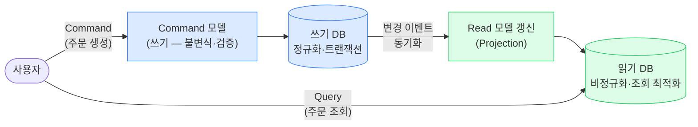
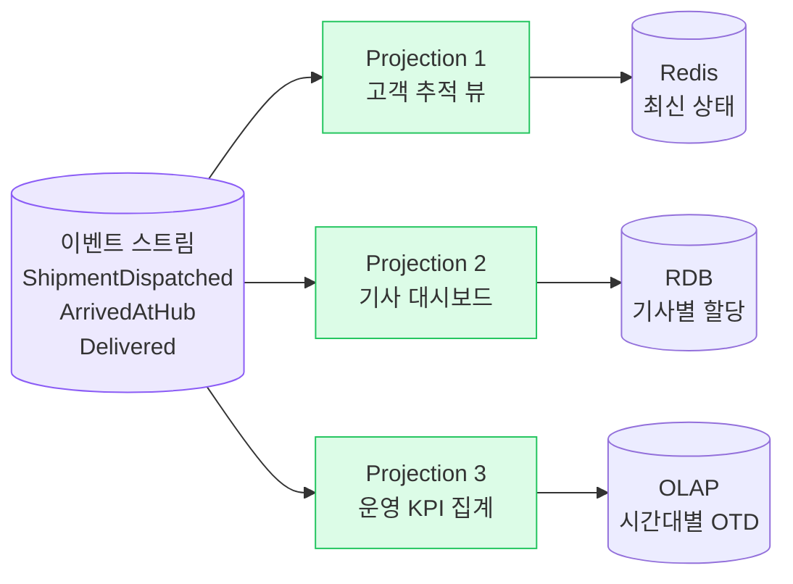
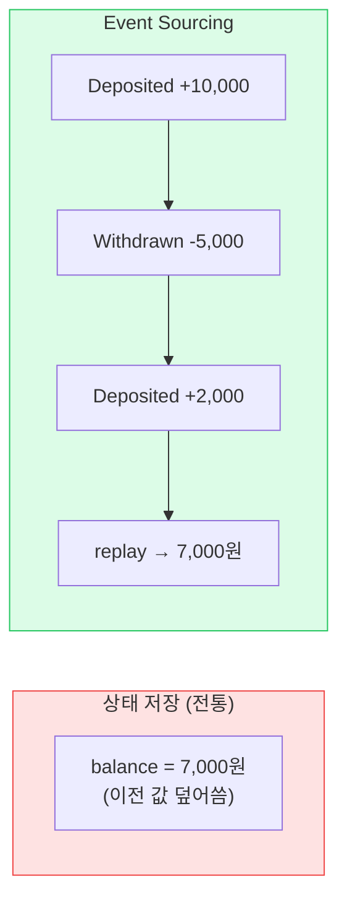
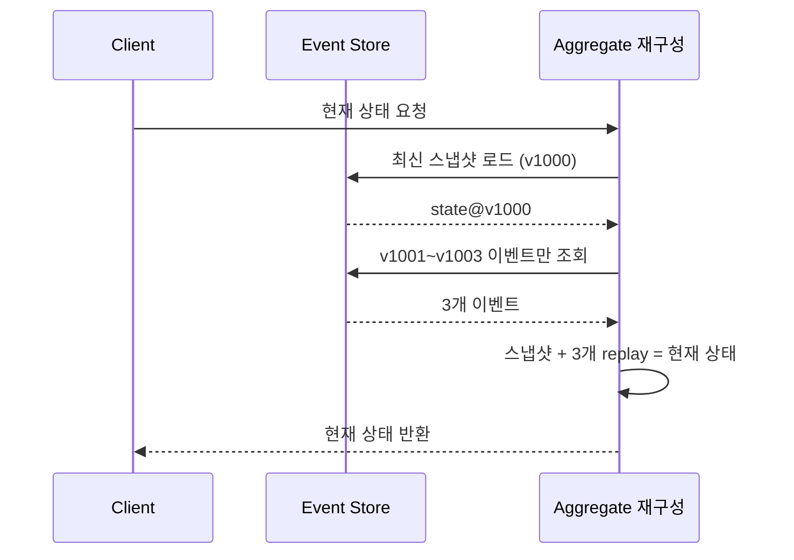
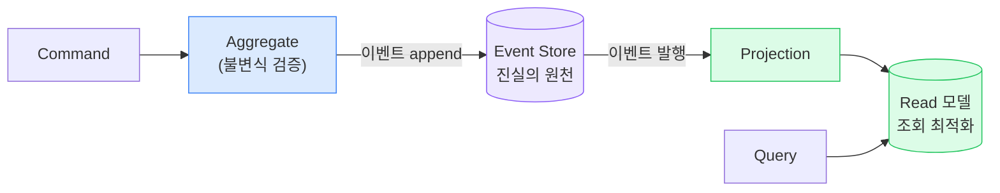

## 1. 왜 읽기/쓰기를 분리하는가 — 문제 → 해결

**문제**: 하나의 모델로 쓰기(주문 생성·검증)와 읽기(주문 목록·대시보드·통계)를 다 처리하면, 복잡한 쓰기 불변식과 다양한 읽기 요구가 충돌한다. 읽기 트래픽이 폭주(운송추적 조회)하면 쓰기까지 같이 느려진다.

**해결**: **CQRS(Command Query Responsibility Segregation, 명령/조회 책임 분리)**는 쓰기 모델(Command)과 읽기 모델(Query)의 모델·인터페이스를 분리한다. 두 모델이 같은 DB를 사용해도 CQRS이며, 별도 저장소·프로젝션은 읽기/쓰기 부하와 모델 차이가 실제로 클 때 선택한다. 각각의 독립 최적화·확장에는 동기화와 운영 비용이 따른다.

> **⚠️ 가장 중요한 경고**
>
> CQRS는 **기본값이 아니다** . 단순 CRUD에 도입하면 코드 2배, 동기화 버그, 최종 일관성 디버깅 지옥. **읽기/쓰기의 모델·부하·확장 요구가 확연히 다를 때만** 도입하라. "멋있어서" 쓰면 면접에서 오히려 감점.

## 2. CQRS 구조


```mermaid
flowchart LR
    U(["사용자"])
    U -->|"Command\n(주문 생성)"| CM["Command 모델\n(쓰기 — 불변식·검증)"]
    CM --> WDB[("쓰기 DB\n정규화·트랜잭션")]
    WDB -->|"변경 이벤트\n동기화"| RM["Read 모델 갱신\n(Projection)"]
    RM --> RDB[("읽기 DB\n비정규화·조회 최적화")]
    U -->|"Query\n(주문 조회)"| RDB

    style CM fill:#dbeafe,stroke:#3b82f6
    style WDB fill:#dbeafe,stroke:#3b82f6
    style RM fill:#dcfce7,stroke:#22c55e
    style RDB fill:#dcfce7,stroke:#22c55e
```

*CQRS — 쓰기는 정규화·트랜잭션 최적화, 읽기는 비정규화·조회 최적화. 둘은 이벤트로 동기화(최종 일관성).*

|  | Command (쓰기) | Query (읽기) |
| --- | --- | --- |
| 목표 | 불변식 보장·정합성 | 빠른 조회·다양한 뷰 |
| 모델 | Aggregate (DDD) | DTO·비정규화 뷰 |
| 저장소 | 정합성과 명령 처리에 맞춘 저장소 | 조회 패턴에 맞춘 비정규화 테이블·검색·캐시 등(요구사항에 따라 선택) |
| 확장 | 쓰기 부하 기준 | 읽기 부하 기준(보통 훨씬 큼) |
| 일관성 | 강일관성 | 최종 일관성 (지연 허용) |

> **💡 물류 적용**
>
> 운송추적: **쓰기** 는 운송장 상태 전이(예: CREATED→PICKED_UP 허용 여부를 도메인 규칙으로 검증), **읽기** 는 고객 추적 화면이다. 실제 읽기량·지연 목표·검색 조건을 측정한 뒤 비정규화 테이블, 검색 저장소, 캐시 중 하나를 선택한다. 읽기 모델을 분리하면 독립 확장 여지가 생기지만 최종 일관성·재구축·중복 전달을 함께 운영해야 한다.

## 3. Projection (프로젝션) · 읽기 모델 구축

**Projection**은 쓰기 측 변경(또는 이벤트)을 받아 읽기 모델을 갱신하는 과정이다. 같은 데이터로 *여러 개의 다른 읽기 뷰*를 만들 수 있다.


```mermaid
flowchart LR
    E[("이벤트 스트림\nShipmentDispatched\nArrivedAtHub\nDelivered")]
    E --> P1["Projection 1\n고객 추적 뷰"]
    E --> P2["Projection 2\n기사 대시보드"]
    E --> P3["Projection 3\n운영 KPI 집계"]
    P1 --> V1[("Redis\n최신 상태")]
    P2 --> V2[("RDB\n기사별 할당")]
    P3 --> V3[("OLAP\n시간대별 OTD")]

    style E fill:#ede9fe,stroke:#8b5cf6
    style P1 fill:#dcfce7,stroke:#22c55e
    style P2 fill:#dcfce7,stroke:#22c55e
    style P3 fill:#dcfce7,stroke:#22c55e
```

*하나의 이벤트 스트림 → 여러 Projection → 용도별 읽기 저장소. 새 뷰가 필요하면 Projection을 추가하면 끝.*

> **⚠️ 실무 함정 — 동기화 지연과 Read-your-write**
>
> 읽기 모델은 보통 **비동기 갱신** 이라 "방금 쓴 걸 바로 못 읽는" 현상이 생긴다(Read-your-write 위반). 사용자가 주문 직후 목록에서 안 보임 → UX 문제. 해결: 쓰기 직후만 쓰기 모델에서 직접 읽기, 또는 클라이언트 낙관적 업데이트. 🔥(Deep-dive)

## 4. Event Sourcing (이벤트 소싱)

상태(현재 값)를 저장하는 대신 **상태를 바꾼 이벤트의 시퀀스**를 저장한다. 현재 상태는 이벤트를 처음부터 재생(replay)해 도출한다. 회계 장부(원장)처럼 "변경 내역이 곧 진실"이다.


```mermaid
flowchart LR
    subgraph STATE["상태 저장 (전통)"]
      direction TB
      ST["balance = 7,000원\n(이전 값 덮어씀)"]
    end
    subgraph ES["Event Sourcing"]
      direction TB
      E1["Deposited +10,000"]
      E2["Withdrawn -5,000"]
      E3["Deposited +2,000"]
      E1 --> E2 --> E3
      SUM["replay → 7,000원"]
      E3 --> SUM
    end

    style STATE fill:#fee2e2,stroke:#ef4444
    style ES fill:#dcfce7,stroke:#22c55e
```

*상태 저장은 "어떻게 7,000원이 됐는지" 역사를 잃는다. ES는 전체 이력을 보존하고 replay로 현재를 재구성.*

### 장점과 비용

| 장점 | 비용/위험 |
| --- | --- |
| 완전한 감사 로그(Audit) — 모든 변경 추적 | 이벤트 스키마 진화(버전 관리)가 매우 어려움 |
| 과거 임의 시점 상태 복원(시간여행) | 현재 상태 조회가 비쌈 → 스냅샷 필요 |
| 이벤트 재생으로 새 읽기 모델 생성 | 학습 곡선·운영 복잡도 높음 |
| 디버깅·재현 용이 (이벤트 재생) | "이벤트 삭제 불가" → GDPR 개인정보 삭제 충돌 |

> **⚠️ 실무 함정 — 흔한 오해**
>
> Event Sourcing을 "모든 변경을 로그 테이블에 남기는 것"으로 오해하면 안 된다. ES에서는 해당 이벤트 스트림이 Aggregate의 상태를 재구성하는 기록이며, 스냅샷과 읽기 모델은 파생물이다. 이벤트 스키마 버전, 순서·동시성 검사, 개인정보 보존·삭제 정책, 스냅샷·리플레이 전략 없이 시작하면 운영에서 무너진다.

## 5. 스냅샷(Snapshot) · 리플레이(Replay)

이벤트가 수만 개 쌓인 Aggregate를 매번 처음부터 재생하면 느리다. 주기적으로 **스냅샷**(특정 버전의 상태)을 저장하고, 이후 이벤트만 재생한다.


```mermaid
sequenceDiagram
    participant C as Client
    participant ES as Event Store
    participant A as Aggregate 재구성

    C->>A: 현재 상태 요청
    A->>ES: 최신 스냅샷 로드 (v1000)
    ES-->>A: state@v1000
    A->>ES: v1001~v1003 이벤트만 조회
    ES-->>A: 3개 이벤트
    A->>A: 스냅샷 + 3개 replay = 현재 상태
    A-->>C: 현재 상태 반환
```

*스냅샷 v1000 + 이후 3개 이벤트만 재생 → 1003개 전부 재생 대신 빠르게 현재 상태 도출.*

## 6. CQRS + Event Sourcing 결합

둘은 별개 패턴이지만 궁합이 좋다. ES가 이벤트를 진실로 저장하고, CQRS의 읽기 모델은 그 이벤트 스트림을 Projection해 만든다.


```mermaid
flowchart LR
    CMD["Command"] --> AGG["Aggregate\n(불변식 검증)"]
    AGG -->|"이벤트 append"| ESTORE[("Event Store\n진실의 원천")]
    ESTORE -->|"이벤트 발행"| PROJ["Projection"]
    PROJ --> READ[("Read 모델\n조회 최적화")]
    QRY["Query"] --> READ

    style AGG fill:#dbeafe,stroke:#3b82f6
    style ESTORE fill:#ede9fe,stroke:#8b5cf6
    style PROJ fill:#dcfce7,stroke:#22c55e
    style READ fill:#dcfce7,stroke:#22c55e
```

*ES(쓰기=이벤트 저장) + CQRS(읽기=Projection). Command는 이벤트를 만들고, Query는 Projection을 읽는다.*

> **🎯 면접 포인트**
>
> "CQRS와 Event Sourcing은 항상 같이 쓰나요?" → **아니다, 독립적이다.** CQRS만 써도 되고(읽기/쓰기 DB만 분리), ES만 써도 된다. 다만 함께 쓰면 시너지가 크다. 둘을 묶어서만 이해하면 오해. 🔥(Deep-dive)

## 7. Trade-off · 적용 조건

| 패턴 | 도입해야 할 때 | 도입하면 안 될 때 |
| --- | --- | --- |
| **CQRS** | 읽기/쓰기 부하·모델 차이 큼, 복잡한 조회 뷰 다수, 읽기 독립 확장 필요 | 단순 CRUD, 읽기/쓰기 비대칭 작음, 팀이 최종 일관성 감당 어려움 |
| **Event Sourcing** | 감사·재구성·시간여행이 요구되고 이벤트를 원장으로 운영할 역량이 있음 | 단순 도메인, 현재 상태 CRUD가 주 용도, 즉시 일관성 읽기 요구가 크거나 개인정보 삭제 정책을 충족할 설계가 없음 |

> **💡 시니어 판단 — 점진 도입**
>
> 처음부터 ES로 가지 마라. 먼저 감사·재구성 요구와 읽기/쓰기 비대칭을 확인하고, 필요한 경계에만 선택적으로 도입한다. CRUD에 CQRS를 적용할 때도 논리 모델 분리부터 시작할 수 있다. 조직 전체에 동일 패턴을 강제하기보다 이벤트 계약·운영 역량·삭제 정책을 검증한 뒤 범위를 넓힌다.

## 8. 실패 입력 → 판단 → 복구

| 실패 입력 | 판단 | 복구·완화 |
| --- | --- | --- |
| 쓰기 DB는 커밋됐지만 읽기 Projection 이벤트가 유실됨 | Outbox/이벤트 로그의 상태와 Projection의 마지막 버전을 대조한다. 브로커 lag만으로 유실을 단정하지 않는다. | 이벤트를 재발행하거나 원장부터 해당 범위를 재투영한다. 소비자는 `(aggregate_id, version)` 또는 event ID로 중복·역순을 막는다. |
| 사용자가 방금 변경한 값이 읽기 화면에 없음 | 허용 지연과 Read-your-write 요구를 구분한다. 읽기 저장소가 최신인지, 캐시가 오래됐는지 확인한다. | 커밋 버전/토큰을 전달해 그 버전 이상을 읽거나, 짧은 시간 쓰기 모델 조회·낙관적 UI를 사용한다. “CQRS면 즉시 읽기”라고 가정하지 않는다. |
| 과거 이벤트에 개인정보가 포함되어 삭제 요청이 들어옴 | 이벤트가 append-only라는 사실과 법적 보존·삭제·암호화 정책을 분리해 검토한다. | PII를 이벤트에서 분리하거나 토큰화하고 키 폐기·마스킹·보정 이벤트·리드 모델 삭제를 정책과 증거로 실행한다. 단순 행 삭제가 replay를 깨뜨릴 수 있다. |
| 이벤트 스키마가 바뀌어 재생이 실패함 | 저장된 이벤트 버전과 현재 handler의 호환 범위를 확인한다. | upcaster/버전별 handler로 읽고, 재투영 전 새 모델을 격리 검증한다. 과거 이벤트를 무리하게 덮어쓰지 않는다. |

이 표의 지연·처리량·보존기간은 시스템 요구사항에서 정할 값이며 고정된 숫자나 특정 저장소가 보편적인 답은 아니다.

> **🎯 면접 포인트**
>
> “운송추적 시스템을 설계하라”는 질문에는 CQRS라는 이름보다 쓰기 불변식, 읽기 지연을 사용자에게 표시하는 방식, Projection 재구축과 중복 이벤트 처리를 함께 설명한다. 읽기를 Redis나 검색 저장소로 분리할지는 실제 질의와 SLO로 결정한다. 🔥(Deep-dive)

```sql
SELECT event_id, aggregate_version, event_type, payload
FROM event_store
WHERE aggregate_id = :id
ORDER BY aggregate_version;
```

## 9. 공식 참고 자료

- [Microsoft Learn — CQRS pattern](https://learn.microsoft.com/en-us/azure/architecture/patterns/cqrs)
- [Microsoft Learn — Event Sourcing pattern](https://learn.microsoft.com/en-us/azure/architecture/patterns/event-sourcing)
- [Microsoft Learn — Materialized View pattern](https://learn.microsoft.com/en-us/azure/architecture/patterns/materialized-view)
