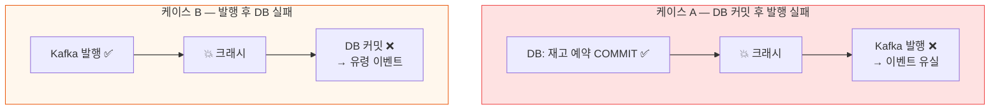
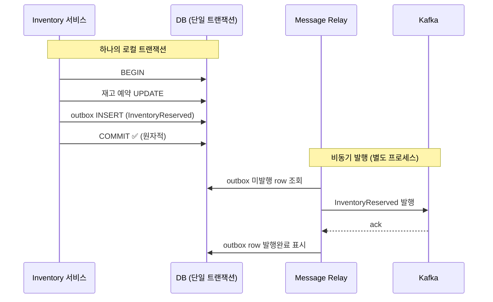
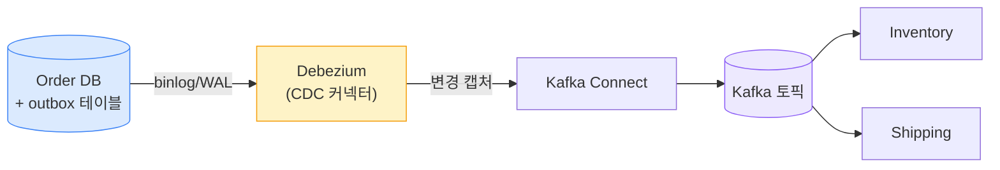
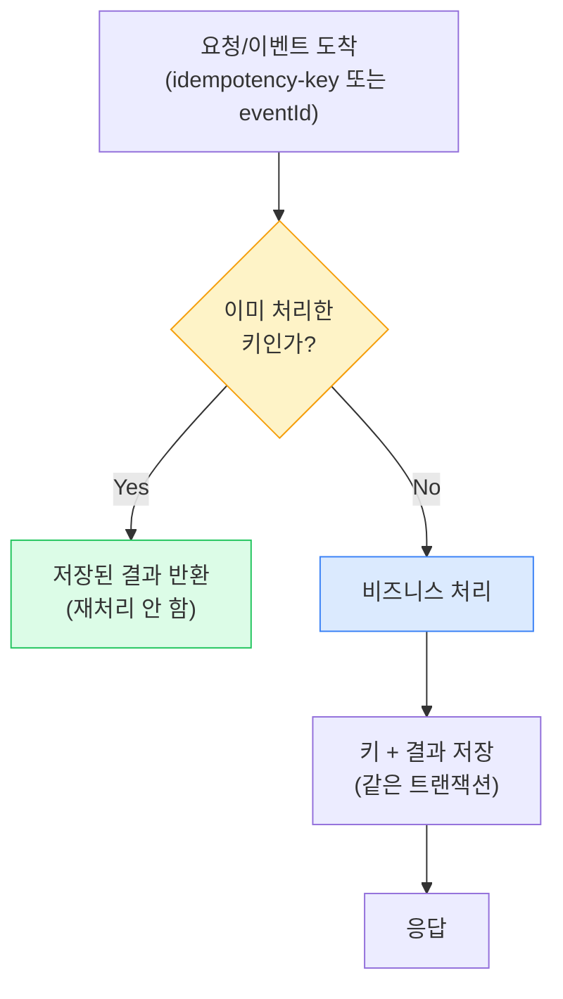
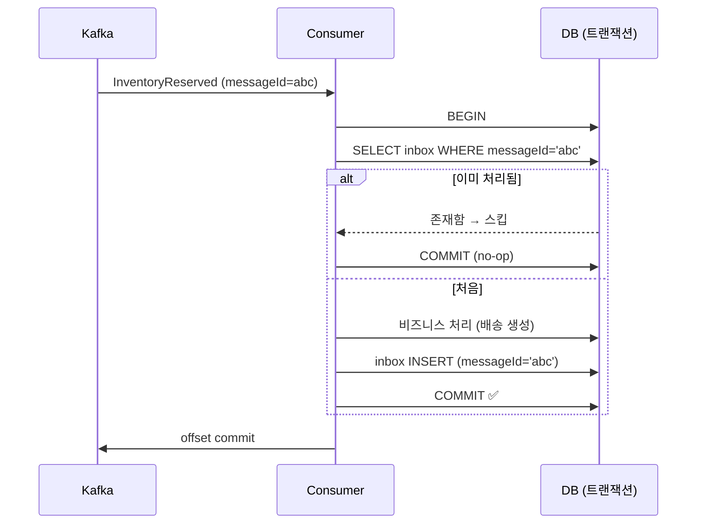
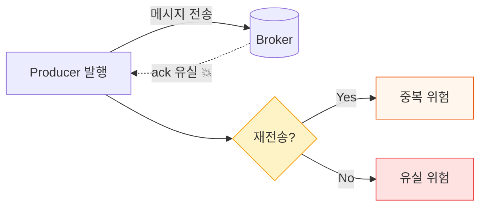
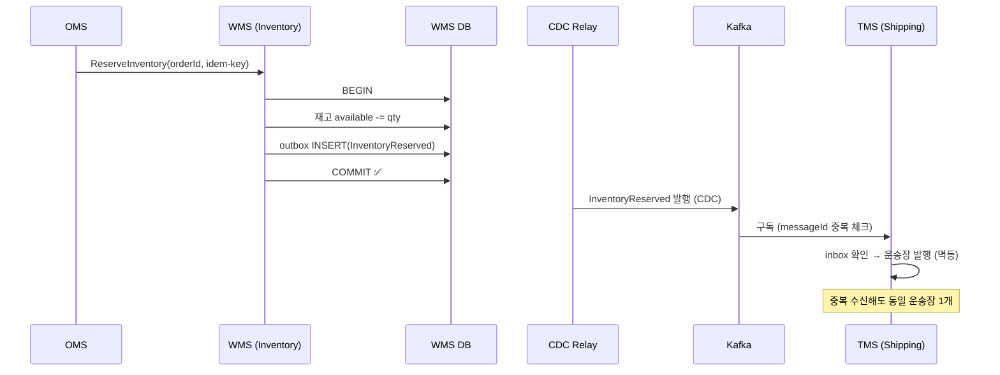

## 1. Dual-write 문제 (이중 쓰기)

하나의 비즈니스 동작이 **서로 다른 두 시스템(DB + 메시지 브로커)에 써야** 할 때, 둘을 하나의 트랜잭션으로 묶을 수 없다. 사이에서 죽으면 불일치가 생긴다.

*DB와 브로커는 분리된 트랜잭션. 순서를 어떻게 바꿔도 그 사이 장애 시 불일치(유실/유령)가 발생한다.*

> **🎯 면접 포인트 (매우 단골)**
>
> "주문을 저장하고 이벤트를 발행하는데, 발행 직전에 서버가 죽으면?" → 이 한 질문이 Dual-write 이해를 검증한다. "try-catch로 재시도"는 부분 답. **"DB와 브로커를 한 트랜잭션에 못 묶으니 Outbox로 같은 DB 트랜잭션에 이벤트를 적재하고, 별도 릴레이가 발행한다"** 가 정답.

## 2. Transactional Outbox (트랜잭셔널 아웃박스)

핵심 아이디어: 비즈니스 데이터와 **발행할 이벤트를 같은 DB의 `outbox` 테이블에 한 트랜잭션으로** 저장한다. DB 트랜잭션이 원자성을 보장하므로 "데이터는 저장됐는데 이벤트는 없는" 상태가 불가능해진다. 발행은 나중에 별도 프로세스가 한다.

*비즈니스 변경 + outbox INSERT가 한 트랜잭션 → 원자성 확보. 릴레이가 outbox를 읽어 발행 후 마킹.*

> **💡 outbox 테이블 스키마**
>
> `id` , `aggregate_type` , `aggregate_id` , `event_type` , `payload(JSON)` , `created_at` , `published_at(nullable)` . `published_at IS NULL` 인 row만 발행 대상. 멱등 발행 위해 `id` 를 메시지 키/Idempotency-Key로 사용.

## 3. 릴레이 방식 — 폴링 vs CDC

outbox를 어떻게 읽어 발행하느냐의 두 방식.

| 관점 | Polling Publisher (폴링) | CDC (Change Data Capture, 변경 데이터 캡처) |
| --- | --- | --- |
| 방식 | 주기적으로 `SELECT ... WHERE published_at IS NULL` | DB 트랜잭션 로그(binlog/WAL)를 구독 |
| 구현 난이도 | **간단** (앱 코드만) | 높음 (Debezium 등 인프라) |
| 지연 | 폴링 간격만큼 (수십~수백 ms) | **거의 실시간** |
| DB 부하 | 폴링 쿼리 부하 | 로그 읽기 (앱 DB 부하 적음) |
| 대표 도구 | 스케줄러 + 쿼리 | Debezium + Kafka Connect |

*CDC 방식 — Debezium이 트랜잭션 로그를 읽어 outbox 변경을 Kafka로. 폴링 부하 없이 실시간 발행.*

> **⚠️ 실무 함정**
>
> 릴레이는 **At-least-once** 다. 발행 후 "발행완료 마킹" 직전에 죽으면 같은 이벤트를 또 발행한다. 그래서 **컨슈머 멱등성이 필수 전제** . Outbox는 "유실 0"을 보장하지만 "중복 0"은 보장 안 한다.

## 4. Idempotency (멱등성) 보장

**멱등성**: 같은 요청/이벤트를 여러 번 처리해도 결과가 한 번 처리한 것과 동일. At-least-once 세상에서 중복을 흡수하는 핵심 무기.

### 구현 방법

| 방법 | 설명 | 적용 |
| --- | --- | --- |
| **Idempotency-Key** | 클라이언트가 고유 키 부여 → 서버가 키별 처리 결과 저장 | 결제 요청, 외부 API 호출 |
| **처리 이벤트 ID 기록** | 이미 처리한 `eventId`를 DB/Redis에 저장 후 중복 무시 | 이벤트 컨슈머 (Inbox) |
| **조건부 연산(자연 멱등)** | `SET status='PAID'`처럼 반복해도 결과 동일하게 설계 | 상태 전이 |
| **유니크 제약** | DB unique index로 중복 INSERT 차단 | 주문번호·예약ID |

*멱등 처리 흐름 — 키 확인 → 처리 → 키+결과 저장을 같은 트랜잭션으로. 중복이 와도 안전.*

> **🎯 면접 포인트**
>
> "결제 버튼 더블클릭으로 두 번 요청되면?" → 클라이언트가 **같은 Idempotency-Key** 를 보내고, 서버는 키가 이미 있으면 첫 처리 결과를 그대로 반환. 키 저장과 결제 처리는 **같은 트랜잭션 또는 유니크 제약** 으로 원자화해야 경쟁 조건(동시 두 요청)도 막힌다. 🔥(Deep-dive)

## 5. Inbox 패턴 (소비자 측 중복 제거)

Outbox가 발행 측이라면 **Inbox(인박스)**는 소비 측이다. 컨슈머가 처리한 `messageId`를 inbox 테이블에 기록하고, 이미 있으면 스킵한다. 메시지 처리와 inbox 기록을 같은 트랜잭션으로 묶어 "처리는 했는데 기록 안 됨 → 재처리"를 막는다.

*Inbox 패턴 — messageId로 중복 판정 + 비즈니스 처리 + inbox 기록을 한 트랜잭션으로 원자화.*

> **💡 Outbox + Inbox = 양쪽 안전**
>
> 발행 측 **Outbox** 로 유실 방지, 소비 측 **Inbox** 로 중복 제거. 둘을 합치면 At-least-once 위에서 **Effectively-once** 를 달성한다. 운송장 이벤트처럼 중복·유실이 치명적인 흐름의 표준 조합.

## 6. Exactly-once의 허상

"정확히 한 번 전달(Exactly-once delivery)"은 분산 환경에서 **수학적으로 불가능**하다. 발행자가 ack를 못 받았을 때 "안 갔다"인지 "갔는데 ack만 유실"인지 구분할 수 없기 때문이다. 재전송하면 중복, 안 하면 유실.

*ack 유실 시 발행자는 진실을 알 수 없다. "정확히 한 번 전달"이 불가능한 근본 이유.*

> **🎯 면접 포인트 (고급)**
>
> "Kafka가 exactly-once 지원하지 않나요?" → Kafka의 EOS는 **"Kafka 내부 처리(read-process-write)"** 한정이지, 외부 시스템(DB·결제 API)까지의 end-to-end exactly-once delivery는 아니다. 현실 해법은 **"At-least-once 전송 + 멱등 컨슈머 = Effectively-once 처리"** . 이걸 구분하면 시니어 신호. 🔥(Deep-dive)

| 용어 | 의미 |
| --- | --- |
| Exactly-once **delivery** | 전달이 정확히 1번 — 분산 환경에서 불가능 |
| Exactly-once / Effectively-once **processing** | 결과가 1번 처리한 것과 동일 — 멱등성으로 **달성 가능** |

## 7. 물류 적용 예제 — 재고 예약 + 운송장 이벤트

> **시나리오** — 재고 차감 트랜잭션과 `InventoryReserved` 이벤트 발행을 원자화, 운송장 이벤트는 멱등 소비.

*Outbox(WMS 발행 측) + Inbox(TMS 소비 측). 재고-이벤트 원자화 + 운송장 중복 방지 동시 달성.*

> **💡 정량 근거**
>
> Cut-off 직전 초당 수천 건 재고 예약 상황에서, Outbox 없이 "커밋 후 발행"이면 장애 시 **이벤트 유실율이 0이 아니다** (수천 건 중 일부 유실 = 배송 누락). Outbox는 유실율을 0으로, Inbox 멱등은 기사 앱 중복 스캔으로 인한 운송장 중복 발행을 0으로 만든다.

## 8. 함정과 실제 사례

| 함정 | 대응 |
| --- | --- |
| Outbox 없이 커밋 후 발행 | Transactional Outbox로 원자화 |
| 멱등성 없는 컨슈머 | Inbox / eventId 기록 / 유니크 제약 |
| Idempotency-Key 저장과 처리가 별도 트랜잭션 | 같은 트랜잭션 또는 유니크 제약으로 경쟁 차단 |
| outbox 테이블 무한 증가 | 발행 완료 row 주기적 아카이빙/삭제 |
| Exactly-once를 믿고 멱등 생략 | delivery≠processing 구분, 멱등 필수 |

| 회사 | 활용 |
| --- | --- |
| **토스 / 결제** | 결제 요청에 Idempotency-Key 표준 적용 — 더블 요청·재시도에도 단일 결제 보장 |
| **우아한형제들(배민)** | 주문 이벤트 발행에 Outbox 패턴으로 DB-Kafka 원자성 확보, 컨슈머 멱등 처리 |
| **쿠팡 / 물류** | 운송장 TrackingEvent를 CDC(Debezium류) + Kafka로, 중복 스캔은 멱등 소비로 흡수 |
| **Stripe** | `Idempotency-Key` 헤더를 공개 API 표준으로 — 네트워크 재시도 안전 |

> **🎯 면접 포인트 (종합)**
>
> 이 장의 세 핵심 — ① Dual-write는 Outbox로 ② 중복은 멱등(Inbox/Key)으로 ③ Exactly-once delivery는 불가, Effectively-once processing이 목표 — 를 한 문장으로 엮어 답하면 분산 시스템 정합성에 대한 시니어 이해를 보여준다.
