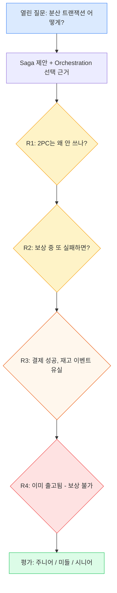
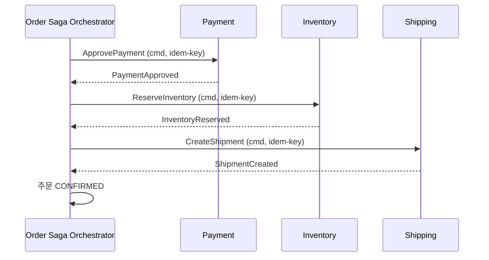
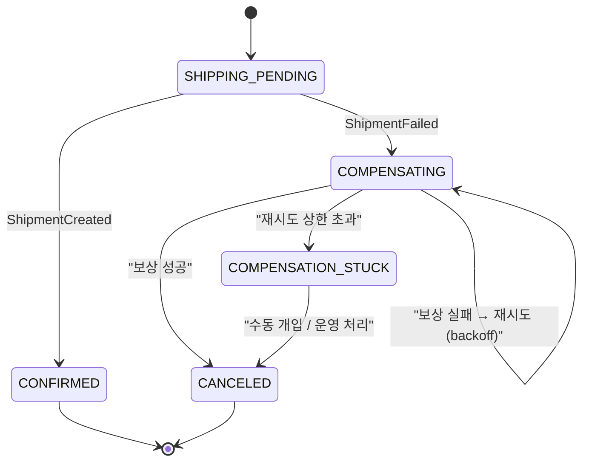
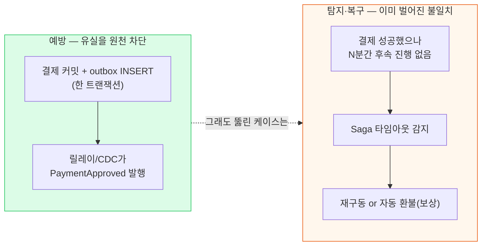
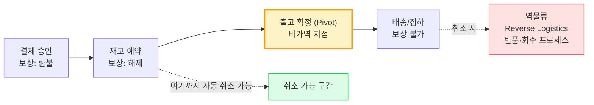

## 1. 면접 시나리오 개요 (40분)

> **면접관**: "이커머스 백엔드입니다. 기존 모놀리스를 **Order / Payment / Inventory / Shipping** 4개 마이크로서비스로 분리했고, 각자 독립 DB를 씁니다. 고객이 주문하면 결제·재고·배송이 모두 성공해야 주문이 확정됩니다. 이 흐름의 **분산 트랜잭션을 어떻게 처리**하시겠어요? 화이트보드 쓰셔도 됩니다."

이 카드는 개념 카드(04 Saga, 06 Outbox/Idempotency)를 **이미 안다고 전제**한다. 여기서 훈련하는 건 지식이 아니라 **압박 속에서 답을 구조화하고, 오답의 함정을 피하고, 후속 질문을 예측하는 능력**이다.



*면접은 정답을 맞히는 게임이 아니라 "어디까지 무너지지 않고 버티나"의 게임이다. 각 라운드는 앞 답변의 약한 고리를 파고든다.*

> **🎯 면접 포인트 — 첫 30초가 승부**
>
> 열린 질문에 곧장 코드/이벤트 이름부터 쏟지 마라. **"강일관성을 포기하고 최종 일관성(Eventual Consistency)을 받아들이는 대신 가용성·확장성을 얻겠다. 그래서 Saga를 쓰고, 4단계에 보상 로직이 많으니 Choreography보다 Orchestration을 택하겠다"** — 이 한 문장으로 (1) Trade-off 인식 (2) 패턴 선택 (3) 선택 근거를 30초에 던지면 면접관이 "이 사람은 프레임이 있다"고 판단한다.

### 답변의 뼈대 (말하면서 그릴 것)



*성공 경로(Happy path). 면접관은 이걸 30초 만에 지나가고 곧바로 실패 경로를 후벼판다. 준비된 지원자는 성공 경로를 빨리 그리고 "이제 실패 경로를 보죠"라고 먼저 치고 나간다.*

---

## 2. R1 — "2PC는 왜 안 쓰나요?"

> **면접관**: "그냥 **2PC(Two-Phase Commit, 2단계 커밋)**로 4개 DB를 묶으면 강일관성이 공짜인데, 왜 굳이 복잡한 Saga를 쓰죠?"

이건 함정이자 기본기 검증이다. "복잡해서요" 같은 감성 답변은 감점이다. **정량적·구조적 이유**를 대야 한다.

| 축 | 2PC | Saga | 면접에서 강조할 한 마디 |
| --- | --- | --- | --- |
| 락 보유 | Prepare~Commit 구간 내내 락 | 로컬 트랜잭션만 짧게 | "Cut-off 초당 수천 건에서 2PC 락 대기는 처리량을 무너뜨린다" |
| 가용성 | 코디네이터 죽으면 참여자 무한 블로킹 | 참여자 독립 진행 | "CAP에서 2PC는 CP, Saga는 AP 쪽 선택" |
| 이종 시스템 | XA 필요 — Kafka·외부 결제 API 미지원 | 무관 | "PG사 결제 API는 XA를 지원 안 한다. 2PC 자체가 불가능" |
| 격리성 | 강함 | 포기(중간 상태 노출) | "대가로 격리성을 잃는 걸 인정하고 보상으로 메운다" |

> **⚠️ 실무 함정 — "2PC는 무조건 나쁘다"도 오답**
>
> 면접관이 "그럼 2PC는 쓰레기냐?"고 되물으면 함정이다. **단일 DB 내 분산(같은 RDBMS 샤드), 참여자 소수·저지연·XA 지원 환경**에서는 2PC가 여전히 유효하다고 짚어라. "우리 시나리오는 이종 시스템 + 외부 결제 API라서 2PC가 **불가능**한 것이지, 2PC 자체가 악은 아니다" — 이 균형 잡힌 답이 시니어 신호다.

**흔한 오답 3종**
- "2PC는 느려서요" (X — 왜 느린지, 락·블로킹을 못 짚음)
- "요즘 안 써서요" (X — 근거 없는 트렌드 추종)
- "MSA니까 2PC 안 씁니다" (X — MSA가 이유가 아니라 이종 DB·외부 API가 이유)

---

## 3. R2 — "보상 중에 또 실패하면? 무한 루프 아닌가?"

> **면접관**: "재고 예약까지 됐는데 배송 생성이 실패해서 보상을 돌립니다. 그런데 **재고 해제(보상)를 호출했더니 Inventory 서비스가 죽어서 그것도 실패**했어요. 그럼 결제는 잡힌 채, 재고는 물려 있고, 보상은 실패한 상태로 시스템이 굳는 거 아닌가요?"

여기서 무너지는 지원자가 많다. 핵심은 **"보상은 롤백이 아니라 반드시 성공할 때까지 재시도되는 별도 트랜잭션"**이라는 관점이다.



*보상 실패는 종료 상태가 아니다. `COMPENSATING`은 성공까지 스스로 재시도하고, 상한을 넘으면 `COMPENSATION_STUCK`으로 격리해 사람에게 넘긴다. "굳는다"의 반대 — 명시적으로 붙잡아 둔다.*

**모범 답변 4요소 (반드시 다 말할 것)**
1. **보상은 멱등(Idempotent)**해야 한다 → "이미 해제된 재고 또 해제" 요청이 와도 no-op. 그래서 재시도가 안전하다.
2. **지수 백오프(Exponential Backoff) 재시도** → 일시적 장애(네트워크·순간 다운)는 대부분 재시도로 흡수된다.
3. **재시도 상한 + Dead Letter Queue(DLQ)** → 상한을 넘으면 DLQ로 격리하고 알림(PagerDuty/Slack)을 쏜다.
4. **오케스트레이터 상태 영속화** → `COMPENSATING`이 DB에 남아 있으니, 오케스트레이터가 죽었다 살아나도 "보상 중이었다"를 알고 이어서 재시도한다.

```kotlin
// 보상 핸들러 — 멱등 + 상태 기반 재시도. "이미 해제됨"이 정상 종료.
@Component
class ReleaseInventoryCompensation(
    private val sagaRepo: SagaStateRepository,
    private val inventoryClient: InventoryClient,
) {
    fun handle(sagaId: String) {
        val saga = sagaRepo.findById(sagaId)
        if (saga.compensationDone(Step.INVENTORY)) return   // 멱등: 재진입 시 즉시 종료

        try {
            // Inventory 쪽도 idempotencyKey로 멱등 처리 → 중복 해제 방지
            inventoryClient.release(saga.orderId, idempotencyKey = "cmp-inv-$sagaId")
            sagaRepo.markCompensated(sagaId, Step.INVENTORY)     // 상태 영속화
        } catch (e: TransientException) {
            // 일시 장애 → 상태는 COMPENSATING 유지. 재시도 큐가 backoff로 재호출.
            if (saga.retryCount(Step.INVENTORY) >= MAX_RETRY) {
                sagaRepo.moveToStuck(sagaId, Step.INVENTORY)     // DLQ + 온콜 알림
                alerting.pageOnCall("Compensation stuck: saga=$sagaId")
            } else {
                sagaRepo.incrementRetry(sagaId, Step.INVENTORY)
                throw e   // 재시도 프레임워크(예: @Retryable / Kafka 리컨슘)로 위임
            }
        }
    }
}
```

> **🎯 면접 포인트 — "무한 루프" 프레임을 깨라**
>
> 면접관의 "무한 루프 아니냐"는 유도 질문이다. 정답은 **"무한 재시도가 아니라 상한이 있고, 상한 후엔 자동에서 사람으로 에스컬레이션한다"**. 즉 시스템은 절대 조용히 굳지 않고 **반드시 CONFIRMED 또는 CANCELED 또는 (알람이 울리는) STUCK 중 하나로 수렴**한다. "결국 사람이 본다"는 걸 부끄러워하지 마라 — 금융·물류 정합성 사고의 최후 안전망이 운영 개입이다.

> **⚠️ 실무 함정 — 보상이 비멱등이면 재시도가 독이 된다**
>
> 재시도 전략을 자랑스럽게 말했는데 보상이 멱등하지 않으면? "재고 해제"가 재시도로 두 번 실행돼 **재고가 실제보다 +1 부풀려진다**. 재시도와 멱등성은 **세트**다. 하나만 말하면 반쪽이다.

---

## 4. R3 — "결제 성공, 재고 이벤트 유실"

> **면접관**: "결제 캡처는 성공했고 Payment DB에 커밋됐습니다. 그런데 그 다음 `PaymentApproved` 이벤트를 Kafka에 발행하기 **직전에 Payment 서버가 죽었어요**. 재고 예약은 시작도 안 됐습니다. **고객 돈은 빠졌는데 아무 일도 안 일어난** 이 상태, 어떻게 방어하죠?"

이건 06번 카드의 **Dual-write(이중 쓰기) 문제**를 면접 압박으로 던진 것이다. "Outbox 쓰면 됩니다"에서 멈추면 미들, **탐지·복구까지 말하면** 시니어다.



*방어는 2겹이다. (1) Transactional Outbox로 "커밋됐는데 이벤트 없음"을 구조적으로 불가능하게 만들고, (2) 그럼에도 남는 회색지대는 Saga 타임아웃 + Reconciliation(정합성 대사)으로 잡는다.*

**모범 답변 레이어**
- **1차 (예방)**: 결제 캡처 결과와 `PaymentApproved` 이벤트를 **같은 DB 트랜잭션의 outbox 테이블**에 함께 커밋한다. 서버가 발행 직전 죽어도 outbox에 이벤트가 남아 있으니, 별도 릴레이(폴링 또는 Debezium CDC)가 재기동 후 발행한다. → **유실 0**.
- **2차 (탐지)**: 그래도 오케스트레이터 관점에서 "결제는 됐는데 N분째 재고 단계로 안 넘어감"을 **Saga 타임아웃**으로 감지한다. 오케스트레이터 상태가 `PAYMENT_APPROVED`에 멈춰 있으면 워치독이 재구동하거나 보상(자동 환불)을 트리거한다.
- **3차 (복구)**: 최후엔 **Reconciliation 배치** — Payment DB의 캡처 내역과 Order Saga 상태를 주기적으로 대사해 "결제 O, 주문 미확정" 고아(orphan)를 찾아 환불 또는 재개한다.

> **🎯 면접 포인트 — At-least-once를 먼저 인정하라**
>
> 여기서 반드시 "릴레이는 **At-least-once(최소 한 번)**라 중복 발행이 가능하고, 그래서 **재고 컨슈머는 멱등(Inbox 패턴 / eventId 기록)**이어야 한다"를 **묻기 전에** 덧붙여라. 면접관의 다음 질문("그럼 중복은?")을 선제 차단하는 것이다. Outbox로 유실을 막으면 그 부작용이 중복이고, 중복은 멱등으로 흡수한다 — 이 인과를 스스로 잇는 게 시니어의 서사다.

> **💡 팁 — "Exactly-once 지원하는 큐 쓰면 되잖아요"에 대한 카운터**
>
> 면접관이 "Kafka EOS(Exactly-Once Semantics) 쓰면 이 고민 없지 않나?"로 흔들면: **"EOS는 Kafka 내부 read-process-write 한정이지, 'DB 커밋 ↔ 결제 PG ↔ Kafka'를 가로지르는 end-to-end exactly-once delivery는 분산 환경에서 수학적으로 불가능하다(ack 유실을 구분할 수 없음). 현실 목표는 At-least-once 전송 + 멱등 소비 = Effectively-once processing"**이라고 못 박아라.

**흔한 오답**
- "try-catch로 발행 재시도합니다" (X — 서버가 죽으면 그 프로세스 자체가 사라져 재시도할 주체가 없음)
- "발행부터 하고 DB 커밋합니다" (X — 순서만 바꾸면 이번엔 '유령 이벤트'가 생김. 06 카드 케이스 B)
- "결제를 나중에 하면 되죠" (X — 결제를 마지막에 두면 재고·배송 다 잡고 결제 실패 시 더 큰 보상 폭탄)

---

## 5. R4 — "이미 출고됐다. 보상 불가능한 단계는?"

> **면접관**: "재고 예약·결제·배송 다 성공해서 상품이 **이미 트럭에 실려 물류센터를 떠났습니다**. 그런데 고객이 취소를 눌렀어요. 보상 트랜잭션으로 재고를 도로 채워 넣고 결제를 취소하면 되나요?"

이게 마지막 압박이자 도메인 성숙도 검증이다. **"모든 단계가 보상 가능하다"는 착각을 깨는** 질문이다.



*Pivot transaction(피벗 트랜잭션) = "이 지점을 넘으면 자동 되돌리기 불가"인 확정점. 출고 이후의 취소는 Saga 보상이 아니라 **역물류(Reverse Logistics)라는 별도 비즈니스 프로세스**로 넘어간다.*

**모범 답변 흐름**
1. **개념 전환**: "출고는 **비가역(irreversible) 단계**입니다. 물리 세계에 이미 영향을 줬으니 소프트웨어 롤백으로 되돌릴 수 없습니다."
2. **Pivot 식별**: "그래서 **출고 확정을 Pivot transaction**으로 잡고, 그 전까지만 Saga가 자동 취소를 보장합니다. Pivot 이후는 '취소'가 아니라 '반품 요청'이라는 **다른 상태·다른 워크플로우**로 전이합니다."
3. **역물류 에스컬레이션**: "취소는 실패로 끝나지 않고 **RETURN_REQUESTED**로 상태를 바꿔 회수 배차 → 입고 검수 → 재고 원복 → 환불이라는 **별도 Saga(반품 Saga)**를 시작합니다. 원래 주문 Saga의 보상이 아니라 신규 보상 프로세스입니다."
4. **UX/정책 연결**: "그래서 실무에선 출고 직전 **취소 마감 시각(cancel cut-off)**을 두거나, 출고 후 취소는 '반품 접수'로 안내합니다. 쿠팡·컬리가 '이미 상품 준비 중이라 취소 불가, 반품으로 진행' 문구를 띄우는 게 정확히 이 Pivot 설계입니다."

> **⚠️ 실무 함정 — 비가역 단계를 Saga 중간에 두는 설계**
>
> 최악의 설계는 "출고 → 결제"처럼 **비가역 단계를 가역 단계보다 앞에** 두는 것이다. 그럼 결제 실패 시 이미 나간 상품을 회수해야 한다. 원칙: **가역적·취소 가능한 단계를 먼저, 비가역 단계(출고·메일 발송·정산 확정)를 Saga 맨 끝(Pivot 이후)에 배치**한다. 면접에서 단계 순서를 이 관점으로 재배치하면 강한 인상을 준다.

> **💡 팁 — "환불은 되잖아요?"의 함정**
>
> 면접관이 "결제는 환불로 되돌아가지 않냐"고 하면: **"환불은 '완전한 역행'이 아니라 '새로운 반대 거래'입니다. PG 정산이 이미 끝났으면 취소가 아니라 환불 API를 별도 호출하고, 카드사 반영에 수일이 걸리며, 수수료·포인트 사용분은 그대로 되돌지 않을 수 있습니다."** 보상이 T의 완벽한 역함수가 아니라 **의미적 상쇄(semantic undo)**임을 짚으면 깊이가 드러난다.

---

## 6. 좋은 답변 vs 나쁜 답변

| 라운드 | 나쁜 답변 (감점) | 좋은 답변 (가점) |
| --- | --- | --- |
| R1 (2PC) | "2PC는 느리고 요즘 안 써요" | "이종 DB + 외부 PG라 XA 불가. 락 블로킹으로 처리량 붕괴. 단, XA 지원 소수 참여자엔 2PC도 유효" |
| R2 (보상 실패) | "그럼 롤백합니다 / 무한 재시도합니다" | "보상은 멱등 + 백오프 재시도, 상한 후 DLQ·온콜. 상태 영속화로 재기동 복구. STUCK도 명시적 종료 상태" |
| R3 (이벤트 유실) | "try-catch 재시도요" | "Outbox로 유실 0(예방) + Saga 타임아웃·Reconciliation(탐지) 2겹. At-least-once라 컨슈머 멱등 필수" |
| R4 (출고됨) | "보상으로 재고 되돌립니다" | "출고는 비가역=Pivot. 이후는 취소 아닌 반품 Saga·역물류로 에스컬레이션. 환불은 역행 아닌 반대 거래" |
| 공통 태도 | 단정·정답 나열 | Trade-off 먼저, 실패 경로 자진 언급, 후속 질문 선제 차단 |

| 신호 | 주니어가 놓치는 것 | 시니어가 자연스럽게 잇는 것 |
| --- | --- | --- |
| 실패 경로 | 성공 경로만 그리고 만족 | "이제 실패 경로 보죠"라고 먼저 파고듦 |
| 인과 연결 | Outbox와 멱등을 따로 암기 | "유실 막으면 중복 생기고, 중복은 멱등으로 흡수" 인과 서사 |
| 물리 세계 | 모든 걸 롤백 가능하다고 가정 | 비가역·Pivot·역물류로 소프트웨어 밖 현실 인식 |
| 최후 수단 | "자동으로 다 처리됩니다" | "상한 후 사람이 본다"를 안전망으로 당당히 제시 |

---

## 7. 평가 루브릭

| 레벨 | 판단 기준 (이 정도면 해당 레벨) |
| --- | --- |
| **주니어 (Junior)** | Saga·보상 개념은 안다. 성공 경로를 그리고 Choreography/Orchestration을 구분한다. 하지만 R2 이후 보상 실패·이벤트 유실에서 "재시도/롤백" 수준에 머물고, 멱등성·상태 영속화·비가역 단계를 스스로 못 잇는다. |
| **미들 (Mid)** | R1~R3를 방어한다. 2PC 회피 근거를 정량으로 대고, 보상 멱등·Outbox·Inbox를 정확히 쓴다. 다만 R4의 비가역/Pivot/역물류에서 막히거나, 탐지·복구(Reconciliation) 같은 2차 방어선을 먼저 떠올리지 못한다. |
| **시니어 (Senior)** | 4라운드를 Trade-off로 엮어 답한다. **후속 질문을 선제 차단**하고(At-least-once→멱등, 예방→탐지→복구), 비가역 단계를 Pivot으로 재배치하며, "최후엔 운영 개입"을 안전망으로 제시한다. 토스 결제 Idempotency-Key, 쿠팡 반품 프로세스 같은 **실사례**로 뒷받침한다. 무엇보다 "완벽한 exactly-once·완벽한 롤백은 없다. 우리는 정합성을 **수렴**시키는 것"이라는 성숙한 관점을 드러낸다. |

> **🎯 면접 포인트 — 마지막 30초 클로징**
>
> 면접 끝에 여유가 있으면 이렇게 닫아라: **"핵심은 세 가지입니다. ① 강일관성을 포기하고 Saga로 최종 일관성을 택하되 격리성 상실을 보상으로 메운다. ② 유실은 Outbox로 예방하고 남는 회색지대는 Reconciliation으로 탐지·복구하며, 중복은 멱등으로 흡수한다. ③ 비가역 단계는 Pivot으로 확정점을 긋고 그 이후는 역물류 같은 별도 프로세스로 넘긴다. 시스템은 절대 조용히 굳지 않고 CONFIRMED·CANCELED·(알람 울리는) STUCK 중 하나로 반드시 수렴한다."** 이 클로징 하나가 전체 인상을 시니어로 고정한다.
