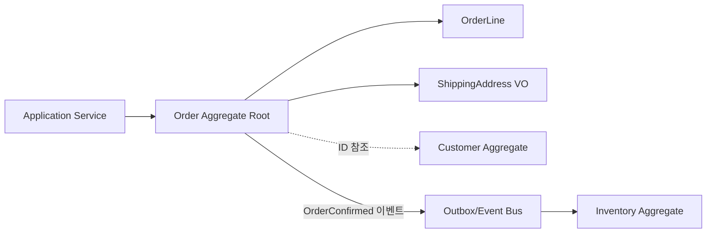

## 1. Aggregate는 동시 변경의 최소 단위다

`Aggregate(애그리게이트)`는 연관된 Entity와 Value Object의 묶음이며, 외부 변경은 Aggregate Root를 통해서만 들어온다. 핵심은 객체를 예쁘게 묶는 것이 아니라 “커밋 순간에 반드시 참이어야 하는 Invariant(불변식)”의 경계를 정하는 것이다.



| 경계 선택 | 장점 | 비용·위험 |
|---|---|---|
| 큰 Aggregate | 한 트랜잭션으로 많은 규칙 보장 | 긴 락, 충돌 증가, 전체 로딩 비용 |
| 작은 Aggregate | 독립 확장, 경합 감소 | Aggregate 간 최종 일관성·보상 필요 |
| 외부 객체 직접 참조 | 탐색과 구현이 직관적 | 저장소 경계 누수, 의도치 않은 연쇄 로딩 |
| ID 참조 | 경계와 생명주기 명확 | 별도 조회·조합 필요 |

## 2. 경계 찾는 순서

1. 명령과 동시에 깨지면 안 되는 비즈니스 규칙을 문장으로 쓴다.
2. 그 규칙에 필요한 상태만 같은 Aggregate에 둔다.
3. 다른 객체는 ID로 참조하고, 즉시 일관성이 정말 필요한지 되묻는다.
4. 동시 명령이 몰릴 Root를 찾아 버전 충돌과 처리량을 계산한다.

```kotlin
class Order(
    val id: OrderId,
    private val lines: MutableList<OrderLine>,
    private var status: OrderStatus,
    private var version: Long,
) {
    fun confirm(): OrderConfirmed {
        check(status == OrderStatus.DRAFT) { "확정 가능한 주문 상태가 아니다" }
        check(lines.isNotEmpty()) { "빈 주문은 확정할 수 없다" }
        status = OrderStatus.CONFIRMED
        return OrderConfirmed(id, lines.map { it.skuId to it.quantity })
    }
}
```

주문 확정과 재고 예약을 같은 Aggregate로 묶으면 모든 SKU 주문이 재고 Root에 경합할 수 있다. 주문은 자기 불변식을 지킨 뒤 `OrderConfirmed`를 Outbox에 기록하고, 재고 Aggregate가 예약을 시도하게 만들 수 있다. 예약 실패는 주문 취소나 대체 제안이라는 명시적 상태 전이로 처리한다.

> **실무 함정** — “한 요청이므로 한 트랜잭션”이라는 이유로 여러 Aggregate를 항상 같이 저장하면 서비스 계층이 사실상의 거대한 Aggregate가 된다. 불변식과 실패 보상 규칙을 먼저 써야 한다.

## 3. 충돌은 경계 품질의 신호다

낙관적 락 충돌률이 높다면 재시도만 늘리지 말고 Root가 너무 큰지, 핫한 카운터를 별도 모델로 분리할지 검토한다. 반대로 Aggregate를 지나치게 작게 쪼개 보상 흐름이 비즈니스보다 복잡해졌다면 강한 일관성이 필요한 규칙을 다시 합친다.

> **면접 포인트** — Aggregate 크기에 정답은 없다. “같이 바뀌는 데이터”가 아니라 “동시에 참이어야 하는 규칙”을 기준으로 경계를 제시하고, 경합률과 실패 복잡도로 설계를 검증한다.
