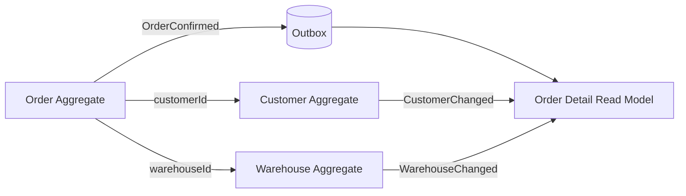

## 1. 참조는 일관성 요구를 드러낸다

Aggregate 밖의 객체를 ORM 연관관계로 직접 물리면 탐색은 편하지만 트랜잭션과 로딩 경계가 흐려진다. ID 참조는 “다른 Aggregate는 별도 일관성 경계”라는 사실을 코드에 드러낸다.



| 전략 | 값의 시점 | 장점 | 적합한 예 |
|---|---|---|---|
| ID 후 실시간 조회 | 현재 | 최신값, 중복 저장 감소 | 현재 고객 등급 |
| 명령 시 Snapshot | 과거 사건 시점 | 감사·재현 가능 | 주문 당시 주소·상품명·가격 |
| 이벤트 기반 Read Model | 약간 지연된 현재 | 조회 성능과 서비스 분리 | 주문 상세 통합 화면 |
| 객체 직접 참조 | 같은 Aggregate 내부 | 불변식 구현 단순 | Order와 OrderLine |

## 2. 현재값과 사건값을 구분한다

배송지는 고객 주소 ID만 저장하면 고객이 주소를 수정했을 때 과거 주문의 배송지가 바뀐다. 주문 확정 당시 주소는 Value Object Snapshot으로 복사하고, 현재 고객 정보가 필요하면 Customer Aggregate나 Read Model을 조회한다.

```kotlin
data class Order(
    val id: OrderId,
    val customerId: CustomerId,
    val shippingAddressAtOrder: ShippingAddress,
    val warehouseId: WarehouseId,
)
```

이벤트 기반 복제는 즉시 일관성을 포기하는 대신 조회 결합을 줄인다. 이벤트에는 소비자가 필요한 식별자와 변경 버전을 넣고, 소비자는 `(aggregateId, version)`으로 중복·역순을 방어한다.

> **실무 함정** — ID 참조를 도입한 뒤 Application Service가 매 요청마다 여러 서비스를 동기 호출하면 분산 객체 그래프가 된다. 화면 조합은 BFF(Read Model), 명령 불변식은 Aggregate 내부, 후속 반영은 이벤트로 역할을 나눈다.

## 3. 선택 질문

1. 이 값은 “현재값”인가 “사건 당시 값”인가?
2. 같은 트랜잭션에서 반드시 검증해야 하는가?
3. 지연 허용 시간과 잘못된 값의 비즈니스 비용은 얼마인가?
4. 참조 대상 장애가 핵심 명령을 막아도 되는가?

> **면접 포인트** — ID 참조는 성능 최적화가 아니라 일관성 경계 선언이다. Snapshot과 Read Model을 섞지 말고 값의 시간 의미부터 설명한다.
