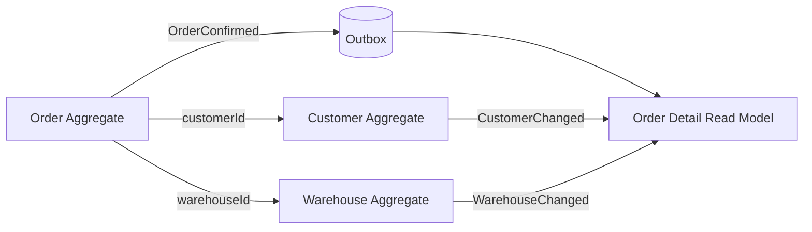

## 1. 참조는 일관성 요구를 드러낸다

Aggregate 밖의 객체를 ORM 연관관계로 직접 물리면 탐색은 편하지만 트랜잭션과 로딩 경계가 흐려진다. ID 참조는 “다른 Aggregate는 별도 일관성 경계”라는 사실을 코드에 드러낸다.


```mermaid
flowchart LR
    ORDER[Order Aggregate] -->|customerId| CUSTOMER[Customer Aggregate]
    ORDER -->|warehouseId| WAREHOUSE[Warehouse Aggregate]
    ORDER -->|OrderConfirmed| OUTBOX[(Outbox)]
    OUTBOX --> PROJECTION[Order Detail Read Model]
    CUSTOMER -->|CustomerChanged| PROJECTION
    WAREHOUSE -->|WarehouseChanged| PROJECTION
```

| 전략 | 값의 시점 | 장점 | 적합한 예 |
|---|---|---|---|
| ID 후 실시간 조회 | 현재 | 최신값, 중복 저장 감소 | 현재 고객 등급 |
| 명령 시 Snapshot | 과거 사건 시점 | 감사·재현 가능 | 주문 당시 주소·상품명·가격 |
| 이벤트 기반 Read Model | 약간 지연된 현재 | 조회 성능과 서비스 분리 | 주문 상세 통합 화면 |
| 객체 직접 참조 | 같은 Aggregate 내부 | 불변식 구현 단순 | Order와 OrderLine |

## 2. 현재값과 사건값을 구분한다

배송지는 고객 주소 ID만 저장하면 고객이 주소를 수정했을 때 과거 주문의 배송지가 바뀐다. 주문 확정 당시 주소는 Value Object Snapshot으로 복사하고, 현재 고객 정보가 필요하면 Customer Aggregate나 Read Model을 조회한다.

```kotlin
data class Order(
    val id: OrderId,
    val customerId: CustomerId,
    val shippingAddressAtOrder: ShippingAddress,
    val warehouseId: WarehouseId,
)
```

이벤트 기반 복제는 즉시 일관성을 포기하는 대신 조회 결합을 줄인다. 이벤트에는 소비자가 필요한 식별자와 변경 버전을 넣고, 소비자는 `(aggregateId, version)`으로 중복·역순을 방어한다.

> **실무 함정** — ID 참조를 도입한 뒤 Application Service가 매 요청마다 여러 서비스를 동기 호출하면 분산 객체 그래프가 된다. 화면 조합은 BFF(Read Model), 명령 불변식은 Aggregate 내부, 후속 반영은 이벤트로 역할을 나눈다.

## 3. 선택 질문

1. 이 값은 “현재값”인가 “사건 당시 값”인가?
2. 같은 트랜잭션에서 반드시 검증해야 하는가?
3. 지연 허용 시간과 잘못된 값의 비즈니스 비용은 얼마인가?
4. 참조 대상 장애가 핵심 명령을 막아도 되는가?

> **면접 포인트** — ID 참조는 성능 최적화가 아니라 일관성 경계 선언이다. Snapshot과 Read Model을 섞지 말고 값의 시간 의미부터 설명한다.

## 4. 실패 입력 → 판단 → 복구

| 실패 입력 | 판단 | 복구·완화 |
|---|---|---|
| 주문 상세에서 Customer를 매번 동기 호출하다 고객 서비스 장애가 주문 조회를 막음 | 해당 화면이 현재 고객 정보의 강한 최신성을 요구하는지, 주문 자체의 핵심 데이터인지 분리한다. 호출 수·타임아웃·캐시의 오래된 정도를 측정한다. | 주문 상세 Read Model에 필요한 표시값을 투영하고 버전을 기록한다. 최신값이 꼭 필요한 작업만 명시적 재조회·fallback을 사용한다. |
| 고객이 주소를 변경한 뒤 과거 주문의 배송지가 함께 바뀜 | 주소가 사건 당시 값인지 현재 프로필인지 의미를 확인한다. 동일한 `customerId`만 저장했는지와 Snapshot 시점을 확인한다. | 주문 확정 시 주소·상품명·가격 등 재현에 필요한 값을 Snapshot으로 저장하고, 정정은 새 주문 이벤트나 보정 기록으로 남긴다. |
| 동일 이벤트가 두 번 도착하거나 버전 8이 버전 7보다 먼저 도착함 | 전달 보장은 보통 at-least-once일 수 있으므로 event ID만으로 충분한지, Aggregate별 순서가 필요한지 확인한다. | `(consumer, event_id)` 고유 기록과 `(aggregate_id, version)` 조건부 적용을 트랜잭션으로 묶는다. 버전 gap은 보류·재조회하고 성공 응답을 다시 보내도 부작용은 한 번만 커밋한다. |

ID 참조가 네트워크 호출을 자동으로 없애는 것은 아니다. 핵심 명령에서 필요한 최신성, 화면 조합의 지연 허용, Snapshot의 보존·개인정보 정책을 각각 계약으로 적는다.

## 5. 공식 참고 자료

- [Microsoft Learn — Use domain analysis to model microservices](https://learn.microsoft.com/en-us/azure/architecture/microservices/model/domain-analysis)
- [Microsoft Learn — Designing a microservice domain model](https://learn.microsoft.com/en-us/dotnet/architecture/microservices/microservice-ddd-cqrs-patterns/microservice-domain-model)
- [Microsoft Learn — CQRS pattern](https://learn.microsoft.com/en-us/azure/architecture/patterns/cqrs)
