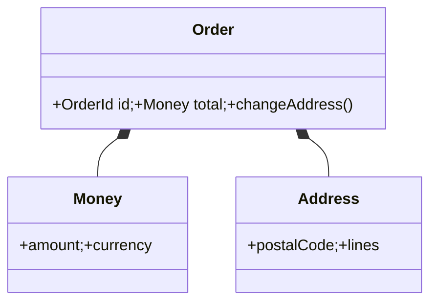

## 1. 클래스 모양이 아니라 의미로 고른다

Entity는 속성이 바뀌어도 같은 대상을 추적하며 식별자와 수명주기를 가진다. Value Object는 구성 값이 같으면 같고, 유효한 상태로 한 번에 생성되어 교체된다.



| 기준 | Entity | Value Object |
|---|---|---|
| 동등성 | 식별자 | 모든 의미 있는 값 |
| 변경 | 수명주기 동안 상태 전이 | 새 값으로 교체 |
| 예 | 주문·회원 | 금액·기간·좌표 |
| 주의 | ID만 있는 빈 모델 | 과도한 객체 분해 |

```kotlin
data class Money private constructor(val amount: Long, val currency: Currency) {
    init { require(amount >= 0) }
}
```

> **모델링 함정** — ORM 테이블이 있다고 모두 Entity는 아니다. 반대로 외부 식별자가 없어도 도메인이 동일성을 추적하면 Entity다.

## 2. 경계 안에서 불변식을 지킨다

Value Object 생성자가 단위와 범위를 검증하면 잘못된 원시값이 도메인 깊숙이 흐르는 것을 막는다. Entity 변경은 의도를 드러내는 메서드로 제한하고 Aggregate가 일관성을 책임진다.

> **면접 포인트** — 동일한 개념도 Bounded Context의 질문에 따라 모델이 달라짐을 구체적인 수명주기와 비교 규칙으로 설명한다.
