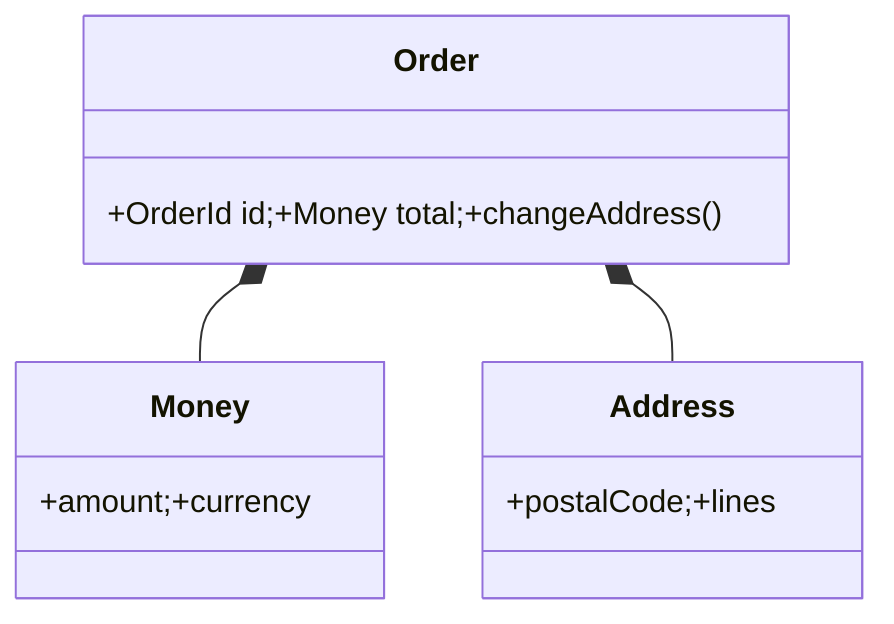

## 1. 클래스 모양이 아니라 의미로 고른다

Entity는 속성이 바뀌어도 같은 대상을 추적하며 식별자와 수명주기를 가진다. Value Object는 구성 값이 같으면 같고, 유효한 상태로 한 번에 생성되어 교체된다.


```mermaid
classDiagram
    class Order {+OrderId id;+Money total;+changeAddress()}
    class Money {+amount;+currency}
    class Address {+postalCode;+lines}
    Order *-- Money
    Order *-- Address
```

| 기준 | Entity | Value Object |
|---|---|---|
| 동등성 | 식별자 | 모든 의미 있는 값 |
| 변경 | 수명주기 동안 상태 전이 | 새 값으로 교체 |
| 예 | 주문·회원 | 금액·기간·좌표 |
| 주의 | ID만 있는 빈 모델 | 과도한 객체 분해 |

```kotlin
data class Money private constructor(val amount: Long, val currency: Currency) {
    init { require(amount >= 0) }
}
```

> **모델링 함정** — ORM 테이블이 있다고 모두 Entity는 아니다. 반대로 외부 식별자가 없어도 도메인이 동일성을 추적하면 Entity다.

## 2. 경계 안에서 불변식을 지킨다

Value Object 생성자가 단위와 범위를 검증하면 잘못된 원시값이 도메인 깊숙이 흐르는 것을 막는다. Entity 변경은 의도를 드러내는 메서드로 제한하고 Aggregate가 일관성을 책임진다.

> **면접 포인트** — 동일한 개념도 Bounded Context의 질문에 따라 모델이 달라짐을 구체적인 수명주기와 비교 규칙으로 설명한다.

## 3. 실패 입력 → 판단 → 복구

| 실패 입력 | 판단 | 복구·완화 |
|---|---|---|
| 회원 주소를 수정했더니 과거 주문의 배송지가 변경됨 | 주문이 보존해야 하는 것은 현재 주소인지 주문 시점 주소인지 확인한다. 같은 mutable 객체를 여러 Aggregate가 공유했는지 검사한다. | 주문에는 주소 Value Object Snapshot을 복사하고, 회원 주소는 별도 Entity의 현재 상태로 관리한다. Snapshot 변경은 일반 수정이 아니라 명시적 정정 사건으로 처리한다. |
| `Money(100, KRW)`와 `Money(100, USD)`가 같다고 판정되거나 단위가 섞임 | 값 객체의 모든 의미 있는 필드와 단위·정밀도·반올림 규칙을 동등성에 포함했는지 확인한다. | 생성 시 통화·범위·스케일을 검증하고 통화 변환은 별도 정책/서비스를 거치게 한다. 원시 `Long`을 여러 통화의 금액으로 재사용하지 않는다. |
| DB surrogate key를 API에 그대로 노출해 식별자 변경·추측 문제가 발생함 | DB 행 식별자, Aggregate의 도메인 ID, 외부 공개 ID가 같은 수명주기와 노출 정책을 갖는지 분리해 본다. | 내부 FK와 공개 식별자를 별도 계약으로 두고, 도메인 ID의 생성·중복·마이그레이션 정책을 명시한다. 도메인 규칙이 자연키에 의존한다면 Unique 제약과 변경 정책도 함께 설계한다. |

Value Object의 불변성과 DB/ORM 매핑 방식은 언어·프레임워크에 따라 다르다. 생성 비용은 객체 수·직렬화·변경 빈도와 실제 프로파일링으로 판단하며, 불변 객체를 도입했다는 이유만으로 성능 수치를 가정하지 않는다.

## 4. 공식 참고 자료

- [Microsoft Learn — Designing a microservice domain model](https://learn.microsoft.com/en-us/dotnet/architecture/microservices/microservice-ddd-cqrs-patterns/microservice-domain-model)
- [Microsoft Learn — API design: Map REST to DDD patterns](https://learn.microsoft.com/en-us/azure/architecture/microservices/design/api-design)
