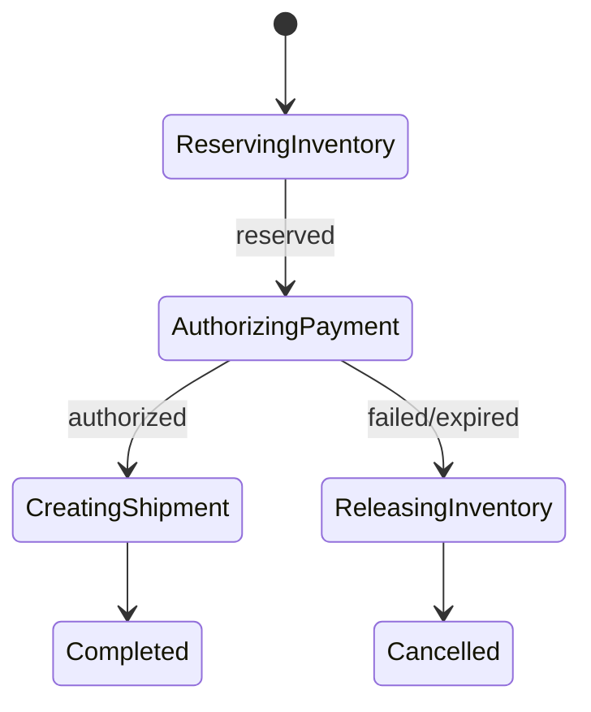

## 1. 장기 흐름을 상태로 저장한다

오케스트레이터는 현재 단계, 시도 번호, Deadline, 명령 ID를 영속화한다. 각 참여 서비스는 같은 명령의 재시도를 멱등하게 처리하고 결과 이벤트는 Saga ID와 단계 ID를 포함한다.



| 상태 | Timeout 대응 | 보상 |
|---|---|---|
| 재고 예약 | 결과 조회 후 재시도 | 예약 해제 |
| 결제 승인 | 결과 미상 격리 | 승인 확인 후 취소 |
| 배송 생성 | 중복 조회 | 출고 전 취소 가능 여부 |
| 완료 | 이벤트 발행 재시도 | 업무 정책에 따름 |

```text
command_id = saga_id + step + attempt_semantic_version
transition only when current_state and version match
```

> **설계 원칙** — 보상은 DB Rollback이 아니다. 가격 변동, 이미 출고된 상품, 환불 지연처럼 되돌릴 수 없는 현실을 상태와 고객 정책으로 표현한다.

## 2. 운영과 수동 개입

상태별 체류 시간, 재시도, 보상 실패를 지표화한다. 자동 복구가 위험한 결과 미상은 운영 큐에서 근거를 확인하고 승인된 전이만 실행하며 모든 조치를 감사 기록으로 남긴다.

> **면접 포인트** — Happy Path보다 결과 미상, 중복 이벤트, 보상 실패, 오케스트레이터 재시작의 상태 전이를 깊게 설명한다.
