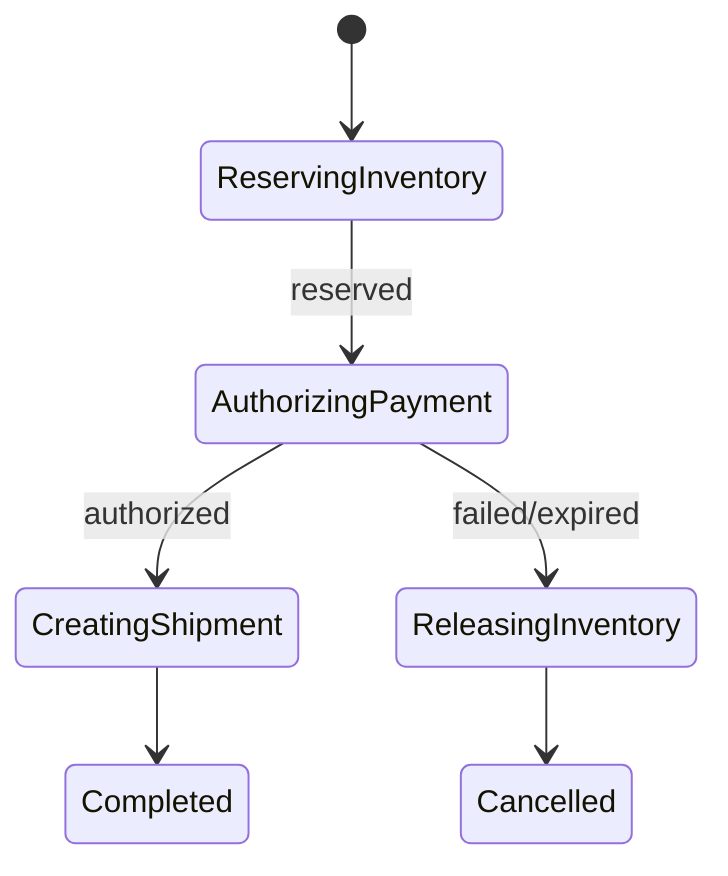

## 1. 장기 흐름을 상태로 저장한다

오케스트레이터는 현재 단계, 시도 번호, Deadline, 명령 ID를 영속화한다. 각 참여 서비스는 같은 명령의 재시도를 멱등하게 처리하고 결과 이벤트는 Saga ID와 단계 ID를 포함한다.


```mermaid
stateDiagram-v2
    [*] --> ReservingInventory
    ReservingInventory --> AuthorizingPayment: reserved
    AuthorizingPayment --> CreatingShipment: authorized
    CreatingShipment --> Completed
    AuthorizingPayment --> ReleasingInventory: failed/expired
    ReleasingInventory --> Cancelled
```

| 상태 | Timeout 대응 | 보상 |
|---|---|---|
| 재고 예약 | 결과 조회 후 재시도 | 예약 해제 |
| 결제 승인 | 결과 미상 격리 | 승인 확인 후 취소 |
| 배송 생성 | 중복 조회 | 출고 전 취소 가능 여부 |
| 완료 | 이벤트 발행 재시도 | 업무 정책에 따름 |

```text
command_id = saga_id + step + attempt_semantic_version
transition only when current_state and version match
```

> **설계 원칙** — 보상은 DB Rollback이 아니다. 가격 변동, 이미 출고된 상품, 환불 지연처럼 되돌릴 수 없는 현실을 상태와 고객 정책으로 표현한다.

## 2. 운영과 수동 개입

상태별 체류 시간, 재시도, 보상 실패를 지표화한다. 자동 복구가 위험한 결과 미상은 운영 큐에서 근거를 확인하고 승인된 전이만 실행하며 모든 조치를 감사 기록으로 남긴다.

> **면접 포인트** — Happy Path보다 결과 미상, 중복 이벤트, 보상 실패, 오케스트레이터 재시작의 상태 전이를 깊게 설명한다.

## 3. 실패 입력 → 판단 → 복구

| 실패 입력 | 판단 | 복구·완화 |
|---|---|---|
| 재고 예약은 성공했지만 결제 API가 timeout을 반환함 | timeout은 실패가 아니라 결과 미상일 수 있다. 결제 제공자의 조회 API·멱등 키·승인 상태를 먼저 확인한다. | 주문을 `PAYMENT_PENDING`처럼 격리하고 동일 `command_id`로 상태 조회를 재시도한다. 승인 여부가 확인되기 전 재고를 성급히 해제하거나 고객에게 실패를 확정하지 않는다. |
| 결제 승인 뒤 배송 생성이 실패해 환불이 필요함 | 각 단계가 실제로 보상 가능한지, 배송이 이미 외부에 접수됐는지, 환불이 비동기인지 구분한다. | 보상 명령을 별도 멱등 작업으로 기록하고 `REFUND_PENDING`·운영 큐·고객 안내를 둔다. 가격·재고·배송이 원래 상태로 완전히 돌아간다고 가정하지 않는다. |
| 오케스트레이터가 명령을 보낸 직후 재시작됨 | 상태 전이와 발행된 명령의 원자성이 깨졌는지, lease 만료와 재처리 경합이 있는지 확인한다. | 상태·다음 단계·command ID를 한 저장소에 조건부로 기록하고 Outbox 또는 동등한 발행 보장을 사용한다. 재개 worker는 `current_state`와 version을 비교하고 참여 서비스는 명령을 멱등 처리한다. |
| 보상도 실패해 장시간 흐름이 정체됨 | 자동 재시도가 안전한 단계인지와 비가역적인 pivot 이후인지 판단한다. | 재시도 한도를 고정된 숫자로 가정하지 말고 오류 종류·deadline·비용으로 정한다. `COMPENSATION_REQUIRED`와 영향 범위를 대사하고 승인된 수동 전이와 감사 로그로 닫는다. |

오케스트레이션은 분산 트랜잭션을 하나의 DB rollback으로 바꾸지 않는다. 참여 서비스의 로컬 원자성, 메시지 중복·순서, 외부 API 결과 미상, 고객에게 보일 상태를 별도로 설계한다.

## 4. 공식 참고 자료

- [Microsoft Learn — Saga pattern](https://learn.microsoft.com/en-us/azure/architecture/patterns/saga)
- [Microsoft Learn — Choreography pattern](https://learn.microsoft.com/en-us/azure/architecture/patterns/choreography)
- [Microsoft Learn — CQRS pattern](https://learn.microsoft.com/en-us/azure/architecture/patterns/cqrs)
