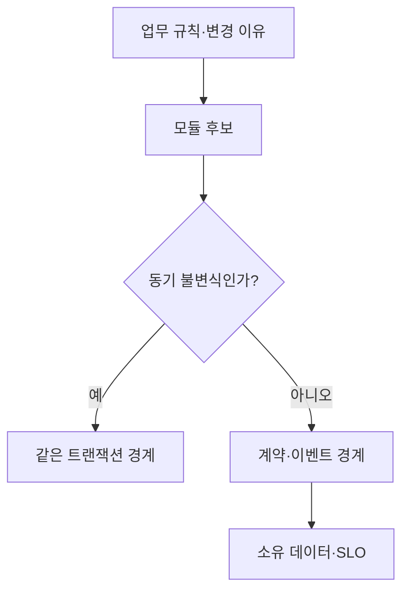

## 1. 명사보다 변경 이유를 찾는다

서비스 수가 목표가 아니다. 함께 지켜야 하는 불변식은 가까이 두고, 독립적으로 바뀌고 확장되는 업무 능력은 경계를 검토한다. 조직과 운영 성숙도가 낮으면 모듈러 모놀리스가 더 안전할 수 있다.



| 근거 | 함께 둘 신호 | 나눌 신호 |
|---|---|---|
| 불변식 | 원자적 변경 필수 | 지연 허용 |
| 변경 | 항상 함께 배포 | 빈도·팀이 다름 |
| 확장 | 같은 부하 특성 | 자원 특성이 다름 |
| 장애 | 함께 실패해도 됨 | 격리 가치가 큼 |

```text
boundary decision = business invariants + ownership + change pattern + failure isolation
not = one table or one noun per service
```

> **면접 전략** — “마이크로서비스가 좋다” 대신 현재 규모의 시작점과 분리 임계값을 제시한다. 경계 비용에는 네트워크와 운영도 포함된다.

## 2. 데이터 소유권으로 검증한다

한 데이터의 쓰기 소유자는 하나로 두고 다른 경계는 API, 이벤트 또는 읽기 모델로 소비한다. 공유 DB 분리는 먼저 쓰기 경로를 단일화한 뒤 변경 로그로 읽기를 옮기는 순서가 안전하다.

> **면접 포인트** — 결정의 반례와 되돌리는 경로까지 말하면 원칙 암기가 아니라 Trade-off 판단임을 보여준다.
