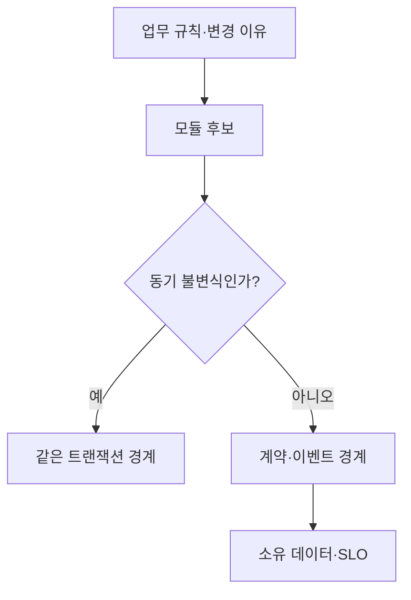

## 1. 명사보다 변경 이유를 찾는다

서비스 수가 목표가 아니다. 함께 지켜야 하는 불변식은 가까이 두고, 독립적으로 바뀌고 확장되는 업무 능력은 경계를 검토한다. 조직과 운영 성숙도가 낮으면 모듈러 모놀리스가 더 안전할 수 있다.


```mermaid
flowchart TD
    R[업무 규칙·변경 이유] --> M[모듈 후보]
    M --> I{동기 불변식인가?}
    I -->|예| T[같은 트랜잭션 경계]
    I -->|아니오| S[계약·이벤트 경계]
    S --> O[소유 데이터·SLO]
```

| 근거 | 함께 둘 신호 | 나눌 신호 |
|---|---|---|
| 불변식 | 원자적 변경 필수 | 지연 허용 |
| 변경 | 항상 함께 배포 | 빈도·팀이 다름 |
| 확장 | 같은 부하 특성 | 자원 특성이 다름 |
| 장애 | 함께 실패해도 됨 | 격리 가치가 큼 |

```text
boundary decision = business invariants + ownership + change pattern + failure isolation
not = one table or one noun per service
```

> **면접 전략** — “마이크로서비스가 좋다” 대신 현재 규모의 시작점과 분리 임계값을 제시한다. 경계 비용에는 네트워크와 운영도 포함된다.

## 2. 데이터 소유권으로 검증한다

한 데이터의 쓰기 소유자는 하나로 두고 다른 경계는 API, 이벤트 또는 읽기 모델로 소비한다. 공유 DB 분리는 먼저 쓰기 경로를 단일화한 뒤 변경 로그로 읽기를 옮기는 순서가 안전하다.

> **면접 포인트** — 결정의 반례와 되돌리는 경로까지 말하면 원칙 암기가 아니라 Trade-off 판단임을 보여준다.

## 3. 실패 입력 → 판단 → 복구

| 실패 입력 | 판단 | 복구·완화 |
|---|---|---|
| 주문과 결제를 별도 서비스로 나눴지만 모든 주문 요청이 결제 동기 호출을 기다림 | 결제 승인과 주문의 어떤 불변식이 같은 커밋을 요구하는지, timeout·결과 미상·재시도 비용을 분리한다. | 주문을 `PAYMENT_PENDING`으로 저장하고 결제 결과 이벤트·조회·보상으로 연결한다. 즉시 결제가 정말 필요한 핵심 경로만 동기화하고, 외부 호출에는 멱등 키와 상태 조회를 둔다. |
| 두 서비스가 같은 `orders` 테이블의 컬럼을 각각 수정함 | 스키마 변경·락·배포 순서·삭제 권한이 암묵적 계약이 됐는지 확인한다. 서비스 수보다 쓰기 소유자와 변경 이력을 먼저 찾는다. | 쓰기 소유자를 하나로 정하고 다른 쪽은 API/이벤트/Read Model로 전환한다. expand → dual-read 또는 backfill → cutover → contract 순서로 단계별 rollback을 남긴다. |
| 작은 변경에도 두 팀이 함께 배포하거나 장애가 연쇄 전파됨 | 공통 라이브러리·공유 테이블·동기 호출·이벤트 fan-out별 결합과 배포/장애 지표를 확인한다. 경계가 너무 잘게 쪼개져 호출이 폭증했는지도 본다. | 모듈러 모놀리스로 합치거나 계약 버전·비동기 경계·소유 데이터로 재조정한다. 분리 비용과 운영 인력까지 포함해 경계를 되돌릴 수 있게 한다. |

서비스 개수, 팀 개수, 한 서비스의 테이블 수에는 보편적인 임계값이 없다. 변경 빈도, 불변식, 데이터 소유권, 부하·SLO, 배포·장애 지표를 같은 기간에 관찰해 경계를 검증한다.

## 4. 공식 참고 자료

- [Microsoft Learn — Use domain analysis to model microservices](https://learn.microsoft.com/en-us/azure/architecture/microservices/model/domain-analysis)
- [Microsoft Learn — Microservices assessment: transaction handling](https://learn.microsoft.com/en-us/azure/architecture/guide/technology-choices/microservices-assessment)
- [Microsoft Learn — Saga pattern](https://learn.microsoft.com/en-us/azure/architecture/patterns/saga)
