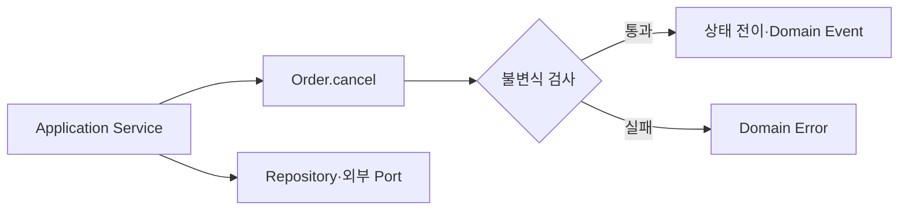

## 1. 상태와 변경 규칙을 같은 곳에 둔다

주문 취소 가능 여부를 여러 Service가 복사하면 규칙 변경 때 누락된다. Entity가 의도를 드러내는 메서드로 전이를 제한하면 유효하지 않은 상태를 생성하기 어렵다.



| 책임 | Domain Model | Application Service |
|---|---|---|
| 불변식 | 핵심 책임 | 호출 순서 보조 |
| 상태 전이 | 의도 메서드 | 유스케이스 시작 |
| 트랜잭션 | 알지 않음 | 경계 설정 |
| 외부 연동 | Port 의미 정의 | 구현 호출·조정 |

```kotlin
fun cancel(now: Instant): OrderCancelled {
    check(status.canCancel && now < shippingCutoff)
    status = CANCELLED
    return OrderCancelled(id, now)
}
```

> **모델링 함정** — Rich Model은 Entity 안에 모든 코드를 넣는 것이 아니다. 여러 Aggregate 조정과 I/O는 도메인 또는 애플리케이션 서비스로 분리한다.

## 2. 복잡도에 비례해 적용한다

규칙이 적고 CRUD가 중심이면 단순 모델이 낫다. 상태 전이, 계산, 예외가 늘어나는 핵심 도메인에 집중하고 읽기 전용 모델에는 같은 복잡성을 강요하지 않는다.

> **면접 포인트** — Anemic을 무조건 나쁘다고 하지 말고 변경 빈도와 불변식 밀도를 적용 기준으로 제시한다.
