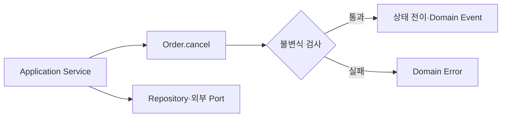

## 1. 상태와 변경 규칙을 같은 곳에 둔다

주문 취소 가능 여부를 여러 Service가 복사하면 규칙 변경 때 누락된다. Entity가 의도를 드러내는 메서드로 전이를 제한하면 유효하지 않은 상태를 생성하기 어렵다.


```mermaid
flowchart LR
    A[Application Service] --> O[Order.cancel]
    O --> I{불변식 검사}
    I -->|통과| S[상태 전이·Domain Event]
    I -->|실패| E[Domain Error]
    A --> R[Repository·외부 Port]
```

| 책임 | Domain Model | Application Service |
|---|---|---|
| 불변식 | 핵심 책임 | 호출 순서 보조 |
| 상태 전이 | 의도 메서드 | 유스케이스 시작 |
| 트랜잭션 | 알지 않음 | 경계 설정 |
| 외부 연동 | Port 의미 정의 | 구현 호출·조정 |

```kotlin
fun cancel(now: Instant): OrderCancelled {
    check(status.canCancel && now < shippingCutoff)
    status = CANCELLED
    return OrderCancelled(id, now)
}
```

> **모델링 함정** — Rich Model은 Entity 안에 모든 코드를 넣는 것이 아니다. 여러 Aggregate 조정과 I/O는 도메인 또는 애플리케이션 서비스로 분리한다.

## 2. 복잡도에 비례해 적용한다

규칙이 적고 CRUD가 중심이면 단순 모델이 낫다. 상태 전이, 계산, 예외가 늘어나는 핵심 도메인에 집중하고 읽기 전용 모델에는 같은 복잡성을 강요하지 않는다.

> **면접 포인트** — Anemic을 무조건 나쁘다고 하지 말고 변경 빈도와 불변식 밀도를 적용 기준으로 제시한다.

## 3. 실패 입력 → 판단 → 복구

| 실패 입력 | 판단 | 복구·완화 |
|---|---|---|
| Controller와 여러 Service가 `status = CANCELLED`를 직접 대입함 | 상태 전이 조건이 호출자마다 복제됐는지, 동시에 처리된 취소·출고 요청의 불변식이 어디서 검사되는지 확인한다. | Aggregate의 의도 메서드와 조건부 저장으로 전이를 한 곳에 모은다. 단순 조회/매핑은 Service에 남기고 모든 코드를 Entity에 넣지는 않는다. |
| Domain Entity가 Repository나 결제 HTTP client를 직접 호출함 | 도메인 규칙과 I/O·재시도·timeout이 섞여 테스트와 재사용 경계가 무너졌는지 확인한다. | 도메인은 필요한 Port의 의미만 정의하고 구현·트랜잭션·외부 호출 조정은 application/infrastructure 계층에 둔다. 외부 결과 미상은 상태로 모델링한다. |
| 간단한 CRUD 화면에 VO·Domain Event·복잡한 Aggregate를 모두 도입함 | 업무 규칙의 변경 빈도·불변식 수·감사/재구성 요구가 패턴 운영 비용을 정당화하는지 확인한다. | 현재 상태 CRUD와 단순 검증은 persistence/application 모델로 유지하고, 복잡성이 생긴 경계에만 행위 모델을 점진 도입한다. |

Rich Model은 “객체 안에 모든 로직을 넣기”가 아니라 핵심 불변식의 소유자를 분명히 하는 선택이다. 조회 전용 모델과 외부 연동 조정은 별도 경로로 두며, 프레임워크의 Entity 생명주기·프록시 동작은 도메인 규칙과 구분한다.

## 4. 공식 참고 자료

- [Microsoft Learn — Designing a microservice domain model](https://learn.microsoft.com/en-us/dotnet/architecture/microservices/microservice-ddd-cqrs-patterns/microservice-domain-model)
- [Microsoft Learn — Designing a DDD-oriented microservice](https://learn.microsoft.com/en-us/dotnet/architecture/microservices/microservice-ddd-cqrs-patterns/ddd-oriented-microservice)
- [Microsoft Learn — Infrastructure persistence layer design](https://learn.microsoft.com/en-us/dotnet/architecture/microservices/microservice-ddd-cqrs-patterns/infrastructure-persistence-layer-design)
