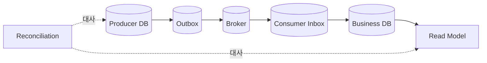

## 1. 손실처럼 보이는 위치를 분해한다

생산자 DB와 Broker 사이, Broker 보존, 소비자 처리, 조회 투영 사이에 각각 다른 실패가 있다. Correlation ID와 단계별 상태를 연결해 “발행 안 됨”과 “소비 지연”을 먼저 구분한다.



| 장애 경계 | 안전장치 | 복구 증거 |
|---|---|---|
| DB→Broker | Transactional Outbox | 미발행 Outbox |
| Broker→Consumer | ACK·보존 | Offset·Lag |
| Consumer 효과 | Inbox·멱등 키 | Event ID·업무 키 |
| 투영 | 재생·Version | 원본과 Checksum |

```text
recover in order: stop amplification → define source of truth → scope affected keys → replay or compensate → reconcile
```

> **면접 전략** — 재처리를 바로 실행하지 않는다. 비멱등 부작용과 잘못된 이벤트 자체를 다시 적용할 위험을 먼저 분류한다.

## 2. 복구도 정상 기능으로 만든다

기간·업무 키로 제한된 Replay, Dry Run, 처리율 제한, 결과 대사를 제공한다. 사실 기록이 잘못됐다면 삭제보다 원본을 상쇄하는 보정 이벤트가 감사에 유리하다.

> **면접 포인트** — 예방 패턴뿐 아니라 장애 탐지 시간, 영향 범위 산정, 고객 상태 복구와 재발 방지까지 닫는다.
