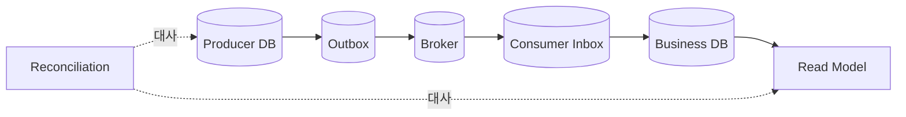

## 1. 손실처럼 보이는 위치를 분해한다

생산자 DB와 Broker 사이, Broker 보존, 소비자 처리, 조회 투영 사이에 각각 다른 실패가 있다. Correlation ID와 단계별 상태를 연결해 “발행 안 됨”과 “소비 지연”을 먼저 구분한다.


```mermaid
flowchart LR
    D[(Producer DB)] --> O[(Outbox)]
    O --> B[(Broker)]
    B --> I[(Consumer Inbox)]
    I --> V[(Business DB)]
    V --> Q[Read Model]
    A[Reconciliation] -.대사.-> D
    A -.대사.-> Q
```

| 장애 경계 | 안전장치 | 복구 증거 |
|---|---|---|
| DB→Broker | Transactional Outbox | 미발행 Outbox |
| Broker→Consumer | ACK·보존 | Offset·Lag |
| Consumer 효과 | Inbox·멱등 키 | Event ID·업무 키 |
| 투영 | 재생·Version | 원본과 Checksum |

```text
recover in order: stop amplification → define source of truth → scope affected keys → replay or compensate → reconcile
```

> **면접 전략** — 재처리를 바로 실행하지 않는다. 비멱등 부작용과 잘못된 이벤트 자체를 다시 적용할 위험을 먼저 분류한다.

## 2. 복구도 정상 기능으로 만든다

기간·업무 키로 제한된 Replay, Dry Run, 처리율 제한, 결과 대사를 제공한다. 사실 기록이 잘못됐다면 삭제보다 원본을 상쇄하는 보정 이벤트가 감사에 유리하다.

> **면접 포인트** — 예방 패턴뿐 아니라 장애 탐지 시간, 영향 범위 산정, 고객 상태 복구와 재발 방지까지 닫는다.

## 3. 실패 입력 → 판단 → 복구

| 실패 입력 | 판단 | 복구·완화 |
|---|---|---|
| DB 커밋 뒤 프로세스가 죽어 Broker에 이벤트가 없음 | 비즈니스 row와 Outbox row가 같은 로컬 트랜잭션에 기록됐는지, 단순 발행 로그와 실제 Broker 수신을 구분한다. | Outbox 미발행·재시도 age를 탐지하고 relay가 안전하게 재발행한다. Outbox row에 안정적인 event ID를 두어 재시도 중복을 소비자가 처리하게 한다. |
| 소비자 DB 커밋 후 ACK 전에 죽음 | Broker가 재전달한 동일 event ID가 이미 업무 효과를 만들었는지, inbox 기록과 business write가 같은 트랜잭션인지 확인한다. | `(consumer, event_id)` 고유 제약 또는 조건부 삽입으로 중복 효과를 막고, 이미 처리된 경우에도 ACK를 재전송한다. 외부 HTTP·메일 등 DB 밖 부작용은 별도 멱등 키/대사로 관리한다. |
| 잘못된 이벤트가 여러 Projection에 이미 반영됨 | 원본 사실이 잘못된 것인지 Projection handler만 결함인지, 영향 event/version/key 범위를 확정한다. | handler 결함이면 수정 후 제한 범위 재생, 원본 사실이면 상쇄·보정 이벤트를 발행한다. 재생 중 외부 부작용을 다시 실행하지 않도록 side effect를 분리하고 Dry Run·대사를 거친다. |
| 이벤트 보존기간이 지나 재생할 원본이 없음 | Broker의 보존 정책과 Outbox/원장/감사 저장소 중 어떤 것이 source of truth인지 확인한다. | 복구 가능한 원본을 별도로 보존하고, 누락 범위는 추정으로 채우지 말고 대사·수동 보정으로 표시한다. 보존기간과 복구 목표는 업무 요구로 정한다. |

Transactional Outbox는 DB와 Broker 사이의 모든 전달을 자동으로 exactly-once로 만들지 않는다. 원자적으로 기록한 뒤 relay가 적어도 한 번 전달하고, 소비자 멱등성·순서/버전 검사·대사로 최종 효과를 통제한다.

## 4. 공식 참고 자료

- [Microsoft Learn — Choreography pattern](https://learn.microsoft.com/en-us/azure/architecture/patterns/choreography)
- [Microsoft Learn — CQRS pattern](https://learn.microsoft.com/en-us/azure/architecture/patterns/cqrs)
- [Microsoft Learn — Competing Consumers pattern](https://learn.microsoft.com/en-us/azure/architecture/patterns/competing-consumers)
