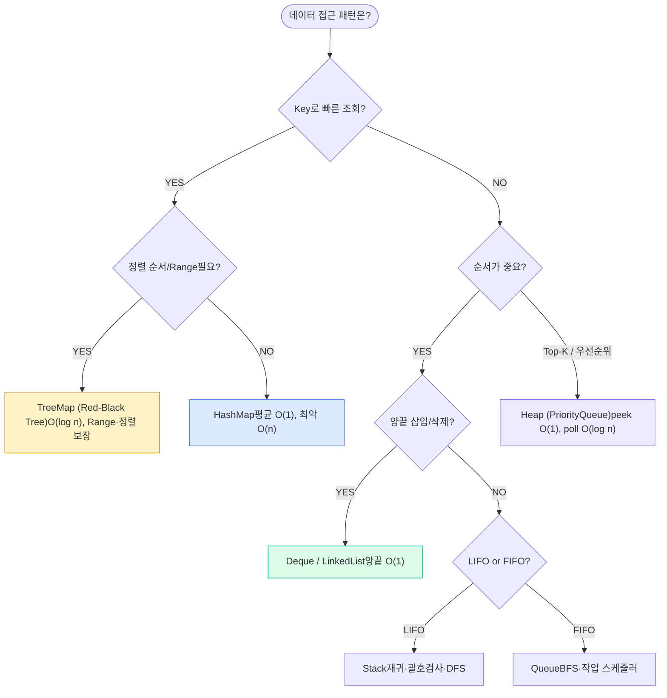
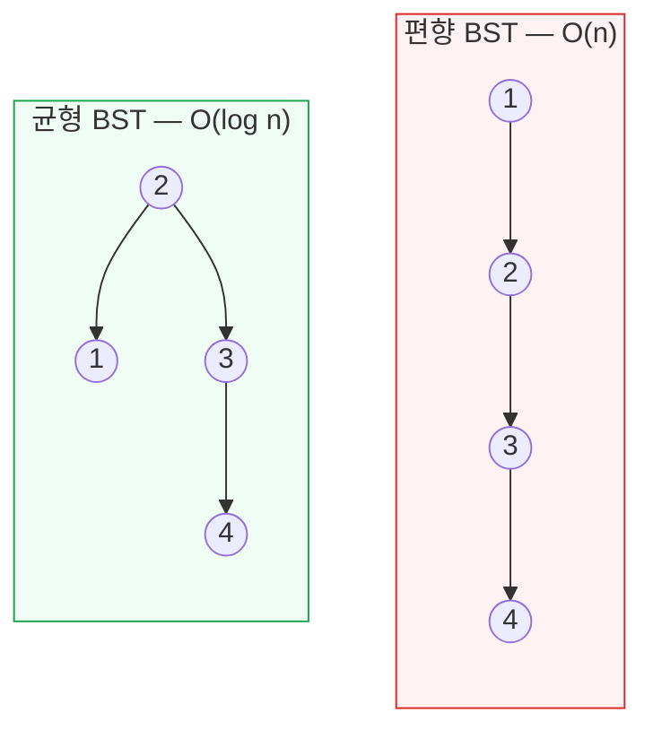
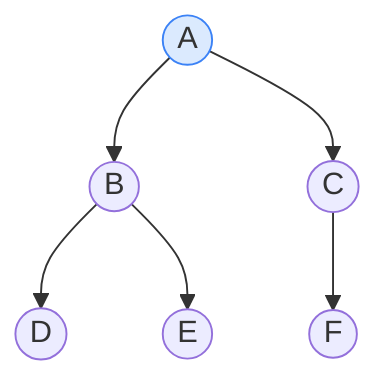

## 1. 자료구조 선택 원칙

"어떤 자료구조를 쓸까?"의 답은 항상 **접근 패턴**에서 나온다. 면접에서 자료구조를 고를 때는 다음을 먼저 물어라: **읽기/쓰기 비율, 순서 보장 필요 여부, Range 조회 여부, 메모리 제약, 데이터 분포**.



*자료구조 선택 의사결정 트리 — 접근 패턴 → 자료구조*

| 자료구조 | 조회 | 탐색 | 삽입 | 삭제 | 특징 / 실무 함정 |
| --- | --- | --- | --- | --- | --- |
| **Array** | O(1) | O(n) | O(n) | O(n) | 인덱스 접근 최적, 메모리 연속 → 캐시 지역성 우수 |
| **Dynamic Array** | O(1) | O(n) | O(1) 분할상환 | O(n) | append 시 2배 확장 → `amortized` O(1), 일시적 O(n) 복사 |
| **LinkedList** | O(n) | O(n) | O(1)* | O(1)* | *노드 위치 알 때. 캐시 지역성 낮아 실측은 느림 |
| **HashMap** | O(1) avg | O(1) avg | O(1) avg | O(1) avg | 충돌 집중 시 O(n), Resizing 시 O(n) 일시 정지 |
| **TreeMap** | O(log n) | O(log n) | O(log n) | O(log n) | Red-Black Tree, 정렬·Range 보장 |
| **Heap** | O(1) peek | O(n) | O(log n) | O(log n) | 최솟/최댓값 특화. 임의 탐색 비효율 |

> **🎯 면접 함정 — "HashMap이 항상 빠르다"**
>
> 평균 O(1)이지만 해시 충돌이 집중되면 최악 O(n). 악의적 입력으로 충돌을 유도하는 **Hash Collision DoS** 가 가능하다. Java 8+는 버킷 크기 8 초과 시 LinkedList → Red-Black Tree로 전환해 최악을 O(log n)으로 완화. `load factor` 0.75, 초기 capacity 지정으로 리사이징을 줄여라.

## 2. 해시 테이블 (Hash Table)

해시 테이블은 **해시 함수**로 Key를 버킷 인덱스로 매핑한다. 충돌(Collision) 해결 방식이 성능을 좌우한다.

### 충돌 해결: Chaining vs Open Addressing

| 방식 | 원리 | 장점 | 단점 | 대표 구현 |
| --- | --- | --- | --- | --- |
| **Chaining (체이닝)** | 버킷마다 LinkedList/Tree로 충돌 항목 연결 | Load factor > 1 허용, 삭제 단순 | 포인터 오버헤드, 캐시 지역성 낮음 | Java `HashMap` |
| **Open Addressing** | 충돌 시 다른 빈 슬롯 탐사(Linear/Quadratic/Double) | 캐시 친화적, 메모리 밀집 | Load factor 한계(~0.7), Clustering, 삭제 복잡(tombstone) | Python `dict`, Go `map` |

### Load Factor & Rehashing

**Load Factor(적재율)** = 저장된 항목 수 / 버킷 수. 임계치(보통 0.75)를 넘으면 **Rehashing(재해싱)**으로 버킷을 2배 늘리고 모든 항목을 재배치한다 — 이 순간 O(n) 비용이 발생하며, 대규모 맵에서는 **지연 스파이크**의 원인이 된다.

> **⚠️ 실무 함정 — 대규모 트래픽**
>
> 라스트마일 추적 시스템에서 수천만 운송장을 단일 `ConcurrentHashMap` 에 적재하면 리사이징 순간 지연 스파이크 + GC 압박이 온다. 예상 크기를 알면 `new HashMap<>(expectedSize / 0.75 + 1)` 로 초기화해 재해싱을 회피하라.

### 확률적 자료구조

| 자료구조 | 용도 | 특성 | 실무 예 |
| --- | --- | --- | --- |
| **Bloom Filter** | "존재하지 않음"을 빠르게 판정 | False Positive 가능, False Negative 없음, 공간 효율 | 캐시 미스 방지, Cassandra SSTable 조회 |
| **HyperLogLog** | Cardinality(고유값 개수) 추정 | 오차 ~2%, 수십억 항목을 12KB로 | Redis `PFCOUNT` — 일일 UV 집계 |
| **Count-Min Sketch** | 빈도(frequency) 추정 | 과대추정만 발생, 공간 고정 | Heavy Hitter 탐지, 트래픽 모니터링 |

## 3. 트리 & 힙 (Tree & Heap)

### 균형 트리가 필요한 이유

일반 BST(Binary Search Tree, 이진 탐색 트리)는 정렬된 입력이 들어오면 한쪽으로 치우쳐 **O(n)** 연결 리스트가 된다. AVL·Red-Black Tree는 회전(Rotation)으로 높이를 **O(log n)**으로 강제한다.



*정렬 입력을 넣으면 일반 BST는 편향되어 O(n) — 균형 트리는 높이를 보장*

| 트리 | 균형 방식 | 특징 | 사용처 |
| --- | --- | --- | --- |
| **AVL Tree** | 엄격한 높이 균형(차 ≤ 1) | 조회 빠름, 삽입/삭제 시 회전 많음 | 읽기 집중 워크로드 |
| **Red-Black Tree** | 느슨한 균형(색 규칙) | 삽입/삭제 회전 적음, 균형 살짝 약함 | Java `TreeMap`, Linux CFS 스케줄러 |
| **B+Tree** | 다진 트리, 리프에 데이터 | 디스크 블록 친화, 낮은 높이, Range 스캔 빠름 | MySQL InnoDB 인덱스 |
| **Trie** | 문자 단위 분기 | 접두사 검색 O(L) | 자동완성, IP 라우팅 |
| **Segment / Fenwick** | 구간 합·최솟값 | 구간 질의 + 갱신 O(log n) | 구간 통계, 누적 집계 |

> **💡 백엔드 연결 — 왜 DB 인덱스는 B+Tree인가**
>
> 디스크 I/O는 메모리보다 ~10만 배 느리다. B+Tree는 한 노드에 수백 개 키를 담아(높은 fan-out) 트리 높이를 3~4단으로 낮춘다 → 수십억 행도 **3~4번의 디스크 읽기** 로 도달. 리프 노드가 연결 리스트로 이어져 `WHERE created_at BETWEEN ...` 같은 Range 스캔이 순차 I/O가 된다.

### 힙 (Heap) — Top-K의 표준 도구

힙은 완전 이진 트리로, 부모가 자식보다 항상 작거나(min-heap) 큰(max-heap) **힙 속성**을 유지한다. peek O(1), insert/poll O(log n). "스트림에서 상위 K개"는 크기 K짜리 힙으로 **O(n log K)**에 해결 — 전체 정렬 O(n log n)보다 빠르고 메모리도 K로 고정된다.

## 4. 그래프 (Graph)

### 인접 리스트 vs 인접 행렬

| 표현 | 공간 | 간선 존재 확인 | 인접 순회 | 적합 상황 |
| --- | --- | --- | --- | --- |
| **인접 리스트** | O(V+E) | O(degree) | O(degree) | 희소 그래프(Sparse). 대부분의 실무 그래프 |
| **인접 행렬** | O(V²) | O(1) | O(V) | 밀집 그래프(Dense), 간선 존재 빈번 조회 |

> **💡 물류 도메인 연결 — 그래프는 어디에나**
>
> 배송망의 허브·캠프·기사 노드와 운송 구간 간선이 곧 그래프다. **최단 경로(Dijkstra)** 는 라우팅, **위상 정렬** 은 작업 의존성(피킹→패킹→출고), **Union-Find** 는 동일 권역 클러스터링에 쓰인다. 실무 배송망은 대개 희소 → 인접 리스트가 정답.

### 핵심 그래프 알고리즘 복잡도

| 알고리즘 | 용도 | 복잡도 | 비고 |
| --- | --- | --- | --- |
| **BFS** | 최단 경로(무가중치) | O(V+E) | 큐 기반, 레벨 순회 |
| **DFS** | 연결성·사이클·위상정렬 | O(V+E) | 스택/재귀 |
| **Dijkstra** | 최단 경로(음수 없는 가중치) | O(E log V) | 우선순위 큐 |
| **Bellman-Ford** | 음수 간선 허용 최단 경로 | O(VE) | 음수 사이클 탐지 |
| **Topological Sort** | 의존성 정렬(DAG) | O(V+E) | Kahn / DFS |

## 5. 정렬 알고리즘 (Sorting)

```
복잡도 위계
O(1)  <  O(log n)  <  O(n)  <  O(n log n)  <  O(n²)  <  O(2ⁿ)
상수      로그          선형       선형로그        이차       지수

정렬의 이론적 하한: 비교 기반 정렬은 O(n log n)보다 빠를 수 없다
  (결정 트리 높이 = log(n!) = Θ(n log n))
Radix/Counting Sort가 O(n)인 이유: 비교를 안 하기 때문 (키 범위 제한 필요)

```

| 알고리즘 | 평균 | 최악 | 공간 | Stable | 언제 쓰나 |
| --- | --- | --- | --- | --- | --- |
| **Quick Sort** | O(n log n) | O(n²) | O(log n) | No | 일반 목적, in-place. Java `Arrays.sort`(primitive) |
| **Merge Sort** | O(n log n) | O(n log n) | O(n) | Yes | 안정 정렬·최악 보장 필요. 외부 정렬(디스크) |
| **Heap Sort** | O(n log n) | O(n log n) | O(1) | No | 메모리 제약 + 최악 보장 동시 필요 |
| **Tim Sort** | O(n log n) | O(n log n) | O(n) | Yes | 실데이터(부분 정렬 활용). Java `Collections.sort`, Python |
| **Radix Sort** | O(nk) | O(nk) | O(n+k) | Yes | 정수·고정길이 키. 비교 없음 |

> **🎯 면접 포인트 — "왜 각각인가"**
>
> Quick Sort는 평균 빠르지만 정렬된 입력 + 나쁜 피벗 → O(n²)이라 외부 노출 API엔 위험(피벗 랜덤화 필수). Merge Sort는 **Stable** 하고 최악도 O(n log n)이라 다중 키 정렬·외부 정렬에 적합. 그래서 Java는 객체 정렬에 Tim Sort(안정), primitive엔 Dual-Pivot Quick Sort를 쓴다 — 객체는 안정성 중요, primitive는 동치 구분 불필요라서.

## 6. 면접 빈출 패턴 (Coding Patterns)

| 패턴 | 적용 신호 | 복잡도 | 대표 문제 |
| --- | --- | --- | --- |
| **Two Pointers(투포인터)** | 정렬 배열, 쌍 탐색 | O(n) | Two Sum(정렬), 회문 검사 |
| **Sliding Window(슬라이딩 윈도우)** | 연속 부분 배열/문자열 | O(n) | 최대 합 부분배열, 최장 무중복 부분문자열 |
| **Prefix Sum(누적 합)** | 구간 합 반복 질의 | 전처리 O(n), 질의 O(1) | 구간 합, 부분배열 합 = K |
| **Binary Search on Answer** | 단조성 있는 최적값 | O(n log range) | 최소 용량 배분, Koko 바나나 |
| **Union-Find** | 동적 연결성 | α(n) ≈ O(1) | 연결 요소, 사이클 탐지 |
| **Monotonic Stack** | 다음 큰/작은 원소 | O(n) | Next Greater Element, 빗물 가두기 |

### Sliding Window 직관

"연속 구간"이라는 신호가 보이면 슬라이딩 윈도우를 의심하라. 이중 루프 O(n²)을 윈도우 양끝 포인터로 **O(n)**으로 줄인다. 윈도우 확장(right++) → 조건 위반 시 축소(left++).

```
// 최장 무중복 부분문자열 — O(n)
int left = 0, best = 0;
Set<Character> window = new HashSet<>();
for (int right = 0; right < s.length(); right++) {
    while (window.contains(s.charAt(right))) {   // 조건 위반 → 축소
        window.remove(s.charAt(left++));
    }
    window.add(s.charAt(right));                 // 확장
    best = Math.max(best, right - left + 1);
}

```

> **💡 백엔드 연결**
>
> Sliding Window는 면접 문제만이 아니다. **Rate Limiter(처리율 제한)** 의 Sliding Window Log/Counter, 모니터링의 이동 평균(rolling average)이 모두 같은 원리다. Union-Find의 α(n)(역 아커만 함수)는 실질적으로 상수 — "사실상 O(1)"이라 말하되 이론적으론 거의 상수임을 정확히 표현하라.

## 7. BFS / DFS 순회



*동일 트리, 순회 순서 비교 — BFS: A B C D E F (큐) / DFS(전위): A B D E C F (스택)*

| 구분 | BFS | DFS |
| --- | --- | --- |
| **자료구조** | Queue(FIFO) | Stack / 재귀 |
| **메모리** | O(너비) — 최악 O(V) | O(깊이) — 최악 O(V) |
| **최단 경로** | 무가중치에서 보장 | 보장 안 됨 |
| **적합 상황** | 최단 거리, 레벨 단위 처리 | 경로 탐색, 사이클·위상정렬, 백트래킹 |
| **주의** | 너비 넓으면 큐 폭발 | 깊으면 Stack Overflow(재귀) → 명시 스택 |

> **⚠️ 실무 함정 — 재귀 DFS의 Stack Overflow**
>
> 깊이 수만의 그래프를 재귀 DFS로 돌리면 JVM 기본 스택(~512KB~1MB)이 터진다. 프로덕션에서는 명시적 `Deque` 스택으로 변환하거나, 꼬리 재귀가 아닌 이상 반복문으로 풀어라. 방문 체크(visited)를 큐/스택에 **넣을 때** 표시해야 중복 enqueue를 막는다.

## Q&A 연습

아래 질문에 직접 답변을 작성하세요. 자동 저장되며 피드백 요청 시 복사할 수 있습니다.
