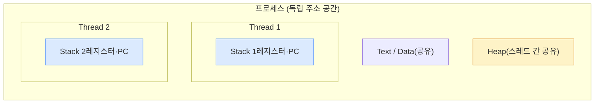
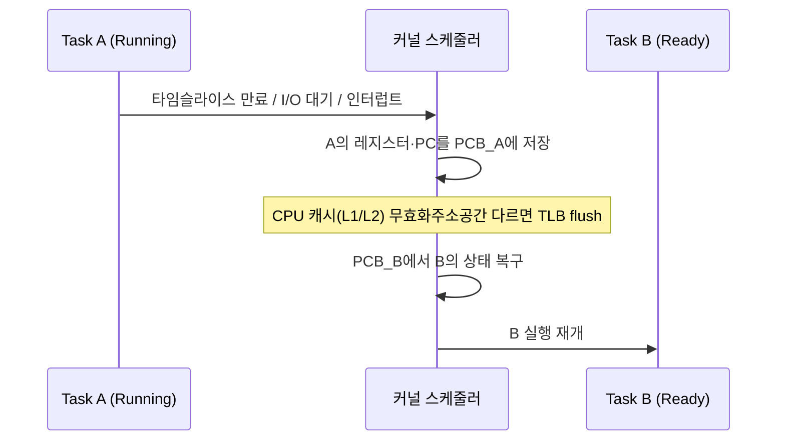
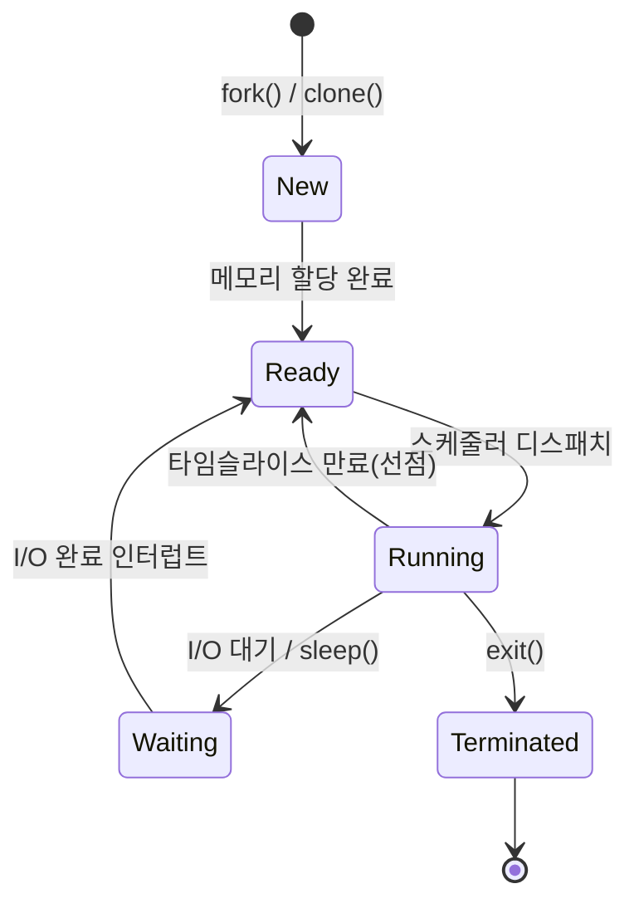
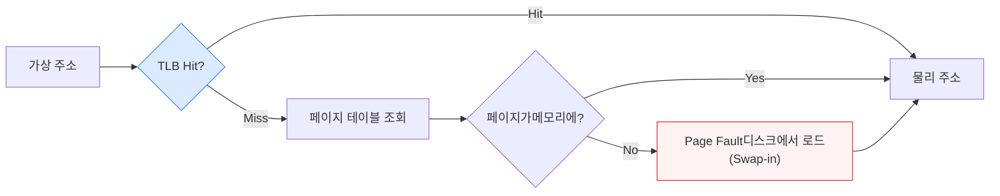
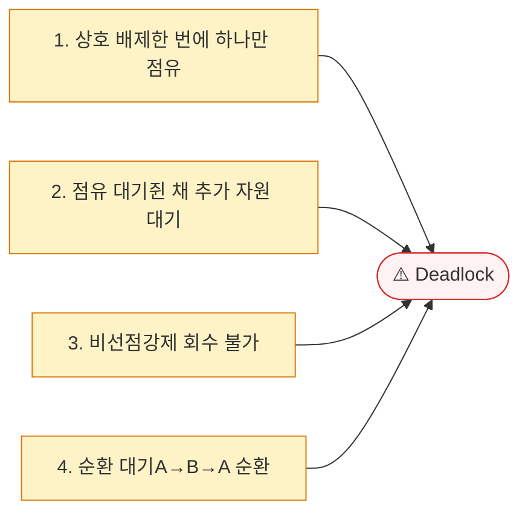

## 1. 프로세스(Process) vs 스레드(Thread)



*스레드는 Heap·Code를 공유하고 Stack·레지스터만 독립 — 그래서 통신은 싸지만 동기화가 필요*

| 구분 | 프로세스 | 스레드 |
| --- | --- | --- |
| **주소 공간** | 독립 가상 주소 공간 | 프로세스 내 공유(Heap·전역·FD) |
| **통신** | IPC(파이프·공유메모리·소켓) | 공유 메모리 직접 접근 → 동기화 필요 |
| **Context Switch** | 비쌈(주소공간 전환 + TLB flush) | 쌈(같은 주소공간 유지) |
| **장애 격리** | 높음(크래시 격리) | 낮음(한 스레드 크래시 → 전체) |
| **생성 비용** | 높음(주소공간 복제) | 낮음 |
| **Linux 구현** | `clone()` (CLONE_VM 없이) | `clone()` + `CLONE_VM`\|`CLONE_FILES`… |

> **💡 리눅스 관점 — 프로세스와 스레드의 경계가 흐리다**
>
> Linux에는 "프로세스 전용/스레드 전용" 시스템 콜이 따로 없다. 둘 다 `clone()` 한 줄로 만들어지며, **어떤 자원을 공유할지(CLONE_VM 등 플래그)** 만 다르다. 커널 입장에선 모두 스케줄링 단위인 **task_struct** 일 뿐이다. `cat /proc/<pid>/status` 에서 `Threads:` 수를 직접 확인할 수 있다.

> **🎯 면접 함정 — "스레드가 항상 빠르다"**
>
> 스레드 수 > CPU 코어 수가 되면 컨텍스트 스위칭이 폭증한다. Lock 경합이 심하면 직렬화되어 단일 스레드보다 느려질 수도 있다(Amdahl's Law). fork+exec 패턴은 **Copy-on-Write(COW)** 로 자식 생성을 가볍게 하지만, 자식이 큰 메모리를 쓰기 시작하면 페이지 복제가 일어나 Redis `BGSAVE` 시 메모리 스파이크의 원인이 된다.

## 2. 컨텍스트 스위칭 (Context Switch, 문맥 교환)

CPU가 실행 중인 task를 바꾸는 과정. PCB(Process Control Block, 프로세스 제어 블록)에 레지스터·PC(Program Counter)·스택 포인터를 저장하고 다음 task 상태를 복구한다.



*컨텍스트 스위치 — 직접 비용(저장/복구)보다 간접 비용(캐시·TLB 무효화)이 더 클 때가 많다*

- **직접 비용**: 레지스터 저장/복구, 커널 진입/복귀 (수 μs)
- **간접 비용**: L1/L2 캐시 무효화 → 캐시 미스 폭증 ("Cache Pollution")
- **TLB flush**: 프로세스 전환 시 페이지 테이블 캐시 초기화 (스레드 전환에선 회피)

> **⚠️ 관찰 도구**
>
> `vmstat 1` 의 `cs` 컬럼이 초당 컨텍스트 스위치 수다. 평소 대비 급증했다면 스레드 과다 생성·Lock 경합·인터럽트 폭주를 의심하라. `pidstat -w` 로 프로세스별 자발적(voluntary, I/O 대기)/비자발적(involuntary, 선점) 스위치를 구분할 수 있다 — 비자발적이 많으면 CPU 과부하 신호.

## 3. CPU 스케줄링 (CPU Scheduling)



*프로세스 상태 머신 — Running↔Ready 전이가 곧 컨텍스트 스위치*

| 알고리즘 | 방식 | 장점 | 단점 |
| --- | --- | --- | --- |
| **FCFS** | 도착 순(비선점) | 단순·공정 | Convoy Effect(긴 작업이 뒤를 막음) |
| **SJF / SRTF** | 짧은 작업 우선 | 평균 대기시간 최소 | 긴 작업 기아(Starvation), 실행시간 예측 불가 |
| **Round Robin** | 타임퀀텀 순환(선점) | 응답성 좋음 | 퀀텀 작으면 스위칭 오버헤드 |
| **Priority** | 우선순위 높은 것 먼저 | 중요 작업 우선 | 기아 → Aging으로 완화 |
| **Linux CFS** | 가상 실행시간(vruntime) 최소 선택 | 공정성, Red-Black Tree O(log n) | 실시간 보장 아님(→ `SCHED_FIFO`) |

> **💡 백엔드 연결 — nice / cgroup**
>
> Linux **CFS(Completely Fair Scheduler, 완전 공정 스케줄러)** 는 각 task의 `vruntime` 이 가장 작은 것을 Red-Black Tree에서 골라 실행한다. `nice` 값으로 가중치를 조정하고, **cgroup** 으로 CPU 점유를 그룹 단위로 제한한다 — 이것이 컨테이너(Docker/K8s) `cpu.limit` 의 실체다. `cpu.cfs_quota_us` 를 너무 낮게 잡으면 **CFS Throttling** 으로 JVM이 멈칫거리는 지연 스파이크가 발생한다.

## 4. 가상 메모리 & 페이징 (Virtual Memory & Paging)

각 프로세스는 전체 메모리를 독점한다고 "착각"하는 가상 주소 공간을 갖는다. MMU(Memory Management Unit)가 페이지 테이블을 통해 가상 → 물리 주소로 변환하며, TLB(Translation Lookaside Buffer, 변환 참조 버퍼)가 최근 변환을 캐싱한다.



*주소 변환 경로 — TLB Miss → 페이지 테이블 → Page Fault 시 디스크 I/O(수만 배 느림)*

| 개념 | 의미 | 비용 / 영향 |
| --- | --- | --- |
| **Page Fault** | 접근 페이지가 물리 메모리에 없음 | Minor(메모리 내 매핑)는 싸고, Major(디스크 로드)는 수 ms로 치명적 |
| **Paging** | 고정 크기(4KB) 페이지 단위 관리 | 외부 단편화 없음, 내부 단편화 소량 |
| **Swapping** | 메모리 부족 시 페이지를 디스크로 내림 | 과도하면 Thrashing(스래싱)으로 시스템 마비 |
| **OOM Killer** | 메모리 고갈 시 커널이 프로세스 강제 종료 | JVM 컨테이너가 갑자기 죽는 단골 원인 |

> **⚠️ 실무 함정 — Swap과 GC는 상극**
>
> JVM Heap이 Swap으로 디스크에 내려가면, GC가 전체 Heap을 스캔할 때 Major Page Fault가 폭발해 stop-the-world가 초 단위로 늘어진다. 그래서 프로덕션 DB·JVM 서버는 흔히 **Swap을 끄거나(`vm.swappiness=0~1`)** 관리한다. 컨테이너에서 갑작스런 종료는 `dmesg | grep -i oom` 으로 OOM Killer 흔적을 확인하라.

## 5. 메모리 레이아웃 (Memory Layout)

```
프로세스 가상 주소 공간 (높은 주소 → 낮은 주소)
┌─────────────────────────────────────┐  높은 주소
│            Kernel Space             │
├─────────────────────────────────────┤
│            Stack (스택)             │  ← 지역변수·리턴주소, 자동 관리
│          ↓ (grows down)             │     크기 제한(~8MB) → Stack Overflow
├─────────────────────────────────────┤
│            (빈 공간)                │
├─────────────────────────────────────┤
│          ↑ (grows up)               │
│            Heap (힙)                │  ← malloc/new, 수동/GC 관리, 단편화
├─────────────────────────────────────┤
│       BSS (초기화 안 된 전역)        │
├─────────────────────────────────────┤
│       Data (초기화된 전역)          │
├─────────────────────────────────────┤
│       Text (코드, read-only 공유)   │  낮은 주소
└─────────────────────────────────────┘

```

### 힙 할당자 (malloc 내부)

유저 공간의 `malloc`은 OS에게 매번 요청하지 않고, `brk`/`mmap`으로 받은 큰 블록을 잘게 관리한다. 구현체에 따라 단편화·동시성 성능이 갈린다.

| 할당자 | 특징 | 강점 |
| --- | --- | --- |
| **glibc (ptmalloc)** | arena 기반, 범용 기본 | 호환성 |
| **tcmalloc (Google)** | 스레드 로컬 캐시 | 멀티스레드 할당 빠름 |
| **jemalloc** | 단편화 최소화 설계 | 긴 실행·고부하 서버(예전 Redis 권장) |

> **🎯 면접 — "Java Heap과 OS Heap은 같은가?"**
>
> 다르다. JVM Heap은 OS Heap 위에 올라간 별도 풀이다. JVM이 시작 시 OS로부터 큰 블록( `-Xmx` )을 받아 객체를 배치하고 GC가 관리한다. 그래서 컨테이너 메모리 한도( `cpu/memory limit` )와 `-Xmx` 를 함께 맞추지 않으면, JVM은 여유가 있다고 믿는데 cgroup이 OOM Kill하는 사고가 난다(JDK 10+ `-XX:+UseContainerSupport` 로 완화).

## 6. 동기화 프리미티브 (Synchronization Primitives)

공유 자원에 여러 스레드가 동시에 접근할 때 발생하는 **Race Condition(경쟁 상태)**을 막기 위해 **Critical Section(임계 구역)**을 보호한다.

| 메커니즘 | 특징 | 사용 상황 |
| --- | --- | --- |
| **Mutex(뮤텍스)** | 상호 배제. 잠근 스레드만 해제 가능(소유권) | 단일 자원 보호 |
| **Semaphore(세마포어)** | 계수형. N개 동시 접근 허용. 소유권 없음 | 연결 풀·동시 실행 수 제한 |
| **Spinlock(스핀락)** | 락 대기 중 CPU 점유(Busy-wait). 스위칭 없음 | 매우 짧은 임계구역, 멀티코어 커널 |
| **RWLock** | 읽기 동시 허용, 쓰기 배타 | 읽기 多 쓰기 少 |
| **Condition Variable** | 특정 조건까지 대기/통지(wait/notify) | Producer-Consumer |
| **CAS(Compare-And-Swap)** | 원자적 비교-교환. Lock-free 기반 | `AtomicInteger`, 락 없는 큐 |

> **💡 Mutex vs Spinlock — 언제 무엇을**
>
> 임계구역이 **매우 짧고** 멀티코어라면 Spinlock이 컨텍스트 스위치 비용을 아껴 유리하다. 임계구역이 **길거나** 싱글코어면 Spin은 CPU 낭비라 Mutex(블로킹)가 낫다. 락을 쥔 스레드가 선점되면 Spin하던 다른 스레드가 무의미하게 CPU를 태운다 — 그래서 유저 공간 락은 흔히 둘을 섞은 **Adaptive Mutex** 를 쓴다.

## 7. 데드락 (Deadlock, 교착 상태)

다음 4조건이 **동시에** 성립할 때 발생. 하나라도 깨면 예방된다.



*데드락 4조건 — 가장 실용적인 깨기는 "순환 대기 제거"(락 획득 순서 통일)*

| 대응 | 전략 | 비고 |
| --- | --- | --- |
| **예방(Prevention)** | 4조건 중 하나를 구조적으로 제거 | 락 순서 통일이 가장 실용적 |
| **회피(Avoidance)** | 안전 상태 유지(Banker's Algorithm) | 이론적, 실무 적용 드묾 |
| **탐지(Detection)** | 자원 할당 그래프 사이클 탐지 후 복구 | DB가 락 그래프로 탐지 → victim rollback |
| **타임아웃** | `tryLock(timeout)`으로 포기 후 재시도 | 가장 흔한 현실적 방어 |

> **🎯 면접 + 실무 — DB 데드락**
>
> 재고 차감에서 주문 A가 SKU1→SKU2, 주문 B가 SKU2→SKU1 순으로 락을 잡으면 DB 데드락이 난다. MySQL InnoDB는 락 그래프에서 사이클을 탐지해 한쪽을 `victim` 으로 롤백한다( `SHOW ENGINE INNODB STATUS` 에서 LATEST DETECTED DEADLOCK 확인). 해결은 OS와 동일 — **모든 트랜잭션이 동일한 순서(예: SKU id 오름차순)로 락을 잡게** 강제하면 순환 대기가 사라진다.

## Q&A 연습

아래 질문에 직접 답변을 작성하세요. 자동 저장되며 피드백 요청 시 복사할 수 있습니다.
