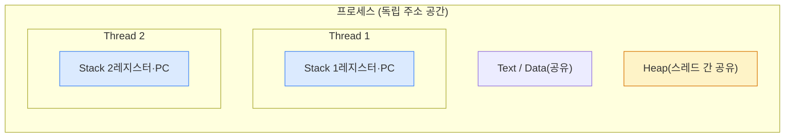
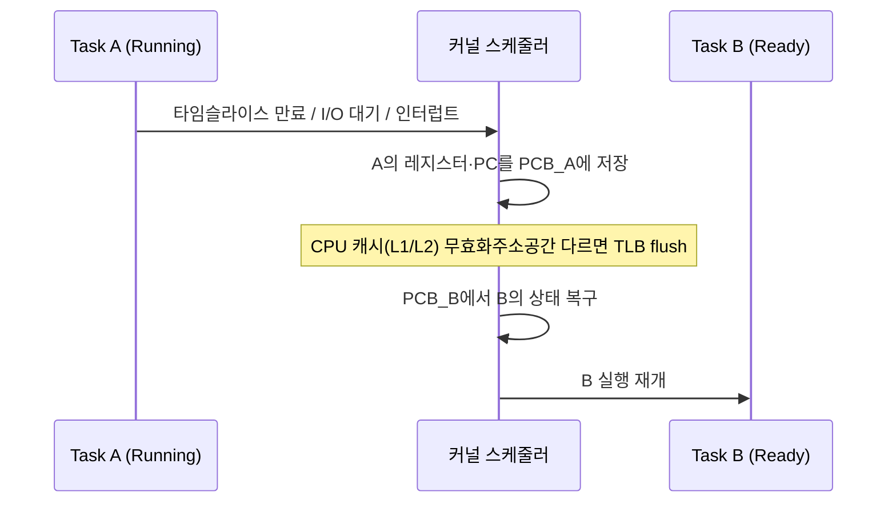
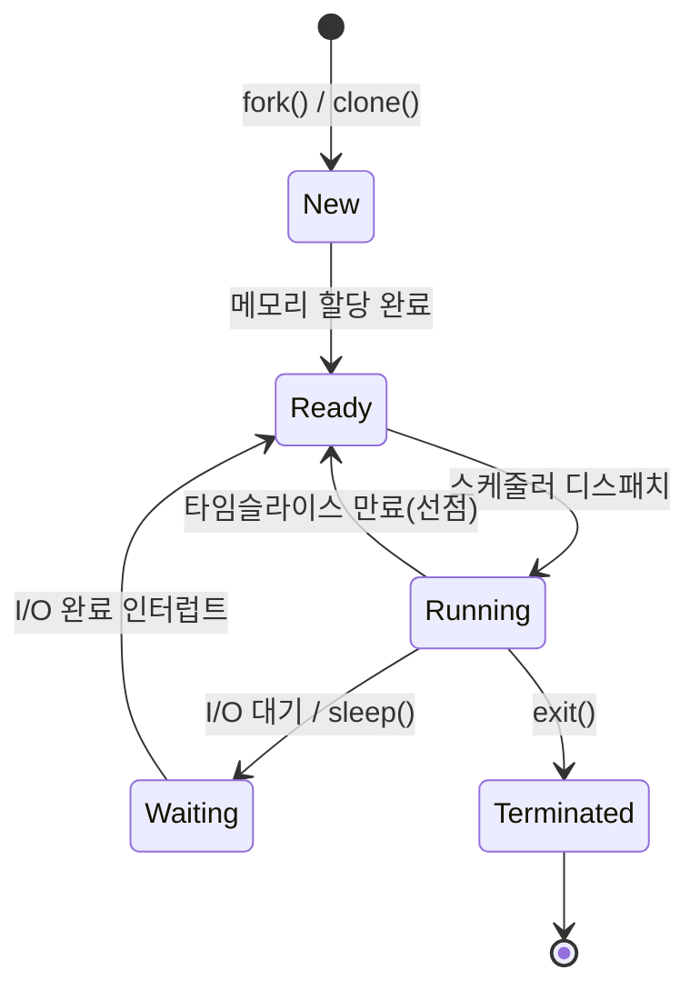
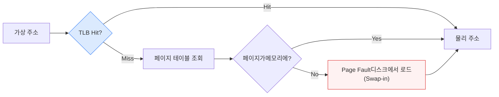
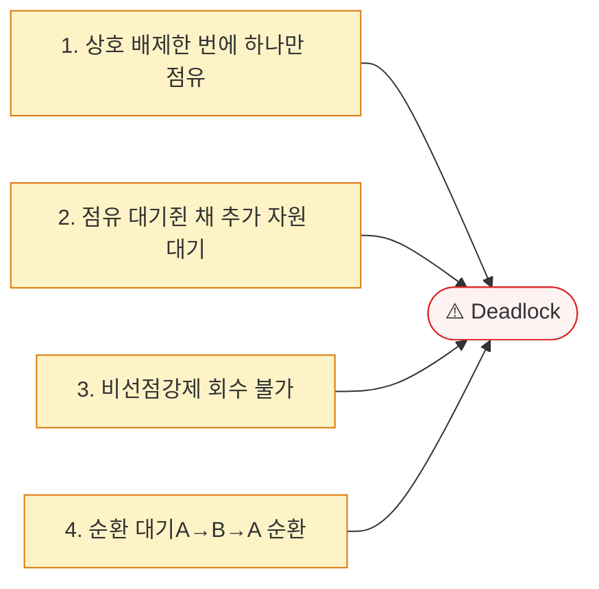

## 1. 프로세스(Process) vs 스레드(Thread)


```mermaid
flowchart LR
    subgraph P["프로세스 (독립 주소 공간)"]
      direction TB
      Code["Text / Data(공유)"]
      Heap["Heap(스레드 간 공유)"]
      subgraph T1["Thread 1"]
        S1["Stack 1레지스터·PC"]
      end
      subgraph T2["Thread 2"]
        S2["Stack 2레지스터·PC"]
      end
    end

    style Heap fill:#fef3c7,stroke:#d97706
    style S1 fill:#dbeafe,stroke:#3b82f6
    style S2 fill:#dbeafe,stroke:#3b82f6
```

*스레드는 Heap·Code를 공유하고 Stack·레지스터만 독립 — 그래서 통신은 싸지만 동기화가 필요*

| 구분 | 프로세스 | 스레드 |
| --- | --- | --- |
| **주소 공간** | 독립 가상 주소 공간 | 프로세스 내 공유(Heap·전역·FD) |
| **통신** | IPC(파이프·공유메모리·소켓) | 공유 메모리 직접 접근 → 동기화 필요 |
| **Context Switch** | 주소 공간·실행 상태 전환이 추가될 수 있음 | 같은 주소 공간을 공유하지만 실행 상태·캐시 영향은 남음 |
| **장애 격리** | 높음(크래시 격리) | 낮음(한 스레드 크래시 → 전체) |
| **생성 비용** | 높음(주소공간 복제) | 낮음 |
| **Linux 구현** | `clone()` (CLONE_VM 없이) | `clone()` + `CLONE_VM`\|`CLONE_FILES`… |

> **💡 리눅스 관점 — 프로세스와 스레드의 경계가 흐리다**
>
> Linux에는 "프로세스 전용/스레드 전용" 시스템 콜이 따로 없다. 둘 다 `clone()` 한 줄로 만들어지며, **어떤 자원을 공유할지(CLONE_VM 등 플래그)** 만 다르다. 커널 입장에선 모두 스케줄링 단위인 **task_struct** 일 뿐이다. `cat /proc/<pid>/status` 에서 `Threads:` 수를 직접 확인할 수 있다.

> **🎯 면접 함정 — "스레드가 항상 빠르다"**
>
> runnable 스레드가 CPU와 코어 수를 크게 초과하면 스케줄링·캐시 경합이 커질 수 있다. Lock 경합이 심하면 직렬화되어 단일 스레드보다 느려질 수도 있다(Amdahl's Law). `fork`의 **Copy-on-Write(COW)** 는 공유 페이지를 유지하다 쓰기 시 복제하지만, 페이지 크기·메모리 접근·allocator에 따라 실제 비용이 달라진다.

## 2. 컨텍스트 스위칭 (Context Switch, 문맥 교환)

CPU가 실행 중인 task를 바꾸는 과정. PCB(Process Control Block, 프로세스 제어 블록)에 레지스터·PC(Program Counter)·스택 포인터를 저장하고 다음 task 상태를 복구한다.


```mermaid
sequenceDiagram
    participant T1 as Task A (Running)
    participant K as 커널 스케줄러
    participant T2 as Task B (Ready)
    T1->>K: 타임슬라이스 만료 / I/O 대기 / 인터럽트
    K->>K: A의 레지스터·PC를 PCB_A에 저장
    Note over K: CPU 캐시(L1/L2) 무효화주소공간 다르면 TLB flush
    K->>K: PCB_B에서 B의 상태 복구
    K->>T2: B 실행 재개
```

*컨텍스트 스위치 — 저장·복구와 캐시·주소 변환 계층의 영향이 워크로드·CPU·커널에 따라 달라진다*

- **직접 비용**: 레지스터·스케줄링 상태 저장/복구, 커널 진입/복귀. 고정된 마이크로초 값으로 일반화하지 않는다.
- **간접 비용**: 작업 집합이 바뀌며 캐시 적중률·분기 예측·메모리 대역폭이 달라질 수 있다.
- **주소 변환 영향**: 주소 공간 전환과 TLB 처리 방식은 CPU 기능·커널·페이지 테이블에 의존하며, 같은 프로세스의 스레드 전환도 비용이 0은 아니다.

> **⚠️ 관찰 도구**
>
> `vmstat 1` 의 `cs` 컬럼이 초당 컨텍스트 스위치 수다. 평소 대비 급증했다면 스레드 과다 생성·Lock 경합·인터럽트 폭주를 의심하라. `pidstat -w` 로 프로세스별 자발적(voluntary, I/O 대기)/비자발적(involuntary, 선점) 스위치를 구분할 수 있다 — 비자발적이 많으면 CPU 과부하 신호.

## 3. CPU 스케줄링 (CPU Scheduling)


```mermaid
stateDiagram-v2
    [*] --> New : fork() / clone()
    New --> Ready : 메모리 할당 완료
    Ready --> Running : 스케줄러 디스패치
    Running --> Ready : 타임슬라이스 만료(선점)
    Running --> Waiting : I/O 대기 / sleep()
    Waiting --> Ready : I/O 완료 인터럽트
    Running --> Terminated : exit()
    Terminated --> [*]
```

*프로세스 상태 머신 — Running↔Ready 전이가 곧 컨텍스트 스위치*

| 알고리즘 | 방식 | 장점 | 단점 |
| --- | --- | --- | --- |
| **FCFS** | 도착 순(비선점) | 단순·공정 | Convoy Effect(긴 작업이 뒤를 막음) |
| **SJF / SRTF** | 짧은 작업 우선 | 평균 대기시간 최소 | 긴 작업 기아(Starvation), 실행시간 예측 불가 |
| **Round Robin** | 타임퀀텀 순환(선점) | 응답성 좋음 | 퀀텀 작으면 스위칭 오버헤드 |
| **Priority** | 우선순위 높은 것 먼저 | 중요 작업 우선 | 기아 → Aging으로 완화 |
| **Linux 일반 공정 스케줄링** | 커널 버전에 따라 CFS 또는 EEVDF | 가중치에 따른 CPU 시간 배분 | 실시간 보장 아님(→ `SCHED_FIFO` 등 별도 정책) |

> **💡 백엔드 연결 — nice / cgroup**
>
> 과거 **CFS(Completely Fair Scheduler)** 는 가상 실행시간을 기준으로 실행 대상을 선택했다. Linux 6.6부터 일반 공정 스케줄링은 EEVDF로 전환되기 시작했으므로, 실행 중인 커널의 정책을 확인해야 한다. `nice`는 가중치에 영향을 주고, 컨테이너 CPU 제한은 cgroup 대역폭 제어를 통해 요청을 지연시킬 수 있다. 지연 스파이크를 볼 때 커널 버전·cgroup 버전별 throttling 지표와 CPU pressure를 확인한다.

## 4. 가상 메모리 & 페이징 (Virtual Memory & Paging)

각 프로세스는 전체 메모리를 독점한다고 "착각"하는 가상 주소 공간을 갖는다. MMU(Memory Management Unit)가 페이지 테이블을 통해 가상 → 물리 주소로 변환하며, TLB(Translation Lookaside Buffer, 변환 참조 버퍼)가 최근 변환을 캐싱한다.


```mermaid
flowchart LR
    VA["가상 주소"] --> TLB{TLB Hit?}
    TLB -- Hit --> PA["물리 주소"]
    TLB -- Miss --> PT["페이지 테이블 조회"]
    PT --> Present{페이지가메모리에?}
    Present -- Yes --> PA
    Present -- No --> PF["Page Fault디스크에서 로드(Swap-in)"]
    PF --> PA

    style TLB fill:#dbeafe,stroke:#3b82f6
    style PF fill:#fef2f2,stroke:#dc2626
```

*주소 변환 경로 — TLB Miss → 페이지 테이블 → 필요하면 Page Fault 처리. Major fault의 지연은 저장장치·캐시·메모리 압력에 의존한다.*

| 개념 | 의미 | 비용 / 영향 |
| --- | --- | --- |
| **Page Fault** | 접근 페이지가 현재 매핑·메모리 상태에 없음 | Minor와 Major를 구분하고 저장장치·메모리 압력에 따른 지연을 측정 |
| **Paging** | 고정 크기(4KB) 페이지 단위 관리 | 외부 단편화 없음, 내부 단편화 소량 |
| **Swapping** | 메모리 부족 시 페이지를 디스크로 내림 | 과도하면 Thrashing(스래싱)으로 시스템 마비 |
| **OOM Killer** | 메모리 고갈 시 커널이 프로세스 강제 종료 | JVM 컨테이너가 갑자기 죽는 단골 원인 |

> **⚠️ 실무 함정 — Swap과 GC는 상극**
>
> 스왑과 페이지 폴트는 메모리 접근 지연을 크게 늘릴 수 있다. GC 지연과 함께 page fault·memory pressure·스왑 입출력을 측정하되 모든 GC가 힙 전체를 스캔한다고 가정하지 않는다. 컨테이너에서 갑자기 종료됐다면 해당 cgroup의 OOM 이벤트와 오케스트레이터 종료 사유를 먼저 확인하고, 접근 가능한 호스트에서는 커널 로그도 대조한다.

## 5. 메모리 레이아웃 (Memory Layout)

```
프로세스 가상 주소 공간 (높은 주소 → 낮은 주소)
┌─────────────────────────────────────┐  높은 주소
│            Kernel Space             │
├─────────────────────────────────────┤
│            Stack (스택)             │  ← 지역변수·리턴주소, 자동 관리
│          ↓ (grows down)             │     실행 환경별 스택 한도 → Stack Overflow
├─────────────────────────────────────┤
│            (빈 공간)                │
├─────────────────────────────────────┤
│          ↑ (grows up)               │
│            Heap (힙)                │  ← malloc/new, 수동/GC 관리, 단편화
├─────────────────────────────────────┤
│       BSS (초기화 안 된 전역)        │
├─────────────────────────────────────┤
│       Data (초기화된 전역)          │
├─────────────────────────────────────┤
│       Text (코드, read-only 공유)   │  낮은 주소
└─────────────────────────────────────┘

```

### 힙 할당자 (malloc 내부)

유저 공간의 `malloc`은 OS에게 매번 요청하지 않고, `brk`/`mmap`으로 받은 큰 블록을 잘게 관리한다. 구현체에 따라 단편화·동시성 성능이 갈린다.

| 할당자 | 특징 | 강점 |
| --- | --- | --- |
| **glibc (ptmalloc)** | arena 기반, 범용 기본 | 호환성 |
| **tcmalloc (Google)** | 스레드 로컬 캐시 | 멀티스레드 할당 빠름 |
| **jemalloc** | 단편화 최소화 설계 | 긴 실행·고부하 서버(예전 Redis 권장) |

> **🎯 면접 — "Java Heap과 OS Heap은 같은가?"**
>
> JVM Heap은 JVM이 관리하는 객체 메모리이며 프로세스의 전체 메모리 사용량과 다르다. `-Xmx`는 힙의 최대치이지 시작 시 전부 물리 메모리로 확보한다는 뜻이 아니다. 메타스페이스, 스레드 스택, 직접 버퍼, 네이티브 라이브러리, 페이지 캐시 등도 컨테이너 한도에 영향을 준다. OOM Kill이면 힙 사용량뿐 아니라 cgroup 메모리·JVM 네이티브 메모리와 종료 사유를 함께 조사한다.

## 6. 동기화 프리미티브 (Synchronization Primitives)

공유 자원에 여러 스레드가 동시에 접근할 때 발생하는 **Race Condition(경쟁 상태)**을 막기 위해 **Critical Section(임계 구역)**을 보호한다.

| 메커니즘 | 특징 | 사용 상황 |
| --- | --- | --- |
| **Mutex(뮤텍스)** | 상호 배제. 잠근 스레드만 해제 가능(소유권) | 단일 자원 보호 |
| **Semaphore(세마포어)** | 계수형. N개 동시 접근 허용. 소유권 없음 | 연결 풀·동시 실행 수 제한 |
| **Spinlock(스핀락)** | 락 대기 중 CPU 점유(Busy-wait). 스위칭 없음 | 매우 짧은 임계구역, 멀티코어 커널 |
| **RWLock** | 읽기 동시 허용, 쓰기 배타 | 읽기 多 쓰기 少 |
| **Condition Variable** | 특정 조건까지 대기/통지(wait/notify) | Producer-Consumer |
| **CAS(Compare-And-Swap)** | 원자적 비교-교환. Lock-free 기반 | `AtomicInteger`, 락 없는 큐 |

> **💡 Mutex vs Spinlock — 언제 무엇을**
>
> 임계구역이 **매우 짧고** 멀티코어에서 소유자가 곧 실행될 때 Spin이 유리할 수 있다. 임계구역이 **길거나** 소유자가 선점·block될 수 있으면 Spin은 CPU를 낭비하므로 blocking mutex가 적합할 수 있다. 실제 primitive의 adaptive 동작은 OS·런타임·라이브러리 구현을 확인한다.

## 7. 데드락 (Deadlock, 교착 상태)

다음 4조건이 **동시에** 성립할 때 발생. 하나라도 깨면 예방된다.


```mermaid
flowchart LR
    A["1. 상호 배제한 번에 하나만 점유"] --> D
    B["2. 점유 대기쥔 채 추가 자원 대기"] --> D
    C["3. 비선점강제 회수 불가"] --> D
    E["4. 순환 대기A→B→A 순환"] --> D
    D(["⚠️ Deadlock"])

    style D fill:#fef2f2,stroke:#dc2626
    style A fill:#fef3c7,stroke:#d97706
    style B fill:#fef3c7,stroke:#d97706
    style C fill:#fef3c7,stroke:#d97706
    style E fill:#fef3c7,stroke:#d97706
```

*데드락 4조건 — 가장 실용적인 깨기는 "순환 대기 제거"(락 획득 순서 통일)*

| 대응 | 전략 | 비고 |
| --- | --- | --- |
| **예방(Prevention)** | 4조건 중 하나를 구조적으로 제거 | 락 순서 통일이 가장 실용적 |
| **회피(Avoidance)** | 안전 상태 유지(Banker's Algorithm) | 이론적, 실무 적용 드묾 |
| **탐지(Detection)** | 자원 할당 그래프 사이클 탐지 후 복구 | DB가 락 그래프로 탐지 → victim rollback |
| **타임아웃** | `tryLock(timeout)`으로 포기 후 재시도 | 가장 흔한 현실적 방어 |

> **🎯 면접 + 실무 — DB 데드락**
>
> 재고 차감에서 주문 A가 SKU1→SKU2, 주문 B가 SKU2→SKU1 순으로 락을 잡으면 DB 데드락이 날 수 있다. DB 엔진마다 탐지·victim 선택·timeout 동작이 다르므로 해당 엔진의 lock graph와 로그를 확인한다. 해결은 OS와 동일 — **모든 트랜잭션이 동일한 순서로 락을 잡게** 강제하고, 실패한 트랜잭션을 안전하게 재시도하며, 재고 불변식을 원자 조건부 갱신으로 보호한다.

## Q&A 연습

아래 질문에 직접 답변을 작성하세요. 자동 저장되며 피드백 요청 시 복사할 수 있습니다.

```bash
# 프로세스의 스레드·메모리·열린 파일 확인 예
ps -L -p <pid>
cat /proc/<pid>/status
ls /proc/<pid>/fd | wc -l
```

## 8. 실패 흐름과 진단 경계

- 컨테이너의 `-Xmx`는 JVM heap 상한일 뿐 프로세스 전체 메모리 상한이 아니다. metaspace·스레드 스택·direct buffer·native library·page cache·cgroup limit을 함께 보고 종료 주체가 JVM인지 커널인지 확인한다.
- OOM killer 로그가 있다고 바로 heap을 줄이거나 늘리지 않는다. cgroup memory events, RSS·committed heap, swap·page fault·GC, sidecar와 같은 시점의 로그를 대조한 뒤 조정한다.
- `volatile` 또는 mutex가 있어도 DB transaction·외부 호출·락 순서가 교착을 만들 수 있다. OS의 4조건과 DB의 lock graph·timeout·victim rollback을 분리해 진단한다.
- 컨텍스트 switch·CPU pressure가 증가했다고 스레드 수를 즉시 줄이지 않는다. runnable 수·I/O 대기·lock contention·cgroup throttling을 함께 확인하고, pool·queue·downstream concurrency를 같이 조정한다.
- Linux의 scheduler·cgroup·allocator 동작과 Java 21의 virtual/platform thread 자원은 버전에 따라 달라질 수 있다. 고정된 스택 크기·switch 비용·page fault 시간을 보편 상수로 제시하지 않는다.

### 근거 자료

- [Linux Kernel — EEVDF Scheduler](https://docs.kernel.org/scheduler/sched-eevdf.html): Linux 6.6 이후 일반 공정 스케줄링 전환.
- [Linux Kernel — Pressure Stall Information](https://docs.kernel.org/accounting/psi.html): CPU·메모리·I/O 대기 관측.
- [Java SE 21 — Thread](https://docs.oracle.com/en/java/javase/21/docs/api/java.base/java/lang/Thread.html): 플랫폼·가상 스레드와 스택 자원.
- [Java SE 21 — Java Language Specification, Threads and Locks](https://docs.oracle.com/javase/specs/jls/se21/html/jls-17.html): Java 메모리 모델과 happens-before.
- [Linux kernel — cgroup v2 memory](https://docs.kernel.org/admin-guide/cgroup-v2.html): 컨테이너 자원 제어와 메모리 pressure 경계.
- [Linux `proc_pid_status`](https://man7.org/linux/man-pages/man5/proc_pid_status.5.html): 프로세스·스레드·메모리 관측 필드.
