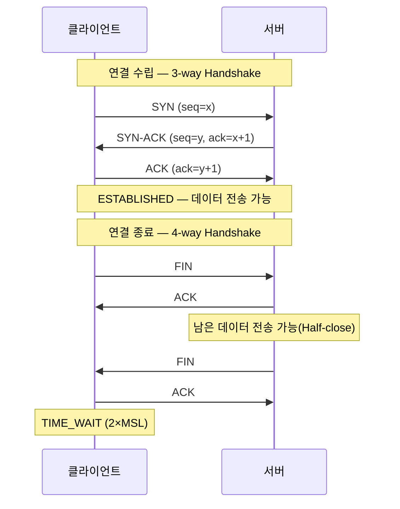
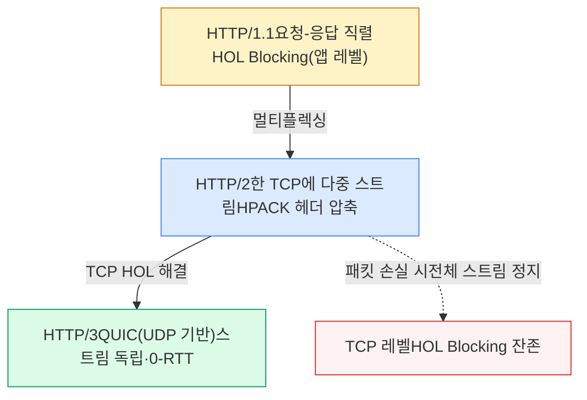
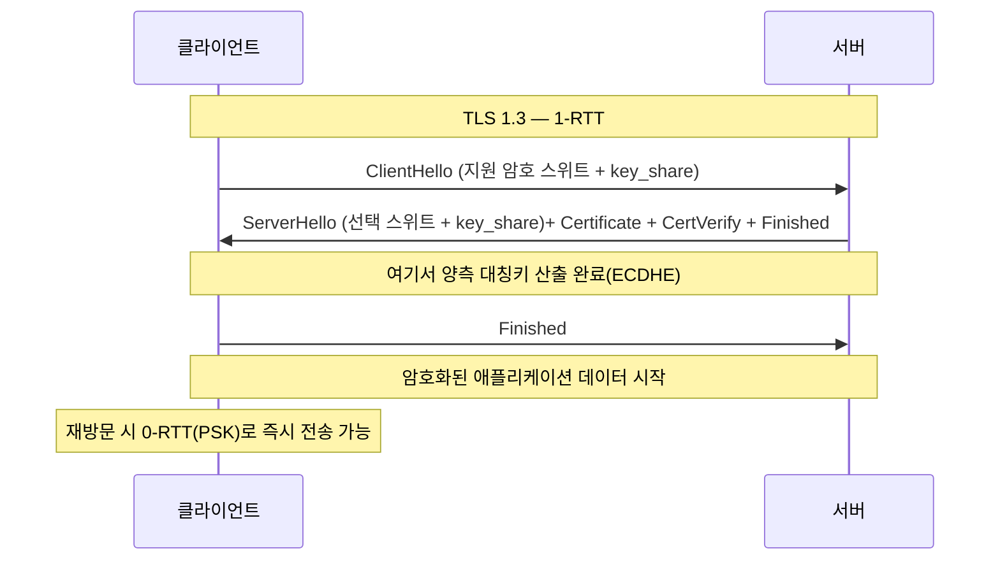
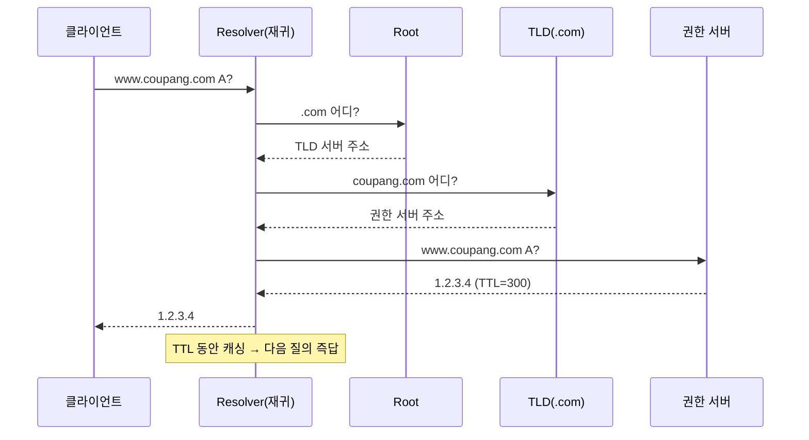
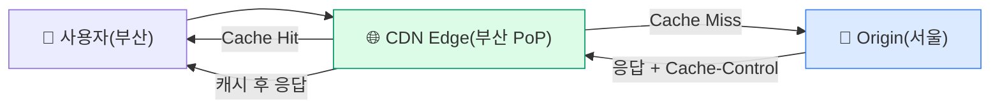

## 1. OSI 7계층 / TCP-IP 4계층

| OSI 7 | TCP/IP 4 | 역할 | 대표 프로토콜 / 단위(PDU) |
| --- | --- | --- | --- |
| 7 Application 6 Presentation 5 Session | Application | 애플리케이션 데이터·인코딩·세션 | HTTP·gRPC·DNS·TLS / Message |
| 4 Transport | Transport | 종단 간 신뢰성·포트 다중화 | TCP·UDP·QUIC / Segment |
| 3 Network | Internet | 호스트 간 라우팅·주소 지정 | IP·ICMP / Packet |
| 2 Data Link 1 Physical | Link | 인접 노드 전송·물리 매체 | Ethernet·ARP / Frame |

> **💡 백엔드 관점 — 계층은 디버깅 분기점**
>
> 장애가 어느 계층인지 빠르게 가르면 진단이 빨라진다. `ping` (L3) → 도달성, `telnet host port` / `ss` (L4) → 포트·연결, `curl -v` (L7) → TLS·HTTP 응답. "L7 LB는 경로 기반 라우팅, L4 LB는 IP:Port 기반"의 차이도 이 계층 모델에서 나온다.

## 2. TCP 핸드셰이크 (3-way / 4-way)



*3-way로 양방향 시퀀스 번호 동기화, 4-way는 양쪽이 독립적으로 닫기 때문*

> **🎯 면접 단골 — "왜 연결은 3-way, 종료는 4-way? TIME_WAIT은 왜?"**
>
> **3 vs 4** : 수립 땐 서버의 ACK와 SYN을 SYN-ACK로 합칠 수 있지만, 종료 땐 서버가 보낼 데이터가 남아있을 수 있어 ACK와 FIN을 분리한다(Half-close). **TIME_WAIT(2×MSL)** : ① 마지막 ACK 유실 시 재전송된 FIN에 응답하기 위해, ② 네트워크에 떠도는 지연 패킷이 같은 4-tuple의 새 연결에 섞이지 않도록. `ss -tan | grep TIME-WAIT | wc -l` 로 측정. 너무 많으면 포트 고갈 → **연결 풀링** · `SO_REUSEADDR` · `tcp_tw_reuse` 로 완화.

> **⚠️ 함정 — TIME_WAIT은 능동 종료(Active Close) 측에 쌓인다**
>
> 서버가 먼저 끊으면 TIME_WAIT이 서버에 쌓여 포트가 마른다. 그래서 보통 **클라이언트가 먼저 닫게** 설계하고, 서버↔서버 호출은 Keep-Alive 커넥션 풀로 연결 자체를 재사용해 종료 빈도를 줄인다.

## 3. 혼잡 제어 (Congestion Control)

TCP는 네트워크 혼잡을 감지해 전송 속도를 스스로 조절한다. **혼잡 윈도우(cwnd)**를 키우고 줄이는 알고리즘이 핵심이다.

```
Slow Start (느린 시작)        : cwnd를 RTT마다 2배 (지수 증가) — ssthresh까지
Congestion Avoidance (혼잡 회피): ssthresh 이후 RTT마다 +1 (선형 증가)
Fast Retransmit / Recovery    : 중복 ACK 3회 → 손실 추정, 즉시 재전송
손실 감지 시                   : cwnd를 줄이고 다시 회피 구간으로

```

| 알고리즘 | 혼잡 신호 | 특징 |
| --- | --- | --- |
| **Reno / NewReno** | 패킷 손실 | 고전적, 손실 기반(AIMD) |
| **CUBIC** | 패킷 손실 | Linux 기본, 고대역폭·고지연에 강함 |
| **BBR (Google)** | 대역폭·RTT 측정 | 손실 무시, 버퍼블로트 회피. YouTube 적용 |

> **🎯 면접 — Nagle vs TCP_NODELAY**
>
> Nagle 알고리즘은 작은 패킷을 모아 보내 대역폭을 아끼지만, Delayed ACK와 만나면 수십 ms 지연이 생긴다. 그래서 지연에 민감한 **실시간·RPC 서버는 `TCP_NODELAY`로 Nagle을 끈다** . "왜 내 gRPC가 가끔 40ms 느린가"의 흔한 범인.

## 4. HTTP 버전 진화 (1.1 / 2 / 3)



*진화의 핵심은 HOL(Head-of-Line) Blocking 제거 — HTTP/2는 앱 레벨, HTTP/3은 TCP 레벨까지 해결*

| 버전 | 전송 | 핵심 개선 | 남은 문제 |
| --- | --- | --- | --- |
| **HTTP/1.0** | TCP | 요청마다 연결 수립/종료 | 높은 지연·연결 비용 |
| **HTTP/1.1** | TCP | Keep-Alive, 파이프라이닝 | 응답 순서 보장 → HOL Blocking |
| **HTTP/2** | TCP | 멀티플렉싱, HPACK, 바이너리 프레이밍, 서버 푸시 | TCP 단일 손실이 전 스트림 정지 |
| **HTTP/3** | QUIC(UDP) | 스트림 독립, 연결 이주, 0-RTT | UDP 차단·미들박스, CPU 부담 |

### 멱등성(Idempotency) & 안전(Safe) 메서드

| 메서드 | Safe | Idempotent | 비고 |
| --- | --- | --- | --- |
| GET / HEAD | ✅ | ✅ | 상태 변경 없음 → 캐시·재시도 안전 |
| PUT / DELETE | ❌ | ✅ | 여러 번 호출해도 결과 동일 |
| POST | ❌ | ❌ | 중복 시 부작용 → `Idempotency-Key` 필요 |

> **💡 백엔드 연결 — 결제·주문 재시도**
>
> 네트워크 타임아웃 후 재시도 시 POST가 중복 결제를 낼 수 있다. 클라이언트가 `Idempotency-Key` 헤더를 붙이고 서버가 키-결과를 저장하면, 재시도여도 동일 응답을 돌려준다. 멱등성은 HTTP 스펙 지식이자 분산 시스템 신뢰성의 핵심.

## 5. HTTPS / TLS 핸드셰이크



*TLS 1.3은 키교환을 ClientHello에 실어 1-RTT로 단축 — 1.2의 2-RTT 대비 절반*

| 항목 | TLS 1.2 | TLS 1.3 |
| --- | --- | --- |
| 핸드셰이크 RTT | 2-RTT | 1-RTT (재연결 0-RTT) |
| 키 교환 | RSA / DHE / ECDHE | ECDHE만(전방향 비밀성 강제) |
| 암호 스위트 | 다수(취약한 것 포함) | AEAD만, 취약 알고리즘 제거 |

> **🎯 면접 — "HTTPS면 안전하다"는 함정**
>
> TLS는 ① **기밀성** (대칭키 암호화) ② **무결성** (MAC) ③ **인증** (인증서 체인 → CA)을 제공하지만, **인증서 검증을 클라이언트가 제대로 해야** 의미가 있다. 검증을 끄거나 만료/자가서명을 무시하면 MITM(중간자 공격)에 뚫린다. `SNI` (여러 도메인 한 IP), `ALPN` (HTTP/2 협상), **mTLS** (상호 인증, 서비스 메시) 개념도 함께.

> **⚠️ 대표 공격**
>
> MITM(중간자), Replay(재전송 → nonce·타임스탬프), Downgrade(구버전 강요 → TLS 1.3 강제·HSTS), CSRF( `SameSite` 쿠키·토큰), XSS(이스케이프·CSP), SQLi(파라미터 바인딩). 쿠키는 `HttpOnly` (JS 접근 차단)· `Secure` (HTTPS만)· `SameSite` 로 방어.

## 6. DNS (Domain Name System)



*재귀 질의(Resolver) + 반복 질의(Root→TLD→Auth) — 캐싱 계층이 TTL로 동작*

| 레코드 | 의미 | 용도 |
| --- | --- | --- |
| **A / AAAA** | 도메인 → IPv4 / IPv6 | 기본 주소 매핑 |
| **CNAME** | 도메인 → 다른 도메인 | 별칭, CDN 연결 |
| **MX** | 메일 서버 | 이메일 라우팅 |
| **TXT** | 임의 텍스트 | SPF·도메인 소유 검증 |
| **SRV** | 서비스 위치(host:port) | 서비스 디스커버리 |

> **⚠️ 함정 — DNS 라운드로빈 LB의 한계**
>
> A 레코드 여러 개로 부하를 분산할 수 있지만, ① **TTL 캐싱** 때문에 장애 IP를 즉시 빼지 못하고, ② 클라이언트·Resolver가 캐시한 IP를 계속 써서 트래픽이 균등하지 않다. 그래서 프로덕션은 DNS는 진입점으로만 쓰고, 실제 분산은 L4/L7 LB·헬스체크로 한다. `dig +trace` 로 질의 경로를 직접 추적하라.

## 7. CDN (Content Delivery Network)

CDN은 사용자와 지리적으로 가까운 **Edge(엣지) 서버**에 콘텐츠를 캐싱해 지연을 줄이고 Origin 부하를 낮춘다. 정적 자원(이미지·JS·CSS)뿐 아니라 동적 가속·DDoS 완화에도 쓰인다.



*Edge 캐시 Hit이면 Origin까지 안 감 — 지연↓, Origin 부하↓*

| 캐시 제어 헤더 | 역할 |
| --- | --- |
| `Cache-Control: max-age` | 캐시 유효 기간(초) |
| `ETag` / `If-None-Match` | 변경 검증 → 304 Not Modified로 대역폭 절약 |
| `Vary` | 요청 헤더별로 캐시 분기(예: Accept-Encoding) |

> **💡 실무 연결 — 캐시 무효화가 어렵다**
>
> "There are only two hard things: cache invalidation and naming things." 정적 자원은 파일명에 해시를 박는 **Cache Busting** ( `app.3f9a.js` )으로 영구 캐시 + 즉시 갱신을 동시에 얻는다. 동적 콘텐츠는 짧은 TTL + `stale-while-revalidate` 로 가용성과 신선도를 절충한다.

## Q&A 연습

아래 질문에 직접 답변을 작성하세요. 자동 저장되며 피드백 요청 시 복사할 수 있습니다.
