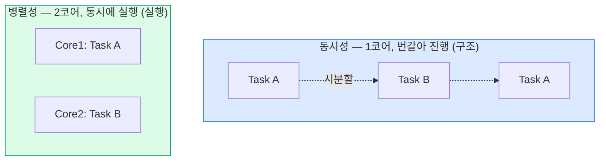
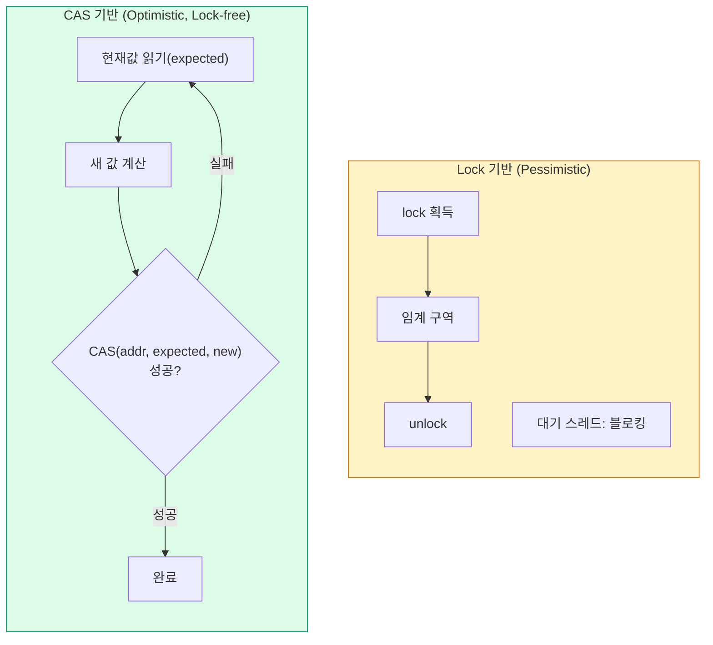
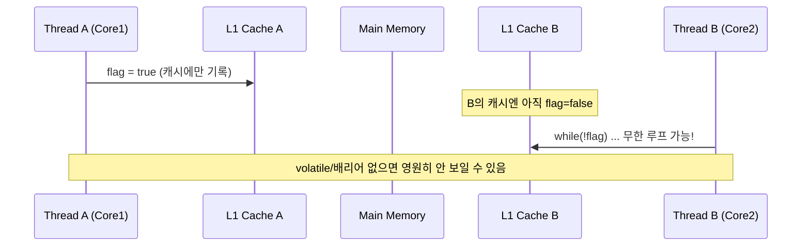
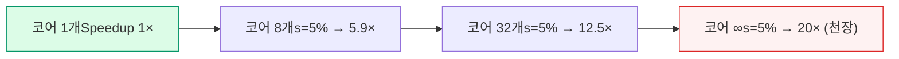

## 1. 동시성(Concurrency) vs 병렬성(Parallelism)



*동시성은 "여러 일을 다루는 구조", 병렬성은 "여러 일을 같은 순간 실행" — Rob Pike의 구분*

- **동시성**: 작업을 잘게 나눠 번갈아 진행. 단일 코어로도 가능(I/O 대기 중 다른 작업). *구조*의 문제.
- **병렬성**: 실제로 동시에 여러 코어에서 실행. 멀티코어 필요. *실행*의 문제.

> **💡 백엔드 연결**
>
> I/O-bound 서버(DB·API 호출 대기 多)는 **동시성** 만으로 처리량이 크게 오른다 — Node.js 이벤트 루프, 코루틴, Virtual Thread(JDK 21+)가 그 예다. CPU-bound 작업(인코딩·연산)이라야 **병렬성** (코어 수만큼 스레드)이 의미 있다. 이 구분이 스레드 풀 사이징의 출발점.

## 2. 임계 구역(Critical Section) & Race Condition

**Race Condition(경쟁 상태)**은 둘 이상 스레드가 공유 자원을 동시에 갱신할 때, 실행 순서에 따라 결과가 달라지는 버그다. 보호되지 않은 공유 자원 접근 구간이 **임계 구역**.

```sql
// 비원자적 read-modify-write — Race Condition
count++  실제로는 3단계:
  1) tmp = count      (read)
  2) tmp = tmp + 1    (modify)
  3) count = tmp      (write)
스레드 A,B가 1을 동시에 읽으면 → 둘 다 +1 → 결과가 +1 (Lost Update)

```

해결: ① 상호 배제(Mutex/synchronized)로 임계 구역 직렬화, ② 원자적 연산(CAS), ③ 애초에 공유 상태를 없애기(불변 객체·메시지 패싱).

> **⚠️ 실무 함정 — 재고 차감**
>
> `SELECT 재고; if(재고>0) UPDATE 재고-1;` 는 전형적 Check-then-Act 경쟁 상태로 **Oversell(초과판매)** 을 낳는다. 해결은 원자적 조건부 UPDATE( `UPDATE ... SET qty=qty-1 WHERE qty>0` )·낙관적 락(version)·비관적 락( `SELECT ... FOR UPDATE` )·Redis 원자 감소 중 부하 특성에 맞게 선택.

## 3. 락(Lock) vs CAS — 두 가지 동기화 철학



*Lock은 충돌을 막고(블로킹), CAS는 충돌을 감지하고 재시도(논블로킹)*

| 관점 | Lock (Blocking) | CAS / Lock-free |
| --- | --- | --- |
| 충돌 처리 | 대기(블로킹) | 재시도(스핀) |
| 경합 낮을 때 | 락 오버헤드 | 매우 빠름 |
| 경합 높을 때 | 안정적 | 재시도 폭증으로 비효율 가능 |
| 위험 | 데드락·우선순위 역전 | ABA 문제·라이브락 |
| 예 | `synchronized`, `ReentrantLock` | `AtomicInteger`, `ConcurrentLinkedQueue` |

> **🎯 면접 — ABA 문제**
>
> CAS는 "값이 expected와 같으면 교체"인데, 값이 A→B→A로 돌아오면 CAS는 변화를 **감지하지 못한다** . 그 사이 자료구조가 바뀌었을 수 있어 위험하다. 해결: 값에 **버전/스탬프** 를 붙이는 `AtomicStampedReference` . Lock-free 자료구조 설계에서 반드시 짚는 포인트.

## 4. 메모리 모델 & 가시성 (Memory Model & Visibility)

현대 CPU·컴파일러는 성능을 위해 **명령 재정렬(Reordering)**을 하고, 각 코어는 자기 캐시에 값을 들고 있다. 그래서 한 스레드의 쓰기가 다른 스레드에 **즉시 보이지 않을 수** 있다 — 이것이 **가시성(Visibility)** 문제.



*가시성 문제 — 쓰기가 메인 메모리로 flush되고 읽기가 무효화되어야 보인다*

### happens-before 관계

A happens-before B이면, A의 결과가 B에 **반드시 보임**이 보장된다(JMM, Java Memory Model). 주요 규칙:

- 동일 스레드 내 프로그램 순서
- `volatile` 쓰기 → 같은 변수 읽기 (Memory Barrier 삽입)
- 모니터 unlock → 같은 모니터 lock
- `Thread.start()` → 시작된 스레드 내부 / 스레드 종료 → `join()` 반환

| 키워드 | 보장 | 주의 |
| --- | --- | --- |
| `volatile` | 가시성 + 재정렬 방지 | 원자성은 보장 안 함(`i++` 여전히 위험) |
| `synchronized` | 상호 배제 + 가시성 | 락 비용·경합 |
| `Atomic*` | 원자성 + 가시성(CAS) | 복합 연산은 별도 설계 필요 |

> **🎯 면접 — "double-checked locking" 함정**
>
> 싱글톤 지연 초기화에서 `volatile` 없이 double-checked locking을 쓰면, 객체 생성(할당→초기화→참조대입)이 재정렬되어 **초기화 덜 된 객체를 다른 스레드가 볼 수** 있다. 인스턴스 필드를 `volatile` 로 선언해 배리어를 강제해야 안전. 더 간단한 답은 **Holder Idiom** (클래스 로딩의 happens-before 활용)이나 **enum 싱글톤** .

## 5. 액터(Actor) / CSP 모델 — 공유 상태를 피하는 길

"공유 메모리 + 락"의 복잡성을 피하는 대안은 **상태를 공유하지 않고 메시지로 통신**하는 것이다. "Don't communicate by sharing memory; share memory by communicating."

| 모델 | 핵심 | 통신 | 대표 |
| --- | --- | --- | --- |
| **공유 메모리 + 락** | 공유 상태를 락으로 보호 | 직접 메모리 접근 | Java `synchronized`, pthread |
| **Actor 모델** | 각 액터가 자기 상태 소유, 메일박스로 메시지 수신 | 비동기 메시지 | Erlang/Elixir, Akka |
| **CSP** | 채널을 통한 동기 통신, 프로세스는 상태 비공유 | 채널(channel) | Go goroutine + channel |

> **💡 실무 연결**
>
> Go의 `goroutine + channel` 은 CSP의 구현이다 — 워커들이 채널로 작업을 주고받으면 락 없이 안전한 파이프라인이 된다. Akka/Erlang의 액터는 통신사·메신저처럼 **장애 격리(let it crash)** 가 중요한 시스템에 강하다. 결국 동시성 버그를 줄이는 가장 좋은 방법은 **공유 가변 상태를 줄이는 것** 이다.

## 6. Amdahl's Law (암달의 법칙)

병렬화로 얻는 속도 향상에는 **상한**이 있다. 직렬(순차) 부분의 비율 `s`가 전체 속도 향상을 제한한다.

```
Speedup(N) = 1 / ( s + (1 - s) / N )

s   = 직렬 부분 비율 (병렬화 불가)
1-s = 병렬 가능 부분
N   = 코어(스레드) 수

예) 직렬 부분 s = 5% (0.05), N → ∞
    Speedup 최대 = 1 / 0.05 = 20배 (코어 무한대여도!)
    즉, 5%의 순차 코드가 20배에서 천장을 만든다.

```



*직렬 5%만 있어도 코어를 무한히 늘려도 20배가 한계 — 수확 체감*

> **🎯 면접 — "스레드 늘리면 빨라지죠?"는 함정**
>
> Amdahl's Law로 반박하라: ① 직렬 부분(락 구간·순차 I/O)이 천장을 만들고, ② 스레드가 코어 수를 넘으면 컨텍스트 스위칭·Lock Contention(락 경합)으로 오히려 느려진다. 진짜 최적화는 스레드 추가가 아니라 **직렬 구간 축소** (락 범위 최소화·샤딩·lock-free·불변 객체)다. 참고로 입력 크기를 함께 키우면 더 낙관적인 **Gustafson's Law** 가 적용된다.

## Q&A 연습

아래 질문에 직접 답변을 작성하세요. 자동 저장되며 피드백 요청 시 복사할 수 있습니다.
