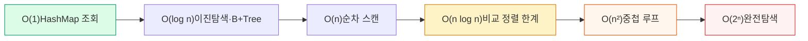
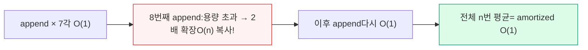

## 1. 빅오(Big-O) · 오메가 · 세타

점근 표기법(Asymptotic Notation)은 입력 n이 커질 때 성장률을 **상수·저차항을 무시하고** 표현한다.

| 표기 | 의미 | 경계 | 쓰임 |
| --- | --- | --- | --- |
| **O(f) — Big-O** | 상한(upper bound) | "아무리 나빠도 이 이하" | 최악 보장 — 가장 흔히 사용 |
| **Ω(f) — Big-Omega** | 하한(lower bound) | "아무리 좋아도 이 이상" | 최선의 한계, 문제의 하한 증명 |
| **Θ(f) — Big-Theta** | 상·하한 일치(tight) | "정확히 이 차수" | 정확한 성장률 표현 |

> **🎯 면접 — "O를 정확히 쓰는가"**
>
> 흔히 "이 알고리즘은 O(n)"이라 말하지만, 정확히는 **최악이 O(n)** 이라는 뜻이다. 평균·최악을 구분하라: Quick Sort는 평균 Θ(n log n), 최악 O(n²). 또 Big-O는 상한이라 "O(n²) 알고리즘이 O(n³)이기도 하다"는 형식적으로 참이지만, 면접에선 **가장 빡빡한(tight) 경계** 를 말해야 한다 → 사실상 Θ를 답하는 셈.

## 2. 증가율 위계 (Growth Hierarchy)

```
O(1) < O(log n) < O(√n) < O(n) < O(n log n) < O(n²) < O(2ⁿ) < O(n!)
상수    로그        제곱근    선형     선형로그       이차      지수      팩토리얼

n = 1,000,000 일 때 대략의 연산 수
O(1)        : 1
O(log n)    : ~20
O(n)        : 1,000,000
O(n log n)  : ~20,000,000
O(n²)       : 1,000,000,000,000   ← 1초 안에 불가능
O(2ⁿ)       : 사실상 영원

```



*실무 경계선: n이 크면 O(n log n) 이하로 끌어내려야 하고, O(n²)·O(2ⁿ)는 입력 크기를 의심하라*

> **💡 면접 입력 크기 감 잡기**
>
> 제약(constraint)이 알고리즘을 알려준다. n ≤ 20 → 비트마스크/완전탐색 O(2ⁿ) 허용. n ≤ 5,000 → O(n²) 가능. n ≤ 10⁵~10⁶ → O(n log n) 필요. n ≥ 10⁷ → O(n)/O(log n)만. "1초 ≈ 10⁸ 연산"을 기준 삼아 역산하라.

## 3. 시간 & 공간 복잡도 (Time & Space)

시간 복잡도만 보면 절반이다. **공간 복잡도** — 추가 메모리, 재귀 호출 스택, 보조 자료구조 — 도 함께 분석해야 한다. 둘 사이엔 흔히 **Trade-off**가 있다.

### Time-Space Trade-off 예시

| 기법 | 시간 | 공간 | 설명 |
| --- | --- | --- | --- |
| **Memoization** | ↓ (중복 계산 제거) | ↑ (캐시 저장) | Fibonacci O(2ⁿ)→O(n), 대신 O(n) 메모리 |
| **Hash Index** | ↓ 조회 O(1) | ↑ 해시 테이블 | DB 인덱스: 조회 빠르게, 저장공간·쓰기 비용 증가 |
| **In-place 정렬** | = | ↓ O(1) | Heap Sort: 메모리 아끼지만 캐시 비친화 |

### 재귀의 공간 복잡도 — 흔한 함정

```
// 재귀 깊이 = 공간 복잡도(호출 스택)
int sum(int n) {            // 공간 O(n) — 스택 프레임 n개 쌓임
    if (n == 0) return 0;
    return n + sum(n - 1);  // 꼬리 재귀지만 JVM은 TCO 미지원 → 스택 누적
}
// n이 크면 StackOverflowError → 반복문 O(1) 공간으로 변환 필요

```

> **⚠️ 함정 — "시간만 보고 공간을 잊는다"**
>
> 재귀 DFS/분할정복은 시간이 O(n log n)이어도 호출 스택이 O(깊이)를 먹는다. 대규모 입력에서 OOM·StackOverflow의 원인. 면접에서 복잡도를 답할 때 **시간과 공간을 항상 쌍으로** 말하면 시니어 인상을 준다.

## 4. 분할상환 분석 (Amortized Analysis)

개별 연산은 가끔 비싸지만, **연산 시퀀스 전체로 평균을 내면** 싼 경우가 있다. 최악 한 번이 아니라 "긴 호출열의 평균 비용"을 본다 — 평균(average)과는 다른 개념(확률 가정 없음).



*Dynamic Array — 가끔 O(n) 복사가 일어나지만, 전체로 평균 내면 분할상환 O(1)*

| 연산 | 최악(단일) | 분할상환 | 이유 |
| --- | --- | --- | --- |
| Dynamic Array `append` | O(n) | O(1) | 2배 확장: 복사 비용이 다음 n번에 분산 |
| HashMap `put` | O(n) | O(1) | Rehashing 비용이 전체에 분산 |
| Union-Find `find` | O(log n) | ~O(α(n)) | 경로 압축 + rank → 거의 상수 |

> **🎯 면접 — "ArrayList add는 O(1)인가?"**
>
> 정확한 답: **분할상환(amortized) O(1)** 이고, 리사이징이 걸리는 그 순간은 O(n)이다. 그래서 크기를 알면 `new ArrayList<>(capacity)` 로 미리 잡아 복사를 없앤다. "amortized"라는 단어를 정확히 쓰면 깊이를 증명한다.

## 5. DP / 그리디 / 분할정복 복잡도

| 패러다임 | 핵심 | 복잡도 분석법 | 대표 예 (복잡도) |
| --- | --- | --- | --- |
| **분할정복(Divide & Conquer)** | 쪼개서 풀고 합침 | 마스터 정리(점화식) | Merge Sort T(n)=2T(n/2)+O(n)=O(n log n) |
| **동적계획법(DP)** | 부분문제 + 메모이제이션 | 상태 수 × 전이 비용 | 0/1 Knapsack O(nW), LCS O(nm) |
| **그리디(Greedy)** | 매 단계 국소 최적 선택 | 정렬 + 선형 스캔이 흔함 | 활동 선택 O(n log n), Dijkstra O(E log V) |
| **백트래킹(Backtracking)** | 탐색 + 가지치기 | 분기 × 깊이(지수적, 가지치기로 완화) | N-Queens O(n!), 부분집합 O(2ⁿ) |

### 마스터 정리 (Master Theorem) 직관

```
T(n) = a·T(n/b) + O(n^d)   (a≥1, b>1)

비교 d vs log_b(a):
  d > log_b(a)  →  T(n) = O(n^d)           (분할 비용이 지배)
  d = log_b(a)  →  T(n) = O(n^d · log n)    (균형)  ← Merge Sort: a=2,b=2,d=1
  d < log_b(a)  →  T(n) = O(n^(log_b a))    (재귀가 지배)

```

> **💡 DP vs 그리디 — 언제 그리디가 맞나**
>
> 그리디는 **탐욕적 선택 속성** 과 **최적 부분 구조** 가 증명될 때만 정답을 보장한다(예: Dijkstra, MST). 증명 없이 그리디를 쓰면 반례에 깨진다 — 동전 거스름돈이 대표적(특정 액면이면 그리디 실패 → DP 필요). 면접에서 그리디를 제안하면 **왜 국소 최적이 전역 최적인지** 한 줄 근거를 붙여라.

## 6. 자료구조 연산 복잡도표 (Cheat Sheet)

면접에서 즉답해야 하는 핵심 표. 평균 / 최악을 구분해서 외우되, **왜**를 함께 기억하라.

| 자료구조 | 접근 | 탐색 | 삽입 | 삭제 | 공간 | 비고 |
| --- | --- | --- | --- | --- | --- | --- |
| **Array** | O(1) | O(n) | O(n) | O(n) | O(n) | 인덱스 즉시, 중간 삽입 시 이동 |
| **Dynamic Array** | O(1) | O(n) | O(1)† | O(n) | O(n) | † amortized, 끝 삽입 |
| **Linked List** | O(n) | O(n) | O(1)* | O(1)* | O(n) | * 위치 알 때 |
| **Stack / Queue** | O(n) | O(n) | O(1) | O(1) | O(n) | 끝/앞 전용 접근 |
| **HashMap** | — | O(1) / O(n)‡ | O(1) / O(n)‡ | O(1) / O(n)‡ | O(n) | ‡ 평균 / 최악(충돌·리사이즈) |
| **TreeMap (R-B)** | — | O(log n) | O(log n) | O(log n) | O(n) | 정렬·Range 보장 |
| **Heap (PQ)** | O(1) peek | O(n) | O(log n) | O(log n) | O(n) | min/max 특화 |
| **Trie** | — | O(L) | O(L) | O(L) | O(Σ·N) | L=키 길이, 접두사 검색 |
| **B+Tree** | — | O(log n) | O(log n) | O(log n) | O(n) | 디스크 친화, DB 인덱스 |
| **Union-Find** | — | O(α(n)) | O(α(n)) | — | O(n) | 경로압축+rank, 사실상 상수 |

> **🎯 면접 — 표를 외우지 말고 "왜"로 재구성하라**
>
> Array 접근이 O(1)인 이유는 **연속 메모리 + 주소 산술** 이고, LinkedList 탐색이 O(n)인 이유는 **포인터 추적** 이다. TreeMap이 O(log n)인 이유는 **균형 트리 높이** , B+Tree가 같은 O(log n)이어도 DB에 쓰이는 이유는 **높은 fan-out으로 디스크 I/O 횟수가 적기** 때문. 원리를 알면 표는 저절로 복원된다.

## Q&A 연습

아래 질문에 직접 답변을 작성하세요. 자동 저장되며 피드백 요청 시 복사할 수 있습니다.
