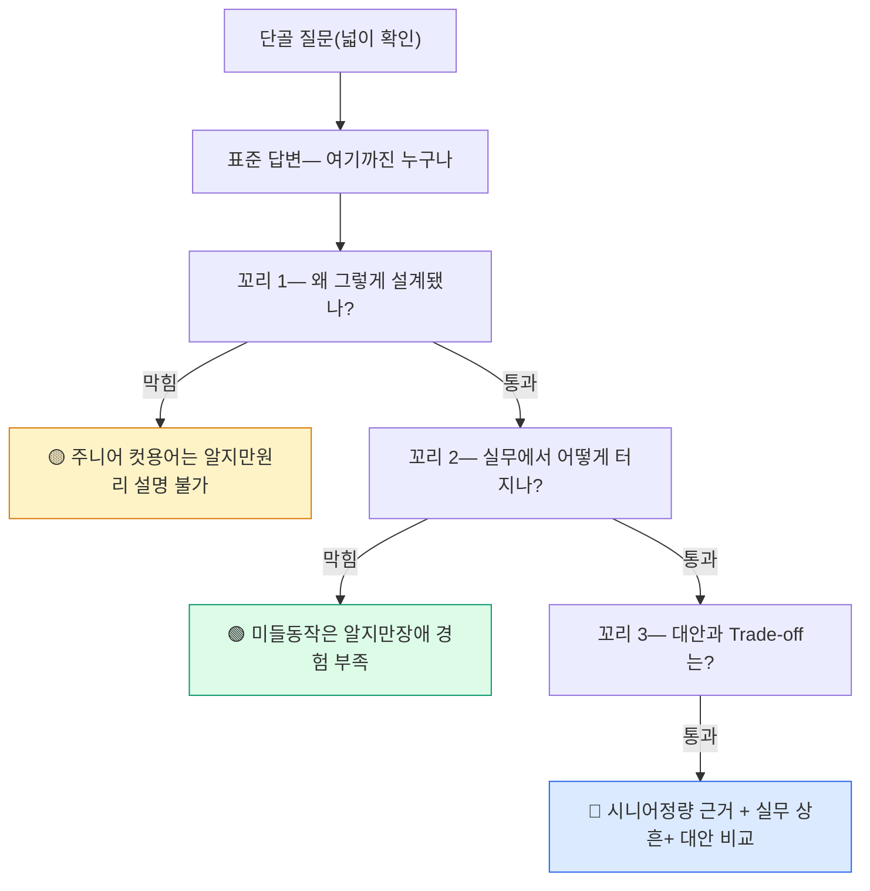
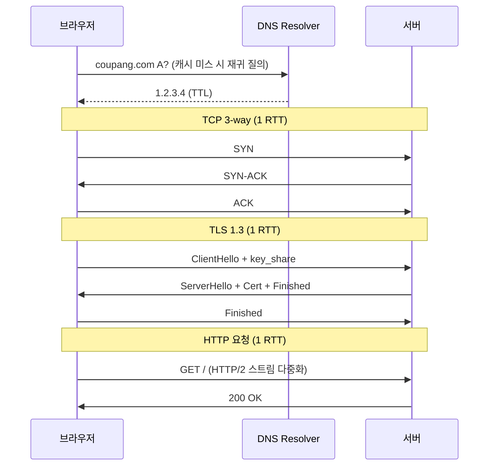
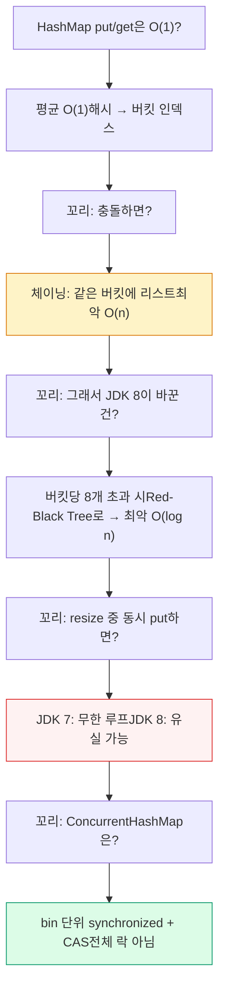

## 1. 이 라운드의 규칙 — 15~20분, 꼬리 질문으로 깊이를 잰다

CS 면접 라운드는 지식의 **넓이**가 아니라 **깊이**를 잰다. 면접관은 누구나 아는 단골 질문("URL 치면?", "프로세스 vs 스레드?")을 던진 뒤, 답변의 **가장 얕은 지점을 파고드는 꼬리 질문**으로 컷라인을 그린다. 6년차에게 표준 답변은 통과 기준이 아니라 시작점일 뿐이다.



*이 카드는 개념 나열이 아니라, 실제로 이어지는 꼬리 질문 체인을 그대로 재현한다.*

> **🎯 면접 포인트**
>
> 꼬리 질문의 목적은 "당신이 이 지식을 **암기했는지 vs 이해했는지**"를 가르는 것이다. 표준 답변까지는 만점이 아니라 0점 방어일 뿐이다. 매 답변 끝에 "왜 이렇게 설계됐는지"를 한 문장 덧붙이는 습관이 컷라인을 넘긴다.

---

## 2. 네트워크 체인 — "브라우저에 URL 치면?"

가장 유명한 질문. 표준 답변(DNS→TCP→TLS→HTTP)은 **통과가 아니라 입장권**이다. 진짜 평가는 그 다음 4개의 꼬리에서 갈린다.



*첫 화면까지 DNS + TCP 1-RTT + TLS 1-RTT + HTTP 1-RTT — RTT 40ms 환경이면 핸드셰이크만 ~120ms.*

**꼬리 질문 체인:**

1. **꼬리 1 — "DNS는 캐시 미스면 몇 번을 왕복하죠?"**
   Root→TLD(.com)→Authoritative 3단계 재귀. 그래서 첫 접속이 느리다. TTL 캐싱으로 두 번째부터 즉답. `dig +trace`로 경로를 직접 본 적 있다고 답하면 강하다.
   → *여기서 "그냥 IP 받아와요"만 답하면 주니어.*

2. **꼬리 2 — "HTTP/2로 멀티플렉싱했는데도 느릴 수 있는 이유는?"**
   **TCP 레벨 HOL Blocking(Head-of-Line Blocking, 대기열 선두 막힘)**. HTTP/2는 한 TCP 연결에 여러 스트림을 다중화하지만, 그 아래 TCP는 **바이트 스트림 하나**다. 패킷 하나가 유실되면 TCP는 순서 보장을 위해 뒤따르는 모든 스트림의 데이터를 커널 버퍼에 붙잡아 둔다. 앱 레벨 HOL은 풀었지만 전송 레벨 HOL이 남는다.
   → *여기서 "HTTP/2면 다 해결됐죠"라 답하면 미들 컷.*

3. **꼬리 3 — "그럼 HTTP/3는 그걸 어떻게 풀죠?"**
   **QUIC(UDP 기반)**은 스트림별로 독립된 시퀀스 번호를 갖는다. 한 스트림의 패킷이 유실돼도 다른 스트림은 영향받지 않는다. 또 TLS를 프로토콜에 내장해 연결 수립이 1-RTT(재방문 0-RTT), 연결 이주(Connection Migration)로 IP가 바뀌어도 세션 유지.

4. **꼬리 4 — "백엔드 서버 간 통신에선 이게 어떻게 연결되죠?"**
   서버↔서버는 매 요청마다 3-way + TLS를 다시 하면 RTT 낭비 + `TIME_WAIT` 소켓 폭증. 그래서 **Keep-Alive 커넥션 풀**로 연결을 재사용한다. HikariCP·Netty·gRPC 채널이 모두 이 원리. keep-alive idle timeout과 서버의 timeout을 맞추지 않으면 "서버가 이미 닫은 소켓을 풀이 재사용 → `Connection reset`" 장애가 난다.

> **⚠️ 실무 함정**
>
> "TCP는 신뢰성 있으니 데이터 손실 없다"는 반쪽 진실이다. TCP가 보장하는 건 **세그먼트 전달**이지 애플리케이션 처리가 아니다. 서버가 ACK를 보낸 뒤 크래시하면 데이터는 유실된다. 그래서 결제·주문은 반드시 **애플리케이션 레벨 ACK + 멱등키(Idempotency-Key)**로 별도 보장한다. 이 구분을 못 하면 시니어 라운드에서 바로 걸린다.

> **💡 팁**
>
> RTT 숫자를 손에 쥐고 답하라. "TLS 1.2는 2-RTT, 1.3은 1-RTT, RTT 40ms면 핸드셰이크 한 번에 40ms 절약"처럼 정량화하면 "실측해본 사람"으로 보인다. 관찰 도구도 함께: `tcpdump -i any port 443`, `ss -ti`(RTT·cwnd 확인), `curl -w '%{time_connect} %{time_appconnect}'`.

---

## 3. OS 체인 — "프로세스 vs 스레드"

표준 답변(주소 공간 공유 여부)은 교과서다. 꼬리는 **비용**과 **한계**로 파고든다.


**꼬리 질문 체인:**

1. **꼬리 1 — "컨텍스트 스위칭 비용이 왜 다르죠?"**
   프로세스 전환은 주소 공간이 바뀌므로 **TLB(Translation Lookaside Buffer) flush**가 일어나 이후 메모리 접근이 모두 TLB miss. 스레드 전환은 같은 주소 공간이라 TLB는 유지되고 L1/L2 캐시 오염만 발생. 스위칭 자체의 직접 비용은 **~1~5µs**지만, 캐시·TLB 재적재라는 간접 비용이 더 크다.
   → *"스레드가 더 싸요"만 답하고 이유를 못 대면 주니어.*

2. **꼬리 2 — "스레드 1만 개 만들면 어떻게 되죠?"**
   두 가지로 터진다. ① **메모리**: JVM 스레드 스택 기본 ~1MB × 1만 = 10GB 가상 메모리 예약. ② **스케줄링**: 코어 8개인데 실행 가능 스레드 1만 개면, 비자발적 컨텍스트 스위치가 폭증해 CPU가 "일하는 시간보다 전환하는 시간"이 커진다(`vmstat`의 `cs` 컬럼 급등). 처리량이 오히려 떨어진다.
   → *"많으면 좀 느려져요"만 답하면 미들 컷. 숫자를 대야 한다.*

3. **꼬리 3 — "그럼 동시 접속 10만을 어떻게 처리하죠?"**
   두 갈래. ① **이벤트 루프(Reactor 패턴)**: 소수 스레드가 `epoll`로 수만 소켓을 non-blocking 다중화(Netty·Node.js·nginx). 스레드당 커넥션이 아니라 이벤트당 콜백. ② **가상 스레드(JDK 21 Virtual Thread)**: 블로킹 코드를 그대로 쓰되, JVM이 블로킹 시점에 캐리어 스레드에서 언마운트해 OS 스레드를 점유하지 않게 한다. 스택은 힙에 저장돼 수백만 개도 가능.

4. **꼬리 4 — "이벤트 루프와 가상 스레드, 뭘 언제 쓰죠?"**
   이벤트 루프는 최고 성능이지만 콜백 지옥 + 한 콜백에서 블로킹하면 전체 루프가 멈추는 위험. 가상 스레드는 명령형 코드의 가독성을 유지하면서 확장. 단, `synchronized` 안에서 블로킹하면 캐리어를 pin해 효과가 반감된다(JDK 21 한계, 이후 개선).

> **⚠️ 실무 함정**
>
> "멀티스레드면 빨라진다"는 Amdahl's Law를 무시한 오해다. 직렬 구간 비율이 5%만 돼도 무한 코어로도 최대 20배 이상 못 간다. 게다가 Lock 경합(contention)이 심하면 스레드를 늘릴수록 오히려 느려진다. `ThreadPoolExecutor` 크기는 CPU-bound면 `코어 수 + 1`, I/O-bound면 `코어 수 × (1 + 대기시간/연산시간)`이 출발점. 무작정 크게 잡으면 스위칭 비용만 늘어난다.

```java
// I/O 대기가 연산의 9배인 워크로드, 8코어 기준
// 최적 스레드 수 ≈ 8 × (1 + 9) = 80
int cores = Runtime.getRuntime().availableProcessors(); // 8
double waitRatio = 9.0; // (대기시간 / 연산시간)
int poolSize = (int) (cores * (1 + waitRatio)); // 80
// 하지만 가상 스레드라면 이 계산 자체가 불필요 —
// executor = Executors.newVirtualThreadPerTaskExecutor();
```

> **💡 팁**
>
> "스레드 몇 개가 적정?"에 공식만 읊지 말고 "실측해서 튜닝한다"를 덧붙여라. `pidstat -w`로 자발적/비자발적 스위치를 구분하고, 비자발적이 많으면 CPU 과부하 신호라 스레드를 **줄인다**고 답하면 운영 경험이 드러난다.

---

## 4. 자료구조 체인 — "HashMap은 어떻게 동작하죠?"

가장 흔한 자료구조 질문. 표준 답변(해시 함수 → 버킷 → 충돌 시 체이닝)은 기본기. 꼬리는 **최악 복잡도**와 **동시성**으로 간다.



**꼬리 질문 체인:**

1. **꼬리 1 — "그럼 HashMap은 O(1)이 보장되나요?"**
   아니다. **평균 O(1), 최악 O(n)**. 해시 충돌이 많거나(나쁜 해시 함수), Load Factor(적재율, 기본 0.75) 초과로 resize가 잦으면 성능이 무너진다. JDK 8부터는 한 버킷의 노드가 8개를 넘고 전체 용량이 64 이상이면 버킷을 **Red-Black Tree(균형 트리)**로 바꿔 최악을 O(log n)으로 방어(treeify).
   → *"O(1)이요"만 답하고 최악을 못 대면 주니어.*

2. **꼬리 2 — "resize는 정확히 언제, 무슨 일이 일어나죠?"**
   `size > capacity × loadFactor`가 되면 용량을 2배로 늘리고 모든 엔트리를 새 버킷에 재배치(rehash). 이때 **O(n) 순간 지연**이 생긴다. 그래서 크기를 알면 `new HashMap<>(expectedSize / 0.75 + 1)`로 초기 용량을 지정해 resize를 피한다.

3. **꼬리 3 — "resize 도중 다른 스레드가 put하면요?"**
   여기가 진짜 컷라인. **JDK 7**은 리스트를 head-insert로 옮겨서 두 스레드가 동시에 rehash하면 링크가 순환(cycle)을 이뤄 다음 `get`이 **무한 루프(CPU 100%)**에 빠지는 악명 높은 버그가 있었다. **JDK 8**은 순서를 유지하는 방식으로 바꿔 무한 루프는 사라졌지만, 여전히 lost update·데이터 유실이 가능해 **스레드 안전하지 않다**.
   → *"동시성 문제 나요"만 답하면 컷. 무한 루프 vs 유실을 버전별로 구분해야 시니어.*

4. **꼬리 4 — "그래서 ConcurrentHashMap은 어떻게 안전하죠?"**
   **JDK 7**은 Segment(기본 16개) 단위 락으로 동시성 수준을 16으로 제한. **JDK 8**은 Segment를 버리고, 버킷(bin) **헤드 노드 단위로만 `synchronized`** + 빈 버킷 삽입은 **CAS(Compare-And-Swap)**로 락 없이 처리. 락 범위가 버킷 하나로 좁아져 경합이 급감하고, `get`은 대부분 락 없이(volatile 읽기) 동작한다. resize도 여러 스레드가 나눠 돕는다(transfer 분담).

> **⚠️ 실무 함정**
>
> "동시성 필요하면 HashMap을 `Collections.synchronizedMap`으로 감싸면 되죠"는 반쪽이다. 그건 **모든 연산을 단일 락**으로 직렬화해 경합이 심하면 ConcurrentHashMap보다 훨씬 느리다. 또 iteration 중에는 여전히 수동 동기화가 필요하다. 읽기가 많은 워크로드는 ConcurrentHashMap이 정답.

> **💡 팁**
>
> 해시 관련 질문엔 "쓰기/읽기 비율, 키 분포, 크기 예측 가능 여부"를 되물어라. "읽기 위주면 ConcurrentHashMap, 불변이면 `Map.of`, 순서 필요하면 LinkedHashMap"처럼 상황별로 자료구조를 고르는 사고가 시니어의 자료구조 감각이다.

---

## 5. 좋은 답변 vs 나쁜 답변

| 질문 | 🔴 나쁜 답변 (컷) | 🟢 좋은 답변 (통과) |
| --- | --- | --- |
| HTTP/2인데 왜 느리죠? | "HTTP/2면 다 해결됐는데요?" | "앱 레벨 HOL은 풀었지만 TCP는 바이트 스트림 하나라 패킷 유실 시 전 스트림이 대기. HTTP/3의 QUIC이 스트림 독립으로 해결." |
| 스레드 1만 개는? | "좀 느려질 것 같아요" | "스택 1MB×1만=10GB VM + 코어 8개에 실행 스레드 1만 → `cs` 폭증. 이벤트 루프나 가상 스레드로 전환." |
| HashMap은 O(1)? | "네, O(1)입니다" | "평균 O(1), 최악 O(n). JDK 8은 버킷 8개 초과 시 트리화로 O(log n) 방어." |
| resize 중 동시 put? | "동시성 문제 나요" | "JDK 7은 순환 링크로 무한 루프, JDK 8은 유실. 그래서 ConcurrentHashMap은 bin 단위 synchronized + CAS." |
| TCP는 신뢰성 있죠? | "네, 손실 없어요" | "세그먼트 전달은 보장하지만 앱 처리는 별개. ACK 후 크래시 시 유실 → 멱등키로 앱 레벨 보장." |

> **🎯 면접 포인트**
>
> 나쁜 답변의 공통점은 "결론만 있고 메커니즘이 없다"는 것. 좋은 답변의 공통점은 "**한계 → 원인 → 대안**"의 3박자를 담는다. 면접관은 결론이 아니라 그 사이의 사고 과정을 듣고 싶어 한다.

---

## 6. 평가 루브릭 — 나는 어디쯤인가

| 축 | 🟡 주니어 (컷) | 🟢 미들 (통과) | 🔵 시니어 (합격 우위) |
| --- | --- | --- | --- |
| **정확성** | 용어는 알지만 원리 설명 불가 | 표준 동작을 정확히 서술 | 최악/평균 복잡도, 버전별 차이까지 |
| **정량 근거** | 숫자 없음("빠르다/느리다") | 대략적 비용 인지 | RTT·µs·MB 단위로 근거 제시 |
| **실무 연결** | 교과서 지식에 머묾 | 프레임워크 사용 경험 | 실제 장애·튜닝·관찰 도구 경험 |
| **대안 비교** | 하나의 답만 암기 | 대안 존재는 인지 | Trade-off를 조건부로 제시 |
| **꼬리 대응** | 2번째 꼬리에서 막힘 | 3번째까지 버팀 | 4번째 대안·한계까지 파고듦 |

**셀프 진단 기준:**

- 각 체인에서 **꼬리 2까지** 막힘없이 답하면 미들 통과선.
- **꼬리 4(대안·한계)**까지 정량 근거를 대며 답하면 시니어.
- 관찰 도구(`tcpdump`·`ss`·`vmstat`·`pidstat`·`jstack`)를 실제로 써본 경험을 자연스럽게 섞으면 결정적 우위.

> **⚠️ 실무 함정**
>
> 루브릭에서 6년차가 가장 많이 걸리는 지점은 "정량 근거" 축이다. 동작 원리는 알지만 "그래서 몇 µs? 몇 RTT? 몇 MB?"에서 침묵하면 미들에 갇힌다. 평소 성능 튜닝할 때 숫자를 손에 익혀두는 것이 유일한 대비책이다.

> **💡 팁**
>
> 막혔을 때 침묵보다 "정확히는 기억 안 나지만, 방향은 이럴 것 같습니다 — ...이니까요"라고 추론 과정을 소리 내는 편이 낫다. 면접관은 정답 여부만큼 **사고 방식**을 평가한다. 단, 확실한 것과 추측을 명확히 구분해서 말하라.

---

## Q&A 연습

위 세 체인(네트워크 HOL, 스레드 1만 개, HashMap resize)을 실제 면접처럼 소리 내어 답해보세요. 각 체인의 꼬리 4까지 정량 근거를 붙여 답할 수 있으면 시니어 라운드 대비가 된 것입니다. 아래 질문에 직접 답변을 작성하면 자동 저장됩니다.
