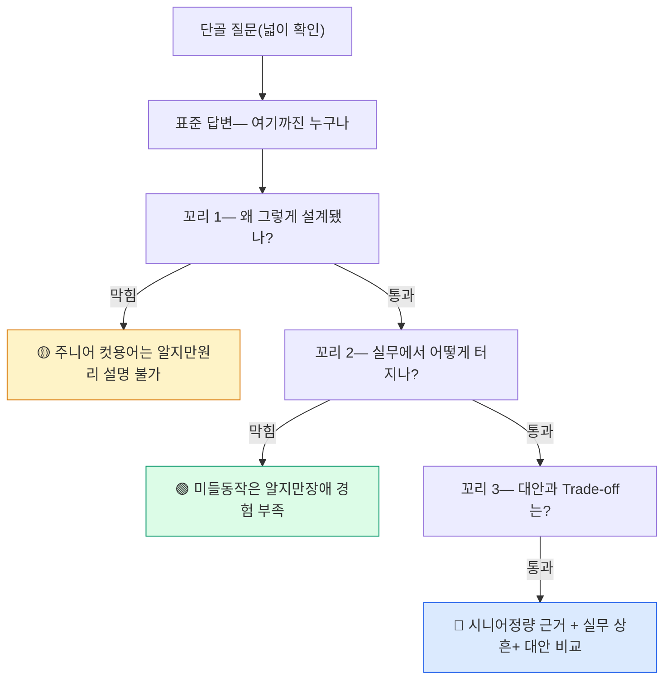
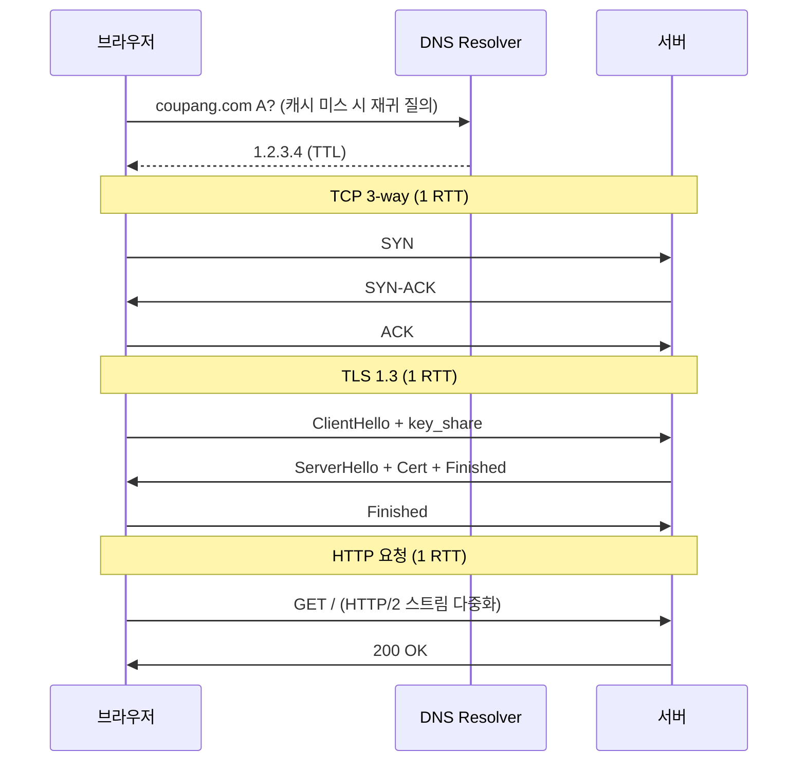
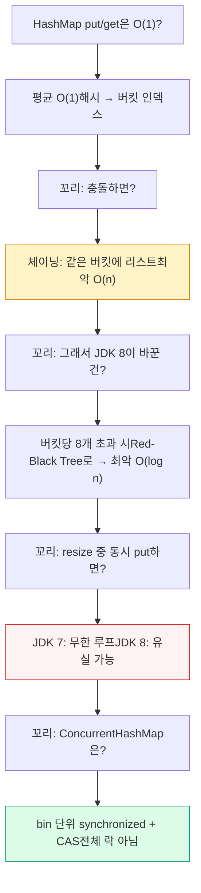

## 1. 이 라운드의 규칙 — 15~20분, 꼬리 질문으로 깊이를 잰다

CS 면접 라운드는 지식의 **넓이**가 아니라 **깊이**를 잰다. 면접관은 누구나 아는 단골 질문("URL 치면?", "프로세스 vs 스레드?")을 던진 뒤, 답변의 **가장 얕은 지점을 파고드는 꼬리 질문**으로 컷라인을 그린다. 6년차에게 표준 답변은 통과 기준이 아니라 시작점일 뿐이다.


```mermaid
flowchart TD
    Q0["단골 질문(넓이 확인)"] --> A0["표준 답변— 여기까진 누구나"]
    A0 --> Q1["꼬리 1— 왜 그렇게 설계됐나?"]
    Q1 -->|막힘| Junior["🟡 주니어 컷용어는 알지만원리 설명 불가"]
    Q1 -->|통과| Q2["꼬리 2— 실무에서 어떻게 터지나?"]
    Q2 -->|막힘| Middle["🟢 미들동작은 알지만장애 경험 부족"]
    Q2 -->|통과| Q3["꼬리 3— 대안과 Trade-off는?"]
    Q3 -->|통과| Senior["🔵 시니어정량 근거 + 실무 상흔+ 대안 비교"]

    style Junior fill:#fef3c7,stroke:#d97706
    style Middle fill:#dcfce7,stroke:#059669
    style Senior fill:#dbeafe,stroke:#2563eb
```

*이 카드는 개념 나열이 아니라, 실제로 이어지는 꼬리 질문 체인을 그대로 재현한다.*

> **🎯 면접 포인트**
>
> 꼬리 질문의 목적은 "당신이 이 지식을 **암기했는지 vs 이해했는지**"를 가르는 것이다. 표준 답변까지는 만점이 아니라 0점 방어일 뿐이다. 매 답변 끝에 "왜 이렇게 설계됐는지"를 한 문장 덧붙이는 습관이 컷라인을 넘긴다.

---

## 2. 네트워크 체인 — "브라우저에 URL 치면?"

가장 유명한 질문. 표준 답변(DNS→TCP→TLS→HTTP)은 **통과가 아니라 입장권**이다. 진짜 평가는 그 다음 4개의 꼬리에서 갈린다.


```mermaid
sequenceDiagram
    participant B as 브라우저
    participant R as DNS Resolver
    participant S as 서버
    B->>R: coupang.com A? (캐시 미스 시 재귀 질의)
    R-->>B: 1.2.3.4 (TTL)
    Note over B,S: TCP 3-way (1 RTT)
    B->>S: SYN
    S->>B: SYN-ACK
    B->>S: ACK
    Note over B,S: TLS 1.3 (1 RTT)
    B->>S: ClientHello + key_share
    S->>B: ServerHello + Cert + Finished
    B->>S: Finished
    Note over B,S: HTTP 요청 (1 RTT)
    B->>S: GET / (HTTP/2 스트림 다중화)
    S->>B: 200 OK
```

*첫 화면의 왕복 수는 DNS 캐시·TCP/TLS 버전·연결 재사용·HTTP 응답 구조에 따라 달라진다. RTT 숫자는 문제에서 주어진 가정으로 계산하고 실제 경로는 도구로 측정한다.*

**꼬리 질문 체인:**

1. **꼬리 1 — "DNS는 캐시 미스면 몇 번을 왕복하죠?"**
   Root→TLD(.com)→Authoritative 3단계 재귀. 그래서 첫 접속이 느리다. TTL 캐싱으로 두 번째부터 즉답. `dig +trace`로 경로를 직접 본 적 있다고 답하면 강하다.
   → *여기서 "그냥 IP 받아와요"만 답하면 주니어.*

2. **꼬리 2 — "HTTP/2로 멀티플렉싱했는데도 느릴 수 있는 이유는?"**
   **TCP 레벨 HOL Blocking(Head-of-Line Blocking, 대기열 선두 막힘)**. HTTP/2는 한 TCP 연결에 여러 스트림을 다중화하지만, 그 아래 TCP는 **바이트 스트림 하나**다. 패킷 하나가 유실되면 TCP는 순서 보장을 위해 뒤따르는 모든 스트림의 데이터를 커널 버퍼에 붙잡아 둔다. 앱 레벨 HOL은 풀었지만 전송 레벨 HOL이 남는다.
   → *여기서 "HTTP/2면 다 해결됐죠"라 답하면 미들 컷.*

3. **꼬리 3 — "그럼 HTTP/3는 그걸 어떻게 풀죠?"**
   **QUIC(UDP 기반)**은 스트림별 전송을 분리해 한 스트림의 손실이 다른 스트림의 전달을 같은 방식으로 막지 않게 한다. TLS 1.3을 사용하며, full handshake·재개·HelloRetryRequest에 따라 왕복 수가 달라진다. 0-RTT early data는 replay 가능한 요청을 구분해야 하고, Connection Migration도 경로·서버 정책에 따라 검증한다.

4. **꼬리 4 — "백엔드 서버 간 통신에선 이게 어떻게 연결되죠?"**
   서버↔서버는 매 요청마다 3-way + TLS를 다시 하면 RTT 낭비 + `TIME_WAIT` 소켓 폭증. 그래서 **Keep-Alive 커넥션 풀**로 연결을 재사용한다. HikariCP·Netty·gRPC 채널이 모두 이 원리. keep-alive idle timeout과 서버의 timeout을 맞추지 않으면 "서버가 이미 닫은 소켓을 풀이 재사용 → `Connection reset`" 장애가 난다.

> **⚠️ 실무 함정**
>
> "TCP는 신뢰성 있으니 데이터 손실 없다"는 반쪽 진실이다. TCP가 보장하는 건 **세그먼트 전달**이지 애플리케이션 처리가 아니다. 서버가 ACK를 보낸 뒤 크래시하면 데이터는 유실된다. 그래서 결제·주문은 반드시 **애플리케이션 레벨 ACK + 멱등키(Idempotency-Key)**로 별도 보장한다. 이 구분을 못 하면 시니어 라운드에서 바로 걸린다.

> **💡 팁**
>
> RTT는 문제에서 주어진 가정으로 계산하고, TLS 재개·HTTP 연결 재사용·서버 처리 시간을 분리해 말한다. 관찰 도구도 함께 제시한다: `tcpdump -i any port 443`, `ss -ti`(RTT·cwnd 확인), `curl -w '%{time_connect} %{time_appconnect}'`.

---

## 3. OS 체인 — "프로세스 vs 스레드"

표준 답변(주소 공간 공유 여부)은 교과서다. 꼬리는 **비용**과 **한계**로 파고든다.


```mermaid
flowchart LR
    Q["프로세스 vs 스레드?"] --> A["스레드는 Heap·Code 공유Stack·레지스터만 독립"]
    A --> T1["꼬리: 스위칭 비용 차이는?"]
    T1 --> B["주소 공간·실행 상태 전환 비용은 CPU·커널·워크로드에 의존"]
    B --> T2["꼬리: 스레드 1만 개 만들면?"]
    T2 --> C["스택 예약·실제 사용량·runnable 수·컨텍스트 전환 측정"]
    C --> T3["꼬리: 그럼 어떻게 풀지?"]
    T3 --> D["이벤트 루프 / 가상 스레드"]

    style C fill:#fef2f2,stroke:#dc2626
    style D fill:#dcfce7,stroke:#059669
```

**꼬리 질문 체인:**

1. **꼬리 1 — "컨텍스트 스위칭 비용이 왜 다르죠?"**
   프로세스 전환에는 주소 공간 전환이 추가될 수 있지만, 모든 TLB 항목이 항상 비워지거나 이후 접근이 모두 miss가 되는 것은 아니다. 스레드 전환도 레지스터·스케줄링 상태와 캐시 영향이 있어 비용을 0으로 볼 수 없다. CPU 기능, 커널, 실행·대기 패턴에 따라 차이가 달라지므로 고정된 마이크로초 수치를 외우기보다 실제 워크로드에서 측정한다.
   → *"스레드가 더 싸요"만 답하고 이유를 못 대면 주니어.*

2. **꼬리 2 — "스레드 1만 개 만들면 어떻게 되죠?"**
   ① **메모리**: 플랫폼 스레드마다 스택 예약과 네이티브 자원이 필요하다. 스택 예약 크기와 실제 committed/RSS는 JVM·OS·옵션에 따라 다르므로 고정된 1MiB로 계산하지 않는다. ② **스케줄링**: 많은 runnable 스레드는 경합과 전환 비용을 키울 수 있지만 대부분 I/O 대기라면 양상이 다르다. 실제 스택 크기·RSS·runnable 수·전환 횟수·처리량을 측정한다.
   → *숫자를 쓸 때는 가정과 예약·실사용의 차이를 함께 밝힌다.*

3. **꼬리 3 — "그럼 동시 접속 10만을 어떻게 처리하죠?"**
   두 갈래. ① **이벤트 루프(Reactor 패턴)**: 소수 스레드가 준비된 소켓 이벤트를 다중화한다. ② **가상 스레드(JDK 21)**: I/O 대기가 많은 코드를 스레드별로 작성하되 대기 중 캐리어를 다른 작업에 쓸 수 있게 한다. 둘 다 연결 수만으로 처리량이 보장되지는 않으며, CPU·메모리·파일 디스크립터·다운스트림 한도가 남는다.

4. **꼬리 4 — "이벤트 루프와 가상 스레드, 뭘 언제 쓰죠?"**
   이벤트 루프는 적은 스레드로 준비된 I/O를 다중화하지만 콜백에서 블로킹하면 해당 loop의 진행을 막는다. 가상 스레드는 명령형 blocking 코드의 동시성을 높일 수 있지만 CPU·메모리·파일 디스크립터·다운스트림 한도를 없애지 않는다. JDK 21에서는 `synchronized` 또는 native 구간의 pinning 가능성을 문서와 관측으로 확인하고, 다른 JDK 버전의 동작을 JDK 21과 동일하다고 가정하지 않는다.

> **⚠️ 실무 함정**
>
> "멀티스레드면 빨라진다"는 Amdahl's Law를 무시한 오해다. 직렬 구간 비율이 5%라는 가정에서는 이상적인 최대 speedup이 20배지만, 실제로는 Lock 경합·메모리 대역폭·스케줄링·I/O가 더 낮춘다. `ThreadPoolExecutor` 크기 공식은 출발점일 뿐이며 CPU-bound·I/O-bound를 구분해 queue, downstream concurrency, latency, CPU pressure로 튜닝한다.

```java
// I/O 대기가 연산의 9배라는 가정의 출발점 예시
// poolSize ≈ cores × (1 + wait/compute) 이후 부하 측정으로 조정
int cores = Runtime.getRuntime().availableProcessors(); // 8
double waitRatio = 9.0; // (대기시간 / 연산시간)
int poolSize = (int) (cores * (1 + waitRatio)); // 예: 80, 실제 값은 측정으로 결정
// 하지만 가상 스레드라면 이 계산 자체가 불필요 —
// executor = Executors.newVirtualThreadPerTaskExecutor();
```

> **💡 팁**
>
> "스레드 몇 개가 적정?"에 공식만 읊지 말고 "실측해서 튜닝한다"를 덧붙여라. `pidstat -w`로 자발적/비자발적 스위치를 구분하고, 비자발적이 많으면 CPU 과부하 신호라 스레드를 **줄인다**고 답하면 운영 경험이 드러난다.

---

## 4. 자료구조 체인 — "HashMap은 어떻게 동작하죠?"

가장 흔한 자료구조 질문. 표준 답변(해시 함수 → 버킷 → 충돌 시 체이닝)은 기본기. 꼬리는 **최악 복잡도**와 **동시성**으로 간다.


```mermaid
flowchart TD
    Q["HashMap put/get은 O(1)?"] --> A["평균 O(1)해시 → 버킷 인덱스"]
    A --> T1["꼬리: 충돌하면?"]
    T1 --> B["체이닝: 같은 버킷에 리스트최악 O(n)"]
    B --> T2["꼬리: 그래서 JDK 8이 바꾼 건?"]
    T2 --> C["버킷당 8개 초과 시Red-Black Tree로 → 최악 O(log n)"]
    C --> T3["꼬리: resize 중 동시 put하면?"]
    T3 --> D["JDK 7: 무한 루프JDK 8: 유실 가능"]
    D --> T4["꼬리: ConcurrentHashMap은?"]
    T4 --> E["bin 단위 synchronized + CAS전체 락 아님"]

    style B fill:#fef3c7,stroke:#d97706
    style D fill:#fef2f2,stroke:#dc2626
    style E fill:#dcfce7,stroke:#059669
```

**꼬리 질문 체인:**

1. **꼬리 1 — "그럼 HashMap은 O(1)이 보장되나요?"**
   아니다. **평균 O(1), 최악 O(n)**이라는 설명은 키 분포와 구현을 전제로 한다. 충돌이 많거나 resize가 반복되면 지연이 커질 수 있다. JDK 8 이후 OpenJDK `HashMap`의 tree bin 임계값·용량 조건은 구현 세부사항이므로 Java 21 문서와 실제 JDK를 확인하고 다른 언어·버전에 일반화하지 않는다.
   → *"O(1)이요"만 답하고 최악을 못 대면 주니어.*

2. **꼬리 2 — "resize는 정확히 언제, 무슨 일이 일어나죠?"**
   threshold를 넘으면 구현이 용량과 버킷 배치를 바꾸고 엔트리를 재배치할 수 있다. 이때 **O(n) 수준의 순간 비용**이 생길 수 있다. 크기를 알면 Java 문서의 capacity·load factor 의미를 확인해 초기 용량을 정하되, 메모리 예약과 실제 키 분포를 함께 측정한다.

3. **꼬리 3 — "resize 도중 다른 스레드가 put하면요?"**
   여기가 진짜 컷라인. JDK 7 계열의 역사적 OpenJDK 구현에서는 동시 resize에서 순환 링크 사례가 보고됐고, 이후 구현은 이를 바꾸었지만 `HashMap`이 thread-safe가 된 것은 아니다. 현재 JDK에서도 동시 put·resize는 데이터 유실·관찰 불일치·예외를 만들 수 있으므로 버전별 내부 구현을 일반 API 계약처럼 외우지 말고 동기화된 자료구조를 사용한다.
   → *"동시성 문제 나요"라고만 하지 말고, 역사적 구현 차이와 현재 API의 thread-safety 경계를 구분한다.*

4. **꼬리 4 — "그래서 ConcurrentHashMap은 어떻게 안전하죠?"**
   **JDK 7 계열 구현**은 Segment 기반 구조를 사용했지만 segment 수와 동작은 구현 세부사항이다. **JDK 8 이후 OpenJDK 구현**은 bin 헤드 동기화와 CAS를 활용하는 구조로 바뀌었지만, API 계약은 내부 락 방식·경합·처리량을 보장하지 않는다. Java 21 문서와 소스, workload 측정으로 `get`·update·resize 특성을 확인한다.

> **⚠️ 실무 함정**
>
> "동시성 필요하면 HashMap을 `Collections.synchronizedMap`으로 감싸면 되죠"는 반쪽이다. 그건 **모든 연산을 단일 락**으로 직렬화해 경합이 심하면 ConcurrentHashMap보다 훨씬 느리다. 또 iteration 중에는 여전히 수동 동기화가 필요하다. 읽기가 많은 워크로드는 ConcurrentHashMap이 정답.

> **💡 팁**
>
> 해시 관련 질문엔 "쓰기/읽기 비율, 키 분포, 크기 예측 가능 여부"를 되물어라. "읽기 위주면 ConcurrentHashMap, 불변이면 `Map.of`, 순서 필요하면 LinkedHashMap"처럼 상황별로 자료구조를 고르는 사고가 시니어의 자료구조 감각이다.

---

## 5. 좋은 답변 vs 나쁜 답변

| 질문 | 🔴 나쁜 답변 (컷) | 🟢 좋은 답변 (통과) |
| --- | --- | --- |
| HTTP/2인데 왜 느리죠? | "HTTP/2면 다 해결됐는데요?" | "앱 레벨 HOL은 풀었지만 TCP는 바이트 스트림 하나라 패킷 유실 시 전 스트림이 대기. HTTP/3의 QUIC이 스트림 독립으로 해결." |
| 스레드 1만 개는? | "좀 느려질 것 같아요" | "플랫폼 스레드의 스택 예약·runnable 경합·파일 디스크립터·다운스트림 한도를 측정하고, 이벤트 루프나 가상 스레드를 조건에 맞게 비교." |
| HashMap은 O(1)? | "네, O(1)입니다" | "평균 O(1), 최악 O(n). JDK 8은 버킷 8개 초과 시 트리화로 O(log n) 방어." |
| resize 중 동시 put? | "동시성 문제 나요" | "JDK 7/8의 역사적 구현 차이를 구분하되 현재 JDK의 HashMap은 thread-safe가 아니므로 ConcurrentHashMap의 API 계약·구현을 확인." |
| TCP는 신뢰성 있죠? | "네, 손실 없어요" | "세그먼트 전달은 보장하지만 앱 처리는 별개. ACK 후 크래시 시 유실 → 멱등키로 앱 레벨 보장." |

> **🎯 면접 포인트**
>
> 나쁜 답변의 공통점은 "결론만 있고 메커니즘이 없다"는 것. 좋은 답변의 공통점은 "**한계 → 원인 → 대안**"의 3박자를 담는다. 면접관은 결론이 아니라 그 사이의 사고 과정을 듣고 싶어 한다.

---

## 6. 평가 루브릭 — 나는 어디쯤인가

| 축 | 🟡 주니어 (컷) | 🟢 미들 (통과) | 🔵 시니어 (합격 우위) |
| --- | --- | --- | --- |
| **정확성** | 용어는 알지만 원리 설명 불가 | 표준 동작을 정확히 서술 | 최악/평균 복잡도, 버전별 차이까지 |
| **정량 근거** | 숫자 없음("빠르다/느리다") | 대략적 비용 인지 | RTT·µs·MB 단위로 근거 제시 |
| **실무 연결** | 교과서 지식에 머묾 | 프레임워크 사용 경험 | 실제 장애·튜닝·관찰 도구 경험 |
| **대안 비교** | 하나의 답만 암기 | 대안 존재는 인지 | Trade-off를 조건부로 제시 |
| **꼬리 대응** | 2번째 꼬리에서 막힘 | 3번째까지 버팀 | 4번째 대안·한계까지 파고듦 |

**셀프 진단 기준:**

- 각 체인에서 **꼬리 2까지** 막힘없이 답하면 미들 통과선.
- **꼬리 4(대안·한계)**까지 정량 근거를 대며 답하면 시니어.
- 관찰 도구(`tcpdump`·`ss`·`vmstat`·`pidstat`·`jstack`)를 실제로 써본 경험을 자연스럽게 섞으면 결정적 우위.

> **⚠️ 실무 함정**
>
> 루브릭에서 6년차가 가장 많이 걸리는 지점은 "정량 근거" 축이다. 동작 원리는 알지만 "그래서 몇 µs? 몇 RTT? 몇 MB?"에서 침묵하면 미들에 갇힌다. 평소 성능 튜닝할 때 숫자를 손에 익혀두는 것이 유일한 대비책이다.

> **💡 팁**
>
> 막혔을 때 침묵보다 "정확히는 기억 안 나지만, 방향은 이럴 것 같습니다 — ...이니까요"라고 추론 과정을 소리 내는 편이 낫다. 면접관은 정답 여부만큼 **사고 방식**을 평가한다. 단, 확실한 것과 추측을 명확히 구분해서 말하라.

---

## Q&A 연습

위 세 체인(네트워크 HOL, 스레드 1만 개, HashMap resize)을 실제 면접처럼 소리 내어 답해보세요. 각 체인의 꼬리 4까지 정량 근거를 붙여 답할 수 있으면 시니어 라운드 대비가 된 것입니다. 아래 질문에 직접 답변을 작성하면 자동 저장됩니다.

## 7. 버전·환경에 따른 실패 경계

- HTTP/2·HTTP/3의 왕복 수와 HOL 동작은 연결 재사용·손실·0-RTT 요청 종류·경로에 따라 달라진다. 문제의 RTT를 실제 네트워크 성능으로 일반화하지 않는다.
- Linux의 스케줄러·TCP·cgroup 동작은 커널 버전·설정·컨테이너 런타임에 의존한다. `CFS`, `EEVDF`, congestion control을 모든 Linux 환경의 동일한 기본값으로 말하지 않는다.
- 플랫폼 스레드와 virtual thread는 같은 방식으로 자원을 쓰지 않는다. JDK 21의 pinning·스택·scheduler 설명을 현재 JDK의 변경사항과 섞지 않고, 파일 디스크립터·DB pool·메모리·CPU pressure를 함께 측정한다.
- JDK HashMap의 resize·tree bin·ConcurrentHashMap 내부 구조는 구현 세부사항이다. 현재 API의 thread-safety 계약과 역사적 OpenJDK 구현의 장애 사례를 구분하고, 내부 구조를 근거로 성능을 보장하지 않는다.
- 면접 수치는 가정일 때만 계산한다. 실제 장애의 원인은 `ss`, `tcpdump`, `jstack`, JFR, `vmstat`, `/proc`, 메트릭과 trace를 조합해 확인하고, 재시작·강제 GC·무지성 scale-out으로 증거를 먼저 지우지 않는다.

## 8. 참고 자료

- [RFC 9114 — HTTP/3](https://www.rfc-editor.org/rfc/rfc9114.html)
- [RFC 9000 — QUIC](https://www.rfc-editor.org/rfc/rfc9000.html)
- [RFC 8446 — TLS 1.3](https://www.rfc-editor.org/rfc/rfc8446.html)
- [Java SE 21 Thread](https://docs.oracle.com/en/java/javase/21/docs/api/java.base/java/lang/Thread.html)
- [JEP 444: Virtual Threads](https://openjdk.org/jeps/444)
- [Java SE 21 HashMap](https://docs.oracle.com/en/java/javase/21/docs/api/java.base/java/util/HashMap.html)
- [Java SE 21 ConcurrentHashMap](https://docs.oracle.com/en/java/javase/21/docs/api/java.base/java/util/concurrent/ConcurrentHashMap.html)
- [Linux kernel EEVDF Scheduler](https://docs.kernel.org/scheduler/sched-eevdf.html)
- [Linux kernel TCP sysctl](https://docs.kernel.org/networking/ip-sysctl.html)
