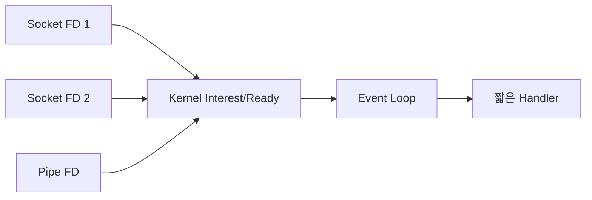

## 1. 준비된 FD를 기다린다

Non-blocking FD는 한 호출이 대기하지 않게 하지만, 준비될 때까지 반복 확인하면 CPU를 낭비한다. Multiplexing API는 여러 FD 중 읽기·쓰기 가능한 대상을 Kernel이 알려주게 한다.



| 방식 | 관심 목록 전달 | 대표 비용 |
|---|---|---|
| select | 매 호출 Bitset | FD 한도·전체 Scan |
| poll | 매 호출 배열 | 전체 Scan |
| epoll | Kernel에 등록 유지 | Trigger 규칙·등록 관리 |
| Thread per conn | Thread가 대기 | Stack·Scheduling |

```c
while ((n = read(fd, buf, sizeof(buf))) > 0) { consume(buf, n); }
if (n < 0 && errno != EAGAIN) { handle_error(); }
```

> **구현 함정** — Edge-triggered에서 일부만 읽고 멈추면 새 Edge가 오지 않아 데이터가 남을 수 있다. EAGAIN까지 Drain한다.

## 2. Event Loop를 보호한다

준비 알림은 작업 완료가 아니다. Handler가 CPU 연산이나 Blocking DNS·파일 I/O를 하면 모든 연결이 지연되므로 별도 Pool과 Backpressure를 둔다.

> **면접 포인트** — API 복잡도 비교뿐 아니라 Trigger 방식, 부분 읽기, Write Buffer와 느린 Consumer까지 설명한다.
