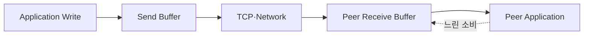

## 1. 소켓 API와 네트워크 완료는 다르다

애플리케이션의 Write는 보통 Kernel 송신 Buffer에 복사되었다는 뜻이다. 상대가 느리면 Buffer가 차고 Non-blocking Write는 부분 쓰기나 다시 시도 신호를 반환한다.



| 계층 | 포화 신호 | 대응 |
|---|---|---|
| Listen Queue | 연결 지연·Drop | Accept 처리·용량 점검 |
| Send Buffer | 부분 쓰기·EAGAIN | Write 관심·Queue 제한 |
| Receive Buffer | Window 축소 | 소비 속도·프로토콜 제한 |
| App Queue | 메모리 증가 | Backpressure·Deadline |

```text
write progress = bytes accepted by local kernel
end-to-end success = application protocol acknowledgement, when required
```

> **구현 함정** — 연결마다 무제한 사용자 공간 Write Queue를 두면 느린 Client가 서버 메모리를 고갈시킨다. 상한과 Timeout, Drop 정책을 둔다.

## 2. 종료도 방향이 있다

FIN은 한 방향의 Byte Stream 종료다. 상대는 남은 방향으로 보낼 수 있으며 RST는 미처 읽지 않은 데이터와 오류 상황을 나타낼 수 있다. 프로토콜 Frame과 종료 규칙을 함께 설계한다.

> **면접 포인트** — TCP 연결 성립, Kernel Buffer, 애플리케이션 Queue의 서로 다른 Backlog를 구분한다.
