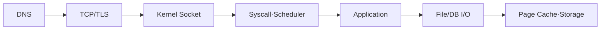

## 1. 계층을 오가며 병목을 찾는다

요청은 이름 해석, 연결·암호화, Kernel Buffer, 시스템 호출, Event Loop·Thread, 애플리케이션과 저장소를 지난다. 각 단계의 Queue와 Timeout을 연결해야 꼬리 지연을 설명할 수 있다.



| 증상 | 구분할 지표 | 가능한 원인 |
|---|---|---|
| 높은 Load·낮은 CPU | Run/D-state·I/O | Block Device·Network FS |
| 높은 Context Switch | Thread 수·Lock | 과도한 경쟁·작은 작업 |
| 첫 읽기만 느림 | Cache Hit·Fault | Page Cache Cold |
| 연결만 느림 | DNS·Handshake | Resolver·Packet Loss |

```text
latency = queueing + cpu service + blocking I/O + network + downstream
measure distributions at boundaries, not only process averages
```

> **면접 전략** — 모든 내부 구현을 암기하기보다 “어디에서 기다릴 수 있는가”를 Queue와 상태로 나열하고 관측 가능한 증거를 붙인다.

## 2. 실험 조건을 통제한다

Warm Cache와 Cold Cache, 동시성, 파일 크기, 연결 재사용 여부를 기록한다. Kernel과 Runtime 최적화가 결과를 바꾸므로 한 번의 Benchmark를 일반화하지 않는다.

> **면접 포인트** — User/Kernel 경계, Blocking과 Waiting, 데이터 복사와 Context Switch 비용을 실제 요청 경로로 연결한다.
