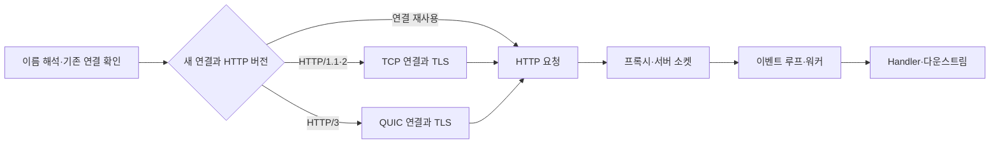

## 1. DNS에서 Handler까지: 프로토콜과 구현 경계를 구분한다

먼저 대상 이름을 주소로 해석한다. 연결이 새로 필요하다면 전송 계층을 수립하고 TLS로 서버 신원을 검증한 뒤 HTTP 요청을 보낸다. 단, HTTPS가 반드시 TCP인 것은 아니다. HTTP/3은 QUIC을 사용하므로 면접에서는 **HTTP 버전과 연결 재사용 여부를 먼저 가정**한다. 프록시·로드밸런서가 있다면 각 홉의 연결과 대기열도 별도로 센다.

서버 측에서는 네트워크 스택이 패킷을 처리하고 소켓에 읽을 데이터를 전달한다. 애플리케이션의 이벤트 루프 또는 워커가 준비된 연결을 읽고, 요청을 파싱·라우팅해 Handler를 실행한다. `read`가 항상 디스크 읽기인 것은 아니다. 소켓 수신, 애플리케이션의 파일 읽기, DB 요청은 서로 다른 경계이며 각각 대기 원인이 다르다. 아래는 **새 TCP 연결을 쓰는 HTTP/1.1·2의 예시 경로**다.

```text
DNS → TCP 연결 → TLS → HTTP 요청 → 프록시/서버 소켓
    → 이벤트 루프 또는 워커 → 라우팅 → Handler → DB/파일/외부 API
```

첫 질문의 답에서는 `DNS`, `connect`, `TLS`, `TTFB`, Handler, 다운스트림 시간을 분리해 측정하겠다고 말한다. 여러 단계를 합친 총 응답 시간만으로는 어느 대기열이 병목인지 알 수 없다.


```mermaid
flowchart LR
    A[이름 해석·기존 연결 확인] --> B{새 연결과 HTTP 버전}
    B -->|HTTP/1.1·2| C[TCP 연결과 TLS]
    B -->|HTTP/3| D[QUIC 연결과 TLS]
    B -->|연결 재사용| E[HTTP 요청]
    C --> E
    D --> E
    E --> F[프록시·서버 소켓]
    F --> G[이벤트 루프·워커]
    G --> H[Handler·다운스트림]
```

## 2. 낮은 CPU와 긴 지연을 함께 해석한다

CPU 평균이 낮아도 한 코어만 포화됐거나, 태스크가 I/O·락·외부 응답을 기다릴 수 있다. 아래 지표는 원인을 **확정하는 값이 아니라 다음 조사를 고르는 증거**다.

| 관찰 | 추가로 확인할 증거 | 다음 판단 |
|---|---|---|
| CPU 낮음·지연 증가 | 코어별 사용률, runnable 태스크, CPU pressure | 실행할 준비가 된 작업이 밀리는가 |
| I/O 지연 증가 | `iowait`, I/O pressure, 디스크/파일시스템 지연, blocked 태스크 | CPU 집계와 요청별 대기를 구분했는가 |
| 락 대기 의심 | 스레드 덤프, 락 대기 시간, 임계 구역 | 특정 락에 요청이 직렬화되는가 |
| 서버 수치 정상 | DNS·연결·TLS·다운스트림 분포 | 측정하지 않은 경계에서 기다리는가 |

Linux PSI는 CPU·메모리·I/O 자원 부족으로 태스크가 지연된 시간을 보여준다. `/proc/stat`의 `iowait`는 CPU 시간 집계값이며 특정 요청이 I/O를 기다린 시간을 직접 나타내지 않는다. 멀티코어와 태스크 이동 때문에 이 값 하나로 병목을 확정하기도 어렵다. `procs_blocked`, I/O PSI, 블록 장치·파일시스템 지연과 요청 추적을 함께 본다. `load average`나 컨텍스트 스위치 수 하나만 보고 원인을 단정하지 않는다. 요청 ID로 구간별 p95/p99를 연결하고, 같은 시간대의 호스트 지표와 스레드 상태를 대조한다. 예를 들어 Handler CPU 시간은 5ms인데 전체 900ms이고 DB 연결 풀 대기가 700ms라면, CPU 최적화보다 풀·DB 병목부터 조사한다. 이 숫자는 진단 설명을 위한 가상 사례다.

## 3. Page Cache를 통제한 파일 읽기 실험

Linux의 일반 파일 읽기는 Page Cache의 영향을 받는다. 첫 읽기가 스토리지에서 데이터를 가져온 뒤 같은 파일의 반복 읽기가 캐시에서 처리되면, 후속 측정은 저장 장치 성능이 아니라 캐시·메모리 복사 비용을 주로 보여줄 수 있다. 반대로 다른 프로세스의 읽기나 메모리 압박이 캐시 상태를 바꾸면 결과가 흔들린다.

파일 크기, 읽기 패턴·블록 크기, 동시성, 파일시스템, 캐시 상태를 기록한다. 워밍업 전후 결과를 분리하고 반복 측정한다. 운영 서버의 전체 캐시를 비우는 방식은 다른 작업에 영향을 주므로 격리된 환경에서만 실험 조건으로 검토한다. `direct I/O`도 정렬 제약과 애플리케이션 동작 차이가 있으므로 일반 읽기와 같은 실험으로 취급하지 않는다.

> **답변 점검** — 세 질문 모두 경로·관측값·반례·다음 실험을 이어서 설명한다. 프로토콜 버전이나 캐시 상태 같은 가정을 먼저 밝히면 구현 세부 차이에도 답이 유지된다.

### 근거 자료

- [RFC 9110 — HTTP Semantics](https://www.rfc-editor.org/rfc/rfc9110.html): HTTPS URI, 요청·응답 의미와 전송 독립성.
- [RFC 9114 — HTTP/3](https://www.rfc-editor.org/rfc/rfc9114.html): QUIC 기반 HTTP/3.
- [Linux Kernel — Pressure Stall Information](https://docs.kernel.org/accounting/psi.html): CPU·메모리·I/O 대기 지표.
- [Linux Kernel — procfs](https://docs.kernel.org/filesystems/proc.html): `/proc/stat`의 `iowait` 해석 주의.
- [Linux Kernel — Block layer statistics](https://docs.kernel.org/block/stat.html): 장치 I/O 계측.
- [Linux Kernel — Page Cache](https://docs.kernel.org/mm/page_cache.html): 파일 읽기와 페이지 캐시의 관계.
