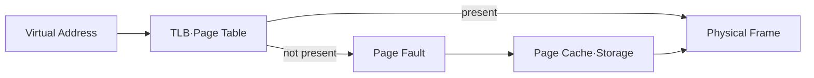

## 1. 주소 변환과 실제 적재는 별개다

프로세스는 가상 주소를 사용하고 MMU가 Page Table과 TLB를 통해 물리 Frame으로 변환한다. 매핑은 있지만 Page가 메모리에 없으면 Fault가 발생해 File 또는 Swap에서 가져오거나 새 Page를 할당한다.



| 개념 | 이점 | 주요 비용 |
|---|---|---|
| TLB | 빠른 주소 변환 | Miss·Shootdown |
| Page Cache | 파일 I/O 재사용 | Dirty Writeback·메모리 압박 |
| mmap | 파일과 주소 공간 통합 | Fault 시점 지연·오류 처리 |
| Copy-on-Write | 복제 지연 | 첫 쓰기 복사 |

```text
minor fault: storage I/O 없이 mapping 해결
major fault: backing storage에서 page를 읽어야 함
```

> **성능 함정** — 프로세스 RSS만 합산하면 공유 Page를 중복 계산할 수 있다. RSS, PSS, Cache와 Dirty Page의 의미를 구분한다.

## 2. 내구성과 메모리 사용을 구분한다

File-backed Page가 메모리에 있다는 사실은 영구 저장 완료를 뜻하지 않는다. 내구성 경계에는 적절한 동기화 호출과 저장 장치 보장이 필요하다.

> **면접 포인트** — Heap, Virtual Address Space, Resident Memory와 Page Cache를 하나의 “메모리 사용량”으로 섞지 않는다.
