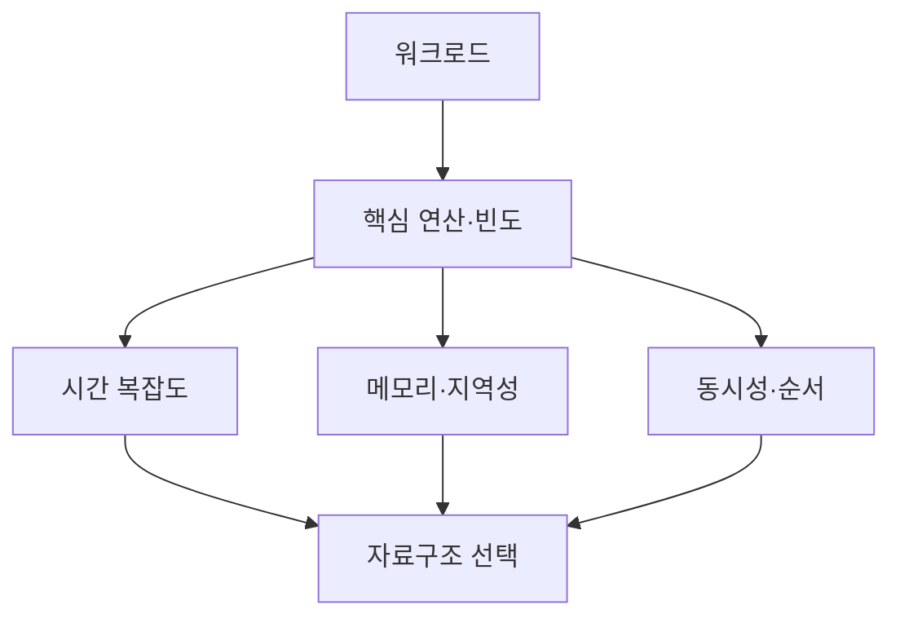

## 1. Big-O 뒤의 조건을 말한다

평균 복잡도는 Hash 품질, Load Factor, 메모리 지역성 같은 가정 위에 있다. 면접에서는 입력 크기, 연산 비율, 순서 필요성, 메모리 한도와 동시 접근을 먼저 확인한다.



| 문제 | 후보 | 압박 질문 |
|---|---|---|
| Key 조회 | Hash·Tree | 순서·최악 복잡도 필요한가 |
| LRU | Hash+Linked List | Lock 범위·Eviction 비용 |
| Top-K | Heap | Stream·동률 처리 |
| Graph 탐색 | List·Matrix | 밀도·업데이트·메모리 |

```text
choose structure by operations × frequency × input distribution × memory budget
then state invariants and failure cases
```

> **면접 전략** — 자료구조 이름을 바로 말하지 않고 요구 연산을 표로 만든 뒤 선택하면 반례 질문에도 근거를 유지할 수 있다.

## 2. 구현 불변식을 제시한다

LRU에서는 Map 항목과 List Node가 항상 일대일이고 Head/Tail 이동이 원자적이어야 한다. 동시성은 전역 Lock, Segmentation, 근사 정책의 복잡도와 정확도를 비교한다.

> **면접 포인트** — 이상적 복잡도뿐 아니라 Resize, Cache Locality, 객체 Overhead와 테스트할 경계값을 포함한다.
