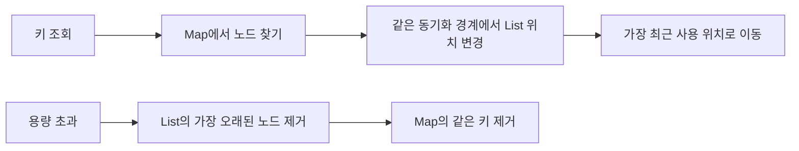

## 1. Hash Table의 O(1)에는 분포와 재배치 비용이 숨어 있다

해시 조회의 평균 상수 시간은 키가 버킷에 고르게 퍼지고 부하율을 적절히 관리한다는 가정 위에 있다. 다른 키가 같은 버킷으로 몰리면 충돌 처리에 추가 비교가 필요하다. 특정 언어·구현의 트리화 같은 방어 장치가 있을 수 있지만 모든 Hash Table에 일반화할 수 없다. 면접에서는 **키 분포, 해시 함수, 동등성 비교 비용, 구현체**를 먼저 묻는다.

항목이 늘면 버킷 배열을 확장하며 기존 항목을 재배치한다. 일반 연산의 분할 상환 비용이 낮아도 확장이 일어나는 단일 삽입은 오래 걸릴 수 있다. 고정된 p99 지연이 중요한 서비스라면 초기 용량, 예상 최대 크기, 메모리 사용량을 함께 검토한다. 순서 조회나 범위 검색이 핵심이면 해시보다 트리·정렬 배열이 적합할 수도 있다.

```text
입력: 키 1만 개의 hashCode가 거의 같은 버킷으로 몰림
관찰: 평균 조회 시간이 기대보다 증가하고 삽입 시 확장 비용이 겹침
판단: 분포와 구현의 충돌 처리 확인 → 키/해시 설계 또는 자료구조 재검토
```

이는 고의로 만든 가상 반례이며, 실제 성능 수치는 언어·구현·키 분포에 따라 달라진다.

## 2. LRU는 조회만으로도 순서를 바꾼다

정확한 LRU를 Map과 이중 연결 리스트로 구현하면 Map은 키에서 노드를 찾고, List는 최근 사용 순서를 관리한다. 조회한 노드를 맨 앞으로 옮기고, 용량 초과 시 맨 뒤 노드를 Map과 List에서 함께 제거한다. 핵심 불변식은 **Map의 모든 키가 List에 정확히 한 번 존재하고 순서가 마지막 사용 시각을 반영한다**는 것이다.

동시 요청에서 `get`도 순서를 수정한다. Map만 동시성 자료구조로 바꾸어도 List 포인터와 제거 작업이 보호되지 않으면 노드 유실, 중복, 이미 제거한 노드의 재삽입이 생긴다. 가장 단순한 설계는 조회·삽입·제거의 Map+List 변경 구간을 하나의 락으로 묶는 것이다. 이때 동시성이 높으면 락 대기가 병목이 된다. 분할 캐시는 경합을 낮추지만 전역적으로 정확한 LRU 순서를 보장하지 않을 수 있다. 정확성 요구가 낮다면 근사 제거 정책도 비교한다.

Java의 `LinkedHashMap`은 access-order와 가장 오래된 항목 제거 훅을 제공하지만 자체적으로 동기화하지 않는다. `ConcurrentHashMap` 하나만으로 전역 LRU 순서를 구현했다고 말해서는 안 된다. 경쟁 테스트에서는 동시에 같은 키를 넣기, 조회와 제거가 겹치기, 용량 경계에서 여러 삽입이 겹치기를 확인한다.


```mermaid
flowchart LR
    A[키 조회] --> B[Map에서 노드 찾기]
    B --> C[같은 동기화 경계에서 List 위치 변경]
    C --> D[가장 최근 사용 위치로 이동]
    E[용량 초과] --> F[List의 가장 오래된 노드 제거]
    F --> G[Map의 같은 키 제거]
```

## 3. 그래프 표현은 밀도와 질의 패턴으로 선택한다

정점 수를 `V`, 간선 수를 `E`라 두면 인접 목록은 대체로 `O(V+E)` 공간을 쓰고 한 정점의 이웃 순회가 `O(degree)`다. 두 정점이 바로 연결됐는지는 이웃 목록 검색 방식에 따라 비용이 달라진다. 인접 행렬은 `O(V²)` 공간을 쓰지만 간선 존재 조회가 `O(1)`이고 한 정점의 모든 이웃을 훑는 데 `O(V)`가 든다. 행렬의 `O(1)`은 인덱스 접근의 계산 복잡도이며 실제 캐시·메모리 비용까지 뜻하지 않는다.

희소 그래프에서 모든 정점 쌍의 슬롯을 할당하면 낭비가 크므로 인접 목록이 유리한 경우가 많다. 밀집 그래프에서 간선 존재를 매우 자주 검사하면 행렬이 단순하다. 가중치, 방향, 중복 간선, 간선 변경 빈도, 정점 ID의 연속성도 선택에 영향을 준다. 예를 들어 `V=100,000`이면 행렬 슬롯은 `10^10`개이므로, 간선이 수십만 개뿐인 그래프에 행렬을 택하기 전에 메모리 예산을 계산해야 한다. 이 숫자는 설계 판단을 위한 가상 입력이다.

| 표현 | 공간 | 간선 존재 확인 | 한 정점의 이웃 순회 |
| --- | --- | --- | --- |
| 인접 목록 | `O(V+E)` | 목록의 탐색 방식에 따라 다름 | `O(degree)` |
| 인접 행렬 | `O(V²)` | `O(1)` 인덱스 접근 | `O(V)` |

> **답변 점검** — 세 문제 모두 평균 복잡도만 암기하지 말고 입력 분포, 불변식, 최악 또는 꼬리 지연, 메모리 한도를 연결해 설명한다.

### 근거 자료

- [Java SE 21 — HashMap](https://docs.oracle.com/en/java/javase/21/docs/api/java.base/java/util/HashMap.html): 초기 용량·부하율·재해시와 충돌.
- [Java SE 21 — LinkedHashMap](https://docs.oracle.com/en/java/javase/21/docs/api/java.base/java/util/LinkedHashMap.html): access-order와 동기화 조건.
- [Java SE 21 — ConcurrentHashMap](https://docs.oracle.com/en/java/javase/21/docs/api/java.base/java/util/concurrent/ConcurrentHashMap.html): 동시 조회·갱신 특성.
- [Boost Graph Library — Graph Data Structures](https://www.boost.org/doc/libs/latest/libs/graph/doc/html/graph/graph_classes/overview.html): 인접 목록·행렬의 공간과 연산 복잡도.
