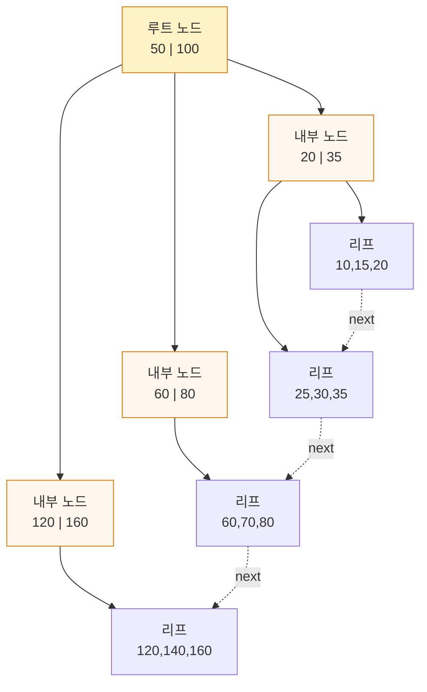
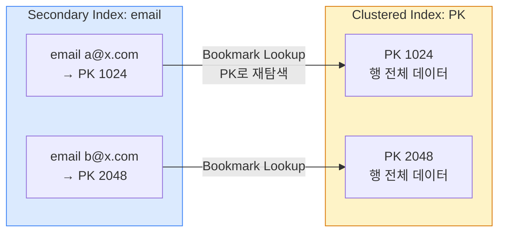
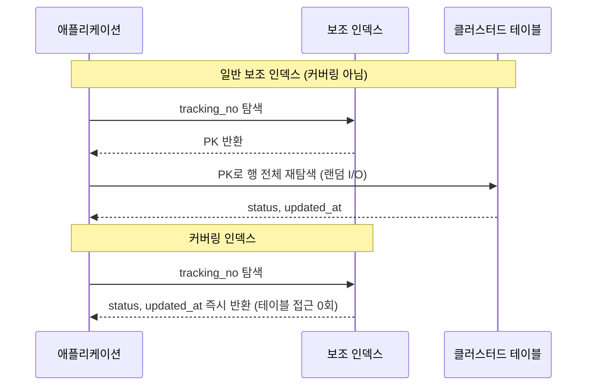

## 1. B+Tree 인덱스 구조와 Clustered vs Secondary

MySQL InnoDB와 PostgreSQL의 기본 인덱스는 **B+Tree(밸런스드 트리)**다. Hash 인덱스와 달리 **범위 검색(Range Scan)과 정렬(ORDER BY)**에 강하다. 핵심은 두 가지다.

- **Internal node(내부 노드)**는 탐색 키만, **Leaf node(리프 노드)**는 실제 데이터(또는 행 포인터)를 보관한다.
- 리프 노드끼리 **이중 연결 리스트(Doubly Linked List)**로 묶여 있어, 한 지점을 찾은 뒤 옆으로 순차 스캔하면 범위 검색이 O(log n + k)로 끝난다.

```
                 [Root]
              [ 50 | 100 ]              내부 노드: 탐색 키만
             /     |      \
       [20|35]  [60|80]  [120|160]      내부 노드
       /  |  \   ...        ...
  [10,15,20][25,30,35] ...              리프 노드: 실제 row(clustered) 또는 PK 포인터
     |          |            |
  (리프끼리 Linked List 연결 → BETWEEN / ORDER BY / 범위 스캔이 빠른 이유)

```

> **정량 감각 — 트리는 생각보다 낮다**
>
> InnoDB 페이지는 16KB. PK가 BIGINT(8B)면 내부 노드 한 페이지의 fan-out(분기 수)이 약 1,000개. 따라서 **약 1,000³ ≈ 10억 행도 트리 높이 3~4 레벨** 이면 도달한다. 인덱스 탐색이 디스크 I/O 3~4번에 끝난다는 의미이며, 상위 레벨은 버퍼풀에 상주하므로 실제 디스크 I/O는 1~2번 수준.



*B+Tree — 리프 노드는 Linked List로 연결되어 Range Scan에 최적*

### Clustered Index vs Secondary Index

InnoDB는 **PK가 곧 Clustered Index(클러스터드 인덱스)**다. 리프 노드에 행 전체가 PK 순으로 정렬 저장된다. 반면 **Secondary Index(보조 인덱스)**의 리프는 인덱스 키 + **PK 값**만 가진다.



*Secondary Index 조회는 PK를 들고 Clustered Index를 한 번 더 탐색(Bookmark Lookup)한다*

> **PK가 크면 모든 보조 인덱스가 비대해진다**
>
> Secondary Index 리프는 PK 값을 포인터로 들고 있다. PK가 `UUID(16B)` 나 긴 문자열이면 **모든 보조 인덱스가 그만큼 커진다** . PK는 짧고 단조 증가하는 값( `BIGINT AUTO_INCREMENT` )이 유리하며, 분산 환경이면 **UUIDv7/ULID** 처럼 시간 정렬성이 있는 ID를 권장한다(랜덤 UUID는 페이지 분할·단편화 유발).

## 2. 복합 인덱스와 선두 컬럼 원칙(Leftmost Prefix)

복합 인덱스 `(a, b, c)`는 사전순으로 정렬된 한 그루의 트리다. **왼쪽 컬럼부터 연속으로** 조건이 주어져야 인덱스를 탄다. 이를 **Leftmost Prefix(선두 컬럼 원칙)**라 한다.

```sql
-- 물류 주문 테이블
CREATE INDEX idx_ws_status_date
  ON orders (warehouse_id, status, created_at);
```

| WHERE / ORDER BY | 인덱스 사용 | 이유 |
| --- | --- | --- |
| `warehouse_id=1` | ✅ 선두 1컬럼 | 선두 컬럼부터 일치 |
| `warehouse_id=1 AND status='PAID'` | ✅ 2컬럼 | 연속 선두 |
| `warehouse_id=1 AND status='PAID' AND created_at>?` | ✅ 풀 활용 | 마지막에 범위 1개 |
| `status='PAID'` 단독 | ❌ 미사용 | 선두(warehouse_id) 누락 |
| `warehouse_id=1 AND created_at>?` | ⚠️ 부분(warehouse_id만) | 중간 status 건너뜀 → 이후 컬럼 활용 불가 |
| `warehouse_id>1 AND status='PAID'` | ⚠️ 부분(warehouse_id만) | 선두가 **범위 조건**이면 그 뒤 컬럼은 정렬 보장이 깨져 활용 불가 |

> **면접 포인트 — 범위 조건은 인덱스의 끝에**
>
> 복합 인덱스에서 **등치(=) 조건은 앞으로, 범위(>, BETWEEN, LIKE 'x%') 조건은 맨 뒤로** 배치한다. 범위 조건을 만나는 순간 그 뒤 컬럼은 정렬이 보장되지 않아 인덱스로 필터링되지 못하고 *range scan 후 필터링* 으로 떨어진다. 정렬(ORDER BY) 컬럼이 범위 컬럼과 다르면 `Using filesort` 가 붙는다.

```sql
EXPLAIN SELECT * FROM orders
WHERE warehouse_id=1 AND status='PAID' AND created_at > '2026-07-01';

+----+--------+-------+--------------------+--------------------+---------+------+------+----------+-----------------------+
| id | table  | type  | possible_keys      | key                | key_len | ref  | rows | filtered | Extra                 |
+----+--------+-------+--------------------+--------------------+---------+------+------+----------+-----------------------+
|  1 | orders | range | idx_ws_status_date | idx_ws_status_date | 13      | NULL |  812 |   100.00 | Using index condition |
+----+--------+-------+--------------------+--------------------+---------+------+------+----------+-----------------------+
```

## 3. 커버링 인덱스(Covering Index)와 Index-Only Scan

**Covering Index(커버링 인덱스)**는 쿼리가 필요로 하는 **모든 컬럼이 인덱스 안에서 해결**되는 경우다. Clustered Index를 다시 찾아가는 Bookmark Lookup(테이블 랜덤 I/O)이 사라진다. MySQL EXPLAIN의 `Extra: Using index`, PostgreSQL의 `Index Only Scan`이 그 신호다.

```sql
-- 운송장 상태 조회: 매우 빈번한 읽기 (수천만 건/일)
SELECT status, updated_at
FROM waybill
WHERE tracking_no = '6012345678';

-- 커버링 인덱스: SELECT 대상 컬럼까지 포함
CREATE INDEX idx_tracking_cover
  ON waybill (tracking_no, status, updated_at);
```



*커버링 인덱스는 테이블(Clustered) 재방문을 제거 → 랜덤 I/O 0회*

```sql
EXPLAIN SELECT status, updated_at FROM waybill WHERE tracking_no='6012345678';

| table   | type | key                | Extra       |
| waybill | ref  | idx_tracking_cover | Using index |   <- Using index = 커버링 성공
```

> **실무 — 운송장 추적 API에 강력**
>
> 쿠팡·CJ대한통운식 운송장 추적 API는 `tracking_no` 로 상태/시각만 반복 조회한다. 이 핫 패스에 커버링 인덱스를 걸면 테이블 랜덤 I/O가 사라져 캐시 미스 시에도 지연이 안정적이다. 단, 인덱스에 컬럼을 욕심내 다 넣으면 인덱스가 커져 쓰기 비용·메모리가 늘어난다 — **핫 쿼리에만 선택적으로** .

## 4. Cardinality(카디널리티)와 Selectivity(선택도)

**Cardinality(카디널리티)**는 컬럼의 고유값 개수, **Selectivity(선택도)**는 `고유값 수 / 전체 행 수`다. 선택도가 높을수록(1에 가까울수록) 인덱스가 걸러내는 효율이 좋다.

| 컬럼 | 예시 카디널리티 | 선택도 | 단독 인덱스 가치 |
| --- | --- | --- | --- |
| `order_id` (PK) | = 전체 행 | 1.0 (최고) | 매우 높음 |
| `tracking_no` | 거의 unique | ≈ 1.0 | 높음 |
| `user_id` | 수백만 | 중간~높음 | 높음 |
| `status` (enum 6종) | 6 | 매우 낮음 | 단독은 거의 무의미 |
| `is_deleted` (boolean) | 2 | 최저 | 무의미 (Partial Index로) |

> **면접 포인트 — "인덱스 있는데 왜 풀스캔?"**
>
> 옵티마이저는 인덱스가 **전체의 대략 20~30% 이상** 을 반환할 것으로 추정하면, 보조 인덱스 탐색 + 랜덤 Bookmark Lookup 비용보다 **순차 풀스캔(Sequential Scan)** 이 싸다고 판단해 인덱스를 버린다. 저선택도 컬럼( `status='PAID'` 가 전체의 60%)에 인덱스를 걸어도 안 타는 이유다. 해법은 **복합 인덱스** ( `status` 를 고선택도 컬럼과 묶기) 또는 **Partial Index** ( `WHERE status='PENDING'` — 소수 상태만 색인).

## 5. EXPLAIN 실행계획 읽기

### MySQL — type 열 (가장 중요)

| type | 의미 | 평가 |
| --- | --- | --- |
| `const / system` | PK/Unique 단일 행 | 최고 |
| `eq_ref` | 조인 시 PK/Unique로 1행씩 | 매우 좋음 |
| `ref` | 비고유 인덱스 등치 매칭 | 좋음 |
| `range` | 인덱스 범위 스캔(BETWEEN, >) | 양호 |
| `index` | 인덱스 풀스캔(리프 전부) | 주의 — 커버링이면 OK |
| `ALL` | 테이블 풀스캔 | 🚨 위험 신호 |

#### 핵심 보조 열

- `key`: 실제 선택된 인덱스. `NULL`이면 인덱스 미사용.
- `rows`: 옵티마이저가 예상한 스캔 행 수(추정치).
- `filtered`: WHERE로 걸러질 비율(%). 낮으면 인덱스로 충분히 못 거른 것.
- `Extra`: `Using index`(커버링·좋음), `Using filesort`·`Using temporary`(정렬/임시테이블·주의), `Using index condition`(ICP·양호).

### PostgreSQL — EXPLAIN (ANALYZE, BUFFERS)

```sql
EXPLAIN (ANALYZE, BUFFERS)
SELECT * FROM orders WHERE warehouse_id = 1 AND status = 'PAID';

                                  QUERY PLAN
-----------------------------------------------------------------------------
 Index Scan using idx_ws_status_date on orders
   (cost=0.43..812.10 rows=820 width=210)
   (actual time=0.05..2.10 rows=812 loops=1)        <- estimated 820 ≈ actual 812 (통계 정상)
   Index Cond: ((warehouse_id = 1) AND (status = 'PAID'))
   Buffers: shared hit=215                           <- 디스크 안 가고 캐시 hit
 Planning Time: 0.18 ms
 Execution Time: 2.40 ms
```

> **estimated vs actual 괴리 = 통계 문제**
>
> PostgreSQL에서 `rows=820 (estimated)` 인데 `actual rows=80000` 처럼 크게 어긋나면 **통계가 오래된 것** 이다. `ANALYZE orders;` (또는 autovacuum) 후 다시 본다. 통계가 틀리면 Nested Loop를 골라야 할 곳에 Hash Join을 고르는 식으로 플랜 전체가 어긋난다. Scan 종류는 `Seq Scan` (풀스캔) → `Index Scan` → `Index Only Scan` (커버링) → `Bitmap Heap Scan` (여러 인덱스 결합) 순으로 읽는다.

## 6. 인덱스가 안 타는 경우 8가지

| 안티패턴 | 예시 | 대안 |
| --- | --- | --- |
| 컬럼에 함수 적용 | `WHERE DATE(created_at)='2026-07-01'` | 범위 전개 또는 함수 기반 인덱스 |
| 묵시적 형변환 | `WHERE tracking_no = 6012345678` (컬럼은 VARCHAR) | 타입 맞추기 (문자열은 따옴표) |
| 앞부분 와일드카드 LIKE | `WHERE name LIKE '%서울%'` | Full-text / 역인덱스(Inverted Index) |
| 부정 조건 | `WHERE status != 'DONE'`, `NOT IN` | 긍정 조건으로 재작성, enum 나열 |
| OR 양쪽 미인덱스 | `WHERE a=? OR b=?` (b 미색인) | UNION 분리 또는 각각 인덱스 |
| 복합 인덱스 선두 누락 | `(a,b)`인데 `WHERE b=?`만 | 선두 포함 또는 `(b,a)` 추가 검토 |
| 저선택도 | `WHERE is_deleted=0` (대부분 0) | Partial Index `WHERE is_deleted=1` |
| 통계 미갱신 | 대량 적재 직후 옵티마이저 오판 | `ANALYZE TABLE` / autovacuum |

> **가장 흔한 실수 — 날짜 함수 감싸기**
>
> `WHERE DATE(created_at) = '2026-07-01'` 는 모든 행에 함수를 적용해야 하므로 인덱스가 무력화된다. 반드시 **범위(Sargable) 조건** 으로: `WHERE created_at >= '2026-07-01 00:00:00' AND created_at < '2026-07-02 00:00:00'`

## 이해도 확인 Q&A

아래 질문에 직접 답변을 작성하세요. 자동 저장되며, 버튼으로 복사해 코치에게 피드백을 요청할 수 있습니다.
