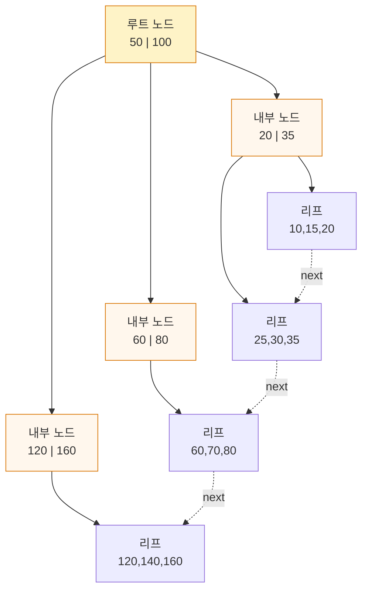
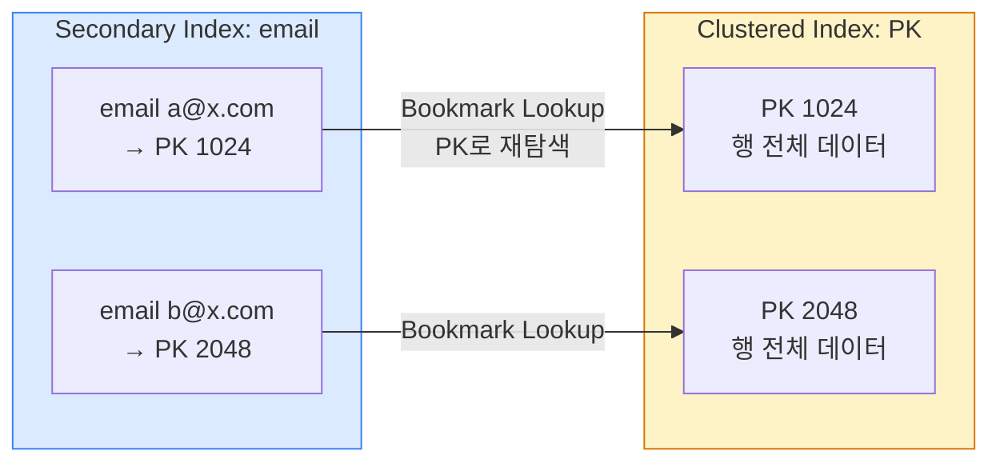
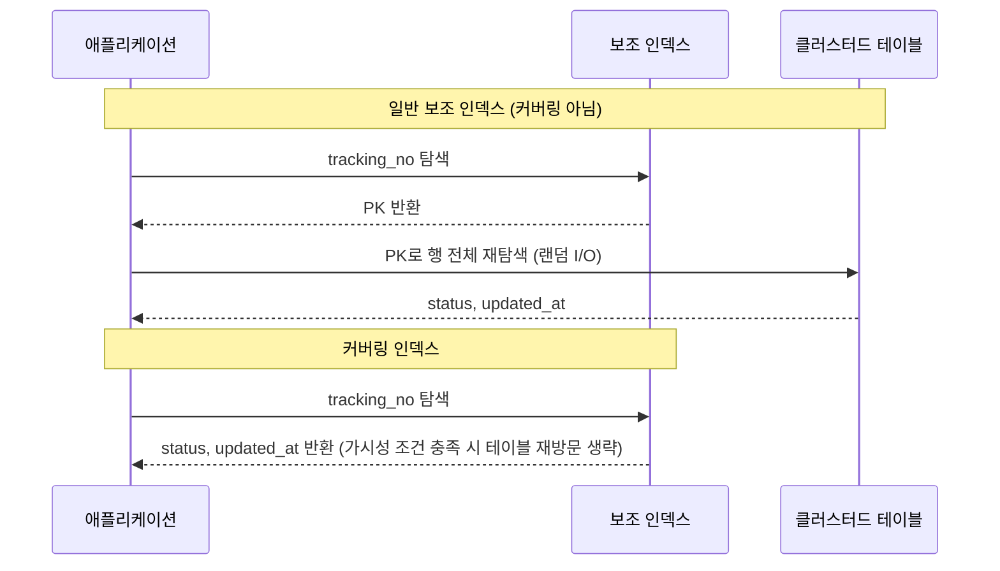

> **검수 기준 — 2026-09-27**
>
> MySQL InnoDB 8.4와 PostgreSQL 17을 기준으로 일반 원리와 예외를 구분한다. 실행계획·성능 수치는 예시이며 데이터 분포와 설정으로 달라진다.
> 참고: [PostgreSQL 복합 인덱스](https://www.postgresql.org/docs/17/indexes-multicolumn.html), [Index-Only Scan](https://www.postgresql.org/docs/17/indexes-index-only-scans.html), [플래너 통계](https://www.postgresql.org/docs/17/planner-stats.html), [MySQL ICP](https://dev.mysql.com/doc/refman/8.4/en/index-condition-pushdown-optimization.html).

## 1. B+Tree 인덱스 구조와 Clustered vs Secondary

MySQL InnoDB의 clustered/secondary index와 PostgreSQL의 기본 B-tree access method는 정렬된 키를 이용한 **범위 검색(Range Scan)과 일부 ORDER BY**에 강하다. 다만 InnoDB는 PK leaf에 행이 함께 놓이는 clustered 구조인 반면 PostgreSQL은 일반적으로 heap table과 B-tree index가 분리되어 있다. Hash·GiST·GIN 등 다른 access method도 있으므로 DBMS와 연산자에 맞춰 선택한다.

- 내부 페이지는 탐색에 필요한 키와 downlink를, leaf 페이지는 키와 행 위치 또는 행 자체를 보관한다. 정확한 페이지 포맷은 엔진별로 다르다.
- B-tree는 sibling page 방향과 정렬 키를 이용해 범위를 스캔하지만, 모든 DBMS의 leaf를 동일한 이중 연결 리스트로 모델링하지 않는다. 이상적인 논리 비용은 `O(log n + k)`로 생각하되 실제 I/O·visibility·cache를 측정한다.

```
                 [Root]
              [ 50 | 100 ]              내부 노드: 탐색 키만
             /     |      \
       [20|35]  [60|80]  [120|160]      내부 노드
       /  |  \   ...        ...
  [10,15,20][25,30,35] ...              리프 노드: 실제 row(clustered) 또는 PK 포인터
     |          |            |
  (리프끼리 Linked List 연결 → BETWEEN / ORDER BY / 범위 스캔이 빠른 이유)

```

> **정량 감각 — 고정된 I/O 공식으로 읽지 않는다**
>
> 페이지 크기·키 폭·포인터 폭·fill factor·압축·행 분포에 따라 fan-out과 높이가 달라진다. 트리 높이가 낮더라도 페이지가 버퍼에 있는지, 보조 인덱스에서 테이블로 재방문하는지, PostgreSQL visibility map을 확인해야 하므로 “항상 3~4번 디스크 I/O” 같은 수치로 성능을 보장하지 않는다.


```mermaid
flowchart TB
    R["루트 노드\n50 | 100"]
    I1["내부 노드\n20 | 35"]
    I2["내부 노드\n60 | 80"]
    I3["내부 노드\n120 | 160"]
    L1["리프\n10,15,20"]
    L2["리프\n25,30,35"]
    L3["리프\n60,70,80"]
    L4["리프\n120,140,160"]
    R --> I1 & I2 & I3
    I1 --> L1 & L2
    I2 --> L3
    I3 --> L4
    L1 -. next .-> L2 -. next .-> L3 -. next .-> L4
    style R fill:#fef3c7,stroke:#d97706
    style I1 fill:#fff7ed,stroke:#d97706
    style I2 fill:#fff7ed,stroke:#d97706
    style I3 fill:#fff7ed,stroke:#d97706
```

*B-tree — 정렬 키와 sibling 탐색으로 범위 스캔을 수행하며 실제 페이지 구조는 엔진별로 다르다.*

### Clustered Index vs Secondary Index

InnoDB는 **PK가 곧 Clustered Index(클러스터드 인덱스)**다. 리프 노드에 행 전체가 PK 순으로 정렬 저장된다. 반면 **Secondary Index(보조 인덱스)**의 리프는 인덱스 키 + **PK 값**만 가진다.


```mermaid
flowchart LR
    subgraph SEC["Secondary Index: email"]
        S1["email a@x.com\n→ PK 1024"]
        S2["email b@x.com\n→ PK 2048"]
    end
    subgraph CLU["Clustered Index: PK"]
        C1["PK 1024\n행 전체 데이터"]
        C2["PK 2048\n행 전체 데이터"]
    end
    S1 -->|"Bookmark Lookup\nPK로 재탐색"| C1
    S2 -->|"Bookmark Lookup"| C2
    style SEC fill:#dbeafe,stroke:#3b82f6
    style CLU fill:#fef3c7,stroke:#d97706
```

*Secondary Index 조회는 PK를 들고 Clustered Index를 한 번 더 탐색(Bookmark Lookup)한다*

> **PK 폭과 키 순서는 엔진별 비용이다**
>
> InnoDB secondary index는 일반적으로 clustered PK를 leaf에 포함하므로 넓은 PK가 보조 인덱스 크기·cache 효율에 영향을 준다. PostgreSQL의 일반 secondary index는 heap TID를 사용하므로 같은 문장을 그대로 적용하면 안 된다. 단조 키는 오른쪽 끝 쓰기 지역성을 얻을 수 있지만 hot page·추측 가능한 ID·분산 생성 요구를 고려해야 하고, UUIDv7·ULID도 자동 정답이 아니다.

## 2. 복합 인덱스와 선두 컬럼 원칙(Leftmost Prefix)

복합 인덱스 `(a, b, c)`는 사전순으로 정렬된다. 선두 컬럼의 등치 조건과 그 다음 범위 조건이 있으면 **탐색 범위를 좁히기 유리**하다. 이를 Leftmost Prefix(선두 컬럼 원칙)로 설명한다. 선두 조건이 없다고 인덱스 사용 자체가 불가능한 것은 아니다. 전체 인덱스 스캔·커버링, DBMS와 버전에 따른 Skip Scan 가능성을 구분하고 실제 계획을 확인한다.

```sql
-- 물류 주문 테이블
CREATE INDEX idx_ws_status_date
  ON orders (warehouse_id, status, created_at);
```

| WHERE / ORDER BY | 인덱스 사용 | 이유 |
| --- | --- | --- |
| `warehouse_id=1` | ✅ 선두 1컬럼 | 선두 컬럼부터 일치 |
| `warehouse_id=1 AND status='PAID'` | ✅ 2컬럼 | 연속 선두 |
| `warehouse_id=1 AND status='PAID' AND created_at>?` | ✅ 풀 활용 | 마지막에 범위 1개 |
| `status='PAID'` 단독 | ⚠️ 좁은 범위 탐색에 불리 | 선두 누락. 전체 인덱스 스캔·커버링·버전별 Skip Scan 여부 확인 |
| `warehouse_id=1 AND created_at>?` | ⚠️ 주 탐색 범위는 warehouse_id | created_at은 인덱스 내 필터 등에 쓰일 수 있음 |
| `warehouse_id>1 AND status='PAID'` | ⚠️ 주 탐색 범위는 warehouse_id | 뒤 컬럼 조건은 필터링 등에 활용 가능. 범위 축소와 구분 |

> **면접 포인트 — 범위 조건은 인덱스의 끝에**
>
> 단일 탐색 범위를 줄이는 출발점으로 **등치 조건을 앞에, 범위 조건을 뒤에** 둔다. 뒤 컬럼이 탐색 구간을 줄이지 못해도 MySQL Index Condition Pushdown(인덱스 조건 푸시다운) 등 필터링에는 활용될 수 있다. ORDER BY 충족 여부는 등치로 고정된 선두 키, 정렬 방향과 전체 키 순서를 보고 판단한다.

```sql
-- 아래 EXPLAIN 행은 교육용 예시다. key_len·rows·filtered는 실제 DDL의
-- 자료형/문자셋, 인덱스 정의, 통계, 데이터 분포에 따라 달라진다.
EXPLAIN SELECT * FROM orders
WHERE warehouse_id=1 AND status='PAID' AND created_at > '2026-07-01';

+----+--------+-------+--------------------+--------------------+---------+------+------+----------+-----------------------+
| id | table  | type  | possible_keys      | key                | key_len | ref  | rows | filtered | Extra                 |
+----+--------+-------+--------------------+--------------------+---------+------+------+----------+-----------------------+
|  1 | orders | range | idx_ws_status_date | idx_ws_status_date | 13      | NULL |  812 |   100.00 | Using index condition |
+----+--------+-------+--------------------+--------------------+---------+------+------+----------+-----------------------+
```

## 3. 커버링 인덱스(Covering Index)와 Index-Only Scan

**Covering Index(커버링 인덱스)**는 질의에 필요한 컬럼을 인덱스가 모두 포함하는 경우다. 행 데이터를 얻기 위한 테이블 재방문을 줄일 수 있다. MySQL의 `Extra: Using index`, PostgreSQL의 `Index Only Scan`을 확인한다. 다만 PostgreSQL에서는 Visibility Map(가시성 맵)의 all-visible 비트가 없으면 MVCC 가시성 확인을 위해 heap에 접근하므로 `Heap Fetches`도 확인해야 한다. 커버링 구조와 실제 I/O 0회는 같은 뜻이 아니다.

```sql
-- 운송장 상태 조회: 매우 빈번한 읽기 (수천만 건/일)
SELECT status, updated_at
FROM waybill
WHERE tracking_no = '6012345678';

-- 커버링 인덱스: SELECT 대상 컬럼까지 포함
CREATE INDEX idx_tracking_cover
  ON waybill (tracking_no, status, updated_at);
```


```mermaid
sequenceDiagram
    participant App as 애플리케이션
    participant Sec as 보조 인덱스
    participant Clu as 클러스터드 테이블
    Note over App,Clu: 일반 보조 인덱스 (커버링 아님)
    App->>Sec: tracking_no 탐색
    Sec-->>App: PK 반환
    App->>Clu: PK로 행 전체 재탐색 (랜덤 I/O)
    Clu-->>App: status, updated_at
    Note over App,Sec: 커버링 인덱스
    App->>Sec: tracking_no 탐색
    Sec-->>App: status, updated_at 반환 (가시성 조건 충족 시 테이블 재방문 생략)
```

*필요한 컬럼을 인덱스에서 얻는 경로. 실제 테이블 접근은 DBMS와 가시성 조건을 확인한다.*

```sql
EXPLAIN SELECT status, updated_at FROM waybill WHERE tracking_no='6012345678';

| table   | type | key                | Extra       |
| waybill | ref  | idx_tracking_cover | Using index |   <- Using index = 커버링 성공
```

> **실무 — 운송장 추적 API에 강력**
>
> 가상의 운송장 추적 API가 `tracking_no`로 상태·시각만 반복 조회한다고 가정하자. 필요한 컬럼을 인덱스에 포함하면 테이블 재방문을 줄일 수 있다. 자주 갱신되는 컬럼을 추가하면 쓰기 비용·메모리가 늘고 PostgreSQL 가시성 맵에도 영향을 준다. 실제 기업의 구현 사실이 아닌 설계 예제이며, **실행계획과 실측 I/O로 판단**한다.

## 4. Cardinality(카디널리티)와 Selectivity(선택도)

컬럼의 Distinct Cardinality(고유값 수)와 **조건 선택도**를 구분한다. 이 카드에서 조건 선택도는 `조건을 만족하는 행 수 / 전체 행 수`이며 작을수록 적은 행을 선택한다. `고유값 수 / 전체 행 수`는 고유도 지표일 뿐, 특정 값의 빈도나 질의 선택도를 직접 나타내지 않는다. 값의 편향이 크면 고유값이 적은 컬럼도 희소 값을 찾는 인덱스로 유용할 수 있다.

| 컬럼 | 예시 고유값 수 | 조건 예시 | 인덱스 판단 |
| --- | --- | --- | --- |
| `order_id` (PK) | = 전체 행 | 등치 조건은 최대 1행 | 단건 탐색에 유리 |
| `tracking_no` | 거의 unique | 등치 조건은 보통 소수 행 | 단건 탐색에 유리 |
| `user_id` | 수백만 | 사용자별 주문 수에 따라 다름 | 빈도 분포 확인 |
| `status` (enum 6종) | 6 | PENDING이 0.1%일 수도 있음 | 희소 상태 조회에 유용할 수 있음 |
| `is_deleted` (boolean) | 2 | true/false 비중에 따라 다름 | 희소 값·부분 인덱스 검토 |

> **면접 포인트 — "인덱스 있는데 왜 풀스캔?"**
>
> 인덱스 탐색과 테이블 재방문의 예상 비용이 순차 스캔보다 크면 풀스캔을 선택할 수 있다. **20~30% 같은 고정 임계값은 없다.** 테이블 크기·행 폭·캐시·상관도·커버링·비용 설정에 따라 달라진다. 복합 인덱스나 PostgreSQL Partial Index(부분 인덱스)를 검토하되 통계와 실제 실행 결과로 확인한다.

## 5. EXPLAIN 실행계획 읽기

### MySQL — type 열 (가장 중요)

| type | 의미 | 평가 |
| --- | --- | --- |
| `const / system` | PK/Unique 단일 행 | 최고 |
| `eq_ref` | 조인 시 PK/Unique로 1행씩 | 매우 좋음 |
| `ref` | 비고유 인덱스 등치 매칭 | 좋음 |
| `range` | 인덱스 범위 스캔(BETWEEN, >) | 양호 |
| `index` | 인덱스 풀스캔(리프 전부) | 주의 — 커버링이면 OK |
| `ALL` | 테이블 풀스캔 | 큰 테이블의 선택적 조회라면 조사. 작은 테이블·넓은 조회에는 합리적일 수 있음 |

#### 핵심 보조 열

- `key`: 실제 선택된 인덱스. `NULL`이면 인덱스 미사용.
- `rows`: 옵티마이저가 예상한 스캔 행 수(추정치).
- `filtered`: WHERE로 걸러질 비율(%). 낮으면 인덱스로 충분히 못 거른 것.
- `Extra`: `Using index`(커버링·좋음), `Using filesort`·`Using temporary`(정렬/임시테이블·주의), `Using index condition`(ICP·양호).

### PostgreSQL — EXPLAIN (ANALYZE, BUFFERS)

```sql
EXPLAIN (ANALYZE, BUFFERS)
SELECT * FROM orders WHERE warehouse_id = 1 AND status = 'PAID';

                                  QUERY PLAN
-----------------------------------------------------------------------------
 Index Scan using idx_ws_status_date on orders
   (cost=0.43..812.10 rows=820 width=210)
   (actual time=0.05..2.10 rows=812 loops=1)        <- estimated 820 ≈ actual 812 (통계 정상)
   Index Cond: ((warehouse_id = 1) AND (status = 'PAID'))
   Buffers: shared hit=215                           <- 디스크 안 가고 캐시 hit
 Planning Time: 0.18 ms
 Execution Time: 2.40 ms
```

> **estimated vs actual 괴리 = 통계 문제**
>
> PostgreSQL에서 estimated rows와 actual rows가 크게 어긋나면 통계 최신성뿐 아니라 **데이터 편향·컬럼 상관관계·추정 모델의 한계**를 조사한다. `ANALYZE` 후에도 차이가 크면 통계 정밀도와 확장 통계를 검토한다. 스캔 종류에는 보편적인 성능 순위가 없고, `Bitmap Heap Scan`은 하나의 인덱스 비트맵으로도 실행된다. 노드별 실제 행 수·loops·버퍼 접근·실행 시간을 함께 읽는다.

## 6. 인덱스가 안 타는 경우 8가지

| 안티패턴 | 예시 | 대안 |
| --- | --- | --- |
| 컬럼에 함수 적용 | `WHERE DATE(created_at)='2026-07-01'` | 범위 전개 또는 함수 기반 인덱스 |
| 묵시적 형변환 | `WHERE tracking_no = 6012345678` (컬럼은 VARCHAR) | 타입 맞추기 (문자열은 따옴표) |
| 앞부분 와일드카드 LIKE | `WHERE name LIKE '%서울%'` | Full-text / 역인덱스(Inverted Index) |
| 부정 조건 | `WHERE status != 'DONE'`, `NOT IN` | 긍정 조건으로 재작성, enum 나열 |
| OR 양쪽 미인덱스 | `WHERE a=? OR b=?` (b 미색인) | UNION 분리 또는 각각 인덱스 |
| 복합 인덱스 선두 누락 | `(a,b)`인데 `WHERE b=?`만 | 선두 포함 또는 `(b,a)` 추가 검토 |
| 저선택도 | `WHERE is_deleted=0` (대부분 0) | Partial Index `WHERE is_deleted=1` |
| 통계 미갱신 | 대량 적재 직후 옵티마이저 오판 | `ANALYZE TABLE` / autovacuum |

> **가장 흔한 실수 — 날짜 함수 감싸기**
>
> `WHERE DATE(created_at) = '2026-07-01'` 는 모든 행에 함수를 적용해야 하므로 인덱스가 무력화된다. 반드시 **범위(Sargable) 조건** 으로: `WHERE created_at >= '2026-07-01 00:00:00' AND created_at < '2026-07-02 00:00:00'`

## 7. 실패 입력 → 판단 → 복구

`orders(warehouse_id, status, created_at)` 인덱스가 있는데 `WHERE status='PAID' AND created_at > :cutoff`가 `ALL` 또는 넓은 스캔으로 실행된다고 하자. 먼저 이 인덱스의 선두 `warehouse_id` 조건이 없다는 사실, 반환 행 수와 실제 분포, 커버링 여부를 확인한다. PostgreSQL은 `EXPLAIN (ANALYZE, BUFFERS)`의 estimated/actual rows와 heap fetch를, MySQL은 `EXPLAIN ANALYZE`의 actual rows·key·Extra를 확인한다.

추정치가 틀렸으면 통계를 갱신하고 데이터 편향·컬럼 상관관계를 점검한다. 계획 자체는 맞지만 후보 행이 많으면 `(status, created_at)`가 실제 업무 질의에 맞는지 비교하되, 쓰기·저장 비용과 다른 질의 회귀를 함께 측정한다. 조회가 짧아져도 인덱스 강제 힌트를 바로 남기지 않고 배포 분포에서 재현한 뒤 필요할 때만 범위를 좁힌다.

참고: [MySQL EXPLAIN](https://dev.mysql.com/doc/refman/8.4/en/explain.html), [PostgreSQL Using EXPLAIN](https://www.postgresql.org/docs/17/using-explain.html)

## 이해도 확인 Q&A

아래 질문에 직접 답변을 작성하세요. 자동 저장되며, 버튼으로 복사해 코치에게 피드백을 요청할 수 있습니다.
