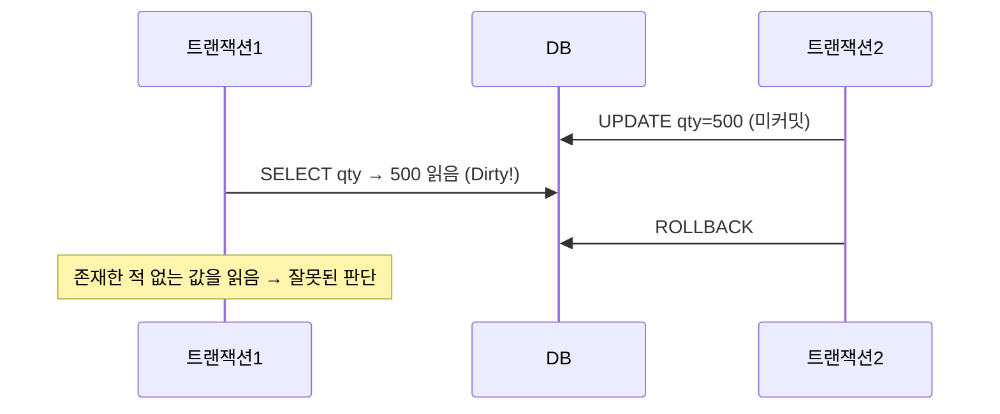
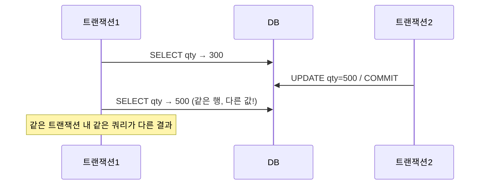
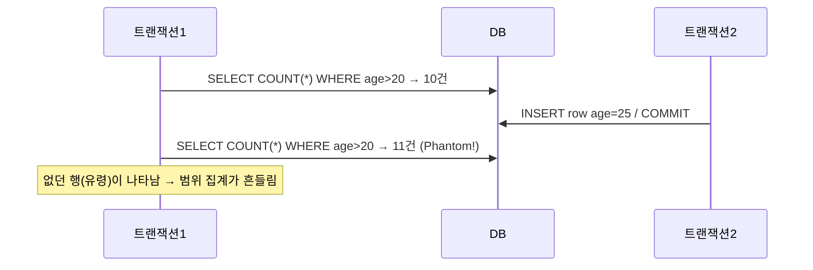
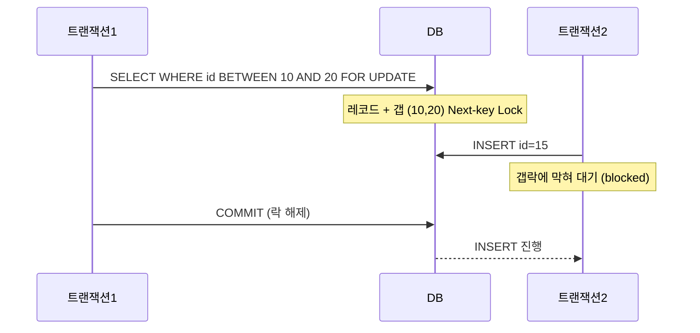
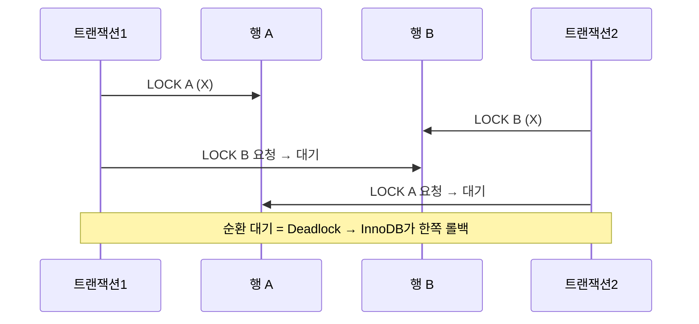

## 1. 동시성 이상현상 3종

격리수준은 결국 "어떤 이상현상을 허용/방지하는가"로 정의된다. 세 가지를 타임라인으로 본다.

### Dirty Read(더티 리드) — 커밋 안 된 값을 읽음



*Dirty Read — 다른 트랜잭션의 미커밋 변경을 읽어버림*

### Non-repeatable Read(반복 불가 읽기) — 같은 행이 두 번 읽을 때 달라짐



*Non-repeatable Read — 한 트랜잭션 안에서 동일 행의 값이 바뀜*

### Phantom Read(팬텀 리드) — 행의 집합이 달라짐



*Phantom Read — 범위 쿼리의 결과 집합에 유령 행이 추가/삭제됨*

## 2. 격리수준(Isolation Level) 4종 — DBMS별 차이가 핵심

| 격리수준 | Dirty | Non-repeatable | Phantom | 기본값 |
| --- | --- | --- | --- | --- |
| READ UNCOMMITTED | 발생 | 발생 | 발생 | — |
| READ COMMITTED | 방지 | 발생 | 발생 | ✅ PostgreSQL 기본 |
| **REPEATABLE READ** | 방지 | 방지 | 표준=발생 / InnoDB=방지 | ✅ MySQL InnoDB 기본 |
| SERIALIZABLE | 방지 | 방지 | 방지 | — |

> **면접 포인트 — "RR에서 팬텀은 막히나요?" 는 함정 질문**
>
> **표준 SQL**: REPEATABLE READ는 팬텀을 **허용**한다. **MySQL InnoDB**: RR 기본인데, **Next-key Lock(넥스트키 락)**으로 범위에 갭락을 걸어 팬텀까지 실질적으로 방지한다. 단 순수 스냅샷 읽기(일반 SELECT)는 MVCC로, 잠금 읽기(`FOR UPDATE`)는 넥스트키락으로 방지한다는 점을 구분해야 한다. **PostgreSQL**: 기본은 READ COMMITTED. RR은 스냅샷 격리로 팬텀 방지. SERIALIZABLE은 **SSI(Serializable Snapshot Isolation)**로 직렬성 위반을 감지해 트랜잭션을 abort시킨다(락 대신 충돌 감지).

```sql
-- 세션 격리수준 확인/설정
SELECT @@transaction_isolation;                 -- MySQL
SHOW transaction_isolation;                       -- PostgreSQL
SET SESSION TRANSACTION ISOLATION LEVEL REPEATABLE READ;
```

> **MVCC가 읽기 일관성의 뿌리**
>
> InnoDB·PostgreSQL 모두 일반 SELECT는 락 없이 **MVCC(Multi-Version Concurrency Control, 다중버전 동시성제어)** 스냅샷을 읽는다. 그래서 "읽기는 쓰기를 막지 않고, 쓰기는 읽기를 막지 않는다." 락은 주로 *쓰기 vs 쓰기* , 그리고 *잠금 읽기(FOR UPDATE)* 에서 동작한다. (자세한 내부 구조는 03-mvcc-internals 참고)

## 3. 공유락(S) / 배타락(X)과 호환성

잠금은 크게 **Shared Lock(S, 공유락)**과 **Exclusive Lock(X, 배타락)**으로 나뉜다. S는 여러 트랜잭션이 함께 읽을 수 있게 하고, X는 쓰기를 위해 독점한다.

#### 락 호환성 매트릭스

| 요청 \ 보유 | S (공유) | X (배타) |
| --- | --- | --- |
| **S (공유)** | ✅ 호환 | ❌ 대기 |
| **X (배타)** | ❌ 대기 | ❌ 대기 |

```sql
-- 공유락: 읽되 남이 바꾸지 못하게
SELECT * FROM stock WHERE sku='A' FOR SHARE;          -- (MySQL: LOCK IN SHARE MODE)

-- 배타락: 읽고 곧 내가 변경
BEGIN;
SELECT qty FROM stock WHERE sku='A' FOR UPDATE;        -- X 락 획득
UPDATE stock SET qty = qty - 1 WHERE sku='A';
COMMIT;                                                 -- 락 해제
```

| 락 | 설명 | 비고 |
| --- | --- | --- |
| **Record Lock** | 인덱스 레코드 단위 락 | WHERE가 인덱스를 타야 좁게 잠김 |
| **Intention Lock (IS/IX)** | 테이블 레벨 의도 락 | 자동 설정, 테이블락 충돌 빠른 감지용 |
| **Metadata Lock** | DDL이 잡는 테이블 구조 락 | 마이그레이션 중 블로킹 원인 |

> **인덱스 없는 FOR UPDATE는 테이블을 통째로 잠근다**
>
> `SELECT ... WHERE col=? FOR UPDATE` 에서 `col` 에 인덱스가 없으면 InnoDB는 풀스캔하며 스캔한 모든 레코드에 락을 건다 → 사실상 테이블 락. 락 읽기는 **반드시 인덱스 조건** 으로 좁혀야 한다.

## 4. Gap Lock / Next-key Lock — 팬텀을 막는 메커니즘

- **Record Lock**: 존재하는 인덱스 레코드 자체를 잠금.
- **Gap Lock(갭락)**: 인덱스 레코드 *사이의 빈 공간*을 잠금. 그 범위에 새 행 INSERT를 막아 팬텀 방지.
- **Next-key Lock(넥스트키락)**: Record Lock + Gap Lock 조합. InnoDB RR의 기본 잠금 단위.

```sql
-- id에 (10), (20), (30) 레코드가 있다고 가정
BEGIN;
SELECT * FROM orders WHERE id BETWEEN 10 AND 20 FOR UPDATE;
-- 잠기는 범위: 레코드 10, 20 + 그 사이 갭 (10,20) + 다음 갭 일부
-- → 이 동안 id=15 INSERT 는 갭락에 걸려 대기 (팬텀 방지)
```



*Next-key Lock — 갭에 INSERT를 막아 RR에서 팬텀을 차단*

> **락 현황 진단**
>
> 교착·대기를 분석할 때 `SHOW ENGINE INNODB STATUS` 의 *LATEST DETECTED DEADLOCK* 섹션, `performance_schema.data_locks` / `data_lock_waits` 를 본다. PostgreSQL은 `pg_locks` + `pg_stat_activity` .

> **갭락은 데드락의 단골 원인**
>
> 갭락은 "존재하지 않는 행"을 잠그기 때문에 직관과 다르게 동작한다. 서로 다른 두 트랜잭션이 인접 갭을 교차로 잠그면 교착이 난다. READ COMMITTED는 갭락을 거의 쓰지 않아 락 경합이 줄지만, 대신 팬텀을 허용한다 — 정합성 vs 동시성 트레이드오프.

## 5. Deadlock(데드락) — 순환 대기

두 트랜잭션이 서로가 가진 락을 기다리면 영원히 진행되지 못한다. InnoDB는 **데드락을 자동 감지**해 비용이 작은 쪽을 victim으로 롤백한다(`ERROR 1213`). 감지에 의존하기보다 **예방**이 우선이다.



*데드락 — 락 획득 순서가 엇갈리면 순환 대기 발생*

### 예방 전략

- **잠금 순서 일관성**: 여러 행을 잠글 땐 항상 같은 순서(예: SKU id 오름차순)로 접근. 가장 효과적.
- **짧은 트랜잭션**: 락 보유 시간을 최소화. 외부 API 호출을 트랜잭션 안에 넣지 않기.
- **인덱스로 락 범위 축소**: 풀스캔으로 불필요한 행까지 잠그지 않기.
- **재시도 로직**: 데드락(1213)은 정상적 신호 — 백오프 후 재시도.

> **면접 포인트 — 재고 차감 동시성**
>
> "여러 주문이 같은 SKU 재고를 동시에 차감할 때 어떻게?" → 격리수준·락을 묶어 답한다: ① 단순하면 **원자적 조건부 UPDATE** ( `UPDATE stock SET qty=qty-1 WHERE sku=? AND qty>=1` )가 락을 명시적으로 다루지 않아 깔끔. ② `FOR UPDATE` 비관적 락은 직관적이나 경합 시 throughput 저하. ③ 멀티 SKU 주문은 **SKU id 정렬 순서로 락** 을 잡아 데드락 예방. (자세히는 07-inventory-concurrency)

```sql
-- 데드락 예방: 항상 작은 sku_id 부터 잠근다
SELECT * FROM stock
WHERE sku_id IN (?, ?)
ORDER BY sku_id            -- 모든 트랜잭션이 동일 순서로 잠금
FOR UPDATE;
```

## 이해도 확인 Q&A

아래 질문에 직접 답변을 작성하세요. 자동 저장되며, 버튼으로 복사해 코치에게 피드백을 요청할 수 있습니다.
