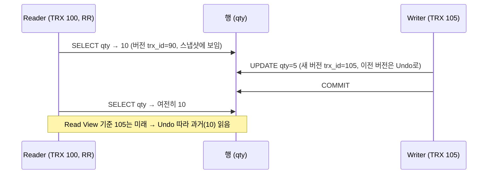
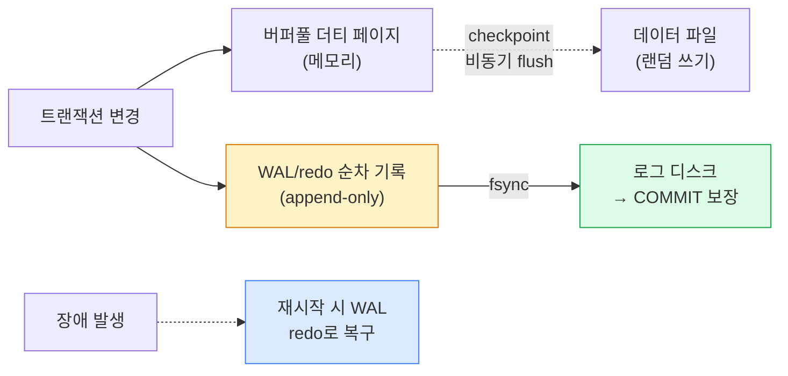

## 1. MVCC 개념과 가시성 판단

**MVCC(Multi-Version Concurrency Control, 다중 버전 동시성 제어)**는 하나의 행에 대해 여러 버전을 유지해, **읽기는 락 없이 자신의 스냅샷 버전**을 읽게 한다. 그래서 "읽기는 쓰기를 막지 않고, 쓰기는 읽기를 막지 않는다."

InnoDB는 각 행에 숨은 시스템 컬럼을 둔다.

- `DB_TRX_ID`: 이 버전을 마지막으로 쓴 트랜잭션 ID.
- `DB_ROLL_PTR`: Undo log에 있는 **이전 버전**으로의 롤백 포인터.

트랜잭션은 시작 시 **Read View(읽기 뷰)**를 만들고, 각 행 버전의 `DB_TRX_ID`가 "내 스냅샷 기준 보이는가"를 판정한다. 안 보이면 `DB_ROLL_PTR`을 따라 과거 버전으로 거슬러 올라간다.



*MVCC — Reader는 자신의 스냅샷 버전을 읽고, 최신 버전이 안 보이면 Undo로 과거를 재구성*

> **REPEATABLE READ vs READ COMMITTED 차이도 Read View로**
>
> InnoDB에서 **RR은 트랜잭션 첫 읽기 시점 Read View를 끝까지 유지** (반복 읽기 일관성), **READ COMMITTED는 매 SELECT마다 새 Read View** 를 만든다(그래서 Non-repeatable read 발생). 같은 MVCC 엔진이 Read View 생성 시점만 바꿔 격리수준을 구현한다.

## 2. InnoDB Undo Log와 Purge

InnoDB는 이전 버전을 **Undo Log(언두 로그)**에 별도로 보관한다. 같은 행을 여러 번 바꾸면 버전들이 `DB_ROLL_PTR`로 연결된 **version chain(버전 체인)**을 이룬다. Undo는 두 가지 역할을 한다.

- **롤백**: 트랜잭션 ABORT 시 Undo로 원상복구.
- **MVCC 읽기**: 오래된 스냅샷이 필요로 하는 과거 버전 제공.

더 이상 어떤 활성 스냅샷도 참조하지 않는 과거 버전은 백그라운드 **Purge thread(퍼지 스레드)**가 정리한다.

```yaml
version chain (행 하나)
  최신: qty=5  (trx 105) --roll_ptr--> qty=10 (trx 90) --roll_ptr--> qty=12 (trx 70)
  ↑ 활성 스냅샷이 trx 90을 봐야 하면 그 버전까지는 purge 불가
```

> **롱 트랜잭션이 Undo를 비대화시킨다**
>
> 오래 열려 있는 트랜잭션(예: 분석 쿼리, 커밋 안 한 세션)이 옛 스냅샷을 붙잡고 있으면 purge가 그 이전 버전을 못 지운다 → **History list length** 가 폭증하고 Undo 테이블스페이스가 부풀며 읽기 시 version chain이 길어져 느려진다. `SHOW ENGINE INNODB STATUS` 의 History list length, `information_schema.innodb_trx` 로 롱 트랜잭션을 감시한다. 물류 배치(주문 이력 집계)를 거대한 단일 트랜잭션으로 돌리면 이 문제가 잘 터진다 — 청크로 쪼개 커밋.

## 3. WAL(Write-Ahead Log)과 Redo

**WAL(Write-Ahead Log, 선행기록로그)**의 원칙: *데이터 페이지를 디스크에 쓰기 전에, 변경 사실을 먼저 로그에 순차 기록*한다. 커밋은 데이터 파일이 아니라 **로그가 디스크에 안전히 내려간 시점(fsync)**에 보장된다. 이것이 **Durability(영속성)**와 **crash recovery(장애 복구)**의 핵심이다.

- InnoDB: **redo log**(ib_logfile / redo log file). 변경은 redo에 먼저, 더티 페이지는 나중에 비동기 flush.
- PostgreSQL: **WAL segment**(pg_wal). 동일 원리. 스트리밍 복제도 이 WAL을 전송.



*WAL — 랜덤 쓰기(데이터 파일)를 순차 쓰기(로그)로 바꿔 성능과 내구성을 동시에 확보*

> **왜 빠른가 — 랜덤을 순차로**
>
> 데이터 페이지를 매번 디스크에 랜덤 쓰기하면 느리다. WAL은 **append-only 순차 쓰기** 라 빠르고, 데이터 페이지는 모아서 **checkpoint** 때 flush한다. 커밋 폭주 시 **group commit** 으로 여러 트랜잭션의 fsync를 묶어 처리한다. 트레이드오프: `innodb_flush_log_at_trx_commit=1` (매 커밋 fsync, 안전·느림) vs `2` (OS 캐시까지, 빠름·장애 시 일부 손실 위험). 결제·재고처럼 정합성이 중요한 곳은 1을 유지.

## 4. InnoDB vs PostgreSQL MVCC 구현 비교

둘 다 MVCC지만 **옛 버전을 어디에 두느냐**가 결정적으로 다르다. InnoDB는 별도 Undo, PostgreSQL은 테이블 안에 죽은 튜플(dead tuple)을 그대로 둔다.

| 관점 | MySQL InnoDB | PostgreSQL |
| --- | --- | --- |
| 옛 버전 저장 위치 | Undo log (별도 영역) | 같은 테이블에 dead tuple로 in-place 누적 |
| UPDATE 동작 | 현재 버전 갱신 + 옛 버전 Undo로 | 새 튜플 INSERT + 옛 튜플 dead 표시 |
| 정리 방식 | Purge thread (자동) | VACUUM / autovacuum 필요 |
| 인덱스 | 보조 인덱스는 PK 포인터 1세트 | 모든 튜플 버전이 heap에 → 인덱스가 버전마다 가리킴, HOT update로 완화 |
| 대표 운영 이슈 | 롱 트랜잭션 → Undo·History list 폭증 | VACUUM 지연 → table/index **bloat** |
| 고유 위험 | — | Transaction ID **wraparound** (32bit XID 소진) → autovacuum freeze 필수 |
| 읽기 비용 | version chain 길면 재구성 비용 | dead tuple 많으면 스캔 행 수 증가 |

> **면접 포인트 — "PostgreSQL은 왜 VACUUM이 필요하죠?"**
>
> PostgreSQL은 UPDATE를 **새 튜플 추가 + 옛 튜플 죽음 표시** 로 처리한다(append-style). 죽은 튜플은 즉시 지워지지 않으므로 **VACUUM이 회수** 하지 않으면 테이블·인덱스가 부풀어(bloat) 스캔이 느려진다. 또 32비트 트랜잭션 ID가 한 바퀴 도는 **wraparound** 를 막기 위해 주기적 freeze가 필요하다. 반면 InnoDB는 Undo를 별도로 두고 purge가 정리하므로 VACUUM 개념이 없지만, **롱 트랜잭션이 purge를 막는** 동일 계열의 문제가 있다. "둘 다 옛 버전을 누가·언제 청소하느냐의 문제"로 묶어 답하면 깊이가 산다.

> **운영 함정 — autovacuum 튜닝**
>
> 쓰기/업데이트가 많은 PostgreSQL 테이블(예: 운송장 상태 갱신)은 기본 autovacuum이 못 따라가 bloat가 쌓인다. `autovacuum_vacuum_scale_factor` 를 테이블별로 낮추고, 대량 갱신 테이블은 `fillfactor` 를 낮춰 HOT update 비율을 올린다.

## 이해도 확인 Q&A

아래 질문에 직접 답변을 작성하세요. 자동 저장되며, 버튼으로 복사해 코치에게 피드백을 요청할 수 있습니다.
