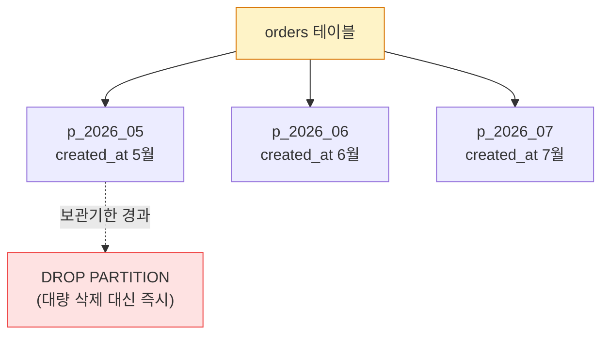
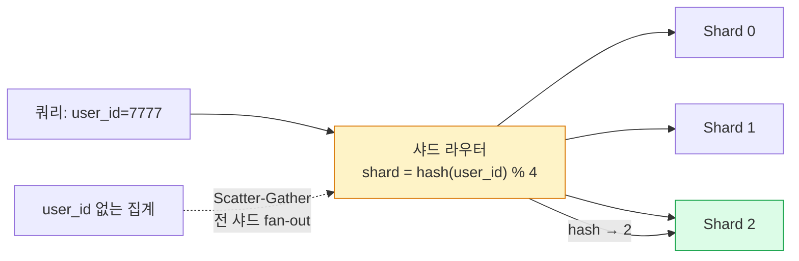
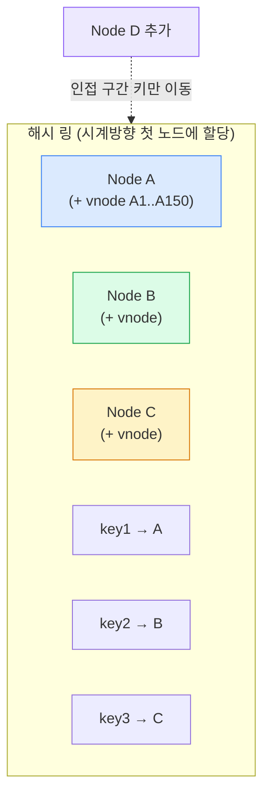
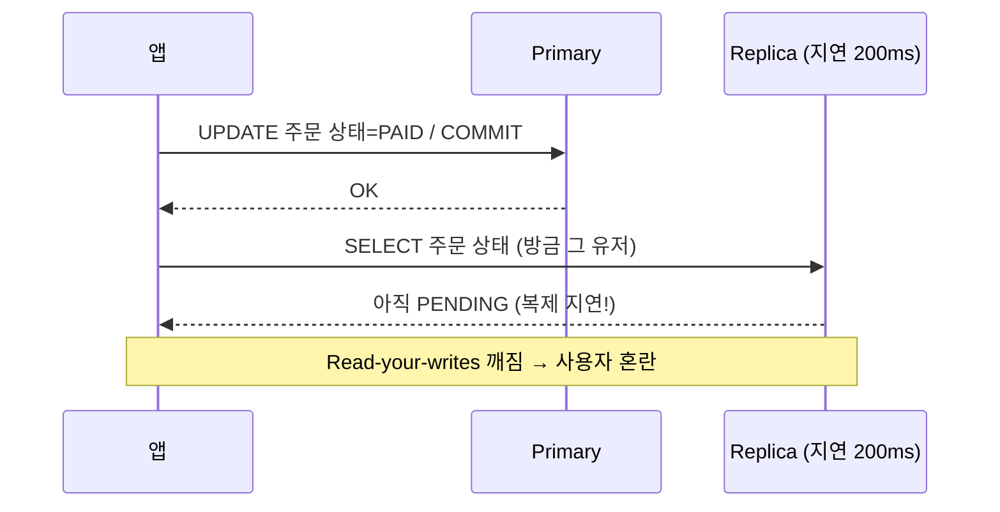

## 1. 파티셔닝(Partitioning) — 수평/수직

**Partitioning(파티셔닝)**은 한 테이블을 더 작은 조각으로 나누되 **같은 DB 인스턴스 안**에 둔다. **Sharding(샤딩)**은 그 조각을 **여러 노드에 분산**한다는 점이 다르다(파티셔닝이 논리, 샤딩이 물리 확장).

- **수평 파티셔닝(Horizontal)**: 행을 기준으로 분할. Range / List / Hash / Composite.
- **수직 파티셔닝(Vertical)**: 컬럼을 기준으로 분할(자주 안 읽는 큰 BLOB 분리 등).



*Range 파티셔닝 — 월별로 나누면 오래된 파티션을 DROP으로 즉시 정리(대량 DELETE 회피)*

```sql
-- 물류 주문: 월별 Range 파티셔닝
CREATE TABLE orders (
  order_id BIGINT, created_at DATETIME, ...,
  PRIMARY KEY (order_id, created_at)
)
PARTITION BY RANGE (TO_DAYS(created_at)) (
  PARTITION p_2026_06 VALUES LESS THAN (TO_DAYS('2026-07-01')),
  PARTITION p_2026_07 VALUES LESS THAN (TO_DAYS('2026-08-01')),
  PARTITION p_max     VALUES LESS THAN MAXVALUE
);
-- 보관정책: 오래된 파티션 즉시 정리
ALTER TABLE orders DROP PARTITION p_2026_06;
```

| 방식 | 분할 기준 | 장점 | 주의 |
| --- | --- | --- | --- |
| Range | created_at 등 범위 | 기간 조회·보관정리 쉬움 | 최근 파티션에 쓰기 집중(핫스팟) |
| List | region 등 목록 | 지역별 격리 | 값 분포 불균형 |
| Hash | hash(key) % N | 균등 분산 | 범위 조회 비효율, N 변경 어려움 |
| Composite | Range + Hash 등 | 두 장점 결합 | 설계·관리 복잡 |

> **Pruning(파티션 가지치기)**
>
> WHERE에 파티션 키가 있으면 옵티마이저가 **관련 파티션만 스캔(Partition Pruning)** 한다. 단 파티션 키가 PK/Unique에 포함돼야 하는 제약, 그리고 파티션 키 없는 조회는 모든 파티션을 뒤지는 점에 주의. EXPLAIN의 `partitions` 컬럼으로 가지치기를 확인한다.

## 2. Sharding Key(샤딩 키) 선택

샤딩 키는 샤딩 설계의 거의 전부다. 판단 기준은 **카디널리티 · 분포 균등성 · 핫스팟 · 조인/조회 지역성**이다. 잘못 고르면 한 샤드만 터지거나(핫스팟), 모든 쿼리가 전 샤드로 흩어진다(Scatter-gather).

| 후보 키 | 분포 | 지역성(한 유저 데이터가 한 샤드) | 핫스팟 위험 | 적합성 |
| --- | --- | --- | --- | --- |
| `user_id` (hash) | 균등 | ✅ 좋음(유저 단위 조회 1샤드) | 낮음 | 이커머스 주문에 권장 |
| `order_date` | 시간 편중 | ❌ 최근이 한 샤드 | 🚨 높음(오늘 주문 폭주) | 비권장(시계열 분석엔 별도) |
| `order_id` (auto-inc) | 단조 증가 | — | 🚨 마지막 샤드 집중 | 비권장 |
| 복합 `(seller_id, ...)` | 판매자별 | 판매자 단위 조회 유리 | 대형 셀러 편중 | B2B 정산 등 |



*샤드 라우팅 — 샤드 키가 있으면 1샤드, 없으면 전 샤드로 흩어지는 Scatter-Gather(비싸다)*

> **면접 포인트 — "user_id vs order_date, 뭘 샤드 키로?"**
>
> 대부분 **user_id 해시** 가 정답이다: 분포 균등 + 유저 단위 조회가 1샤드로 끝남(주문 목록, 마이페이지). `order_date` 는 **오늘 들어온 주문이 한 샤드에 몰려 핫스팟** 이 되고, 단조 증가 키도 마지막 샤드에 쓰기가 집중된다. 단, "기간별 전체 매출 집계" 같은 **Cross-shard 분석** 은 어떤 키로 샤딩해도 비싸므로 OLAP은 별도 시스템(데이터 웨어하우스)으로 분리한다 — OLTP 샤딩과 분석을 한 키로 다 잡으려 하면 실패한다.

> **샤딩의 대가**
>
> Cross-shard JOIN 불가, 분산 트랜잭션(2PC/Saga) 복잡도, 글로벌 유니크/시퀀스 어려움, 리샤딩 고통. **먼저 파티셔닝·읽기복제·캐시로 버틸 수 없는지** 검토하고, 정말 단일 노드 쓰기 한계에 부딪힐 때 샤딩한다.

## 3. Consistent Hashing(일관성 해시) — 리밸런싱 최소화

단순 `hash(key) % N`은 노드 수 N이 바뀌면 거의 모든 키가 재배치된다. **Consistent Hashing(일관성 해시)**은 노드와 키를 같은 해시 링(0~2³²) 위에 올리고, 키를 시계방향 첫 노드에 할당한다. 노드 추가/제거 시 **인접 구간의 키만 이동**한다(평균 1/N).



*일관성 해시 — Virtual Node(가상 노드)로 분포를 고르게, 노드 변동 시 이동 키 최소화*

> **Virtual Node로 핫스팟 완화**
>
> 노드를 링에 하나만 올리면 구간 크기가 들쭉날쭉해 편중된다. 노드당 수백 개의 **Virtual Node(가상 노드)** 를 뿌리면 분포가 고르게 된다. **DynamoDB·Cassandra·Redis Cluster(해시 슬롯 16384)** 가 이 계열을 쓴다. Redis Cluster는 정확히는 16384개 고정 슬롯을 노드에 매핑하는 방식.

## 4. Replication(복제) — 동기 vs 비동기, 그리고 지연

복제는 **읽기 확장**과 **고가용성(HA)**을 위해 데이터를 여러 노드에 복사한다. Primary가 쓰기를 받고, Replica가 읽기를 분담한다. 핵심 트레이드오프는 **일관성 vs 가용성/지연**이다.

| 방식 | 커밋 조건 | 일관성 | 지연/가용성 | 데이터 손실 위험 |
| --- | --- | --- | --- | --- |
| 비동기(Async) | Primary만 쓰면 커밋 | 약함(복제 지연) | 빠름·가용성 높음 | 장애 시 미전파분 손실 가능 |
| 반동기(Semi-sync) | Replica 1개 수신 확인 | 중간 | 중간 | 크게 감소 |
| 동기(Sync) | 모든/정족수 Replica 확인 | 강함 | 느림·한 노드 죽으면 쓰기 지연 | 거의 없음 |



*Replication lag — 쓰기 직후 Replica를 읽으면 옛 값. 라우팅 전략으로 보정 필요*

> **Replication Lag(복제 지연)과 Read-your-writes**
>
> 비동기 복제에선 쓰기 직후 Replica를 읽으면 **자기가 쓴 값이 안 보인다(Read-your-writes 위반)** . 해법: ① 쓰기 직후 일정 시간/세션은 **Primary로 읽기 강제** , ② 복제 위치(GTID/LSN) 기반으로 "충분히 따라온 Replica"만 라우팅, ③ 사용자 본인 데이터만 Primary. 물류에서 "주문하자마자 주문내역이 안 보임" 같은 클레임이 이 문제다.

> **면접 포인트 — MySQL vs PostgreSQL 복제**
>
> **MySQL** : binlog 기반(row/statement/mixed). 비동기 기본, semi-sync 옵션. binlog는 CDC(Change Data Capture)의 소스이기도 해 Debezium→Kafka로 검색·캐시·DW 동기화에 쓰인다. **PostgreSQL** : WAL 기반 **streaming replication** (physical, 바이트 단위 그대로) + **logical replication** (테이블 단위 선택 복제, 버전 이종 가능). 동기 복제는 `synchronous_standby_names` 로 정족수 지정. Failover 시 split-brain 방지를 위해 fencing/합의(예: Patroni)를 둔다.

## 이해도 확인 Q&A

아래 질문에 직접 답변을 작성하세요. 자동 저장되며, 버튼으로 복사해 코치에게 피드백을 요청할 수 있습니다.
