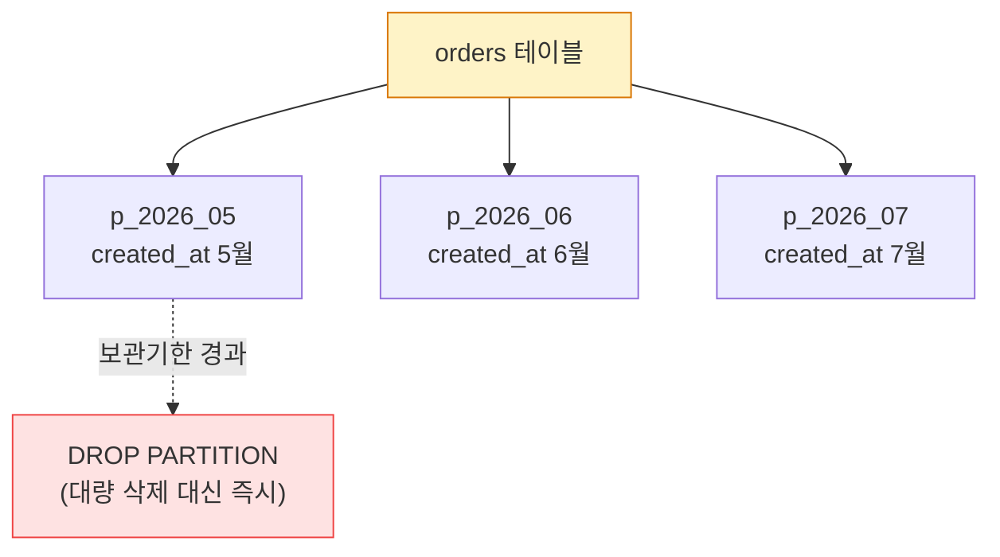
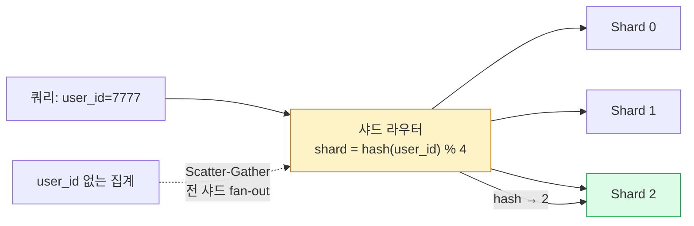
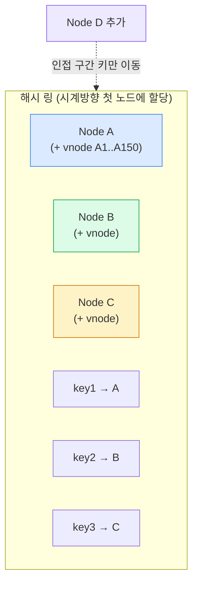
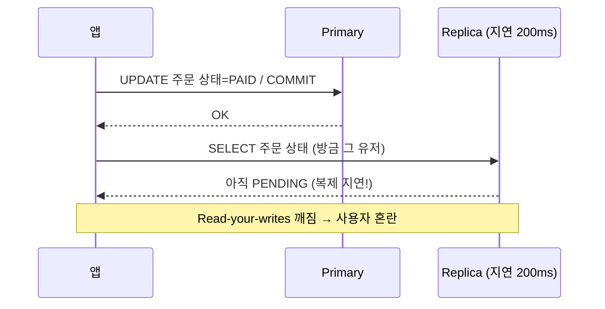

> **검수 기준 — 2026-09-27**
>
> 파티션·샤드·복제의 용어와 일관성은 DBMS와 배포 토폴로지에 따라 달라진다. 아래 SQL과 수치는 학습용 예시이며 실제 버전·설정·데이터 분포로 확인한다.
> 참고: [PostgreSQL Partitioning](https://www.postgresql.org/docs/17/ddl-partitioning.html), [MySQL Partitioning](https://dev.mysql.com/doc/refman/8.4/en/partitioning.html), [PostgreSQL Streaming Replication](https://www.postgresql.org/docs/17/warm-standby.html)

## 1. 파티셔닝(Partitioning) — 수평/수직

**Partitioning(파티셔닝)**은 한 논리 테이블을 더 작은 조각으로 나누는 DB 기능이다. 많은 단일 노드 DB에서는 같은 인스턴스 안에 두지만, 제품에 따라 파티션 배치와 분산 방식이 다르므로 이를 보편 규칙으로 말하지 않는다. **Sharding(샤딩)**은 애플리케이션 라우터나 분산 DB가 데이터를 여러 노드·그룹에 배치하는 확장 전략이다. 한 시스템에서 두 개념을 함께 사용할 수도 있다.

- **수평 파티셔닝(Horizontal)**: 행을 기준으로 분할. Range / List / Hash / Composite.
- **수직 파티셔닝(Vertical)**: 컬럼을 기준으로 분할(자주 안 읽는 큰 BLOB 분리 등).


```mermaid
flowchart TB
    T["orders 테이블"]
    T --> P1["p_2026_05\ncreated_at 5월"]
    T --> P2["p_2026_06\ncreated_at 6월"]
    T --> P3["p_2026_07\ncreated_at 7월"]
    P1 -. "보관기한 경과" .-> D["DROP PARTITION\n(대량 삭제 대신 즉시)"]
    style T fill:#fef3c7,stroke:#d97706
    style D fill:#fee2e2,stroke:#ef4444
```

*Range 파티셔닝 — 월별로 나누면 오래된 파티션을 DROP으로 즉시 정리(대량 DELETE 회피)*

```sql
-- 물류 주문: 월별 Range 파티셔닝
CREATE TABLE orders (
  order_id BIGINT, created_at DATETIME, ...,
  PRIMARY KEY (order_id, created_at)
)
PARTITION BY RANGE (TO_DAYS(created_at)) (
  PARTITION p_2026_06 VALUES LESS THAN (TO_DAYS('2026-07-01')),
  PARTITION p_2026_07 VALUES LESS THAN (TO_DAYS('2026-08-01')),
  PARTITION p_max     VALUES LESS THAN MAXVALUE
);
-- 보관정책: 오래된 파티션 즉시 정리
ALTER TABLE orders DROP PARTITION p_2026_06;
```

| 방식 | 분할 기준 | 장점 | 주의 |
| --- | --- | --- | --- |
| Range | created_at 등 범위 | 기간 조회·보관정리 쉬움 | 최근 파티션에 쓰기 집중(핫스팟) |
| List | region 등 목록 | 지역별 격리 | 값 분포 불균형 |
| Hash | hash(key) % N | 균등 분산 | 범위 조회 비효율, N 변경 어려움 |
| Composite | Range + Hash 등 | 두 장점 결합 | 설계·관리 복잡 |

> **Pruning(파티션 가지치기)**
>
> WHERE에 파티션 키의 범위가 있으면 옵티마이저가 관련 파티션만 스캔할 가능성이 커진다. 함수·형변환·파라미터 형태·DBMS 버전에 따라 pruning이 실패할 수 있고, 파티션 키 없는 조회는 여러 파티션을 읽을 수 있다. 파티션 키를 PK/Unique에 포함해야 하는 제약은 MySQL과 PostgreSQL에서 다르므로 해당 DBMS DDL을 확인한다. EXPLAIN에서 실제 대상 파티션과 제거된 파티션을 확인한다.

## 2. Sharding Key(샤딩 키) 선택

샤딩 키는 샤딩 설계의 거의 전부다. 판단 기준은 **카디널리티 · 분포 균등성 · 핫스팟 · 조인/조회 지역성**이다. 잘못 고르면 한 샤드만 터지거나(핫스팟), 모든 쿼리가 전 샤드로 흩어진다(Scatter-gather).

| 후보 키 | 분포 | 지역성(한 유저 데이터가 한 샤드) | 핫스팟 위험 | 적합성 |
| --- | --- | --- | --- | --- |
| `user_id` (hash) | 균등 | ✅ 좋음(유저 단위 조회 1샤드) | 낮음 | 이커머스 주문에 권장 |
| `order_date` (range/date 기반) | 시간 편중 | ❌ 최근 범위가 한 샤드 | 🚨 높음(오늘 주문 폭주) | 비권장(시계열 분석엔 별도) |
| `order_id` (auto-inc) | 단조 증가 | — | 🚨 마지막 샤드 집중 | 비권장 |
| 복합 `(seller_id, ...)` | 판매자별 | 판매자 단위 조회 유리 | 대형 셀러 편중 | B2B 정산 등 |


```mermaid
flowchart LR
    Q["쿼리: user_id=7777"] --> Router["샤드 라우터\nshard = hash(user_id) % 4"]
    Router --> S0["Shard 0"]
    Router --> S1["Shard 1"]
    Router --> S2["Shard 2"]
    Router -->|"hash → 2"| S2
    XQ["user_id 없는 집계"] -.->|"Scatter-Gather\n전 샤드 fan-out"| Router
    style Router fill:#fef3c7,stroke:#d97706
    style S2 fill:#dcfce7,stroke:#16a34a
```

*샤드 라우팅 — 샤드 키가 있으면 1샤드, 없으면 전 샤드로 흩어지는 Scatter-Gather(비싸다)*

> **면접 포인트 — `user_id` vs `order_date`**
>
> 사용자 단위 조회·트랜잭션이 지배적이면 `user_id`가 한 샤드 지역성을 줄 수 있지만, 대형 사용자·판매자 편향과 cross-user 업무를 확인해야 한다. 시간 범위 조회·보관 삭제가 지배적이면 `order_date`가 pruning과 retention에 유리할 수 있지만 최근 쓰기와 최신 파티션 hot spot을 측정해야 한다. 어떤 키도 모든 쿼리를 최적화하지 않으므로 OLTP 라우팅과 분석용 집계를 별도 파이프라인으로 설계한다.

> **샤딩의 대가**
>
> Cross-shard JOIN 불가, 분산 트랜잭션(2PC/Saga) 복잡도, 글로벌 유니크/시퀀스 어려움, 리샤딩 고통. **먼저 파티셔닝·읽기복제·캐시로 버틸 수 없는지** 검토하고, 정말 단일 노드 쓰기 한계에 부딪힐 때 샤딩한다.

## 3. Consistent Hashing(일관성 해시) — 리밸런싱 최소화

단순 `hash(key) % N`은 노드 수 N이 바뀌면 거의 모든 키가 재배치된다. **Consistent Hashing(일관성 해시)**은 노드와 키를 같은 해시 링(0~2³²) 위에 올리고, 키를 시계방향 첫 노드에 할당한다. 노드 추가/제거 시 **인접 구간의 키만 이동**하며, 균등한 단순 링에서 한 노드를 추가할 때의 기대 이동량은 대략 `1/(N+1)`, 제거할 때는 대략 `1/N` 수준이다. 실제 이동량은 vnode/token 수, 가중치, 리밸런싱 정책과 키 분포에 따라 달라진다.


```mermaid
flowchart TB
    subgraph Ring["해시 링 (시계방향 첫 노드에 할당)"]
        N0["Node A\n(+ vnode A1..A150)"]
        N1["Node B\n(+ vnode)"]
        N2["Node C\n(+ vnode)"]
        K1["key1 → A"]
        K2["key2 → B"]
        K3["key3 → C"]
    end
    NewN["Node D 추가"] -. "인접 구간 키만 이동" .-> Ring
    style N0 fill:#dbeafe,stroke:#3b82f6
    style N1 fill:#dcfce7,stroke:#16a34a
    style N2 fill:#fef3c7,stroke:#d97706
    style NewN fill:#ede9fe,stroke:#8b5cf6
```

*일관성 해시 — Virtual Node(가상 노드)로 분포를 고르게, 노드 변동 시 이동 키 최소화*

> **Virtual Node로 분포를 조정한다**
>
> 링에 물리 노드를 하나만 올리면 구간 크기가 편중될 수 있어 virtual node/token을 여러 개 배치해 분산을 조정한다. 다만 제품마다 토큰 링·고정 슬롯·분할/리밸런싱 알고리즘이 다르다. Cassandra의 token ring과 Redis Cluster의 16,384 hash slot은 같은 “데이터 분산” 문제를 풀지만 구현과 운영 절차가 같지 않으며, DynamoDB 같은 관리형 서비스의 내부 배치 구현을 일관성 해시라고 단정하지 않는다.

## 4. Replication(복제) — 동기 vs 비동기, 그리고 지연

복제는 **읽기 확장**과 **고가용성(HA)**을 위해 데이터를 여러 노드에 복사한다. Primary가 쓰기를 받고, Replica가 읽기를 분담한다. 핵심 트레이드오프는 **일관성 vs 가용성/지연**이다.

| 방식 | 커밋 조건 | 일관성 | 지연/가용성 | 데이터 손실 위험 |
| --- | --- | --- | --- | --- |
| 비동기(Async) | Primary만 쓰면 커밋 | 약함(복제 지연) | 빠름·가용성 높음 | 장애 시 미전파분 손실 가능 |
| 반동기(Semi-sync) | Replica 1개 수신 확인 | 중간 | 중간 | 크게 감소 |
| 동기(Sync) | 설정된 Replica/정족수의 확인 | 설정된 범위에서 강함 | 지연·가용성 비용 | 확인된 복제본 수와 장애 모델에 따라 달라짐 |


```mermaid
sequenceDiagram
    participant App as 앱
    participant P as Primary
    participant R as Replica (지연 200ms)
    App->>P: UPDATE 주문 상태=PAID / COMMIT
    P-->>App: OK
    App->>R: SELECT 주문 상태 (방금 그 유저)
    R-->>App: 아직 PENDING (복제 지연!)
    Note over App,R: Read-your-writes 깨짐 → 사용자 혼란
```

*Replication lag — 쓰기 직후 Replica를 읽으면 옛 값. 라우팅 전략으로 보정 필요*

> **Replication Lag(복제 지연)과 Read-your-writes**
>
> 비동기 복제에선 쓰기 직후 Replica를 읽으면 **자기가 쓴 값이 안 보인다(Read-your-writes 위반)** . 해법: ① 쓰기 직후 일정 시간/세션은 **Primary로 읽기 강제** , ② 복제 위치(GTID/LSN) 기반으로 "충분히 따라온 Replica"만 라우팅, ③ 사용자 본인 데이터만 Primary. 물류에서 "주문하자마자 주문내역이 안 보임" 같은 클레임이 이 문제다.

> **면접 포인트 — MySQL vs PostgreSQL 복제**
>
> **MySQL** : binlog 기반(row/statement/mixed). 비동기 기본, semi-sync 옵션. binlog는 CDC(Change Data Capture)의 소스이기도 해 Debezium→Kafka로 검색·캐시·DW 동기화에 쓰인다. **PostgreSQL** : WAL 기반 **streaming replication** (physical, 바이트 단위 그대로) + **logical replication** (테이블 단위 선택 복제, 버전 이종 가능). 동기 복제는 `synchronous_standby_names` 로 정족수 지정. Failover 시 split-brain 방지를 위해 fencing/합의(예: Patroni)를 둔다.

## 5. 실패 입력 → 판단 → 복구

주문을 Primary에 커밋한 직후 읽기 Replica로 주문내역을 조회했는데 아직 `PENDING`으로 보인다고 하자. 먼저 복제 위치와 요청의 write timestamp/LSN을 비교해 실제 lag인지, 라우터가 다른 Tenant·샤드로 보낸 것인지, 읽기 Cache가 오래된 것인지 분리한다. 일정한 시간 동안 Primary를 읽는 것은 단순 UX 보정이지만, 세션이 여러 노드로 이동하면 충분하지 않을 수 있다.

Read-your-writes가 업무 요구라면 ① 쓰기 응답 뒤 세션/사용자 범위를 Primary로 보내기, ② write position을 전달해 해당 위치까지 재생한 Replica만 선택하기, ③ 해당 화면을 Primary 또는 강한 일관성 경로로 읽기의 비용과 장애 모드를 비교한다. 동기 복제라고 자동으로 모든 읽기 경로의 최신성이 보장되는 것도 아니며, failover 뒤 fencing·epoch·중복 처리까지 확인해야 한다. 샤딩 환경에서는 라우팅 키가 누락된 집계가 모든 샤드로 fan-out될 수 있으므로 비동기 분석 경로와 OLTP를 분리한다.

## 이해도 확인 Q&A

아래 질문에 직접 답변을 작성하세요. 자동 저장되며, 버튼으로 복사해 코치에게 피드백을 요청할 수 있습니다.
