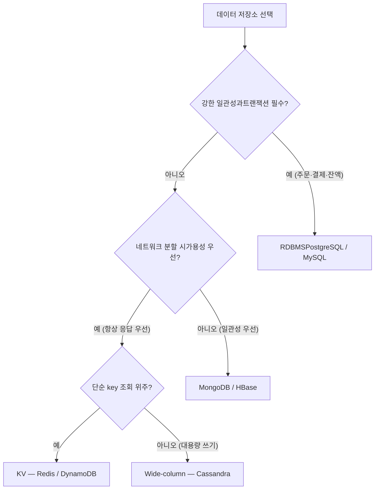
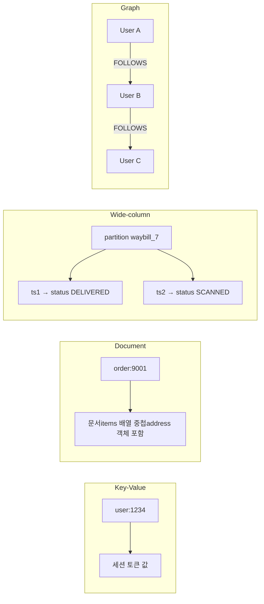
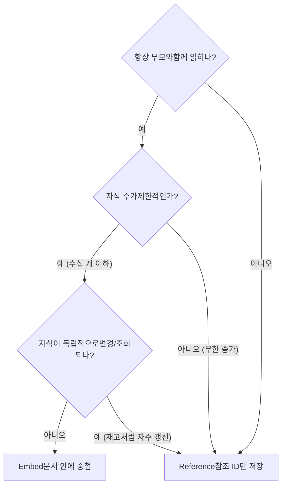

## 1. CAP 정리와 PACELC 확장

**CAP 정리(CAP Theorem)**는 분산 시스템이 다음 셋 중 둘만 동시에 보장할 수 있다는 명제다.

- **Consistency(일관성)**: 모든 노드가 같은 시점에 같은 데이터를 본다(여기서는 linearizability, 즉 최신 쓰기 즉시 반영).
- **Availability(가용성)**: 모든 요청이 (성공/실패 무관하게) 응답을 받는다.
- **Partition tolerance(분할 내성)**: 노드 간 네트워크가 끊겨도 시스템이 계속 동작한다.

> **실무 함정 — CAP의 흔한 오해**
>
> "세 개 중 둘을 고른다"는 표현은 오해를 부른다. 분산 시스템에서 **네트워크 분할(P)은 선택이 아니라 필연** 이다. 따라서 실제 선택은 **분할이 발생했을 때 C와 A 중 무엇을 포기하느냐** 다. CP 시스템은 일관성을 위해 응답을 거부(가용성 포기)하고, AP 시스템은 응답을 위해 오래된 값을 허용(일관성 포기)한다.

### PACELC — CAP의 빈틈을 메우다

CAP은 분할 상황만 다룬다. **PACELC**는 평상시(분할 없을 때)의 트레이드오프까지 명시한다: **분할 시(P) A vs C, 그렇지 않으면(Else, E) L(Latency) vs C(Consistency)**. 즉 정상 운영 중에도 강한 일관성을 위해 지연을 감수할지, 낮은 지연을 위해 일관성을 느슨하게 할지의 선택이 항상 존재한다.

| 시스템 | 분할 시 (P) | 평상시 (E) | 분류 |
| --- | --- | --- | --- |
| PostgreSQL / MySQL (단일 primary) | C (가용성 포기) | C (강한 일관성) | PC/EC |
| DynamoDB / Cassandra (기본) | A (오래된 값 허용) | L (저지연 우선) | PA/EL |
| MongoDB (기본, primary 읽기) | C | C | PC/EC |
| Cassandra (QUORUM 읽기/쓰기) | A | C에 가깝게 조절 | PA/EC (튜닝) |



*데이터 저장소 선택 트리 — 일관성 요구가 첫 분기*

> **면접 포인트**
>
> "왜 PACELC가 CAP보다 실무적인가?"에 답할 수 있어야 한다. 핵심: **네트워크 분할은 드문 사건** 이고, 99.9%의 시간은 분할이 없는 평상시다. CAP은 이 평상시를 전혀 설명하지 못한다. PACELC의 **EL vs EC** 가 실제 시스템(DynamoDB의 eventually consistent read vs strongly consistent read)의 일상적 선택을 정확히 모델링한다.

## 2. NoSQL 4종 분류

NoSQL은 단일 기술이 아니라 데이터 모델에 따른 4개 계열이다. 각자 다른 접근 패턴에 최적화돼 있다.

| 유형 | 데이터 모델 | 강점 | 약점 | 대표 / 사용처 |
| --- | --- | --- | --- | --- |
| Key-Value (KV) | key → opaque value | 초저지연 단순 조회, 캐시 | 값 내부 질의 불가, 범위 검색 약함 | Redis, DynamoDB · 세션·캐시·카운터 |
| Document | key → JSON/BSON 문서 | 유연한 스키마, 중첩 구조 한 번에 읽기 | 다중 문서 트랜잭션·복잡 조인 약함 | MongoDB · 카탈로그·CMS·프로필 |
| Wide-column | partition key → row → 동적 컬럼 | 대용량 쓰기, 시계열, 선형 확장 | 임의 질의 불가(쿼리 우선 설계 강제) | Cassandra, HBase · 로그·이력·IoT |
| Graph | node + edge(관계) | 다단계 관계 탐색(친구의 친구) | 대규모 수평 확장 어려움 | Neo4j · 추천·소셜·사기탐지 |



*4개 NoSQL 계열의 데이터 모델 형태 대조*

> **실무 함정 — Document DB는 schema-less가 아니다**
>
> MongoDB가 "스키마가 없다"는 말은 **DB가 스키마를 강제하지 않는다** 는 뜻일 뿐, 스키마는 여전히 **애플리케이션 코드 안에** 존재한다. 검증을 앱이 떠안으므로, 필드 누락·타입 불일치가 런타임까지 숨는다. 그래서 실무에서는 JSON Schema validation을 DB에 걸거나 ODM(Mongoose 등)으로 스키마를 다시 강제하는 경우가 많다.

## 3. 모델링 패턴 — Query-first의 세계

RDBMS는 **정규화된 스키마를 먼저 설계**하고 쿼리는 나중에 자유롭게 짠다. NoSQL(특히 Cassandra·DynamoDB)은 정반대 — **Query-first modeling(쿼리 우선 모델링)**이다. "어떤 쿼리를 칠 것인가"를 먼저 정하고, 그 쿼리가 단일 partition 조회로 끝나도록 테이블을 역설계한다. 조인이 없으므로 데이터를 의도적으로 중복(denormalize) 저장한다.

### DynamoDB — Partition key + Sort key, Single-table design

DynamoDB의 primary key는 **Partition key(PK)** 단독, 또는 **PK + Sort key(SK)** 조합이다. PK는 데이터를 물리 파티션에 분산하고, SK는 한 파티션 내 정렬·범위 조회를 가능하게 한다. **Single-table design**은 여러 엔티티(주문·주문항목·고객)를 *하나의 테이블*에 PK/SK 패턴으로 욱여넣어, 관련 데이터를 같은 파티션에 모으고 단일 쿼리로 함께 읽는 기법이다.

```kotlin
# 한 테이블에 여러 엔티티 — PK로 묶고 SK로 종류 구분
PK = "USER#1234"   SK = "PROFILE"          → 사용자 프로필
PK = "USER#1234"   SK = "ORDER#9001"       → 주문 1
PK = "USER#1234"   SK = "ORDER#9002"       → 주문 2

# 단일 Query로 "이 사용자의 프로필 + 모든 주문"을 한 번에
Query: PK = "USER#1234"   (SK begins_with 등으로 필터)
```

> **실무 함정 — Cassandra/DynamoDB 핫 파티션**
>
> partition key가 한쪽으로 쏠리면 그 파티션을 가진 노드만 과부하( **hot partition** ). 예: PK를 "오늘 날짜"로 잡으면 모든 쓰기가 한 파티션으로. 회피책은 **composite key** 로 카디널리티를 높이거나(예: `date#shard_no` ), 고른 분포의 키(user_id)를 PK 앞단에 두는 것. DynamoDB는 partition당 처리량(WCU/RCU) 상한이 있어 핫 파티션이 throttling으로 직결된다.

### MongoDB — Embed vs Reference

1:N·N:1 관계를 문서에 어떻게 담을지의 결정이다. 기준은 단 하나 — **"한 번에 함께 읽는 단위인가"**.



*MongoDB Embed vs Reference 결정 흐름 — 16MB 문서 한계와 변경 빈도가 관건*

- **Embed(임베드)**: 주문 ↔ 주문항목처럼 함께 생성·조회되고 수가 제한적이면 중첩. 1회 read로 끝나 빠름.
- **Reference(참조)**: 게시글 ↔ 댓글(무한 증가)처럼 자식이 폭발하거나 독립적으로 갱신되면 ID 참조. 단, 16MB 문서 크기 한계도 임베드 회피 사유.

### Redis 자료구조 매핑

| 자료구조 | 적합 용도 | 물류/서비스 예시 |
| --- | --- | --- |
| String | 캐시, 카운터(INCR) | API 응답 캐시, 일별 주문 카운트 |
| Hash | 객체 필드 묶음 | 세션 객체, 배송 상태 필드 |
| List | 큐, 최근 N개 | 작업 큐, 최근 본 상품 |
| Set | 중복 제거, 집합 연산 | 오늘 주문한 사용자 집합 |
| Sorted Set | 랭킹, 우선순위 큐 | 실시간 인기 상품, 배차 우선순위 |
| Stream | 이벤트 로그, 소비자 그룹 | 주문 이벤트 파이프라인 |

> **실무 사례**
>
> **Netflix** 는 회원별 시청 이력·재생 위치 같은 대용량 시계열을 **Cassandra** 에 저장한다 — partition key는 회원 ID, 쓰기가 폭발해도 선형 확장된다. **Amazon** 의 장바구니(cart)는 **DynamoDB** — "항상 응답해야 하는" 가용성 우선(AP) 요구에 맞춰, 일시적 일관성 결함보다 카트가 절대 안 멈추는 것을 택했다(원조 Dynamo 논문의 동기).

> **면접 포인트**
>
> "왜 Cassandra에선 데이터를 중복 저장하나?"라는 질문의 정답: **조인이 없기 때문** . 같은 데이터를 "조회 패턴 A용 테이블"과 "조회 패턴 B용 테이블"에 각각 denormalize해 둔다. 쓰기 비용·정합성 관리를 읽기 성능(단일 partition 조회)과 맞바꾼 것 — 디스크는 싸고 읽기 지연은 비싸다는 철학이다.

## 4. 선택 가이드 — Trade-off 정리

> **기본 원칙 — RDBMS first**
>
> **RDBMS를 먼저 고려하고, NoSQL은 명확한 이유가 있을 때만 도입한다.** 트랜잭션·강한 일관성·유연한 ad-hoc 쿼리·성숙한 생태계는 RDBMS의 압도적 강점이다. PostgreSQL은 JSONB로 document 기능, 파티셔닝·논리 복제까지 흡수해 "NoSQL이 필요한 순간"을 한참 뒤로 미룬다. NoSQL은 (1) 단일 노드 쓰기 한계 초과, (2) 명확한 단일 접근 패턴, (3) 유연 스키마가 본질적일 때 정당화된다.

| 요구 | 적합 선택 | 근거 |
| --- | --- | --- |
| 트랜잭션·강한 일관성 (주문·결제·잔액) | RDBMS (PostgreSQL/MySQL) | ACID, 다중 행 트랜잭션, FK 제약 |
| 대용량 쓰기·시계열 이력 | Cassandra (Wide-column) | 선형 쓰기 확장, 쿼리 우선 모델링 |
| 초저지연 캐시·세션·카운터 | Redis (KV) | 인메모리, 풍부한 자료구조 |
| 유연 스키마 카탈로그·프로필 | MongoDB (Document) | 중첩 문서 한 번에 read |
| 관계 탐색·추천 | Neo4j (Graph) | 다단계 그래프 순회 최적화 |

### Polyglot persistence (다중 저장소)

현실의 대규모 서비스는 한 DB로 통일하지 않는다. **도메인별로 최적 저장소를 혼용**한다(polyglot persistence). 단, 저장소가 늘면 운영·정합성 비용이 커지므로 "정말 필요한 만큼만" 늘리는 균형이 핵심이다.

> **물류 도메인 매핑 — 한 서비스 안의 polyglot**
>
> **주문·결제 (OMS)** → **RDBMS**: 재고 차감·결제는 강한 일관성·트랜잭션 필수. 토스·배민의 주문 핵심부. **운송장 추적 타임라인 (TMS)** → **Cassandra/Wide-column**: 운송장 ID를 partition key로, 스캔 이벤트가 시간순 append. 쿠팡·CJ대한통운 규모의 배송 이력 쓰기 폭주를 흡수. **캐시·세션·실시간 배차 우선순위** → **Redis**: Sorted Set으로 라스트마일 배차 큐, 조회 캐시.

> **면접 포인트**
>
> "우리 서비스에 NoSQL 도입하자"는 제안을 받으면, 시니어라면 먼저 **"어떤 접근 패턴 때문에? RDBMS로는 왜 안 되나?"** 를 되묻는다. NoSQL을 "성능이 좋아서" 도입하면 ad-hoc 쿼리 불가, 트랜잭션 부재, 운영 부담이라는 비용이 뒤늦게 터진다. **접근 패턴과 정합성 요구** 가 결정 요인이라는 점을 분명히 하라.

## 이해도 확인 Q&A

아래 3문항에 직접 답을 적어보세요. 자동 저장되며, 하단 버튼으로 전체를 복사해 피드백을 요청할 수 있습니다.
