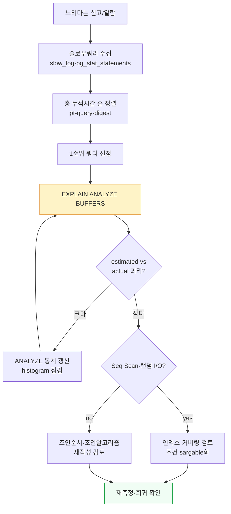
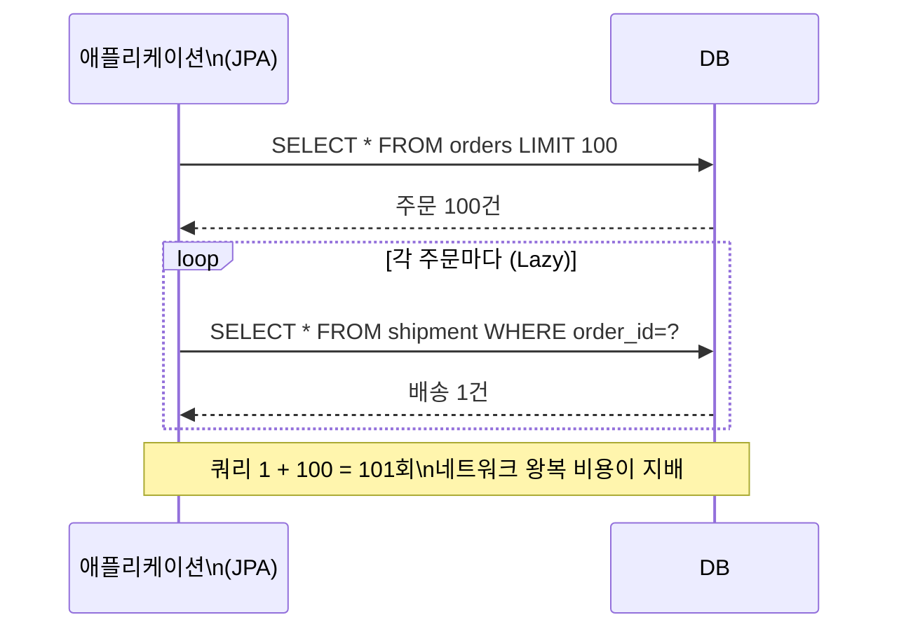

## 1. 슬로우쿼리 분석 프로세스

튜닝의 출발점은 "느린 쿼리를 데이터로 특정하는 것"이다. 감으로 인덱스를 추가하지 않는다.

### 관측 도구

- **MySQL**: `slow_query_log=ON` + `long_query_time=0.5`(초)로 임계 초과 쿼리 수집. 로그를 **pt-query-digest(Percona Toolkit)**로 정규화·집계하면 "총 시간 기여도 1위 쿼리"가 나온다. `performance_schema.events_statements_summary_by_digest`도 동일 목적.
- **PostgreSQL**: **pg_stat_statements** 확장으로 쿼리별 총 호출수·총시간·평균을 누적 집계. 느린 쿼리를 자동 로깅하려면 **auto_explain**(`auto_explain.log_min_duration`)으로 임계 초과 시 실행계획까지 로그에 남긴다.

> **팁 — 평균이 아니라 총량으로 보라**
>
> 한 번에 5초 걸리는 쿼리보다, 10ms지만 초당 5천 번 도는 쿼리가 시스템엔 더 큰 부하다. pt-query-digest와 pg_stat_statements가 **"총 누적 시간(total time) 순"** 으로 정렬해 주는 이유다. *호출 빈도 × 1회 비용* 으로 우선순위를 잡아라.

### 병목 찾기 — EXPLAIN ANALYZE BUFFERS

후보를 좁혔으면 실행계획으로 병목을 짚는다. PostgreSQL은 `BUFFERS`로 실제 읽은 페이지(buffer hit/read)까지 보여줘 I/O 병목을 정량화할 수 있다.

```sql
-- PostgreSQL: 추정이 아니라 실제 실행 + I/O 측정
EXPLAIN (ANALYZE, BUFFERS, VERBOSE)
SELECT * FROM shipment WHERE status='IN_TRANSIT' AND hub_id=42;

-- 읽는 법 (핵심 신호)
-- Seq Scan on shipment  (cost=0..18500 rows=120 width=80)
--   (actual time=0.3..210 rows=98000 loops=1)   ← estimated 120 vs actual 98000 괴리!
--   Buffers: shared hit=200 read=17800           ← 17800 페이지 디스크 read = I/O 병목
-- Planning Time / Execution Time
```

여기서 `rows=120`(추정) vs `actual rows=98000`의 큰 괴리는 통계가 낡았다는 신호이고, `Seq Scan` + 많은 `read`는 인덱스 부재 또는 인덱스가 안 타는 조건을 뜻한다.



*튜닝은 수집→정렬→실행계획→가설→교정→재측정의 반복 루프다.*

> **실무 함정 — 인덱스를 무력화하는 조건**
>
> `WHERE DATE(created_at)='2026-07-01'` 처럼 컬럼을 함수로 감싸면 인덱스를 못 탄다(non-sargable). `created_at >= '2026-07-01' AND created_at < '2026-07-02'` 로 풀어야 한다. `LIKE '%검색어%'` 의 선행 와일드카드, 암묵적 형변환(varchar 컬럼에 숫자 비교)도 같은 함정이다.

## 2. N+1 문제

**N+1 문제**는 ORM(Object-Relational Mapping)에서 가장 흔한 성능 사고다. 부모 N건을 가져오는 쿼리 1번 + 각 부모의 연관 자식을 가져오는 쿼리 N번 = 총 N+1번의 쿼리가 나간다. 주문 100건의 배송정보를 lazy loading으로 순회하면 1 + 100 = 101개 쿼리가 발생한다.



*주문 목록 + 배송정보를 순회하면 lazy loading이 행마다 쿼리를 날려 N+1이 된다.*

### 해법

물류 도메인에서 "주문 목록 + 배송 현황"을 한 화면에 보여줄 때 N+1이 전형적으로 터진다. 해법은 데이터를 *미리 묶어 가져오는* 것이다.

```sql
// 1) Fetch join — 한 방 쿼리로 조인해 가져옴
@Query("SELECT o FROM Order o JOIN FETCH o.shipment WHERE o.status = :st")
List<Order> findWithShipment(@Param("st") OrderStatus st);

// 2) @EntityGraph — 어떤 연관을 즉시 로딩할지 선언
@EntityGraph(attributePaths = {"shipment", "items"})
List<Order> findByStatus(OrderStatus status);

// 3) Batch size — IN 절로 N번을 1번에 (application.yml)
//    hibernate.default_batch_fetch_size: 100
//    → SELECT * FROM shipment WHERE order_id IN (?,?,...,?)  (100개씩 묶음)

// 4) DTO projection — 필요한 컬럼만 조인해 평면 DTO로 (가장 가벼움)
@Query("SELECT new com.x.OrderShipDto(o.id, o.status, s.trackingNo) " +
       "FROM Order o JOIN o.shipment s WHERE o.status = :st")
List<OrderShipDto> findDto(@Param("st") OrderStatus st);
```

| 해법 | 쿼리 수 | 주의점 |
| --- | --- | --- |
| Fetch join | 1 | 컬렉션 fetch join + paging 동시 사용 시 메모리 paging(전체 로딩) 발생. 컬렉션은 1개만. |
| @EntityGraph | 1 | fetch join과 동일 원리. 선언적이라 가독성 좋음. |
| Batch size(IN) | 1 + ceil(N/batch) | 카티전 곱(Cartesian product) 없이 컬렉션 여러 개도 안전. 쿠팡·배민급 목록 API의 현실적 기본값. |
| DTO projection | 1 | 영속성 컨텍스트 이점은 없지만 가장 적은 데이터·메모리. 조회 전용 화면에 최적. |

> **면접 포인트**
>
> "Fetch join이 항상 정답인가요?" → 아니다. **컬렉션(1:N) fetch join에 페이징을 붙이면** Hibernate가 DB 페이징을 포기하고 전체를 메모리로 끌어와 잘라낸다( `HHH000104` 경고). 이 경우 **Batch size(IN 절 묶기)** 가 정석이다. 둘의 차이를 설명하면 시니어 점수.

## 3. 커서 페이지네이션

`LIMIT 20 OFFSET 100000`은 깊어질수록 느려진다. DB가 OFFSET만큼의 앞 행을 *실제로 다 읽어서 정렬한 뒤 버리고* 그 다음 20개만 반환하기 때문이다. 100,020행을 스캔해 20행만 쓰는 셈이다.

```sql
-- (느림) OFFSET 방식: 앞 10만 행을 읽고 버림
SELECT * FROM shipment_history
ORDER BY id DESC
LIMIT 20 OFFSET 100000;
-- EXPLAIN: rows scanned ≈ 100020, 깊이에 비례해 선형 증가

-- (빠름) Keyset / Cursor 방식: 마지막으로 본 키를 기준으로 그 다음만
SELECT * FROM shipment_history
WHERE id < :lastSeenId          -- 직전 페이지 마지막 id를 커서로 전달
ORDER BY id DESC
LIMIT 20;
-- EXPLAIN: 인덱스 range scan으로 20행만 읽음 (OFFSET=어디든 일정)
```

| 관점 | OFFSET 100000, LIMIT 20 | Keyset/Cursor (WHERE id < ?) |
| --- | --- | --- |
| 스캔 행 수 | 약 100,020행 | 약 20행 |
| 응답시간 | 페이지 깊이에 비례 증가(예: 수백 ms~초) | 깊이 무관 일정(예: 수 ms) |
| 임의 페이지 점프 | 가능(N페이지로 바로) | 불가(다음/이전만) — 무한스크롤에 적합 |
| 정렬 안정성 | 중간 삽입/삭제 시 행 밀림·중복 가능 | 커서 키 기준이라 안정적 |
| 적합 사례 | 관리자 페이지 등 얕은 페이징 | 운송장 이력 무한스크롤, 피드 |

> **물류 사례 — 운송장 이력 무한스크롤**
>
> 배송 추적 화면에서 운송장(tracking) 스캔 이력을 무한스크롤로 보여줄 때, 깊은 페이지(오래된 이력)에서 OFFSET은 치명적이다. 마지막 이벤트의 `(event_at, id)` 복합 커서를 내려주고 `WHERE (event_at, id) < (:lastAt, :lastId)` 로 잇는다. 동률 타임스탬프를 id로 깨야 누락·중복이 없다. `(event_at, id)` 복합 인덱스가 전제다.

> **실무 함정 — COUNT(*) 동반**
>
> 페이지네이션마다 전체 건수를 위해 `SELECT COUNT(*)` 를 같이 날리면 대용량에서 그 자체가 슬로우쿼리가 된다. 무한스크롤은 총건수가 필요 없는 경우가 많으니 빼고, 꼭 필요하면 근사치(추정 통계, PostgreSQL의 `reltuples` )나 캐시를 쓴다.

## 4. 카디널리티 추정과 옵티마이저

옵티마이저(Optimizer)는 비용 기반(Cost-based)으로 실행계획을 고른다. 그 비용 계산의 핵심 입력이 **Cardinality(카디널리티, 조건을 통과하는 추정 행 수)**이고, 카디널리티는 **통계(Statistics)**에서 나온다. 통계가 낡으면 추정이 틀리고, 추정이 틀리면 잘못된 플랜을 고른다.

### 통계와 히스토그램

- **통계 갱신**: PostgreSQL은 `ANALYZE`(autovacuum이 자동 수행), MySQL은 `ANALYZE TABLE` 또는 InnoDB의 자동 통계. 대량 적재(bulk load) 직후엔 수동 갱신이 안전하다.
- **Histogram(히스토그램)**: 값의 분포가 한쪽으로 치우친(skewed) 컬럼에서 균등 분포 가정을 보정한다. 예) `status` 컬럼이 99% `DELIVERED`, 1% `IN_TRANSIT`이면 히스토그램 없이는 옵티마이저가 두 값을 비슷하게 보고 오판한다.
- **estimated vs actual rows 괴리**: `EXPLAIN ANALYZE`에서 둘의 차가 수십~수백 배면 통계 문제이거나, 컬럼 간 상관관계(correlation)를 모델이 못 잡은 경우다.

### 조인 순서와 조인 알고리즘

옵티마이저는 **조인 순서(어느 테이블을 먼저 줄일지)**와 **조인 알고리즘**을 함께 고른다. 알고리즘 선택은 대체로 양쪽 입력 크기와 인덱스 유무로 갈린다.

| 조인 알고리즘 | 유리한 상황 | 특징 |
| --- | --- | --- |
| **Nested Loop** | 외부(outer) 결과가 작고, 내부(inner)에 조인키 인덱스가 있을 때 | 외부 1행마다 내부를 인덱스로 lookup. 소량 조인의 OLTP 기본. MySQL의 주력. |
| **Hash Join** | 한쪽이 크고 동등 조인(=)이며 인덱스가 없을 때 | 작은 쪽으로 해시 테이블 만들고 큰 쪽을 probe. 대량 조인·분석 쿼리에 강함. PostgreSQL이 적극 사용(MySQL 8.0.18+도 지원). |
| **Merge Join** | 양쪽이 조인키로 이미 정렬돼 있을 때(인덱스 정렬 활용) | 두 정렬 스트림을 병합. 범위 조인·정렬 필요 시 유리. |

```sql
-- 통계가 틀려 Nested Loop를 잘못 고른 사례 진단
EXPLAIN ANALYZE
SELECT o.id, s.tracking_no
FROM orders o JOIN shipment s ON s.order_id = o.id
WHERE o.created_at >= '2026-06-01';
-- Nested Loop  (rows=100 estimated)  (actual rows=900000)  ← 100배 괴리
--   → 옵티마이저는 100건 조인인 줄 알고 NL을 골랐지만 실제 90만건
--   → Hash Join이 나았을 것. 원인: created_at 통계 낡음

ANALYZE orders;   -- 통계 갱신 후 재측정
```

> **면접 포인트**
>
> "옵티마이저가 인덱스를 안 타는데 힌트로 강제하면 되지 않나요?" → 힌트( `FORCE INDEX` , `/*+ ... */` )는 **최후의 수단** 이다. 데이터 분포가 바뀌면 그 강제가 오히려 독이 된다. 먼저 *통계 갱신·히스토그램·인덱스 설계·쿼리 재작성(sargable화)* 으로 옵티마이저가 옳게 고르도록 유도하라. 힌트를 박는 건 근본 원인을 덮는 것일 수 있다.

## 5. 이해도 확인 Q&A
