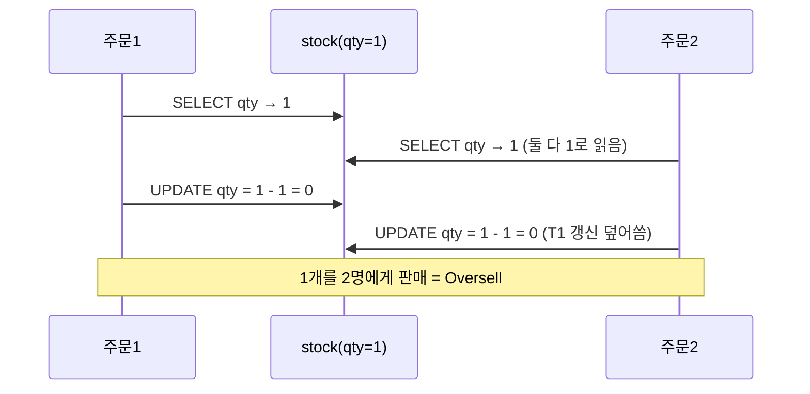
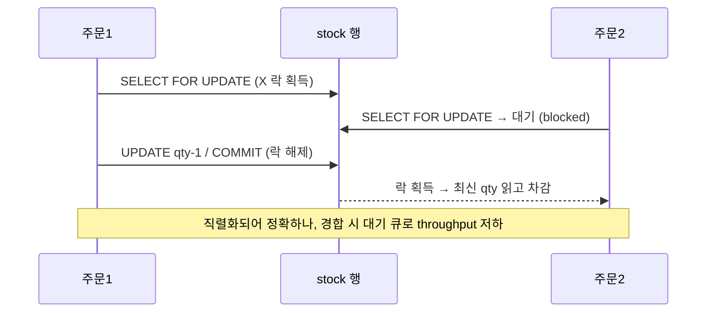
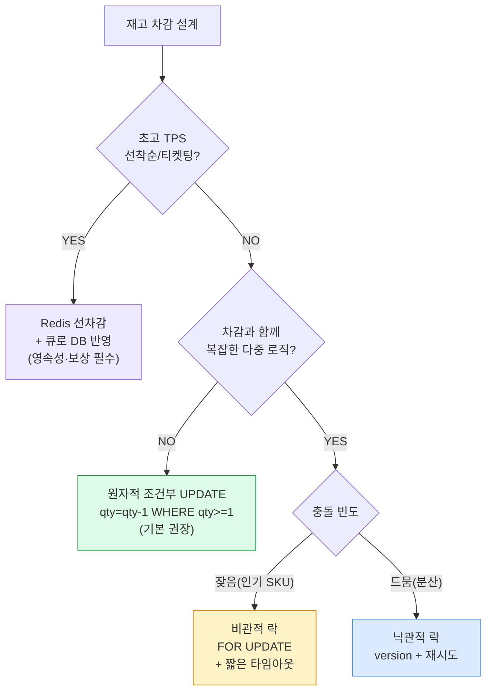

## 1. 문제 정의 — Oversell(초과판매)의 정체

재고 차감은 전형적인 **read-modify-write**다: 현재 수량을 읽고 → 검사하고 → 차감해 쓴다. 이 사이에 다른 트랜잭션이 끼면 **Lost Update(갱신 손실)**가 나고, 재고 1개를 두 주문이 모두 팔아버리는 **Oversell(초과판매)**이 된다.



*Lost Update — 검사와 쓰기 사이의 틈에서 두 주문이 같은 재고를 동시 차감*

> **물류 맥락 — Reserve 단계에서 막아야 한다**
>
> WMS의 **Reserve(예약) → Commit(출고확정) → Ship(출고)** 에서 Oversell은 보통 **Reserve 시점** 에 막는다. 가용재고(Available = On-hand − Reserved)를 원자적으로 차감하고, **예약에 TTL** 을 걸어 결제 미완료 시 자동 복원한다. TTL 없이 예약만 잡으면 "주문은 받았는데 실물이 없는" 유령 재고가 쌓인다.

## 2. Pessimistic Lock(비관적 락)

"충돌이 잦을 것"이라 가정하고 **먼저 락을 잡는다**. `SELECT ... FOR UPDATE`로 행에 배타락(X)을 걸어, 다른 트랜잭션을 대기시킨다.

```sql
BEGIN;
SELECT qty FROM stock WHERE sku='A' FOR UPDATE;   -- X 락, 경쟁자 대기
-- 애플리케이션에서 qty >= 1 검사
UPDATE stock SET qty = qty - 1 WHERE sku='A';
COMMIT;                                            -- 락 해제 → 다음 대기자 진행
```



*비관적 락 — 직렬 처리로 정확하지만, 락 대기가 곧 throughput 병목*

> **트레이드오프와 주의**
>
> 장점: 직관적·확실. 단점: 같은 SKU 경합이 심하면 **대기 큐가 길어져 throughput 급락** , 락 보유 중 외부 호출하면 락 점유 시간 폭증, 멀티 SKU면 데드락 위험. `innodb_lock_wait_timeout` (기본 50s) 초과 시 에러 — 타임아웃을 짧게(예: 3s) 잡고 재시도 설계. WHERE는 반드시 인덱스(PK)로 좁혀 행만 잠그게 한다.

## 3. Optimistic Lock(낙관적 락)

"충돌은 드물 것"이라 가정하고 락을 잡지 않는다. **version 컬럼**을 읽어두고, UPDATE 시 version 일치를 조건으로 건다. 어긋나면(affected rows=0) 누군가 먼저 바꾼 것이므로 재시도한다.

```sql
-- 1) 읽기
SELECT qty, version FROM stock WHERE sku='A';     -- qty=10, version=42
-- 2) 비즈니스 로직
-- 3) 조건부 갱신 (version 검사 포함)
UPDATE stock
SET qty = qty - 1, version = version + 1
WHERE sku='A' AND version = 42;
-- affected rows = 1 → 성공 / 0 → 충돌 → 1)부터 재시도
```

> **고경쟁엔 부적합 — 재시도 폭증**
>
> 충돌이 드물면(서로 다른 SKU) 락 비용 없이 빠르다. 그러나 **같은 인기 SKU에 동시 요청이 몰리면 대부분 충돌→재시도** 로 CPU·DB 라운드트립이 폭증한다(라이브 코노 티켓팅처럼). 재시도 횟수 상한·지수 백오프를 두지 않으면 장애로 번진다. 재고처럼 "한 행에 경쟁이 집중"되는 케이스엔 보통 다음의 원자적 UPDATE가 더 낫다.

## 4. 원자적 조건부 UPDATE — 권장 기본값

읽고-검사하고-쓰는 세 단계를 **단일 UPDATE 문장**으로 합친다. DB가 그 한 문장을 원자적으로 처리하므로 Lost Update가 원천 차단된다. 락을 명시적으로 다루지 않아 코드도 깔끔하다.

```sql
-- 한 문장에 검사 + 차감 (음수 방지 조건 포함)
UPDATE stock
SET qty = qty - 1
WHERE sku = 'A' AND qty >= 1;
-- affected rows = 1 → 차감 성공
-- affected rows = 0 → 품절 (또는 SKU 없음) → 애플리케이션이 '재고없음' 응답
```

> **왜 권장인가**
>
> ① 단일 statement라 **경합 시에도 행 락이 매우 짧게** 잡혔다 풀린다(SELECT FOR UPDATE처럼 애플리케이션 왕복을 락 안에 두지 않음). ② `qty >= 1` 조건이 Oversell을 SQL 레벨에서 보장. ③ 버전 컬럼·재시도 루프 불필요. 단순 단일 SKU 차감이라면 이게 거의 항상 정답. 한계: 차감과 함께 *복잡한 다중 테이블 비즈니스 로직* 이 한 트랜잭션에 묶이면 비관적 락이나 Saga가 필요할 수 있다.

```sql
-- 멀티 SKU 주문: 데드락 예방 위해 sku 정렬 후 각각 원자 차감
-- (한 건이라도 0이면 트랜잭션 롤백 → 전부 실패 처리)
BEGIN;
UPDATE stock SET qty=qty-2 WHERE sku='A' AND qty>=2;  -- 정렬: A 먼저
UPDATE stock SET qty=qty-1 WHERE sku='B' AND qty>=1;  -- 그다음 B
-- 둘 다 affected=1 이면 COMMIT, 아니면 ROLLBACK
COMMIT;
```

## 5. Redis 원자 감소 — 초고 TPS 선착순

DB 한 행에 초당 수만~수십만 요청이 몰리는 **콘서트 티켓·선착순 쿠폰**은 RDBMS 단일 행이 병목이다. Redis의 단일 스레드 + 원자 연산(`DECR`)이나 **Lua 스크립트**로 선차감하고, DB에는 비동기로 반영한다.

```
-- Lua: 재고 확인 + 차감을 원자적으로 (음수 방지)
-- KEYS[1]=stock:sku:A  ARGV[1]=차감수량
local q = tonumber(redis.call('GET', KEYS[1]))
if q == nil or q < tonumber(ARGV[1]) then
  return -1                       -- 재고 부족
end
return redis.call('DECRBY', KEYS[1], ARGV[1])   -- 남은 수량
```

> **정합성 리스크 — 캐시-DB 불일치**
>
> Redis가 진실원(source of truth)이 되면 **Redis 장애·재시작 시 차감분 유실** 위험이 있다(AOF/RDB 영속성 설정 필수). DB 비동기 반영이 밀리면 캐시-DB가 어긋난다. 그래서 보통 **선착순/이벤트성** 에만 쓰고, 결과를 큐(Kafka)로 DB에 안전 반영 + 보상 처리한다. 또는 미리 토큰을 발급하는 **토큰/쿠폰 풀** 방식으로 동시성을 사전 분산한다.

> **면접 포인트 — "그냥 stock = stock - 1 하면 되지 않나요?"**
>
> 이렇게 답하면 탈락이다. 면접관이 원하는 건 **① Lost Update/Oversell이 왜 생기는지 → ② 4~5가지 해법의 트레이드오프 → ③ 주어진 조건(경합·TPS·정합성)에서의 선택 → ④ 데드락/예약 TTL/재시도 같은 운영 디테일** 이다. 쿠팡 로켓배송 일반 재고는 **원자적 조건부 UPDATE** 로 충분하고, 한정판 드롭·티켓팅은 **Redis 선차감 + 큐 반영** 으로 간다 — 케이스를 나눠 답하라.

## 6. 성능·정합성 종합 비교

| 방식 | Throughput | 정합성 | 구현 복잡도 | Oversell 위험 | 적합 상황 |
| --- | --- | --- | --- | --- | --- |
| 비관적 락 (FOR UPDATE) | 낮음(경합 시 대기) | 강함 | 중 | 없음 | 차감+복잡 로직이 한 트랜잭션 |
| 낙관적 락 (version) | 경합 적으면 높음 / 많으면 급락 | 강함 | 중(재시도) | 없음 | 충돌 드문 분산 업데이트 |
| **원자적 조건부 UPDATE** | 높음(짧은 행 락) | 강함 | 낮음 | 없음 | **일반 재고 차감 기본값** |
| Redis 원자 감소 | 매우 높음 | 약함(비동기·캐시) | 높음(동기화·보상) | 설정 미흡 시 있음 | 티켓팅·선착순 초고 TPS |
| 토큰/쿠폰 풀 | 매우 높음 | 중~강(사전 발급) | 높음 | 없음(토큰 한정) | 한정 수량 사전 분배 |



*의사결정 — TPS·로직 복잡도·충돌 빈도로 방식을 선택*

> **실무 사례 매핑**
>
> 쿠팡 로켓배송 일반 재고 = 원자적 조건부 UPDATE / 한정판 드롭·콘서트 티켓 = Redis 선차감 + Kafka 반영 / 배민·토스 선착순 쿠폰 = 토큰 풀 사전 발급. 어떤 방식이든 **예약 TTL과 멱등성(Idempotency)** (같은 주문 재시도가 두 번 차감하지 않도록 Idempotency-Key)이 짝으로 붙어야 한다.

## 이해도 확인 Q&A

아래 질문에 직접 답변을 작성하세요. 자동 저장되며, 버튼으로 복사해 코치에게 피드백을 요청할 수 있습니다.
