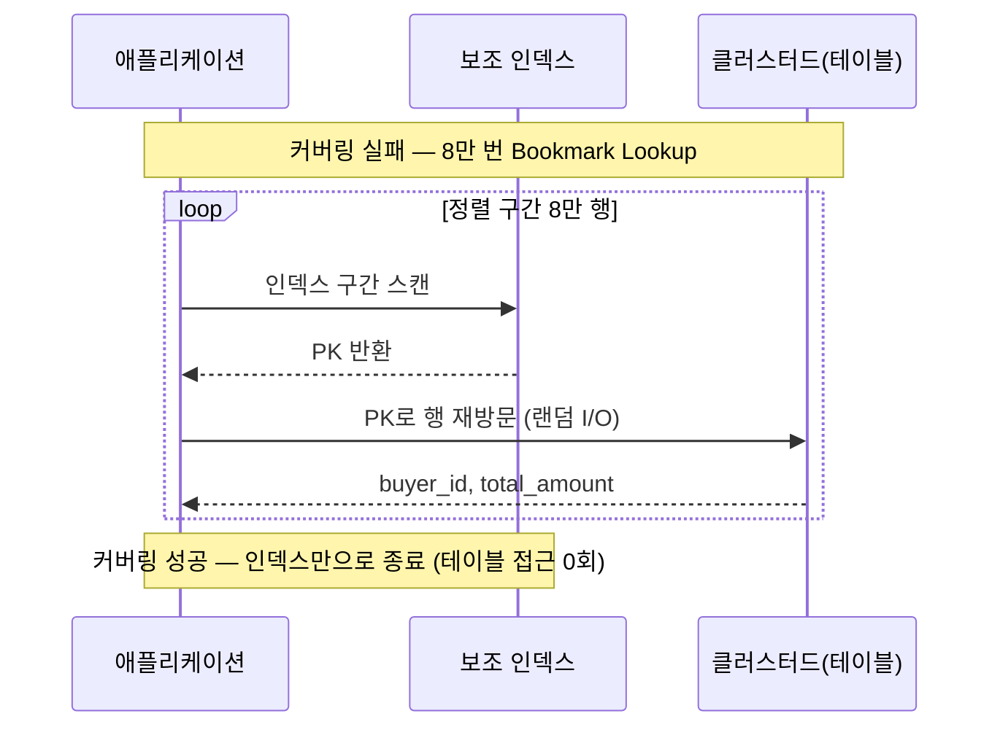
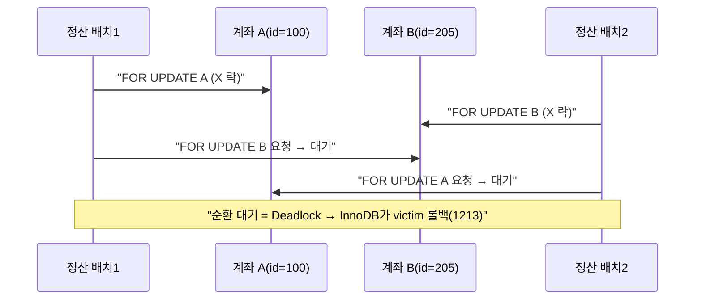
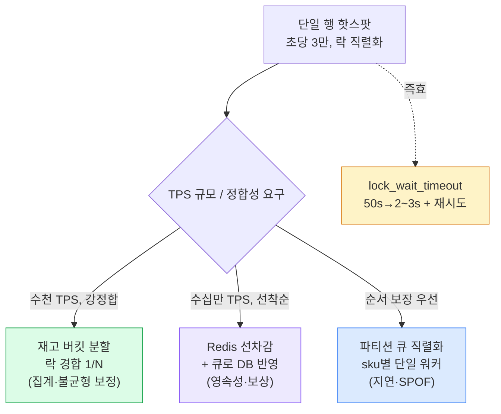

## 이 라운드에 대하여

백엔드 시니어 면접의 **DB 라운드는 보통 20~30분**, 하나의 실제 장애 스토리를 따라간다. "느린 쿼리 하나"에서 출발해 인덱스 → 실행계획 → 락 → 격리수준 → 고경쟁 설계까지 **꼬리를 물고 압박**한다. 면접관이 보는 건 단편 지식이 아니라 **정량적 근거로 원인을 좁히는 사고 과정**과 **MySQL/PostgreSQL 차이를 아는 실무 감각**이다.

이 카드는 개념 설명이 아니라 **실전 문답 대본**이다. 개념 복습은 `database-01`(인덱스·EXPLAIN), `database-02`(락·격리수준), `database-07`(재고 동시성)을 보라. 여기서는 그 지식을 **면접관의 압박에 어떻게 꺼내 쓰는가**에 집중한다.


*면접 문답의 진행 경로 — 한 장애 스토리가 4라운드로 심화된다*

> **🎯 면접 포인트 — "모른다"보다 "어떻게 확인하겠다"**
>
> DB 라운드의 모든 질문은 사실 **"측정 없이 단정하지 마라"** 를 시험한다. "인덱스 추가하겠습니다"가 아니라 "EXPLAIN의 `Extra`와 `rows` vs `actual`을 먼저 보고, `SHOW STATUS LIKE 'Handler_read%'`로 실제 읽은 행을 확인한 뒤 판단하겠습니다"가 시니어의 답이다.

## R1 — "이 쿼리가 느립니다. 인덱스를 어떻게 잡겠습니까?"

**면접관 제시:**

```sql
-- 셀러 대시보드: 특정 샵의 최근 주문을 상태별로 조회, 최신순 20건
SELECT order_id, buyer_id, total_amount, created_at
FROM orders
WHERE shop_id = 4210 AND status = 'PAID'
ORDER BY created_at DESC
LIMIT 20;
-- 현재 orders는 1,200만 행, 인덱스는 PK(order_id)뿐. 800ms.
```

**모범 답변 포인트:**

- 먼저 조건을 분해한다: `shop_id`(등치, 고선택도), `status`(등치, 저선택도 6종), `created_at`(정렬 + 잠재적 범위).
- **복합 인덱스 `(shop_id, status, created_at)`** 를 제안. 순서 근거를 명확히:
  - **등치 조건을 앞, 정렬 컬럼을 뒤** — Leftmost Prefix(선두 컬럼 원칙). `shop_id`, `status`가 등치로 트리 진입점을 좁히고, 마지막 `created_at`이 이미 정렬돼 있어 `ORDER BY ... DESC LIMIT 20`이 **filesort 없이 인덱스 뒤에서 20개만** 읽고 끝난다.
  - `status`를 `created_at`보다 앞에 두는 이유: `status`가 등치라 트리에서 하나의 연속 구간으로 좁혀지고, 그 구간 안에서 `created_at`이 정렬 유지된다. 순서를 `(shop_id, created_at, status)`로 하면 `status` 필터가 정렬 구간을 쪼개 filesort가 붙거나 인덱스 뒤쪽 컬럼을 못 쓴다.

```sql
CREATE INDEX idx_shop_status_created
  ON orders (shop_id, status, created_at);

-- 기대 EXPLAIN (MySQL)
+----+--------+-------+----------------------------+---------+------+-------------+
| id | table  | type  | key                        | key_len | rows | Extra       |
+----+--------+-------+----------------------------+---------+------+-------------+
|  1 | orders | ref   | idx_shop_status_created    | 156     |   20 | Using where |  <- filesort 없음
+----+--------+-------+----------------------------+---------+------+-------------+
```

> **⚠️ 실무 함정 — 정렬 방향과 인덱스**
>
> `ORDER BY created_at DESC`인데 인덱스가 오름차순이어도 InnoDB는 **Backward index scan(역방향 스캔)** 으로 대응한다. 단 MySQL 8.0 미만에서 복합 인덱스의 컬럼별 정렬 방향이 엇갈리면(`a ASC, b DESC`) 인덱스로 못 풀고 filesort가 붙는다. 이때는 8.0의 **Descending Index** (`created_at DESC`로 인덱스 생성)가 답이다. 면접에서 버전을 확인하고 답하면 가점.

**흔한 오답:**

- "`shop_id`, `status`, `created_at`에 각각 인덱스를 만들겠다" → 단일 인덱스 3개로는 이 쿼리를 못 푼다. 옵티마이저가 하나만 골라 나머지는 필터로 떨어지고(`filtered` 낮음), MySQL의 index_merge는 정렬을 만족 못 해 filesort가 붙는다.
- "`status`가 저선택도니 인덱스에서 빼겠다" → 등치 조건이라 트리 진입을 좁히는 데 기여하고, 무엇보다 뒤의 `created_at` 정렬을 살리려면 필요하다. 저선택도라 **단독 인덱스**가 무의미한 것이지, 복합의 앞자리에서는 유용하다.

## R2 — "인덱스를 탔는데도 느립니다"

**면접관 압박:**

> "말한 대로 인덱스를 걸었더니 `type=range`로 인덱스는 타요. 그런데 여전히 200ms. `EXPLAIN`의 `rows`는 500인데 실측하면 8만 행을 읽습니다. `Extra`에는 `Using filesort`가 보이고요. 무엇을 의심하고 어떻게 좁히겠습니까?"

**모범 답변 포인트 — 3가지를 분리해 진단:**

**(1) filesort — 정렬이 인덱스로 안 풀림.** `Using filesort`는 인덱스 정렬 순서와 `ORDER BY`가 안 맞을 때 붙는다. 여기선 아마 쿼리에 `created_at` 범위(`created_at > ?`)가 끼어들어 `status`와 `created_at` 사이 순서가 깨졌거나, 정렬 컬럼이 인덱스 밖 컬럼이다. 인덱스 순서를 쿼리 형태에 맞춰 재조정한다.

**(2) 커버링 실패 — Bookmark Lookup 폭증.** `SELECT`에 `buyer_id, total_amount`가 있어 인덱스만으론 못 풀고 **PK로 클러스터드 인덱스를 8만 번 재방문**(랜덤 I/O)한다. 이게 `rows=500`인데 실측 8만의 정체일 수 있다 — 정렬 후 LIMIT 전에 넓은 구간을 스캔+룩업. **커버링 인덱스**로 필요한 컬럼을 인덱스에 포함시키면 테이블 접근이 사라진다.

```sql
-- 커버링: SELECT 컬럼을 인덱스에 얹는다 (MySQL은 뒤에 그냥 나열, PG는 INCLUDE)
CREATE INDEX idx_cover
  ON orders (shop_id, status, created_at, buyer_id, total_amount);
-- PostgreSQL: CREATE INDEX ... ON orders (shop_id,status,created_at)
--             INCLUDE (buyer_id, total_amount);  -- 키가 아닌 payload로만

-- 기대: Extra: Using index (커버링 성공, 랜덤 I/O 0)
```

**(3) 통계 오차 — `rows` vs `actual` 괴리.** `rows=500`(추정) vs 실측 8만이면 옵티마이저 통계가 낡았다. PostgreSQL이면 `EXPLAIN (ANALYZE, BUFFERS)`로 `estimated` vs `actual rows`를 직접 대조하고 `ANALYZE orders`; MySQL이면 `ANALYZE TABLE orders` 또는 히스토그램(`ANALYZE TABLE ... UPDATE HISTOGRAM ON status`)을 갱신한다.

```sql
-- 실제로 몇 행을 읽었나: 옵티마이저 추정 말고 엔진 카운터로 확인
FLUSH STATUS;
SELECT ... ;  -- 문제 쿼리 실행
SHOW STATUS LIKE 'Handler_read%';
-- Handler_read_next 가 크면 인덱스 구간을 넓게 훑은 것 (LIMIT 전 8만 스캔 등)
```



*rows=500 추정과 실측 8만의 괴리 — 커버링 실패로 인한 대량 룩업이 흔한 원인*

> **💡 팁 — `rows`는 "추정", 진짜는 `actual`/Handler 카운터**
>
> `EXPLAIN`의 `rows`는 옵티마이저 추정치라 믿지 마라. PostgreSQL은 `EXPLAIN ANALYZE`의 `actual rows ... loops=N`을 곱해 실제 처리량을 보고, `Buffers: shared hit/read`로 캐시 히트/디스크 I/O를 구분한다. MySQL은 `EXPLAIN ANALYZE`(8.0.18+) 또는 `Handler_read_*` 카운터로 실측한다. 이 구분을 아는 것만으로 미들과 시니어가 갈린다.

> **⚠️ 실무 함정 — 커버링 인덱스에 컬럼을 다 넣지 마라**
>
> 커버링이 좋다고 `SELECT *`용으로 컬럼을 다 얹으면 인덱스가 테이블만큼 커져 **쓰기마다 인덱스 갱신 비용·버퍼풀 오염**이 생긴다. PostgreSQL의 `INCLUDE`는 키가 아닌 payload라 트리 정렬 부담이 없어 이럴 때 유리하다. 커버링은 **핫 쿼리에만 선택적으로**, 그리고 payload 컬럼은 좁게.

## R3 — "REPEATABLE READ인데 왜 갱신 유실이 납니까?"

**면접관 제시 (포인트 적립 로직):**

```sql
-- 세션 격리수준: REPEATABLE READ (MySQL InnoDB 기본)
BEGIN;
SELECT balance FROM account WHERE id = 100;   -- 1000 읽음 (스냅샷 읽기, 락 없음)
-- 애플리케이션: new = 1000 + 500
UPDATE account SET balance = 1500 WHERE id = 100;
COMMIT;
-- 두 트랜잭션이 동시에 이 흐름을 돌면 한쪽 +500이 사라진다 (최종 1500, 기대 2000)
```

**모범 답변 포인트:**

- **왜 RR이 못 막나:** 일반 `SELECT`는 **MVCC 스냅샷 읽기(consistent read)** 라 **락을 걸지 않는다.** RR이 보장하는 건 "한 트랜잭션 안에서 같은 SELECT는 같은 값" — 즉 **읽기 재현성**이지, 다른 트랜잭션의 쓰기를 막는 게 아니다. 두 트랜잭션이 각자 1000을 읽고 각자 계산해 덮어쓰면 하나가 유실된다. 이건 **격리수준으로 못 막는 read-modify-write 경쟁**이다.
- **해법 1 — 원자적 UPDATE:** 애플리케이션에서 계산하지 말고 DB가 원자적으로:

```sql
UPDATE account SET balance = balance + 500 WHERE id = 100;  -- 읽기-계산-쓰기를 한 문장으로
```

- **해법 2 — 잠금 읽기:** 굳이 값을 읽어 판단해야 하면 `SELECT ... FOR UPDATE`로 X 락을 잡아 직렬화. 이때 두 번째 트랜잭션은 첫 커밋까지 대기하다 **최신 값 1500을 읽고** 2000으로 만든다.
- **해법 3 — 낙관적 락:** `WHERE ... AND version = ?` + affected rows 검사 후 재시도. 충돌이 드물 때.

**이어지는 압박 — 데드락:**

> "그래서 `SELECT ... FOR UPDATE`로 바꿨더니 이번엔 여러 계좌를 동시에 다루는 정산 배치에서 `ERROR 1213 Deadlock`이 자주 터집니다. 왜죠?"

**모범 답변:**

- 두 트랜잭션이 **여러 행을 엇갈린 순서로 잠그면** 순환 대기 → 데드락. T1이 A→B, T2가 B→A 순으로 잠그는 전형.
- **예방: 잠금 순서 일관성.** 항상 같은 순서(예: `id` 오름차순)로 잠근다.

```sql
-- 여러 계좌를 항상 id 오름차순으로 잠근다 → 순환 대기 원천 차단
SELECT * FROM account WHERE id IN (100, 205) ORDER BY id FOR UPDATE;
```



*락 획득 순서가 엇갈리면 데드락 — 항상 동일 순서로 잠가 예방*

> **🎯 면접 포인트 — RR의 팬텀·갱신유실은 MySQL/PostgreSQL이 다르다**
>
> **MySQL InnoDB RR**: 잠금 읽기(`FOR UPDATE`)는 **Next-key Lock(넥스트키 락)** 으로 갭까지 잠가 팬텀도 막는다. 그런데 이 갭락이 오히려 **데드락의 단골 원인**이다. **PostgreSQL RR**: 스냅샷 격리(Snapshot Isolation)라 갱신 유실을 **직접 감지** — 두 트랜잭션이 같은 행을 UPDATE하면 나중 커밋 쪽이 `ERROR: could not serialize access due to concurrent update`로 abort된다(first-updater-wins). 즉 PG RR은 락 대기 대신 **재시도**를 강제한다. SERIALIZABLE에서는 PG가 **SSI(Serializable Snapshot Isolation)** 로 직렬성 위반을 감지해 abort한다. "RR이면 다 같다"고 답하면 감점.

> **⚠️ 실무 함정 — 인덱스 없는 `FOR UPDATE`는 테이블을 통째로 잠근다**
>
> `SELECT ... WHERE non_indexed_col = ? FOR UPDATE`는 풀스캔하며 **스캔한 모든 레코드에 락**을 건다 → 사실상 테이블 락으로 동시성이 0이 된다. 잠금 읽기의 WHERE는 반드시 인덱스(가급적 PK/Unique)로 좁혀야 한다. MySQL RR에서는 여기에 **갭락**까지 더해져 무관한 INSERT도 막힌다.

## R4 — "재고 차감 UPDATE로 Oversell은 막았는데, 락 대기가 폭증합니다"

**면접관 제시:**

```sql
-- Oversell은 이 한 문장으로 막았다 (database-07의 원자적 조건부 UPDATE)
UPDATE stock SET qty = qty - 1 WHERE sku = 'HOT-SKU' AND qty >= 1;
-- 그런데 인기 SKU 하나에 초당 3만 요청 → 같은 행에 X 락이 직렬화되며
-- innodb_lock_wait_timeout(50s) 초과 에러, p99가 2초로 폭등.
```

이건 정합성 문제가 아니라 **단일 행 핫스팟(hot row)** 문제다. `qty>=1`이 Oversell을 막는 건 맞지만, 같은 행에 대한 X 락은 **한 번에 하나씩만** 통과하므로 초당 처리량이 행 하나의 락 순환 속도에 묶인다.

**모범 답변 — SQL을 거의 안 바꾸고 완화하는 3가지:**

**(1) 재고 분할(Stock Bucketing / sharded counter).** 한 SKU의 재고를 N개 행으로 쪼개 락 경합을 1/N로 분산.

```sql
-- 재고를 10개 버킷으로: 요청마다 랜덤/해시 버킷 하나만 잠근다
UPDATE stock_bucket
SET qty = qty - 1
WHERE sku = 'HOT-SKU' AND bucket = ? AND qty >= 1;   -- bucket = rand()%10
-- 총재고 = SUM(qty). 버킷이 비면 다른 버킷 재시도(재고 쏠림 보정 필요)
```

트레이드오프: 락 경합을 N배로 낮추지만 **총재고 조회가 집계**가 되고, 특정 버킷만 소진되는 **불균형**을 재분배 로직으로 보정해야 한다. 잔여가 적을 때(마지막 몇 개) 정확도가 떨어진다.

**(2) Redis 원자 선차감 + 비동기 DB 반영.** 초고 TPS 선착순의 정석. `DECR`/Lua로 Redis에서 선차감하고 DB는 큐(Kafka)로 비동기 반영.

```
-- Lua: GET → 검사 → DECRBY 를 단일 원자 실행 (database-07 참고)
local q = tonumber(redis.call('GET', KEYS[1]))
if q == nil or q < tonumber(ARGV[1]) then return -1 end
return redis.call('DECRBY', KEYS[1], ARGV[1])
```

트레이드오프: 처리량은 수십만 TPS로 뛰지만 **Redis가 진실원**이 되어 장애 시 차감분 유실 위험(AOF/RDB 영속성 필수), 캐시-DB 최종 일관성, 보상 처리 복잡도. **선착순/티켓팅에만**.

**(3) 애플리케이션 직렬화 — 단일 파티션 큐.** 해당 SKU의 차감 요청을 **하나의 워커/파티션으로 순서화**(Kafka partition key=sku)해 DB 경합 자체를 없앤다. 락 대신 큐가 순서를 보장.

트레이드오프: DB 락 경합은 사라지지만 **처리 지연(큐 대기)** 이 생기고, 워커 장애 시 해당 SKU가 멈춘다. 처리량은 워커 하나의 속도에 묶인다.

**보조 튜닝(즉효):** `innodb_lock_wait_timeout`을 50s → **2~3s**로 낮춰 **빠른 실패 + 재시도**로 전환. 50초 대기는 커넥션 풀을 고갈시켜 장애를 전파시킨다.



*핫스팟 완화 의사결정 — TPS 규모와 정합성 요구가 방식을 가른다*

> **🎯 면접 포인트 — "정확성"과 "처리량"을 분리해 답하라**
>
> R4의 함정은 "Oversell을 어떻게 막나"로 되돌아가는 것이다. Oversell은 이미 `qty>=1`로 해결됐다. 면접관이 묻는 건 **정확한데도 느린** 핫스팟의 **처리량 문제**다. "정합성은 유지한 채 락 경합만 분산한다"는 프레임으로, 위 3가지를 **경합 강도·정합성 타협 여부·운영 복잡도**로 비교하면 시니어 답변이다.

## 좋은 답변 vs 나쁜 답변

| 질문 상황 | 나쁜 답변 (감점) | 좋은 답변 (가점) |
| --- | --- | --- |
| R1 인덱스 순서 | "필요한 컬럼에 다 인덱스 걸겠다" | "등치→정렬 순서로 복합 인덱스, filesort 제거를 EXPLAIN `Extra`로 검증" |
| R2 탔는데 느림 | "인덱스 하나 더 추가" | "커버링 실패/filesort/통계 오차를 `actual rows`·`Handler_read`·`Buffers`로 분리 진단" |
| R2 rows vs actual | "rows가 500이니 빠를 것" | "`rows`는 추정치, `EXPLAIN ANALYZE`의 actual·loops로 실측하고 `ANALYZE`로 통계 갱신" |
| R3 갱신 유실 | "격리수준을 SERIALIZABLE로 올린다" | "read-modify-write 경쟁이라 격리론 못 막음. 원자 UPDATE/`FOR UPDATE`/버전으로 해결" |
| R3 데드락 | "재시도만 하면 된다" | "잠금 순서 일관성(id 정렬)으로 예방 + 짧은 트랜잭션 + 재시도, MySQL 갭락 원인 인지" |
| R3 DBMS 차이 | "RR이면 다 똑같다" | "MySQL은 넥스트키 락, PG는 SI라 concurrent update abort — first-updater-wins" |
| R4 핫스팟 | "Oversell 막으면 됨" (질문 회피) | "정합성은 유지, 락 경합만 버킷/Redis/큐로 분산. timeout 낮춰 빠른 실패" |

> **💡 팁 — 항상 "측정 → 가설 → 검증"의 3박자로 말하라**
>
> "느리면 EXPLAIN을 보고(측정), 커버링 실패가 의심되니(가설), `Extra`에 `Using index`가 뜨는지 커버링 인덱스로 검증하겠다(검증)." 이 구조로 말하면 어떤 압박에도 흔들리지 않는다. 숫자(`rows`, 락 대기 시간, TPS)를 근거로 붙이면 확실히 가점.

## 평가 루브릭

| 항목 | 주니어 | 미들 | 시니어 |
| --- | --- | --- | --- |
| 인덱스 설계 | 단일 인덱스 나열 | 복합 인덱스 순서 이해 | 정렬·범위·커버링까지 EXPLAIN 근거로 설계 |
| 실행계획 | `type`만 봄 | `key`/`rows`/`Extra` 해석 | `rows` vs `actual`, Handler/Buffers로 실측 진단 |
| 격리수준 | 4단계 암기 | 이상현상 매핑 | MySQL/PG 차이(넥스트키 vs SSI) + 갱신유실 한계 |
| 락·데드락 | "락 걸면 됨" | `FOR UPDATE` 사용 | 순서 일관성 예방 + 갭락 원인 + 타임아웃 튜닝 |
| 고경쟁 설계 | 원자 UPDATE 안다 | 비관/낙관/원자 비교 | 핫스팟 분산(버킷/Redis/큐)을 트레이드오프로 선택 |
| 태도 | 단정적 답변 | 트레이드오프 언급 | 측정 우선·정량 근거·케이스 분기 |

> **🎯 면접 포인트 — 한 문장으로 마무리하는 습관**
>
> 각 라운드 끝에 "즉 이 케이스는 ___ 조건이라 ___를 택하고, ___이면 ___로 갑니다"처럼 **조건부 결론**으로 닫아라. 면접관은 "정답 하나"가 아니라 "상황에 따라 다르게 판단할 수 있는가"를 본다. `database-07`의 재고 방식 5분법, `database-02`의 격리수준 DBMS 매트릭스를 조건부 결론의 재료로 쓰면 좋다.

## 이해도 확인 Q&A

아래 질문에 직접 답변을 작성하세요. 실제 면접이라 생각하고 소리 내어 답한 뒤, 자동 저장된 답을 코치에게 보내 피드백을 받으세요.
