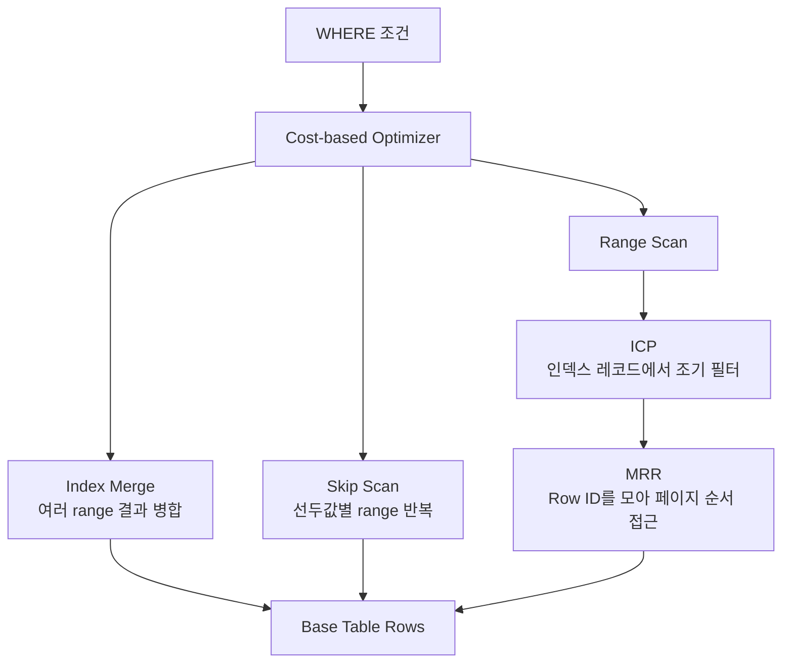

## 1. 네 전략은 서로 다른 낭비를 줄인다

MySQL 옵티마이저는 통계와 비용 모델을 바탕으로 접근 경로를 고른다. 각 최적화가 존재한다고 해서 항상 선택되는 것은 아니며, 최종 판단은 실제 데이터 분포에서 `EXPLAIN ANALYZE`로 확인한다.

| 전략 | 줄이는 비용 | 잘 맞는 상황 | 경계 |
|---|---|---|---|
| Index Merge | 한 테이블의 여러 인덱스 결과 결합 | 서로 다른 컬럼의 OR/AND 조건 | 후보 집합 병합과 테이블 조회 비용 |
| Skip Scan | 복합 인덱스 선두값별 반복 탐색 | 선두 컬럼 Cardinality가 낮음 | 선두값 종류가 많으면 반복 비용 증가 |
| ICP | 스토리지 엔진 단계에서 인덱스 조건 평가 | 인덱스만으로 일부 조건 필터 가능 | 인덱스에 없는 조건은 테이블에서 평가 |
| MRR | 랜덤한 테이블 페이지 접근을 묶음·정렬 | Secondary Index가 많은 행을 가리킴 | 버퍼링·정렬 자체의 비용 |



## 2. 실행계획을 읽는 최소 실험

```sql
CREATE INDEX idx_orders_status ON orders(status);
CREATE INDEX idx_orders_customer ON orders(customer_id);
CREATE INDEX idx_orders_region_created ON orders(region, created_at);

EXPLAIN ANALYZE
SELECT *
FROM orders
WHERE status = 'READY' OR customer_id = 42;

EXPLAIN ANALYZE
SELECT *
FROM orders
WHERE created_at >= CURRENT_DATE - INTERVAL 1 DAY;
```

첫 쿼리는 두 단일 인덱스의 Index Merge 후보가 될 수 있다. 하지만 `(status, customer_id)` 복합 인덱스가 OR 조건을 자동 해결하는 것은 아니며, 조건 형태와 선택도에 따라 쿼리 분리 후 `UNION ALL`이 더 명확할 수도 있다. 두 번째 쿼리는 `region` 종류가 매우 적다면 `(region, created_at)`을 선두값별로 탐색하는 Skip Scan 후보가 될 수 있다.

ICP(Index Condition Pushdown, 인덱스 조건 푸시다운)는 인덱스 레코드를 읽은 시점에 조건을 먼저 평가해 Base Table 접근 횟수를 줄인다. MRR(Multi-Range Read, 다중 범위 읽기)은 Secondary Index에서 얻은 Row ID를 모아 데이터 페이지 순서에 가깝게 접근함으로써 랜덤 I/O를 줄인다.

> **실무 함정** — `type=index_merge`가 보인다고 최적이라고 판단하면 안 된다. 예상 행과 실제 행의 차이, 반복 루프, Base Table 접근 수, 임시 정렬 비용을 함께 본다. 통계가 오래됐거나 컬럼 상관관계가 크면 비용 모델이 틀릴 수 있다.

## 3. 튜닝 순서

1. 필요한 행 수와 반환 컬럼을 줄인다.
2. 실제 조건·정렬에 맞는 복합 인덱스를 먼저 검토한다.
3. `EXPLAIN ANALYZE`로 추정치와 실측치를 비교한다.
4. Index Merge·Skip Scan·ICP·MRR은 결과로 관찰하고, 힌트로 강제할 때는 배포 데이터 분포 변화까지 감시한다.

> **면접 포인트** — 인덱스 개수를 늘리는 것이 답이 아니다. 옵티마이저가 읽은 인덱스 레코드 수와 Base Table 페이지 수를 분리해 설명하면 각 최적화의 목적이 선명해진다.

## 참고

- [MySQL 8.4 Index Merge Optimization](https://dev.mysql.com/doc/refman/8.4/en/index-merge-optimization.html)
- [MySQL 8.4 SELECT Optimization](https://dev.mysql.com/doc/refman/8.4/en/select-optimization.html)
