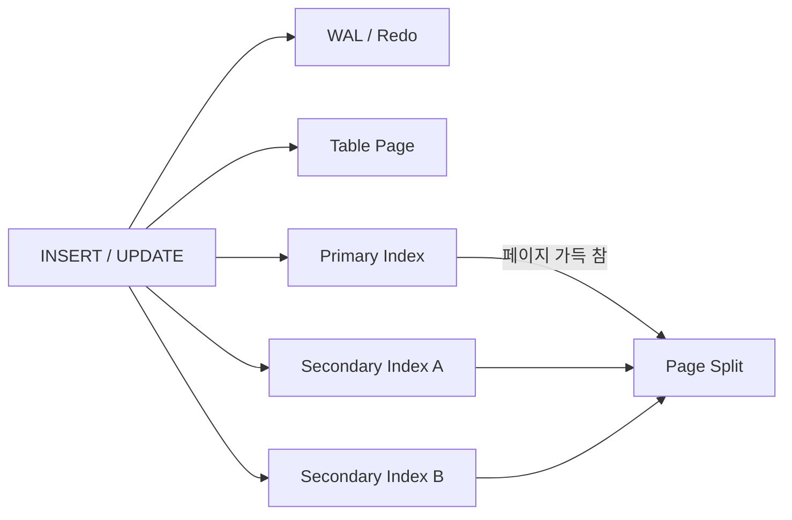

## 1. 인덱스는 쓰기마다 유지되는 복제 구조다

행 하나를 INSERT하면 테이블 데이터뿐 아니라 관련된 모든 인덱스에 키를 추가하고 WAL/Redo Log에도 변경을 기록한다. UPDATE가 인덱스 컬럼을 바꾸면 기존 키 삭제와 새 키 삽입이 발생한다.



| 비용 | 원인 | 관측 지표 |
|---|---|---|
| CPU | 키 비교·정렬·압축 | DB CPU, rows written/sec |
| I/O | 데이터·인덱스·WAL 쓰기 | write IOPS, WAL bytes/sec |
| 캐시 | 인덱스 페이지가 버퍼 점유 | buffer hit ratio, eviction |
| 공간 | 키·포인터·여유 공간 | index size, bloat |
| 복제 | 더 많은 변경 로그 전송·재생 | Replica Lag, replay rate |

## 2. 페이지 분할과 키 분포

정렬 위치가 임의인 키는 여러 Leaf Page를 건드리고 가득 찬 페이지 중간에 삽입될 때 분할을 유발할 수 있다. 시간 순서가 있는 키는 오른쪽 끝 쓰기에 집중해 지역성이 좋아지지만 Hot Page 경합과 단조 증가 정보 노출을 고려해야 한다.

```sql
SELECT indexrelname, idx_scan, pg_size_pretty(pg_relation_size(indexrelid))
FROM pg_stat_user_indexes
WHERE relname = 'orders'
ORDER BY pg_relation_size(indexrelid) DESC;
```

UUIDv7 같은 시간 정렬 식별자는 랜덤 UUID보다 쓰기 지역성을 높일 수 있지만, 생성기 정확성·동시 생성 순서·개인정보 노출 요구까지 검토한다. 데이터베이스와 엔진별 내부 구조가 다르므로 동일 데이터로 측정한다.

> **실무 함정** — “조회 하나가 빨라졌다”만 보고 인덱스를 추가하면 모든 쓰기 경로와 Replica에 영구 비용을 부과한다. 저사용 인덱스도 Unique 제약이나 장애 쿼리용일 수 있으므로 사용 횟수만으로 삭제하지 않는다.

## 3. 안전한 추가·삭제

대형 인덱스 빌드는 기존 데이터를 읽고 정렬하며 변경 로그를 늘린다. Online/Concurrent 옵션의 실제 잠금 범위, 실패 후 남는 객체, 디스크 여유, Replica Lag을 확인한다. 배포 전 예상 크기와 최대 시간을 산정하고 중단 기준을 둔다.

> **면접 포인트** — 인덱스 설계는 읽기 쿼리 목록과 쓰기 예산의 협상이다. 추가 전후 p95 쓰기 지연, WAL 증가량, 인덱스 크기를 함께 제시한다.
