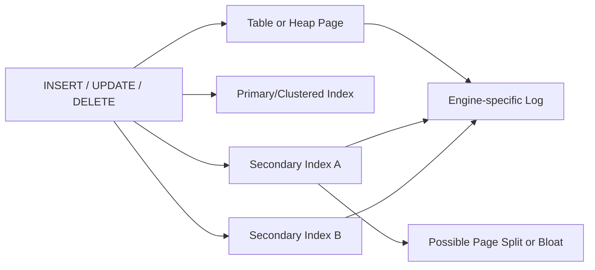

> **검수 기준 — 2026-09-27**
>
> 인덱스 유지·페이지 분할·온라인 DDL은 엔진별 구현이 다르다. WAL은 PostgreSQL 용어이고 InnoDB는 redo/undo·binlog 등 별도 로그를 사용하므로 하나의 보편 경로로 설명하지 않는다. 비용·크기·잠금은 같은 데이터와 버전에서 실측한다.

## 1. 인덱스는 쓰기마다 유지되는 구조다

행 하나를 INSERT하면 테이블/heap과 관련 인덱스에 키를 추가한다. UPDATE가 인덱스 키를 바꾸면 엔진에 따라 기존 index entry의 삭제 표시와 새 entry 삽입, MVCC 정리 또는 page rewrite가 발생할 수 있다. PostgreSQL의 WAL과 InnoDB의 redo/undo·binlog는 목적과 기록 시점이 다르지만, 인덱스가 늘면 CPU·I/O·로그·복제량이 늘 수 있다는 비용 경계는 공통으로 관측한다.


```mermaid
flowchart LR
    SQL[INSERT / UPDATE / DELETE] --> TABLE[Table or Heap Page]
    SQL --> PK[Primary/Clustered Index]
    SQL --> I1[Secondary Index A]
    SQL --> I2[Secondary Index B]
    TABLE --> LOG[Engine-specific Log]
    I1 --> LOG
    I2 --> LOG
    I1 --> SPLIT[Possible Page Split or Bloat]
```

| 비용 | 원인 | 관측 지표 |
|---|---|---|
| CPU | 키 비교·정렬·압축·MVCC 처리 | DB CPU, rows written/sec |
| I/O | 데이터·인덱스·로그 페이지 쓰기 | write IOPS, WAL/redo bytes |
| 캐시 | 인덱스 페이지가 버퍼를 점유 | buffer hit ratio, eviction |
| 공간 | 키·포인터·여유 공간·bloat | index size, dead tuples |
| 복제 | 변경 로그 전송·재생 | Replica Lag, replay rate |

인덱스 2개에서 10개가 되었다고 INSERT 비용이 정확히 5배가 되는 것은 아니다. 인덱스 키 분포·페이지 cache hit·동시성·변경 컬럼·배치 크기와 엔진의 로그 압축이 함께 비용을 결정한다.

## 2. 페이지 분할과 키 분포

랜덤 키는 여러 leaf page를 건드리고 중간 삽입에서 split·분산 I/O를 만들 수 있지만, 실제 영향은 page fill, cache, 엔진 구현과 workload에 따라 달라진다. 시간 정렬 키는 쓰기 지역성을 높일 수 있어도 오른쪽 끝 hot page·예측 가능한 식별자·동시 생성 순서·분산 노드 시계 문제를 검토한다. UUIDv7을 도입한다면 “항상 빠르다”가 아니라 같은 부하에서 page split·p95·index size를 비교한다.

```sql
SELECT indexrelname, idx_scan,
       pg_size_pretty(pg_relation_size(indexrelid)) AS size
FROM pg_stat_user_indexes
WHERE relname = 'orders'
ORDER BY pg_relation_size(indexrelid) DESC;
```

> **실무 함정** — 조회 하나가 빨라졌다는 이유만으로 인덱스를 추가하면 모든 쓰기 경로와 Replica에 지속 비용을 부과한다. 사용량이 낮은 인덱스도 Unique·FK·장애 경로를 보호할 수 있으므로 사용 횟수만으로 삭제하지 않는다.

## 3. 안전한 추가·삭제

대형 인덱스 빌드는 기존 데이터를 읽고 정렬·페이지를 생성하며 변경 로그와 디스크 임시 공간을 사용할 수 있다. PostgreSQL `CREATE INDEX CONCURRENTLY`, MySQL `ALGORITHM`/`LOCK` 옵션처럼 이름이 비슷한 기능도 잠금 범위·실패 잔여물·쓰기 영향이 다르므로 해당 버전 문서를 확인한다. 예상 크기·최대 시간·Replica Lag·중단 기준과 롤백/재시도 절차를 먼저 정한다.

### 실패 입력 → 판단 → 복구

운영 중 `tracking_no` 인덱스를 추가했는데 빌드가 길어지고 Replica Lag이 증가했다고 하자. 먼저 새 인덱스가 실제 장애 Query에 필요한지와 현재 DDL 단계·Lock wait·디스크 여유를 확인한다. 읽기 지연이 개선되지 않으면 작업을 계속 밀어붙이지 않고 중단 가능 여부와 실패 후 남은 객체를 확인한다. 완료 후에도 p95 읽기·p95 쓰기·로그량·Replica replay·index size를 전후 비교하고, Partial/필요 컬럼만 포함하는 대안을 검토한다.

참고: [PostgreSQL CREATE INDEX](https://www.postgresql.org/docs/17/sql-createindex.html), [MySQL Online DDL](https://dev.mysql.com/doc/refman/8.4/en/innodb-online-ddl-operations.html)

> **면접 포인트** — 인덱스 설계는 읽기 쿼리 목록과 쓰기 예산의 협상이다. 추가 전후 p95 쓰기 지연, 로그 증가량, 인덱스 크기, 잠금·복제 상태를 함께 제시한다.
