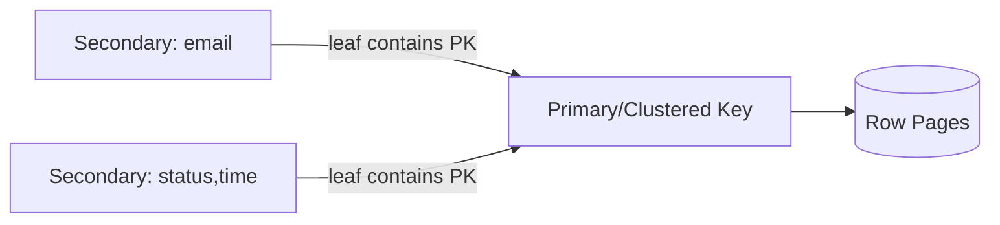

## 1. 기본 키는 저장 배치에도 영향을 준다

DBMS 구현마다 다르지만 클러스터드 구조에서는 기본 키 순서로 행이 배치되고 보조 인덱스 Leaf가 기본 키를 행 포인터로 포함할 수 있다. 따라서 안정적이고 작으며 변경되지 않는 키가 유리하다.



| 키 형태 | 장점 | 비용 |
|---|---|---|
| 단조 정수 | 작은 키·높은 쓰기 지역성 | 끝 Page 경합·노출 |
| 랜덤 UUID | 분산 생성·비예측 | Page 분산·큰 키 |
| 시간 정렬 ID | 대략적 순서 | 시간·노드 정보 노출 |
| 자연 키 | 조회 의미 직접 표현 | 변경·폭·외부 규칙 의존 |

```sql
CREATE TABLE orders (
  id BIGINT PRIMARY KEY,
  public_id UUID NOT NULL UNIQUE,
  created_at TIMESTAMPTZ NOT NULL
);
```

> **설계 함정** — 외부 공개 ID와 내부 물리 배치 키를 반드시 하나로 만들 필요는 없다. 두 키를 두면 쓰기 비용과 추가 Unique Index 비용을 함께 평가한다.

## 2. 실제 실행 계획으로 검증한다

카디널리티와 분포, Page Split, Index 크기, Buffer 적중을 운영 부하와 유사한 데이터로 측정한다. PK 변경은 모든 참조와 보조 인덱스에 영향을 주므로 초기에 선택 근거를 기록한다.

> **면접 포인트** — “UUID는 느리다” 같은 단정 대신 엔진의 저장 방식, 키 폭, 쓰기 분포, 공개 요구를 분리한다.
