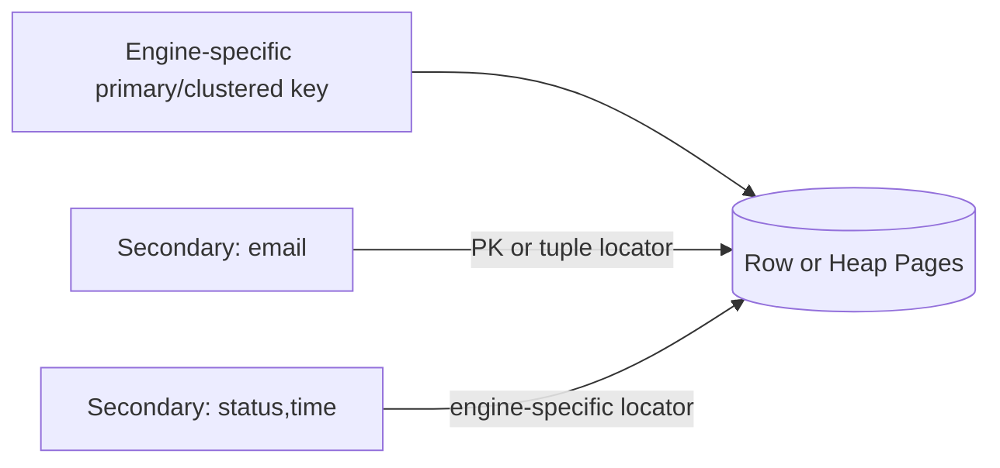

> **검수 기준 — 2026-09-27**
>
> “Clustered Index”의 의미는 DBMS별로 다르다. InnoDB는 PK clustered index를 사용하지만 PostgreSQL의 일반 테이블은 heap과 index가 분리되어 있다. 키 폭·순서·공개 가능성은 실제 엔진과 부하에서 함께 평가한다.
> 참고: [MySQL InnoDB clustered and secondary indexes](https://dev.mysql.com/doc/refman/8.4/en/innodb-index-types.html), [PostgreSQL Indexes](https://www.postgresql.org/docs/17/indexes.html)

## 1. 기본 키는 저장 배치와 참조 비용에 영향을 준다

InnoDB에서는 PK leaf에 행이 함께 저장되는 clustered 구조이고 secondary index가 clustered PK를 참조하므로 PK 폭이 보조 인덱스 크기에 영향을 준다. PostgreSQL의 일반 secondary index는 heap tuple 위치를 참조하므로 InnoDB 설명을 그대로 적용하지 않는다. SQL Server 등 다른 제품은 별도 clustered 설정을 가질 수 있다.


```mermaid
flowchart LR
    PK[Engine-specific primary/clustered key] --> R[(Row or Heap Pages)]
    S1[Secondary: email] -->|PK or tuple locator| R
    S2[Secondary: status,time] -->|engine-specific locator| R
```

| 키 형태 | 장점 | 비용 |
|---|---|---|
| 단조 정수 | 작은 키·쓰기 지역성 | 끝 Page 경합·순서 노출 |
| 랜덤 UUID | 분산 생성·비예측 | 페이지 분산·키 폭·cache 비용 가능 |
| 시간 정렬 ID | 대략적 삽입 지역성 | 시간·노드 정보 노출·시계/동시성 검토 |
| 자연 키 | 업무 의미 직접 표현 | 변경·폭·외부 규칙 의존 |

```sql
CREATE TABLE orders (
  id BIGINT PRIMARY KEY,
  public_id UUID NOT NULL UNIQUE,
  created_at TIMESTAMPTZ NOT NULL
);
```

내부 물리 키와 외부 공개 ID를 분리하면 공개 식별자 변경·추측 위험을 줄일 수 있지만, Unique Index와 두 ID의 대사 비용이 추가된다. 두 키 중 하나가 항상 빠르다고 가정하지 말고 조회·삽입·복제·보안 요구를 수치화한다.

## 2. 실제 실행 계획으로 검증한다

카디널리티와 분포, Page Split 또는 PostgreSQL bloat, Index 크기, Buffer 적중, secondary-to-row lookup을 운영 부하와 유사한 데이터로 측정한다. PK 변경은 FK·참조·보조 인덱스·CDC payload에 영향을 주므로 초기에 선택 근거와 마이그레이션 비용을 기록한다.

### 실패 입력 → 판단 → 복구

랜덤 UUID를 PK로 교체한 뒤 InnoDB insert p95와 인덱스 크기가 증가했다고 하자. 곧바로 “UUID는 느리다”고 결론 내리지 말고 기존/신규 키 폭, insert 분포, page split, cache hit, secondary index 크기와 동시성을 같은 데이터로 비교한다. 시간 정렬 ID를 선택하더라도 외부에 순서를 노출해도 되는지, 여러 노드의 시계가 역전될 때 유일성과 정렬이 유지되는지 확인한다.

PostgreSQL에서 clustered라는 용어를 보고 PK가 행을 물리적으로 정렬한다고 가정하면 안 된다. heap과 index plan, `Index Only Scan`의 visibility 조건을 직접 확인하고, 장기간 물리 정렬이 필요하다면 제품별 `CLUSTER`/재작성 비용과 유지 정책을 별도로 검토한다.

> **면접 포인트** — “UUID는 느리다” 같은 단정 대신 엔진의 저장 방식, 키 폭, 쓰기 분포, tuple lookup, 외부 공개 요구와 장애·마이그레이션 비용을 분리한다.
